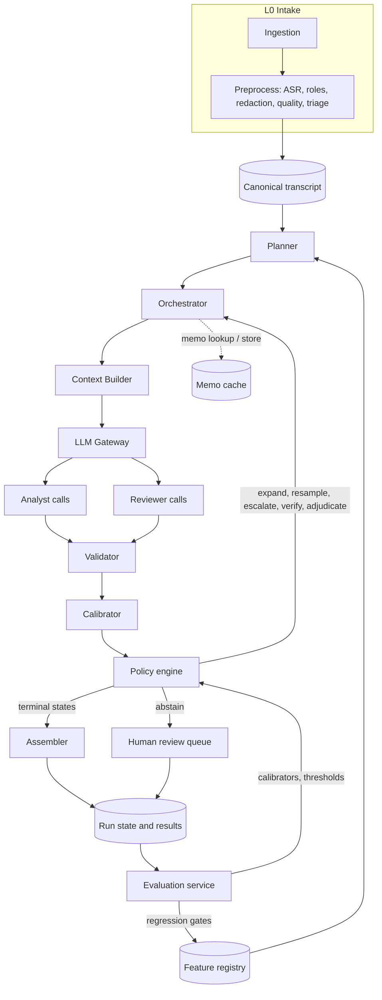
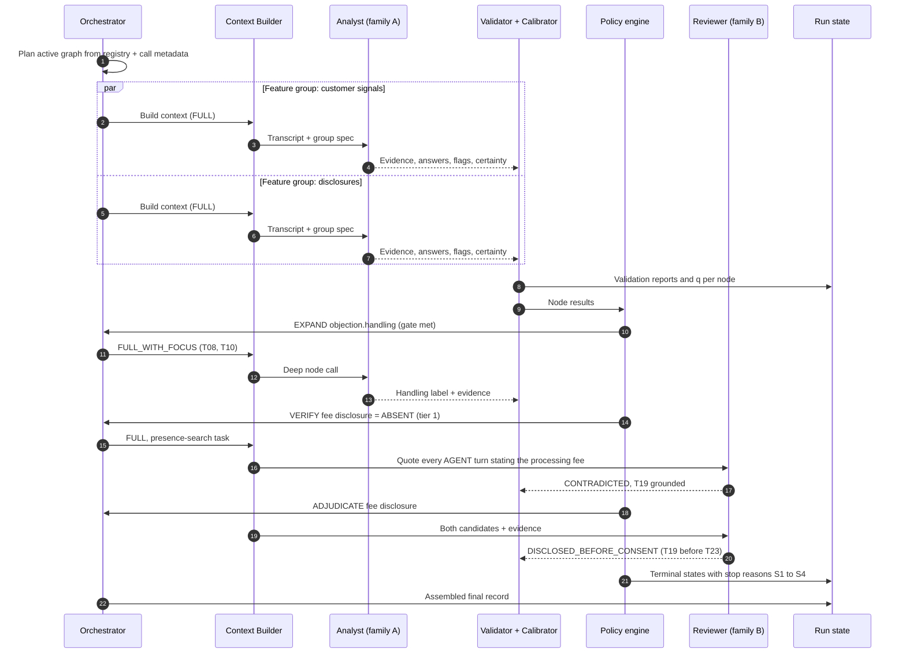
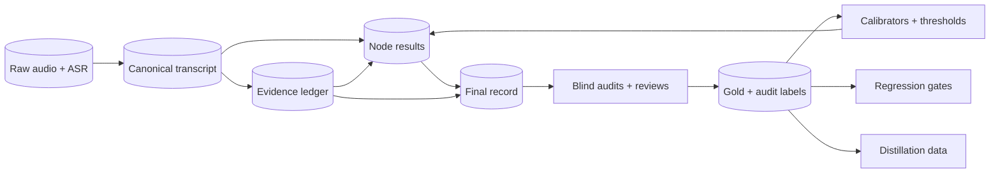
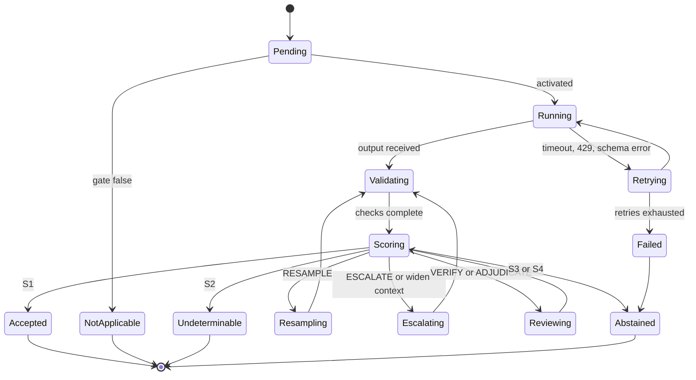
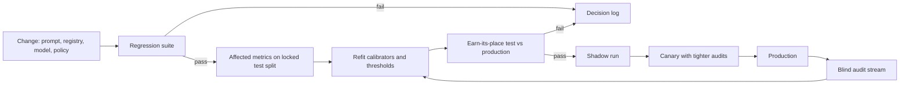

# Evidence-Gated Transcript Analysis

**An AI systems architecture design document for progressive, multi-depth feature analysis of conversation transcripts**

Version 1.0 · 11 September 2026 · Status: recommendation for implementation · Scope: per-transcript feature extraction and progressive analysis (cross-call analytics is out of scope except where noted)

---

## Executive summary

**The decision.** Build a *workflow*, not a multi-agent system. LLMs are called as stateless, typed functions inside a deterministic, registry-driven graph. Each transcript receives one **evidence-first Analyst call per feature group** over the full, speaker-labelled transcript. Deeper analysis is switched on **by code, from the typed outputs of earlier calls** — never by an LLM planner. Every result passes **deterministic evidence validation**. A **calibrated confidence score** — built from agreement, evidence and validation signals, never from the model's self-reported confidence alone — drives a **policy engine** that accepts, re-samples, escalates to a stronger or different model, sends the case to an independent **Reviewer**, or abstains to a human. Most transcripts should finish in one pass per feature group; extra computation is spent only where calibrated risk says it will change the answer.

I call this design the **Evidence-Gated Workflow**: *evidence-gated* because no decision is accepted without transcript evidence that has been checked by code, and because the evidence and its confidence — not a planner — gate whether more analysis happens.

| # | Question | Decision |
|---|---|---|
| 1 | Paradigm | Hybrid (Option E): a declarative conditional graph executed by deterministic code, with uncertainty-gated extra compute. Not agentic planning. |
| 2 | Multi-agent? | **No agents in the per-transcript path.** Multiple specialised LLM *calls*, yes — each one must justify itself (Part 3). |
| 3 | LLM roles | Two: **Analyst** (evidence + decision; also used for conditional deep nodes) and **Reviewer** (verify / adjudicate). Planner, router, supervisor, synthesiser and validator are code. |
| 4 | Routing | "LLMs decide facts; code decides control flow." Routing reads typed fields; gates are recall-oriented so a wrong parent can be caught downstream. |
| 5 | Depth | Collapse coarse + fine levels into one call by default; split only for rubric size, rare-and-expensive branches, a different context or model. At most two sequential LLM stages per feature. |
| 6 | Evidence | Evidence first, inside the same call (evidence fields precede the decision in the output schema); supporting *and* contradicting evidence; every quote checked by code against the cited turn. |
| 7 | Context | Full canonical transcript (turn IDs, speaker roles, timestamps) for primary analysis. Summaries never feed a decision. Each node's context view is declared by its evidence type. |
| 8 | Confidence | A calibrated P(correct) per decision from black-box signals; acceptance thresholds set per risk tier on held-out data so auto-accepted precision is guaranteed, not hoped for. |
| 9 | Verification | Deterministic checks always; LLM verification only where calibrated risk or policy requires it, and decorrelated from the Analyst (different model family, view or task). No "are you sure?" loops, no debate. |
| 10 | Stopping | Stop when calibrated confidence clears the tier threshold, when no available action has positive expected value, when the transcript itself cannot settle the question (UNDETERMINABLE), or at a hard cap. |
| 11 | Scale | A new feature is a registry entry, a prompt, an evaluation set and calibration data — not new orchestration code. Content-hash memoisation recomputes only what changed. |
| 12 | Proof | Every component must earn its place in a paired, cost-aware ablation on a locked golden set (Parts 18–19). |

**What would change this decision.** Agentic components become justified if (a) the analysis needs *open-ended* actions whose sequence cannot be enumerated in advance (for example, pulling CRM records, prior calls or policy documents conditionally on what was said), (b) the work shifts from per-transcript extraction to cross-call investigation ("why did conversion drop in April?"), or (c) a controlled experiment shows a planner-driven variant beating the workflow on the golden set at an acceptable cost. None of these holds for per-transcript feature analysis today.

### How to read this document

Each part opens with a **Decision** and then separates three kinds of claims:

- **[R] Research-backed** — supported by peer-reviewed or preprint research, cited by number.
- **[P] Established practice** — official documentation or widely adopted engineering practice from major AI organisations.
- **[I] Architectural inference** — my reasoning and recommendation. These are the claims your experiments (Part 19) should try to break.

Figures quoted from papers are the papers' own numbers on their own benchmarks; treat them as evidence about *direction and mechanism*, not as predictions for your transcripts.

### A running example

The illustrations below use one short, invented outbound personal-loan call (romanised Hinglish, as such calls often are). It is not real data.

```text
T07  AGENT     01:42  Sir, aapka pre-approved personal loan offer hai, 5 lakh tak.
T08  CUSTOMER  01:49  Rate kya hai? Last time bahut zyada tha.
T09  AGENT     01:53  Rate aapke profile pe depend karega, starting 10.99% se.
T10  CUSTOMER  02:01  Hmm... dusre bank ne kam bola tha. I'll think about it.
 ...
T23  CUSTOMER  05:37  Theek hai, documents bhej dijiye, dekhte hain.
```

Four features of different shapes will recur:

- **Objection** — instance-bearing and hierarchical: *detected → type (rate) → subtype (competitor comparison) → handling → resolution*. Evidence: T08, T10.
- **Mandatory disclosure** — an *absence* feature: was the processing fee disclosed before the customer agreed to proceed? Proving "no" requires reading everything.
- **Customer intent** — a *trajectory*: hesitant at T10, tentatively positive at T23. The "final state" depends on order.
- **Call outcome** — an *aggregate* judgement over the whole call.

The architecture's job is to handle all four shapes with the same machinery, at a cost that tracks how hard each call actually is.

## Part 1 — Understanding the problem

> **Decision.** Treat transcript feature analysis as **conditional structured prediction with selective output**: event-style information extraction (for features that occur as instances), hierarchical multi-label classification (for label paths), state tracking (for features that change over the call), all wrapped in a decision about how much computation each answer deserves. It is *not* an open-ended planning problem, and that single fact removes most of the case for agents.

### 1.1 A formal statement

**Input.** A transcript *T* = ⟨u₁ … uₙ⟩ where each turn uᵢ = (turn_id, speaker_role, t_start, t_end, text, asr_confidence, attribution_confidence), plus call metadata *M* (campaign, product, agent, disposition, duration).

**Feature registry.** A versioned set of features *F*. Each feature *f* is a small graph of **typed questions** (nodes). A node *q* has an answer space *Y_q* extended with two reserved outcomes — `NOT_APPLICABLE` (its parent condition is false) and `UNDETERMINABLE` (the transcript does not contain enough information) — plus an *evidence type* (Section 1.3) and a *risk tier*. Edges are conditional: node *q′* is defined only when its parent's answer lies in a declared set.

**Output.** For every node that becomes active: an answer (or a set of instances, each with its own attributes), an evidence set of turn references, a status, a calibrated confidence, and provenance (model, prompt and registry versions; resolution path).

**Control problem.** Given a budget, decide for each active node whether the current answer is good enough, or whether to spend more computation (re-sample, escalate, verify, adjudicate) or hand it to a human. This is a *metareasoning* problem — deciding how much to think — in the classical sense of Russell and Wefald [1]. It is not planning over what to do in the world: the set of possible analyses is known in advance and finite.

### 1.2 Which kinds of AI problem are involved

| Candidate framing | Is it part of this problem? | Where it lives in the architecture |
|---|---|---|
| Information extraction | **Yes** — instance-bearing features (each objection, each commitment) are event-like: a trigger, a type, arguments, attributes. | Analyst output schema (instances with evidence). |
| Classification | **Yes** — most nodes choose from a closed label set. | Analyst / deep nodes. |
| Hierarchical classification | **Yes** — label paths (type → subtype); inherits the error-propagation problem of top-down classifiers [2]. | Joint coarse + fine prediction by default; soft-gated deep nodes (Part 6). |
| Semantic / pragmatic interpretation | **Yes** — "I'll think about it" is a soft deferral, not a neutral statement. | Inside the Analyst; never delegated to keyword rules. |
| Intent detection | **Yes**, but per speaker and per moment. | Trajectory-type nodes. |
| State detection / tracking | **Yes** — intent, objection status and consent change during the call; dialogue state tracking is the established framing [3]. | Trajectory outputs; final state derived in code. |
| Reasoning | **Sometimes** — ordering rules ("disclosure before consent"), multi-turn inference. Most nodes need careful reading more than long reasoning chains [4]. | Reasoning effort is a per-node setting, raised only when experiments show a gain (Part 12). |
| Decision-tree traversal | **Partly** — the feature graph is a tree/DAG, but which branches are active depends on content. | Declarative graph; traversal done by code. |
| Dynamic routing | **Yes, but over a known graph.** | Deterministic policy reading typed outputs (Part 9). |
| Sequential decision making | **Yes, over computation** (when to stop), not over the world. | Policy engine and stopping rule (Parts 10, 21). |
| Evidence aggregation | **Yes** — distributed evidence, contradictions, absence. | Evidence ledger (Part 7). |
| Uncertainty estimation | **Yes — central.** | Calibrated confidence per node (Part 10). |
| Agentic workflow orchestration | **No, for per-transcript analysis.** The action space is enumerable; agency adds variance and cost without adding capability. | Offline only (taxonomy discovery, investigations). |

**[I] The key insight: two independent axes of adaptivity.** Designs for this problem usually conflate two different kinds of "going deeper":

1. **Structural adaptivity** — *which* questions become applicable. If no objection was raised, the objection-type question is `NOT_APPLICABLE`. This is decided by the *content* of the transcript and is a pure function of earlier typed answers.
2. **Epistemic adaptivity** — *how much computation* a question deserves. A clear-cut objection needs one read; an ambiguous one might need a second model. This is decided by *uncertainty × cost of error*.

Conflating the two is the root of most over-engineered designs. Teams build an "agent" to decide which analyses to run (structural) when a conditional edge in code suffices; and they bolt a verifier onto every output (epistemic) when only the uncertain or high-stakes ones need it. The Evidence-Gated Workflow gives each axis its own mechanism: conditional edges for the first, a calibrated policy for the second.

### 1.3 What makes transcripts different from independent documents

| Characteristic | What goes wrong if ignored | Architectural consequence |
|---|---|---|
| **Speaker asymmetry.** Who said it changes the meaning ("interest rate is 10.99%" is a disclosure from the agent, a quote from the customer). | Misattribution. Multimodal models "can capture what was said [but] often fail to identify who said it" [R] [5]; in dialogue summaries, wrong subject/object ("who did what to whom") is among the most frequent factual errors [R] [6]. | Speaker role and attribution confidence on every turn and every evidence item; code enforces role constraints (Part 7). |
| **Distributed evidence and adjacency.** "Haan" (yes) at T12 means nothing without the question at T11. | Excerpt-based pipelines lose the question that gives the answer its meaning. | Full transcript for primary analysis; evidence items may span multiple turns. |
| **Implicit and pragmatic meaning.** Soft refusals, politeness, sarcasm, code-mixed idiom. | Keyword or embedding retrieval misses non-literal evidence; long-context retrieval degrades most when there is no literal match between question and evidence [R] [7, 8]. | Do not use retrieval to *find* evidence inside a single call; let the Analyst read the whole conversation. |
| **Contradictions and self-corrections.** "Salary 50 thousand… actually 45." | A model reports the first or the more salient value. | Output schema requires contradicting evidence alongside supporting evidence; a contradiction flag feeds the policy. |
| **Temporal change.** Intent, objection status and consent evolve. | A single label hides the change; "any positive signal" and "final positive state" get mixed up. | Trajectory outputs (turn-stamped states); final/maximum state computed by code. |
| **Absence features.** "Was the fee disclosed?" can only be answered "no" by reading everything. | Excerpt or retrieval pipelines are *structurally unable* to prove absence. | Absence-type nodes always receive the full transcript, and use a dedicated verification protocol (Part 7.5). |
| **Ambiguity and missing evidence.** The call genuinely does not settle the question. | The model is forced to guess; the guess looks like a confident answer. | `UNDETERMINABLE` is a first-class answer, distinct from `ABSTAINED` (the system is unsure). |
| **Spoken-language noise.** ASR errors, diarization errors, code-switching, disfluency. | Spoken task-oriented dialogue remains hard: on SpokenWOZ the best state tracker reached only 25.65% joint goal accuracy [R] [9]; code-switching measurably changes LLM comprehension, and prompting fixes are inconsistent [R] [10]; text-only LLM post-processing can cut word diarization error substantially (−55.5% relative on Fisher) [R] [11]. | A transcript-quality score becomes a confidence signal; evidence matching is fuzzy; low-quality transcripts are gated early. |
| **Length profile.** Most calls fit easily in a modern context window, with a long tail of long calls. | Accuracy degrades far below the advertised window — even on simple tasks [R] [12, 8, 13]. | Keep instructions and context lean; group features moderately; switch to segmented processing above a measured length threshold. |
| **Rare, high-stakes events.** Compliance breaches are rare; consequences (agent penalties, regulatory exposure) are real. | Headline accuracy hides poor recall on the rare class; LLM quality-assurance scorers show counterfactual flip rates of 5.4–13.0% on identity and style cues [R] [14]. | Per-class thresholds, asymmetric verification for consequential findings, stratified evaluation, fairness audits. |

**[I] Consequence for the rest of the design.** Each feature node carries an **evidence type** — `LOCALIZED`, `DISTRIBUTED`, `ABSENCE`, `TRAJECTORY` or `AGGREGATE` — plus the speaker roles its evidence must come from. The evidence type, not the feature's name, determines what context a node sees (Part 8), how it is verified (Part 11) and how its evidence is represented (Part 7). This is what makes the architecture independent of any particular taxonomy.

## Part 2 — The fundamental architecture question

> **Decision.** Option E (hybrid), in a specific form: **a declarative conditional graph (B's structure) whose branches are activated by code from typed outputs (C's adaptivity, without an LLM router), executed with A's determinism, plus uncertainty-gated escalation and selective verification.** Option D (agentic planning) is rejected for per-transcript analysis.

### 2.1 What the evidence says

- **[P]** Anthropic separates *workflows* ("LLMs and tools orchestrated through predefined code paths") from *agents* ("LLMs dynamically direct their own processes and tool usage"), and recommends "finding the simplest solution possible, and only increasing complexity when needed"; workflows "offer predictability and consistency for well-defined tasks" [15]. OpenAI's guide likewise says to "validate that your use case can meet these criteria clearly. Otherwise, a deterministic solution may suffice" [16].
- **[R]** Across 260 configurations, multi-agent coordination *improved* a decomposable financial-reasoning task by 80.9% but *degraded* sequential planning tasks by 39–70%; independent agents amplified errors 17.2×, centralised ones 4.4× [17]. Progressive feature analysis is a chain of dependent decisions (parent → child), which is the unfavourable case.
- **[R]** Agent benchmarks that ignore cost produce "needlessly complex and costly" systems; accuracy and cost should be optimised jointly, and simple baselines are routinely competitive [18].
- **[R]** Adding LLM calls is not monotonic: in voting-style compound systems, performance can rise and then *fall* as calls increase, because extra calls help easy queries and hurt hard ones [19].

### 2.2 The options against the problem's properties

| Property (from Part 1) | A. Fixed pipeline | B. Hierarchical pipeline | C. Dynamic routing (LLM router) | D. Agentic planning | **E. Evidence-Gated Workflow** |
|---|---|---|---|---|---|
| Known, finite set of analyses | Fits | Fits | Fits | Over-general | Fits (registry) |
| Conditional depth | Wastes calls on inapplicable nodes | Fits, but each level adds a call and an error source | Fits | Fits | Conditional edges in code |
| Difficulty varies by call | Same compute for all | Same compute for all | Partly | Yes, uncontrolled | Calibrated, bounded |
| Cascading errors | Low (flat) | **High** — a wrong parent blocks correct children | Router errors are silent | High, and hard to attribute | Soft gates + child can reject parent |
| Auditability (banking, compliance) | High | High | Medium | **Low** — paths differ run to run | High — every path is a replayable trace |
| Cost predictability | High | High | Medium | **Low** — agents use ~4× chat tokens, multi-agent ~15× [20] | Bounded ceiling, low average |
| Adding a feature | Code change | Code change | Prompt + router change | Prompt change, unpredictable effects | Registry entry |
| Handles ambiguity | No | No | No | Possibly | Explicit (`UNDETERMINABLE`, abstain, escalate) |

### 2.3 Why each pure option fails

- **A (fixed pipeline)** has the right determinism but no adaptivity: every call gets every question at the same depth and the same model, regardless of whether the question applies or whether the answer was obvious.
- **B (hierarchical pipeline)** matches the shape of the taxonomy but pays for it twice: one call per level (cost, latency), and multiplicative error. If each stage is 95% accurate and errors were independent, three chained stages would be ~86% end-to-end. In a 2025 study with a black-box LLM, top-down multi-step prompting had the *highest* conditional accuracy at the deepest level (0.853 given a correct parent) yet *lower* final-level accuracy than predicting the full label path in one call (0.490 vs 0.532) [R] [21]. Narrow calls are more accurate *if* the parent is right; the chain as a whole is not.
- **C (LLM router)** adds a call whose only job is to produce a decision that the analysis call can emit as a typed field. Router mistakes are silent: a feature that is never routed is never analysed, so recall losses do not show up anywhere.
- **D (agentic planning)** solves a problem this system does not have. Planning is valuable when the sub-tasks "aren't pre-defined, but determined by the orchestrator" [15]. Here the sub-tasks are the registry. What planning adds is variance: 14 distinct multi-agent failure modes, including step repetition, disobeying specifications and premature termination [R] [22]; and failures that are hard to diagnose — the best automated method identified the responsible agent 53.5% of the time and the decisive step 14.2% of the time [R] [23].

### 2.4 The composition that follows from the problem

**[I]** The recommended architecture keeps each good property and drops each liability:

- From **A**: deterministic execution, fixed contracts, replayable traces.
- From **B**: the feature graph — but levels are *collapsed* into one call wherever the sibling set is small (Part 6), so graph depth ≠ call depth.
- From **C**: data-dependent activation — but the "router" is a function in code reading the Analyst's typed output, not another LLM call.
- From cascades and adaptive computation: extra compute only for uncertain or high-stakes nodes (Parts 10–12, 21).
- From verifier architectures: independent checks where they are cheap (code) or decorrelated (another model family, another view) — not everywhere.

## Part 3 — Should this be a multi-agent system?

> **Decision.** **Many calls, zero agents.** Use multiple specialised, stateless LLM calls where a specific, measurable reason exists (listed in 3.3). Do not use autonomous agents, agent-to-agent conversation, supervisors or one-agent-per-category designs in the per-transcript path.

### 3.1 Terms, used precisely

- **LLM call** — a stateless function with a fixed input contract and a schema-validated output. Control flow stays in code.
- **Workflow** — a code-defined graph of calls and deterministic steps.
- **Agent** — an LLM that chooses its own next action or tool in a loop.
- **Multi-agent system** — several agents exchanging messages or state, often with a supervisor.

The question "multi-agent or not?" is really two questions: *how many LLM calls* should a transcript get, and *who decides the control flow*. The recommendation is "several, adaptively" and "code".

### 3.2 Comparison

| Criterion | Single LLM call (all features) | Multiple specialised calls (workflow) | Multi-agent system | Agentic workflow (planner + tools) | **Hybrid: deterministic + LLM (recommended)** |
|---|---|---|---|---|---|
| Accuracy | Good on small registries; degrades as instruction density rises (best frontier model 68% at 500 instructions) [R] [24] | Good; each call has a focused rubric | No consistent gain over strong single-model baselines on reasoning tasks [R] [25, 26] | Task-dependent; negative on sequential tasks [R] [17] | Best available: focused calls + selective extra compute |
| Reasoning quality | Diluted across many questions | Focused | Conformity and drift in discussion | Can wander | Focused; deeper reasoning only where needed |
| Consistency | High within a call | Needs cross-call rules | Low (conflicting implicit decisions) [P] [27] | Low | High: code enforces cross-feature rules |
| Cost | Lowest | Low–medium | High: 3–10× single-agent tokens [P] [28] | High: ~4× chat tokens for one agent [P] [20] | Low average, bounded maximum |
| Latency | Lowest | Parallelisable | High (sequential turns) | High, variable | Parallel first pass; extra steps only for hard cases |
| Scalability (features) | Breaks at high instruction density | Linear in feature groups | Coordination overhead grows | Unclear | Linear in groups; conditional nodes only when active |
| Observability | High | High | Low | Low | High: one trace per transcript, one span per node |
| Maintainability | One giant prompt | Many small prompts | Emergent behaviour | Emergent behaviour | Registry entries + small prompts |
| Failure modes | Omission, interference | Cross-call inconsistency | 14 documented modes [R] [22] | Loops, premature stop | Enumerated and mitigated (Part 20) |
| Debugging | Easy | Easy | Hard: 53.5% agent-level, 14.2% step-level attribution [R] [23] | Hard | Easy: deterministic replay |
| New features | Edit the giant prompt | Add a call | Add an agent and its interactions | Add a tool/prompt | Add a registry entry |
| Ambiguous cases | Forced guess | Forced guess | Debate converges but not reliably to truth [R] [29] | Possibly | Explicit escalation, `UNDETERMINABLE`, abstention |

### 3.3 What specific problem does another LLM call solve?

**[I]** A new call (or a new "agent") must be justified by one of these, and the justification must be written in the registry next to the node:

| Legitimate reason | What it buys | Needs agency? |
|---|---|---|
| **Context isolation** — the sub-task needs a long rubric or reference material that would dilute the main prompt | Accuracy (lower instruction density) | No — a call |
| **Conditional computation** — the sub-task applies to a minority of transcripts | Cost | No — a conditional edge |
| **Decorrelation** — an independent check needs a *different* view (model family, input, task framing) | Error detection that agreement alone cannot give | No — a call |
| **Model tier** — the sub-task needs a stronger model or higher reasoning effort | Accuracy where it matters, cost elsewhere | No — a model setting |
| **Parallelism** — independent feature groups | Latency | No — a fan-out |
| **Separate ownership and versioning** — a compliance team owns one rubric | Governance | No — a separate prompt file |
| **Generation vs verification split** — checking a claim is easier than producing it | Precision on consequential outputs | No — a Reviewer call |

None of these requires an LLM to decide control flow. Anthropic's own guidance points the same way: split by *context* rather than by type of work, and the one consistently effective multi-agent pattern it reports is a **verification sub-agent** that checks outputs without needing the full history [P] [28] — which, stripped of the agent vocabulary, is the Reviewer call in this design.

**Reasons that do not justify another call:** mirroring the org chart ("Compliance Agent", "Sales Agent"); persona role-play; letting calls "discuss" a case; adding a verifier because one is available; one call per taxonomy leaf.

### 3.4 Why "one agent per category" is the wrong default

- **[I] Classification is comparative.** Deciding whether an objection is about *rate* or about *eligibility* requires seeing both definitions side by side. A per-category binary call never sees the alternatives, so borderline cases are decided without contrast.
- **[I] Inconsistent outputs.** K independent yes/no calls for mutually exclusive categories produce multiple "yes" answers or none; each call's confidence is calibrated in isolation, so the combination is not.
- **[I] Cost scales with the taxonomy, not the transcript.** K categories × every transcript, most of them answering "no".
- **[R] Bundling related tasks can help strong models.** Answering several related instructions in one call reduced inference time 1.46× and *improved* accuracy by up to 12.4% for GPT-4 and 7.3% for Llama-2-Chat-70B compared with one task per call [30] — while very high instruction densities do degrade performance [24]. The practical rule: **siblings that compete belong in one call; independent features can be grouped by shared context, up to a density limit found by experiment (E2).**

### 3.5 Where agents *are* useful in this programme

- **Offline taxonomy discovery**: an agent that clusters `OTHER` answers, abstentions and reviewer disagreements, and proposes candidate labels for human approval.
- **Cross-call investigations**: corpus-level questions ("what changed in April?") where the next query depends on the last result — breadth-first, parallelisable research is where multi-agent systems have shown large gains (+90.2% on Anthropic's internal research evaluation) [P] [20].
- **Reviewer tooling for humans**: an assistant that helps an auditor navigate a flagged call.

These sit outside the per-transcript path, so their variance never touches production labels.

## Part 4 — The LLM roles that are actually needed

> **Decision.** The minimum useful set is **two LLM role types**: the **Analyst** (reads the transcript, extracts evidence, decides; the same contract is reused for conditional deep nodes) and the **Reviewer** (checks a claim against the transcript, or adjudicates between conflicting answers). Everything else — planning, routing, validation, contradiction rules, synthesis, confidence scoring — is deterministic code or a small statistical model.

### 4.1 Role-by-role analysis

| Role | Why it might be needed | Needs an LLM? | Deterministic alternative | Combine with | Runs |
|---|---|---|---|---|---|
| **Extractor** | Pull evidence spans and instances | Yes — non-literal, cross-turn evidence | Keyword rules only for fixed phrases (e.g. a mandated script) | **Analyst** | Every transcript |
| **Classifier** | Choose labels | Yes | Fine-tuned small classifier for high-volume, stable nodes (later; see 4.3) | **Analyst** | Every transcript |
| **Analyzer** | Interpret meaning, pragmatics, trajectories | Yes | — | **Analyst** | Every transcript |
| **Router** | Decide which deeper analysis runs | **No** | Conditional edges over typed Analyst fields | Code | Always (code) |
| **Planner** | Decide the sequence of steps | **No** | The registry *is* the plan; runtime expansion is a graph walk | Code | Always (code) |
| **Researcher** | Fetch more information | Rarely — the transcript fits in context; reference material is static | Context builder injects rulebook / product facts | Code | — |
| **Contradiction detector** | Find conflicting statements | Partly | Rule-expressible conflicts (cross-feature constraints) in code; within-transcript contradictions reported by the Analyst as a field | Analyst + code | Every transcript |
| **Ambiguity resolver** | Decide unclear cases | Yes | — | **Reviewer** (adjudicate mode) | Only flagged nodes |
| **Critic** | Critique an output | Only as a *decorrelated* check; self-critique without external signal is unreliable [R] [31, 32] | Deterministic validators | **Reviewer** (verify mode) | Selected nodes |
| **Verifier** | Confirm a claim is supported | Sometimes — grounding can be done by a small checker (770M-parameter MiniCheck matches GPT-4-level fact-checking at ~400× lower cost) [R] [33] | Quote-in-turn matching, speaker and order checks | **Reviewer** / small checker | Deterministic: always. LLM: selected |
| **Adjudicator** | Resolve conflicting answers | Yes | — | **Reviewer** (adjudicate mode) | Only on conflict |
| **Synthesizer** | Assemble final output | **No** | Assembly and scoring in code | Code | Always (code) |
| **Supervisor** | Coordinate workers | **No** | Orchestrator + policy engine | Code | Always (code) |

### 4.2 The minimum set

**Analyst** — one prompt family, one output contract:

- Input: a context view of the transcript (usually all of it), a feature-group specification (definitions, label paths, boundary examples), and, for deep nodes, the parent decision with pointers to its evidence.
- Output: for each feature in the group, **evidence first** (supporting and contradicting items with turn IDs, speaker and verbatim quote), then the label path or instances, then flags (`ambiguous`, `insufficient_evidence`, `contradiction_present`), a categorical certainty, and for deep nodes a `parent_rejected` option.
- A "deep node" is simply the Analyst contract instantiated with a narrower specification. There is no separate "Deep Analysis agent".

**Reviewer** — one prompt family, two modes:

- **Verify**: given a claim and its evidence, answer *supported / not supported / contradicted*, and search the transcript for counter-evidence. Framed as a check, not a re-do, and run on a different model family where possible.
- **Adjudicate**: given two or more conflicting candidate answers with their evidence, choose one, or declare `UNDETERMINABLE` with a reason.

**Upstream and offline helpers (not per-feature roles):**

- **Speaker-role resolver** — only when roles are not available from dual-channel audio or dialer metadata. A small model or a single prompt; it emits a per-turn attribution confidence that later becomes a confidence signal.
- **Taxonomy scout** (offline, may be agentic) — proposes new labels from `OTHER`/abstained clusters for human approval.

### 4.3 When an LLM role should become *less* LLM over time

**[R]** For stable, high-volume classification nodes, fine-tuned small models still "consistently and significantly outperform" zero-shot prompted frontier models when task-specific labels exist [34]; distillation can produce small models that beat much larger prompted ones with less data [35]; and LLM annotations are strong enough to bootstrap training sets [36].

**[I]** Plan for it: every accepted, reviewed and human-labelled node result is training data. Once a node has a few thousand high-confidence labels and a stable definition, test a distilled classifier as the *first rung* of that node's model ladder. The architecture does not change; only the node's `model_policy` does.

## Part 5 — Dynamic versus fixed workflows

> **Decision.** Fixed **floor**, dynamic **middle**, fixed **ceiling**. Every applicable feature group always gets its Analyst pass (the floor — no model decides to skip a feature). Deeper nodes and extra computation are added dynamically, per node, from typed outputs and calibrated confidence (the middle). A per-transcript budget and per-node caps bound the worst case (the ceiling).

### 5.1 What the research says about adaptive computation

- **[R]** The best way to spend inference compute "critically varies depending on the difficulty of the prompt"; allocating it adaptively was more than 4× more efficient than a uniform best-of-N baseline [37].
- **[R]** Stopping sampling once answers agree cut the sample budget by up to 7.9× with an average accuracy drop below 0.1% [38]; weighting votes by confidence cut the required samples by over 40% [39].
- **[R]** Cascades that answer with a cheap model and escalate only uncertain cases match the strong model's quality at a fraction of its cost: up to 98% cost reduction in FrugalGPT [40]; comparable accuracy at 40% of the strong model's cost when the weaker model's answer *consistency* signals difficulty [41]; over 50% cost reduction with self-verification-based routing [42].
- **[R]** Decomposing *only when the executor fails* (ADaPT) achieved success rates up to 27–33% higher than strong baselines, including plan-then-execute, on three agent benchmarks [43] — the same principle as "go deeper only when needed".
- **[R]** More calls can hurt: for hard queries, extra voting calls lower accuracy [19]. Extra computation is not free insurance.

### 5.2 Fixed versus dynamic, compared

| | Every transcript, same sequence | Adaptive (recommended) |
|---|---|---|
| Cost | Proportional to registry size × depth | Proportional to what the call actually contains and how hard it is |
| Latency | Predictable | Predictable ceiling; most calls finish early |
| Recall risk | None from skipping | None from skipping *features* (floor); only inapplicable nodes are skipped |
| Accuracy on hard cases | Same effort as easy cases | More effort exactly where uncertainty is |
| Debuggability | Trivial | Trivial *if* every decision to do more work is logged with its trigger (it is — Part 24) |

### 5.3 The three situations the system must recognise

| Situation | Signals (all computed, none self-declared) | What happens | Typical extra LLM calls |
|---|---|---|---|
| **Straightforward** — "one analysis is enough" | Evidence grounded; no flags; calibrated confidence ≥ tier threshold | Accept; activate child nodes only if the answer requires them | 0 |
| **Ambiguous** — "do more analysis" | Confidence in the middle band; `ambiguous` flag; weak or single evidence item; low transcript quality in the evidence turns | Re-sample the node (cheap model, adaptive stop at agreement), then recompute confidence; if still unresolved, escalate to a stronger model or send to the Reviewer | 1–3 |
| **Conflicting evidence** — "invoke deeper reasoning" | `contradiction_present`; supporting *and* contradicting evidence; disagreement between re-samples or between models; a child node rejects its parent | Reviewer in adjudicate mode on a different model family, given both candidates and their evidence; may return `UNDETERMINABLE` | 1–2 |

### 5.4 Design rules

- **[I] No model skips a feature.** Pruning features with an LLM "triage" step converts model errors into silent recall loss. Features are skipped only by deterministic applicability rules on metadata (e.g. a product-specific disclosure applies only to that product's campaign).
- **[I] Every additional unit of work carries its trigger.** The trace records *why* a node was re-sampled, escalated or reviewed. An escalation with no recorded trigger is a bug.
- **[I] Extra work must have a demonstrated success rate.** An action is allowed in a confidence band only if, on held-out data, it flips wrong answers to right more often than it flips right answers to wrong (the flip matrix, Part 18). Otherwise the band goes straight to abstention.
- **[I] Budgets are part of the specification.** Each risk tier declares a maximum number of extra calls per node and per transcript. When a budget is exhausted, the node is abstained, not silently accepted.

## Part 6 — Coarse-to-fine reasoning

> **Decision.** Keep the *taxonomy* hierarchical but make the *execution* as flat as accuracy allows. By default the Analyst predicts the full label path (coarse and fine) in one call. A level is split into its own conditional node only for a stated reason, gates between levels are recall-oriented, and a child can reject its parent. Intermediate representations are **pointers into the transcript**, not paraphrases of it.

### 6.1 What hierarchy costs

- **[R]** Top-down ("local classifier per parent node") hierarchical classification propagates errors: a wrong decision at a higher level cannot be corrected below it — the classic *blocking* problem [2].
- **[R]** With a black-box LLM, predicting the whole label path directly beat top-down multi-step prompting at the deepest level (0.532 vs 0.490 accuracy), even though the multi-step approach was more accurate *given a correct parent* (0.853) [21]. The same study notes that the one-call approach becomes expensive when deep hierarchies must be spelled out in the prompt.
- **[I]** The trade-off is therefore specific: narrow, level-by-level calls buy conditional accuracy and pay for it with error propagation and extra calls; one-call prediction avoids propagation but pays in prompt size as the hierarchy grows. The design should take the conditional accuracy only where the parent decision is reliable, and avoid paying propagation where it is not.

### 6.2 Collapse or split? The rule

**Collapse** coarse and fine levels into one Analyst call when:

- the sibling set at the fine level is small enough to define precisely in the prompt (as a starting point, around 10–15 labels with short definitions — tune by experiment E3);
- the fine decision uses the same evidence as the coarse one;
- the fine labels compete with each other (the model needs to see them side by side).

**Split** a level into a conditional deep node when at least one holds (and write the reason in the registry):

- **Rubric size** — the fine level needs a long rubric, regulation text or many boundary examples that would crowd the group prompt.
- **Rare and expensive** — the branch applies to a small fraction of calls, so running it conditionally saves real cost.
- **Different context** — the child needs reference material (product terms, policy clauses) the parent does not.
- **Different model** — the child is measurably harder and needs a stronger model or higher reasoning effort.
- **Different owner** — another team owns and versions the child's definitions.

**Cap:** at most **two sequential LLM stages per feature** on the normal path (Analyst → one deep level), plus Reviewer steps on the exception path. Deeper taxonomies are handled by collapsing more levels into each stage, not by adding stages.

### 6.3 Soft gates and parent rejection

Two mechanisms keep a split hierarchy from inheriting the blocking problem:

1. **Recall-oriented gates.** A child node is activated when the parent's calibrated probability of the triggering label exceeds τ_route, set *lower* than the parent's own acceptance threshold τ_accept. In the running example, if "objection present" is 0.55 likely, the objection-type node still runs — the parent may be unresolved, but the child is cheap relative to a missed objection.
2. **Parent rejection.** Every deep node's schema includes `parent_rejected` with a reason and evidence ("no objection is present; T10 is a deferral, not an objection"). A rejection turns the pair into a conflict and sends it to the Reviewer (adjudicate mode). The child thereby acts as a free, partially independent check on the parent.

### 6.4 Progressive narrowing versus full context at every stage

| Approach | Strength | Risk |
|---|---|---|
| Narrow the context at each level (parent evidence only) | Fewer tokens; decision provably based only on the given spans (faithful by construction, as in select-then-predict models [R] [44]) | Loses the question that gives an answer its meaning, earlier commitments, later reversals, and anything the parent missed |
| Full transcript at every level | No information loss; child can find what the parent missed | More tokens per call; attention dilution on long calls [R] [8] |
| **Full transcript + focus pointers (default)** | Child sees everything but is told which turns the parent relied on | Slightly more tokens than narrowing |

**[I]** Default to *full transcript + focus pointers* for deep nodes. Switch a node to narrowed context (evidence windows) only when experiment E4 shows no accuracy loss for that node, or when calls exceed the measured long-transcript threshold (Part 8). Absence and trajectory nodes never use narrowed context.

### 6.5 Which intermediate representations earn their place

| Representation | Verdict | Why |
|---|---|---|
| Raw transcript (ASR output, timestamps, confidences) | **Keep** as the immutable source of truth | Everything must be traceable to it |
| **Canonical transcript** — normalised turns with stable IDs, speaker roles, timestamps, quality scores | **Essential** | Every evidence reference points into it; all prompts render from it |
| **Evidence ledger** — typed evidence items per node (turn IDs, speaker, quote, stance) | **Essential** | The backbone of traceability; reused by deep nodes, Reviewer, humans and evaluation |
| **Feature state** — node results with status, confidence, provenance | **Essential** | Drives routing, stopping and assembly |
| Conversation map — phases (opening, verification, pitch, objection handling, closing) | **Optional** | Useful for long calls and phase-dependent rules ("disclosure during pitch"); produce only if a feature needs it |
| Free-text summary | **Human use only** | Dialogue summaries are unfaithful in over a third of cases, with who-did-what errors among the most common [R] [6]; never an input to a decision |
| Embeddings / vector index of turns | **Not needed** per transcript | The whole call fits in context; retrieval misses non-literal evidence [R] [7] |

## Part 7 — Evidence architecture

> **Decision.** **Evidence first, in the same call.** The Analyst's output schema places evidence fields *before* the decision, requires contradicting as well as supporting evidence, and cites turns by ID with verbatim quotes. Code verifies every quote against the cited turn before anything else happens. Evidence is extracted once, stored in a ledger and reused; it is re-searched only when a node is escalated, and generated independently by a second model only for consequential or absence-type decisions.

### 7.1 Evidence-first versus decision-first

| | Transcript → evidence → decision (recommended) | Transcript → decision → find supporting evidence |
|---|---|---|
| Faithfulness | The decision is conditioned on the extracted evidence (fields are generated in schema order) | Evidence is conditioned on the decision — invites rationalisation |
| Counter-evidence | Asked for explicitly before deciding | Rarely looked for once the answer is fixed |
| Hallucinated evidence | Caught by code before the decision is used | Same check possible, but the decision is already made |
| Cost | Same call | Same call, or an extra call |
| Failure mode | Missing evidence (recall) → mitigated by the Reviewer's counter-evidence search | Confirmation bias → hard to detect |

**Research and practice behind it:**

- **[R]** Chain-of-thought explanations can rationalise answers that were actually driven by biasing features in the prompt, without mentioning them; accuracy dropped by up to 36% on biased inputs [45]. Evidence written *after* a decision is at risk of the same effect.
- **[R]** Even strong models "lack complete citation support 50% of the time" on a long-form QA benchmark [46] — citations must be checked, not trusted.
- **[P]** For long documents, asking the model "to quote relevant parts of the documents first before carrying out its task" helps it focus; placing long material above the instructions improved response quality by up to 30% in Anthropic's tests [47].
- **[P]** Structured-output implementations generate fields in schema order (the Gemini API documents that it "preserves the same order as the ordering of keys in the schema") [48]. Because decoding is autoregressive, putting evidence keys first makes the decision condition on them.
- **[R]** Strict format constraints can reduce reasoning quality, and stricter constraints hurt more [49]. Mitigation: keep the schema shallow, allow one short free-text `rationale` field between evidence and label, and measure (experiment E5).

### 7.2 The evidence item

Every evidence item is a small, typed record:

```json
{
  "evidence_id": "ev_07",
  "node_id": "objection.detect_type",
  "turn_ids": ["T08", "T10"],
  "speaker_roles": ["CUSTOMER", "CUSTOMER"],
  "quote": "Rate kya hai? Last time bahut zyada tha. … dusre bank ne kam bola tha.",
  "stance": "SUPPORTS",
  "note": "Asks about rate, then compares with a competitor's lower quote."
}
```

`stance` is one of `SUPPORTS`, `CONTRADICTS` or `CONTEXT`. Quotes may be elided with "…" between turns but each fragment must match its turn.

### 7.3 Deterministic grounding checks (always on, no LLM)

1. **Existence** — each quote fragment fuzzy-matches text in the cited turn (tolerant of romanisation variants and ASR artefacts; threshold tuned on the golden set). A failed match marks the item `UNGROUNDED`.
2. **Speaker constraint** — the node declares which roles may supply its evidence (a disclosure must come from the `AGENT`). A violation is a validation failure.
3. **Order constraint** — trajectory and sequencing nodes ("disclosure before consent") are checked against turn order and timestamps.
4. **Sufficiency** — a positive answer with zero grounded `SUPPORTS` items is invalid; a node whose evidence is entirely `UNGROUNDED` is treated as a probable hallucination and escalated, never accepted.
5. **Cross-feature constraints** — declared rules such as "if `call_outcome = CONVERTED` then `customer_intent.final_state` must not be `REFUSED` unless a later reversal exists".

These checks cost milliseconds and catch the most damaging class of LLM error — confident answers built on evidence that is not in the call.

### 7.4 How evidence flows

| Question | Answer |
|---|---|
| Extracted once and reused? | **Yes.** The ledger is written by the Analyst and read by deep nodes (as focus pointers), the Reviewer, the assembler, human reviewers and evaluation. |
| Retrieved dynamically? | **Only on escalation**, when the Reviewer searches the full transcript for counter-evidence. No retrieval index is needed; the Reviewer reads the call. |
| Generated independently by another model? | **Selectively**: for tier-1 positive findings (e.g. a compliance breach that triggers action) and for absence nodes, a Reviewer on a different model family re-derives evidence without seeing the Analyst's evidence first, then the two sets are compared. |
| Attached to every intermediate decision? | **Yes** — it is produced in the same call, so the marginal cost is small, and it makes every intermediate state auditable. |
| Generated only when verification is needed? | **No** — deferring evidence invites decision-first rationalisation and makes cheap code checks impossible. |

### 7.5 Absence-type evidence

A claim such as "the processing fee was **not** disclosed" cannot cite a turn that proves it. The protocol:

1. The node always receives the **full transcript**.
2. The Analyst returns the *scope* it searched (e.g. "all AGENT turns"), any **near-miss** mentions ("T15 mentions 'charges' without an amount"), and the decision.
3. For consequential findings, the Reviewer runs a **presence search** framed the other way round: "Quote every AGENT turn that states the processing fee." Presence is easy to verify by code; if the Reviewer finds a grounded quote, the absence claim is contradicted and the node goes to adjudication.
4. The final record stores the search scope and near-misses as its evidence, so a human auditor can see *why* the system concluded absence.

### 7.6 Traceability chain

Every field in the final output resolves as: **output field → node result → evidence IDs → turn IDs → character offsets in the canonical transcript → raw ASR segment**, with provenance at each step (registry version, prompt version, model ID, call ID). This chain is what makes the system auditable by compliance teams without re-running anything.

## Part 8 — Context management

> **Decision.** Context is assembled per node by a **Context Builder** according to a declared **context policy**, chosen by the node's evidence type and role — not by whichever call ran before it. The default for primary analysis is the **full canonical transcript**, rendered compactly with turn IDs, speaker roles and timestamps, placed *before* the instructions. Summaries never feed a decision. Above a measured length threshold, long calls switch to segmented processing with explicit coverage accounting.

### 8.1 What the research says

- **[R]** Models use information at the start and end of long inputs better than information in the middle [13]; reasoning degrades at input lengths far below technical maxima [12]; across 18 models, performance "varies significantly as input length changes, even on simple tasks", and on a conversational memory benchmark focused prompts scored significantly higher than full prompts [8].
- **[R]** Degradation is worst when the question and the evidence share no literal words: at 32K tokens, 11 of 13 long-context models fell below half their short-context score [7]. Pragmatic evidence in calls is often exactly this kind.
- **[R]** Instruction-following degrades with instruction density, with a bias toward earlier instructions [24]; prompt formatting alone can swing accuracy dramatically (up to 76 points in one model) [50].
- **[P]** Context engineering means finding "the smallest set of high-signal tokens that maximize the likelihood of some desired outcome" [51]; long documents go above the query [47].

**[I] Reading this correctly for transcripts.** A typical sales or service call is a few thousand tokens — well inside the range where full context is reliable, and short enough that a model can read all of it. The research argues against *padding* the context (irrelevant material, huge instruction sets), not against giving the model the conversation it is analysing. The risks grow with call length and instruction density, so both are controlled explicitly.

### 8.2 Strategies compared

| Strategy | Information-loss risk | Cost | Use for |
|---|---|---|---|
| **Full transcript** to every call | None | Highest per call (unless prompt caching applies) | Analyst passes; absence, trajectory and aggregate nodes; Reviewer counter-evidence search |
| **Relevant excerpts** (evidence windows ± k turns) | Medium — loses distant context and anything the extractor missed | Low | Reviewer *grounding* checks; localized deep nodes where E4 shows parity; very long calls |
| **Structured intermediate representation** (ledger + feature state) | High if used *instead of* the transcript | Very low | Routing, assembly, audit — never as the only input to a semantic decision |
| **Summary + evidence** | High — summaries drop particulars and misattribute speakers [R] [6] | Low | Human review screens only |
| **Hybrid: full transcript + focus pointers** | None | Full-transcript cost | **Default for deep nodes** |

### 8.3 Context policies

| Policy | Content | Default for |
|---|---|---|
| `FULL` | Entire canonical transcript | Analyst group calls; `ABSENCE`, `TRAJECTORY`, `AGGREGATE` nodes |
| `FULL_WITH_FOCUS` | Entire transcript + "focus turns" list from the parent's evidence | Deep nodes (default) |
| `WINDOWS(k)` | Evidence turns ± k turns, in original order, with elision markers | Reviewer verify-mode grounding checks; `LOCALIZED` deep nodes that pass E4 |
| `EVIDENCE_ONLY` | Only the cited turns | Small grounding checkers (NLI-style), never semantic decisions |
| `SEGMENTED` | Overlapping segments for calls above the length threshold, processed independently and merged by code with coverage accounting | Long calls, `LOCALIZED` nodes |

### 8.4 Rendering the transcript

- **One turn per line**, compact and consistent: `T14 | AGENT | 03:12 | text…`. Plain lines cost far fewer tokens than JSON and are easier to quote exactly.
- **Speaker roles, not just speaker indices.** `SPEAKER_00` must be resolved to `AGENT` / `CUSTOMER` / `OTHER` before analysis; turns whose role is uncertain are marked `AGENT?` and their attribution confidence is available to the confidence model.
- **Never merge turns across speakers**, and never let preprocessing reorder turns.
- **Quality markers inline**: low-confidence ASR spans and silence/hallucination replacements (e.g. `[PAUSE]`) stay visible so the model does not over-interpret them.
- **Time is explicit**: turn index for order, timestamps for duration-sensitive rules ("disclosure within the first two minutes").
- **Layout**: stable content first (system instructions, then transcript), variable content last (feature specification, schema, question). This follows the long-context guidance and makes the shared prefix cacheable on providers that support prompt caching — which changes the economics of sending the full transcript to several calls. Where caching is unavailable, the same analysis argues for fewer, larger feature groups.

### 8.5 Summarisation: when it helps and when it hurts

- **Helps**: human triage screens; navigation of very long calls; cross-call analytics where a *lossy* view is acceptable and labelled as such.
- **Hurts**: any decision that must be traceable, any absence or speaker-sensitive feature, any rule about order or exact wording. Over a third of generated dialogue summaries contained factual errors in one careful study, with wrong subjects/objects ("who did what") among the most common [R] [6].
- **Preventing loss**: pass *pointers* (turn IDs) rather than paraphrases; keep verbatim quotes; never summarise before extraction; when segmenting, record which turns each segment covered so absence claims can be checked for coverage.

### 8.6 Long calls

**[I]** Determine a length threshold *L\** per model by experiment (accuracy of a fixed node set versus transcript length on the golden set; E4). Below *L\**, use `FULL`. Above it:

- `LOCALIZED` nodes → `SEGMENTED` with overlapping windows; merge instances in code (deduplicate by overlapping turn IDs).
- `ABSENCE` nodes → segmented *presence* search in every segment; conclude absence only when every segment reports none and coverage is complete.
- `TRAJECTORY` nodes → per-segment state sequences, stitched in order by code.
- `AGGREGATE` nodes → per-segment findings, then one Analyst call over the ledger *plus* a sampled set of turns; flagged as lower-confidence by default.

### 8.7 Should different calls receive different context?

Yes — deliberately. The Analyst needs breadth; a grounding check needs precision; an adjudication needs both candidates, their evidence and the full call. What must *not* happen is context passed implicitly from one call's output into the next call's prompt. Each call's context is rebuilt from the canonical transcript and the ledger by the Context Builder, so no call inherits another call's paraphrases or mistakes.

## Part 9 — Routing and decision policy

> **Decision.** **LLMs decide facts; code decides control flow.** The routing layer is a deterministic **policy engine**: a pure function from (typed node result, validation outcome, calibrated confidence, risk tier, budget state, attempt history) to the next action. LLM judgement enters routing only through typed fields in LLM outputs — never through free-text instructions such as "now run the objection analysis". Learned components may later *estimate* the inputs (confidence, expected benefit of an action); they never take over execution.

### 9.1 The action set

| Action | Meaning | Typical trigger |
|---|---|---|
| `ACCEPT` (stop) | Commit the node result | Calibrated confidence ≥ τ_accept for the node's tier; validation passed |
| `EXPAND` (route) | Activate child nodes | Parent label in the child's activation set with probability ≥ τ_route |
| `RESAMPLE` | Re-run the same node (cheap model, new sample) and pool results | Medium band; instability suspected |
| `ESCALATE` | Re-run the node fresh on a stronger model or higher reasoning effort, *without* showing the previous answer | Low band; ungrounded evidence; repeated disagreement |
| `VERIFY` | Reviewer (verify mode) checks the claim and searches for counter-evidence | Tier-1 positive findings; medium band after resampling; contradiction flag |
| `RETRIEVE_MORE_EVIDENCE` | Re-run with a wider context policy (`WINDOWS` → `FULL`; `SEGMENTED` → `FULL` for the span) | Node ran on narrowed context and is uncertain |
| `ADJUDICATE` | Reviewer (adjudicate mode) chooses between conflicting candidates or declares `UNDETERMINABLE` | Disagreement between models; child rejected parent; verification contradicted the claim |
| `RETRY` | Technical re-execution only | Timeout, rate limit, schema-invalid output (once, with the validation error) |
| `ABSTAIN` | Send to human review with the full trace | Very low band; budget exhausted; tier-1 node unresolved |
| `NOT_APPLICABLE` / `UNDETERMINABLE` | Terminal answers, not failures | Parent condition false / transcript does not settle the question |

### 9.2 Routing approaches compared

| Approach | Strengths | Weaknesses | Use here |
|---|---|---|---|
| Deterministic rules | Transparent, testable, free | Cannot read meaning | **All control flow**, over typed outputs |
| LLM-based router | Reads meaning | Extra call, silent errors, variance | **No** — the Analyst's typed output already carries the semantic signal |
| Classifier-based router (small model) | Cheap, fast | Needs labels; drifts | Later: pre-filtering at very high volume, if E-series tests show no recall loss |
| Confidence-based routing | Adapts compute to difficulty; well studied in cascades [R] [40, 52] | Only as good as the confidence estimate | **Yes** — the core of epistemic routing |
| Rules + LLM | Rules for structure, LLM for meaning | Boundary must be explicit | **Yes** — this is the design: LLM fields in, rules decide |
| Learned routing (e.g. preference-trained routers) | Can beat hand-set thresholds; routers can transfer to new model pairs [R] [53] | Needs data; opaque | Later: learn *thresholds and action values* per band from logged outcomes; keep execution deterministic |

**[R]** A unified analysis of routing and cascading finds that **the quality estimator is the critical factor** for both, and that combining them ("cascade routing") beats either alone [54]. The practical implication is that effort belongs in the confidence model (Part 10), not in a clever router.

### 9.3 Which decisions need reasoning

| Decision | Deterministic | Needs LLM reasoning |
|---|---|---|
| Which feature groups apply to this call | ✓ (metadata rules) | |
| Whether an objection was raised, and of what type | | ✓ (Analyst) |
| Whether to run the objection-handling node | ✓ (edge condition on the typed label) | |
| Whether the evidence quote exists in T10 | ✓ | |
| Whether T10 is a refusal or a deferral | | ✓ |
| Whether to escalate | ✓ (policy over calibrated confidence) | |
| Which of two conflicting answers is right | | ✓ (Reviewer) |
| Whether the call is `UNDETERMINABLE` for this question | Proposed by an LLM (flag / Reviewer), accepted by policy | ✓ |
| When to stop | ✓ (stopping rule, Part 21) | |

### 9.4 Default policy table

Three thresholds per node, derived from its risk tier and calibration data (Part 10): τ_accept > τ_verify > τ_abstain.

| Calibrated confidence *q* | Tier 1 (consequential) | Tier 2 (operational) | Tier 3 (exploratory) |
|---|---|---|---|
| *q* ≥ τ_accept | `ACCEPT`; **positives** additionally `VERIFY` (decorrelated) | `ACCEPT` | `ACCEPT` |
| τ_verify ≤ *q* < τ_accept | `RESAMPLE` → recompute → `VERIFY` if still below | `RESAMPLE` → recompute → `ACCEPT` or `ESCALATE` | `ACCEPT` with low-confidence status |
| τ_abstain ≤ *q* < τ_verify | `ESCALATE` → if disagreement, `ADJUDICATE` | `ESCALATE` | `ABSTAIN` (no human queue; excluded from metrics) |
| *q* < τ_abstain | `ABSTAIN` → human | `ESCALATE` once, then `ABSTAIN` | `ABSTAIN` |

**Overrides** (checked before the bands): schema-invalid → `RETRY` once; all evidence ungrounded → `ESCALATE`; `parent_rejected` → `ADJUDICATE`; `contradiction_present` on tier 1–2 → `VERIFY`; `insufficient_evidence` with agreement across samples → `UNDETERMINABLE`; budget exhausted → `ABSTAIN` (tier 1–2) or accept-with-flag (tier 3).

**Caps per node:** one resample round (adaptive, up to 3 samples), one escalation, one adjudication. **Cap per transcript:** a declared maximum of extra calls (e.g. 2× the floor). These values are starting points; the experiments in Part 19 set them.

## Part 10 — Confidence, uncertainty and abstention

> **Decision.** Confidence is a **calibrated probability that a node's answer is correct**, produced by a small statistical model (the **calibrator**) from black-box signals: agreement between samples or models, evidence grounding, validation outcomes, the model's own categorical certainty (as one feature among many) and transcript quality. Acceptance thresholds are chosen per node and risk tier on held-out labelled data so that the precision of auto-accepted answers meets a target with statistical confidence. `UNDETERMINABLE` (the call cannot settle it) and `ABSTAINED` (the system cannot settle it) are different outcomes with different handling.

### 10.1 Why the model's stated confidence is not enough

- **[R]** When asked to verbalise confidence, LLMs "tend to be overconfident", and no single elicitation method dominates; all struggle on specialised tasks [55].
- **[R]** For RLHF-tuned models, verbalised confidence can be *better* calibrated than token probabilities (about 50% lower calibration error in one study) [56]. It is a useful signal — just not a sufficient one.
- **[R]** Calibration and usefulness are different properties: in confidence-weighted self-consistency, "the most calibrated confidence method proved to be the least effective" [39]. What routing needs most is **discrimination** — separating right answers from wrong ones — and then calibration on top.
- **[R]** Prompting alone gives weak uncertainty estimates; training a small estimator on about a thousand graded examples generalises well, and models can estimate *other* models' uncertainty [57]. A verifier combining input, label and explanation features beat logit-based uncertainty at spotting wrong LLM labels [58].
- **[R]** Consistency-based signals — agreement across samples, or semantic entropy over meaning-clusters of answers — detect unreliable outputs without model internals [59, 60, 61].

### 10.2 Signals

| Signal | What it catches | Cost | Notes |
|---|---|---|---|
| **Validation outcome** (schema, grounding, speaker/order rules) | Hallucinated or misattributed evidence | Free | Hard gates plus features |
| **Evidence profile**: # grounded supporting items, # contradicting, grounding match score | Thin or conflicting support | Free | Strong, cheap discriminator |
| **Analyst flags**: `ambiguous`, `insufficient_evidence`, `contradiction_present` | Model-perceived difficulty | Free | Treated as features, not commands |
| **Categorical certainty** ("certain / likely / unsure") | Overall self-assessment | Free | Categorical is easier to calibrate than a free number |
| **Transcript quality in evidence turns**: ASR confidence, attribution confidence, `[PAUSE]` density | Input noise | Free | Specific to spoken data |
| **Sample agreement** (k samples, adaptive stop) | Unstable answers | k × node cost | Catches *instability*, not *systematic* error |
| **Cross-model agreement** (different family) | Some systematic errors | 1 × node cost on the other model | Worth it only where errors are measurably decorrelated (Part 11) |
| **Parent–child consistency** | Upstream errors | Free (child runs anyway) | `parent_rejected` is a strong signal |
| **Token log-probabilities** | Label uncertainty | Free where exposed | Many hosted APIs do not expose them; not required by this design |

**Two-stage estimation.** Stage 1 uses only the free signals for every node. Only nodes whose stage-1 confidence falls in the middle band pay for stage-2 signals (resampling, cross-model agreement). Confidence estimation is itself adaptive computation.

### 10.3 The calibrator

- **Form**: logistic regression or gradient-boosted trees over the signals above, with node family and model version as features; followed by isotonic or temperature-style recalibration [62]. Keep it small and inspectable.
- **Training data**: human-labelled node results from the calibration split of the golden set, plus the continuous audit stream (Part 18). Roughly a thousand graded examples per node family is a reasonable first target [R] [57].
- **Outputs**: *q* = P(correct) for the node's answer.
- **Quality metrics**: discrimination (AUROC of *q* for correct vs incorrect), calibration (expected calibration error, Brier score), and selective performance (risk–coverage curve).
- **Refit triggers**: any change of model, prompt, registry major version or context policy for the node; drift alarms (Part 18). A calibrator is only valid for the exact configuration it was fitted on.

### 10.4 Thresholds with guarantees, not hopes

**[R]** Selective classification can guarantee a target risk with high probability by choosing the confidence threshold on held-out data [63]; conformal risk control generalises this to other monotone losses such as false-negative rate [64]; conformal methods work with API-only models using sampling frequency and semantic similarity instead of logits [65]. Most directly relevant: *Trust or Escalate* combined calibrated abstention with a cascade from cheaper to stronger judges and **guaranteed over 80% human agreement at close to 80% coverage**, where GPT-4 alone "almost never" reached 80% agreement [66].

**[I] Recipe per node and tier:**

1. On the calibration split, sort node results by *q*.
2. For each candidate threshold τ, compute the error rate among results with *q* ≥ τ and its one-sided 95% upper confidence bound (Clopper–Pearson).
3. Set τ_accept to the lowest τ whose upper bound is at or below the tier's target error (e.g. ≤ 3% for tier 1 positives). Record the resulting **coverage** — the share of results auto-accepted.
4. Set τ_abstain where the answers are no better than the human-review alternative, and τ_verify between them where the flip matrix (Part 18) shows verification helps.
5. Re-validate on the locked test split; publish thresholds with the calibrator version.

If a node cannot reach its target at any useful coverage, that is a finding, not a tuning problem: redesign the node (definition, context, model) before deploying it.

### 10.5 Two kinds of uncertainty

**[R]** Aleatoric uncertainty is irreducible noise in the data; epistemic uncertainty is the model's lack of knowledge and can be reduced with more information or better models [67]. In transcripts:

| | Aleatoric: `UNDETERMINABLE` | Epistemic: `ABSTAINED` |
|---|---|---|
| Meaning | The call does not contain enough to decide ("Was the customer salaried?" — never discussed) | The system is not sure, but the answer is in the call |
| Evidence | Independent analyses *agree* that evidence is insufficient | Analyses *disagree*, or confidence is low despite evidence |
| More compute helps? | No — stop | Possibly — escalate, verify, or ask a human |
| Reported as | A legitimate answer, counted in analytics | A gap, excluded from automated metrics, sent to review |

Human inter-annotator disagreement on a golden-set item is the best evidence that an item is aleatoric; such items should carry `UNDETERMINABLE` as an acceptable gold label.

### 10.6 Abstention and escalation

- **[R]** Abstention is a recognised capability with its own evaluation methods, not a failure mode to be minimised at all costs [68].
- **[I]** Abstentions go to a human queue with the full trace: transcript, ledger, candidate answers, the policy steps taken and why. Human decisions flow back as labels for the calibrator, as boundary-case examples for prompts, and into the adjudication log.
- **[I]** Budget the queue. Choose thresholds so the expected abstention volume fits review capacity; if it does not, the options are explicit — lower coverage targets, accept lower precision on a lower tier, or improve the node — never silent acceptance.

## Part 11 — Verification strategy

> **Decision.** Verify in three layers. **Layer 1 — deterministic checks on every result** (grounding, speaker, order, schema, cross-feature rules). **Layer 2 — selective, decorrelated LLM verification** for tier-1 positive findings, medium-confidence results and contradictions, run as a claim check on a different model family that does not see the Analyst's reasoning. **Layer 3 — parallel independent analyses with aggregation**, only for the hardest tier and only where error decorrelation has been measured. Never ask the same model "are you sure?", and do not use debate.

### 11.1 The options

| Strategy | What the evidence says | Verdict |
|---|---|---|
| **No verification** (LLM → result) | Unchecked citations are incomplete about half the time on long-form tasks [R] [46] | Unacceptable for anything above tier 3 |
| **Self-verification** (same model re-checks itself) | Without external feedback, LLMs "struggle to self-correct… and at times, their performance even degrades" [R] [31]; self-correction works when there is reliable external feedback [R] [32]. Challenged with "Are you sure?", models flipped answers 46% of the time and lost 17% accuracy on average [R] [69]; models tend to defer to perceived user expectations [R] [70]; LLM judges favour their own outputs [R] [71] | **Avoid** as an open-ended re-check. Acceptable only against explicit, checkable criteria — and code does most of that better |
| **Independent verification** (a separate verifier) | Answering verification questions *independently of the draft* reduces hallucination versus letting the model see its own draft [R] [72]; a 770M-parameter grounding checker reached GPT-4-level accuracy at ~400× lower cost [R] [33] | **Use selectively** — the Reviewer's verify mode |
| **Parallel independent reasoning + aggregation** | Majority voting explains most of the gain attributed to multi-agent debate, and debate alone does not raise expected correctness [R] [29]; debate is not reliably better than self-consistency or ensembling [R] [26]; mixing weaker models into an ensemble lowers quality — repeating the best model beat mixing (+6.6% on AlpacaEval 2.0) [R] [73] | **Hardest tier only**, with measured decorrelation |
| **Selective verification** (easy → none, uncertain → verify, difficult → multiple analyses) | Verification is most valuable where confidence is uncertain; cascaded selective evaluation gives guarantees [R] [66] | **Recommended** as the overall policy |

### 11.2 Correlated errors: when agreement is not evidence

Agreement between two analyses is only informative to the extent that their errors are independent.

- **[R]** Across many models, when two models are both wrong they give *the same* wrong answer about 60% of the time on one leaderboard dataset; larger, more accurate models have more correlated errors, even across different architectures and providers [74]. As capability rises, model mistakes become more similar, and LLM judges favour models similar to themselves [75].

**[I] A worked example.** Suppose the Analyst and a verifier each have a 10% error rate on a binary node. If their errors were independent, both would be wrong on 1% of items, so "accept when they agree" would leave about 1% error. With an error correlation of ρ, the joint error rate is 0.01 + ρ × 0.09:

| Error correlation ρ | Both wrong | Share of the Analyst's errors the verifier *misses* |
|---|---|---|
| 0.0 | 1.0% | 10% |
| 0.2 | 2.8% | 28% |
| 0.4 | 4.6% | 46% |
| 0.6 | 6.4% | 64% |

If errors are substantially correlated — as reported for similar and highly capable models — agreement removes far fewer errors than the independent case suggests (at ρ = 0.6, only about a third), while doubling the cost. This is why verification must be **decorrelated by design** and **measured**: estimate P(verifier wrong | Analyst wrong) on the golden set before trusting agreement.

**Decorrelation ladder** (strongest first):

1. **Non-LLM checks** — string grounding, speaker and order rules, cross-feature constraints; completely different failure modes.
2. **Different model family + different input view + different task framing** — e.g. a claim check over evidence windows followed by a counter-evidence search, on a model from another provider or lineage.
3. **Different model family, same framing.**
4. **Same model, different framing or view** (verify-a-claim instead of re-classify; evidence windows instead of full transcript).
5. **Same model, re-sampled** — catches only *unstable* answers, not systematic misreadings. Useful as a confidence signal, weak as verification.

### 11.3 How the Reviewer verifies

- **Claim-level, not answer-level.** "Does T09 show the AGENT stating the interest rate?" is a narrow, checkable question; "Is this analysis correct?" invites agreement.
- **Blind to the Analyst's reasoning.** The Reviewer sees the claim and cited turns, not the rationale — the independence principle behind Chain-of-Verification [72].
- **Two passes in one call**: grounding (does the cited evidence support the claim?) and counter-evidence (is there anything in the transcript that contradicts it?).
- **Outputs are typed**: `SUPPORTED`, `NOT_SUPPORTED`, `CONTRADICTED` (with grounded quotes), `UNDETERMINABLE`.
- **Asymmetric by risk.** For consequential positives (e.g. "breach detected"), verify every one: a false positive harms a person. For consequential negatives ("no breach"), verify the medium band and **audit a random sample** to estimate recall, because verifying every negative is expensive and mostly confirms the obvious.

### 11.4 Verification must pay for itself

Each verification configuration is judged on its **flip matrix** on labelled data: how often it turns a wrong answer right (benefit), a right answer wrong (harm) and leaves errors in place (miss). A verifier whose harm rate approaches its benefit rate in a band is removed from that band. This is the concrete answer to "does adding a verification step improve the system?" (Part 18.5).

## Part 12 — Adaptive model strategy

> **Decision.** Each node has a **model ladder** declared in the registry: the cheapest model that meets the node's target on the golden set answers first; a stronger model (or higher reasoning effort) is used only on escalation; the Reviewer runs on a *different model family* from the Analyst. The strongest model is used where it is measurably needed — escalations, adjudication, and nodes where the cheap model cannot reach useful coverage — not everywhere, and never for planning (there is no planner).

### 12.1 What the evidence says

- **[R]** Cascades and routers consistently reach strong-model quality at a fraction of the cost: up to 98% cost reduction matching GPT-4 [40]; 40% fewer large-model calls with no quality drop [52]; over 2× cost reduction with learned routers [53]; over 50% with self-verification routing [42]; comparable accuracy at 40% of cost using answer consistency as the deferral signal [41].
- **[R]** The quality estimator is what makes or breaks routing and cascading [54].
- **[R]** More test-time reasoning is not uniformly better. Chain-of-thought gives large gains mainly on math and symbolic tasks and much smaller ones elsewhere [4]; reasoning models over-spend tokens on easy problems [76]; and on some tasks, longer reasoning *lowers* accuracy — models get distracted by irrelevant information or overfit to framings [77].

### 12.2 Where the strongest model belongs

| Option | Verdict | Reason |
|---|---|---|
| Everywhere | Only if the cheap model cannot reach the node's precision target at useful coverage | Otherwise pays strong-model prices for easy calls |
| Only for difficult cases (escalation) | **Yes** — default | The cascade result above |
| Only for verification | **Partly** — the Reviewer should be strong *and* from a different family | Verification quality bounds tier-1 precision |
| Only for planning | **No** | There is no planning step to power |
| Only for ambiguous cases | **Yes**, via adjudication | Ambiguity is where capability differences show |

### 12.3 The model ladder

| Rung | What | When |
|---|---|---|
| 0 | Distilled or fine-tuned small classifier | Later, for stable high-volume nodes (Part 4.3) |
| 1 | Cheapest adequate LLM, low reasoning effort | First pass for most nodes |
| 2 | Stronger LLM, or the same model at higher reasoning effort | `ESCALATE` |
| R | Reviewer: strong model from a different family | `VERIFY`, `ADJUDICATE` |

Rung assignments are per node and come from experiment E8, not from parameter counts or leaderboard rank.

### 12.4 Cascade economics

**[I]** With a cheap first pass costing *c*ₛ and a strong pass costing *c*ₗ, a cascade that escalates a fraction *p* of nodes costs *c*ₛ + *p*·*c*ₗ per node versus *c*ₗ for strong-only. It is cheaper whenever *p* < 1 − *c*ₛ/*c*ₗ. If the cheap model costs a fifth of the strong one, the cascade saves money until more than 80% of nodes escalate; at a 20% escalation rate it costs 40% of strong-only.

Cost is only half of the test. A cascade is *safe* only if the cheap rung's confidence separates its right answers from its wrong ones well enough that the accepted share meets the precision target. Before enabling a cascade on a node, check: (1) AUROC of the rung-1 confidence on the calibration split; (2) coverage at the tier's precision target; (3) the strong rung's accuracy *on the escalated slice* (hard cases), which is usually lower than its average.

### 12.5 Reasoning effort

**[I]** Treat reasoning effort as a rung, not a global setting. Default to low effort for classification and extraction nodes, raise it for nodes whose rules involve ordering, arithmetic (amounts, dates, tenure), or multi-condition logic, and only where experiment E11 shows a net gain. Watch for the inverse-scaling signature: accuracy that drops as effort rises on long, distractor-rich transcripts.

### 12.6 Cost- and latency-aware execution

- **Parallel first pass**: feature-group calls are independent and run concurrently; per-transcript latency is roughly the slowest group plus any escalation steps.
- **Batch mode for offline processing**: when results are needed the next morning rather than in seconds, provider batch APIs trade latency for lower price (some providers price batch inference at about half of on-demand for supported models) [P] [78].
- **Prompt caching where available**: a stable prefix (instructions + transcript) shared across a transcript's calls is billed at a discount on providers that support caching; where it is not supported, the same logic favours fewer, larger feature groups (Part 8.4).

## Part 13 — How components communicate

> **Decision.** No component "talks" to another. Nodes communicate through a **shared, append-only run state** (a blackboard whose control is deterministic) and a **DAG** that the orchestrator expands as results arrive. Every message is a typed record — evidence, decisions, uncertainty, metadata — validated against a schema. The transcript is passed by reference and rendered into each call by the Context Builder; no call ever receives another call's free-text output as its context.

### 13.1 Patterns compared

| Pattern | Fit for per-transcript analysis | Why |
|---|---|---|
| Free-form conversation between LLMs | **Reject** | Inter-agent misalignment (ignored input, withheld information, derailment) is one of the three failure categories in multi-agent traces [R] [22]; implicit decisions conflict [P] [27] |
| Structured messages | **Yes** | Typed, validated, replayable |
| Shared state | **Yes** | One source of truth per run; enables memoisation and audit |
| Event-driven | **At the platform edge** | Useful for ingestion and for downstream consumers (e.g. a compliance case system reacting to a verified breach); unnecessary inside a run |
| DAG / workflow | **Yes — the execution model** | Dependencies are explicit; parallelism is free; replay is deterministic |
| Blackboard | **Yes, with deterministic control** | Classic blackboard systems let knowledge sources post to a shared store under a control component; here the control component is the policy engine, not an LLM |
| Supervisor–worker | **Reject (LLM supervisor)** | The supervisor's job — scheduling, retries, stopping — is deterministic code |

### 13.2 What passes between nodes

| Passed | Form | Why |
|---|---|---|
| Transcript | Reference (`transcript_id`, `version`) | Rendered per call by the Context Builder; never copied into another call's output |
| Evidence | Ledger item IDs + verbatim quotes | Pointers preserve fidelity; quotes are verifiable |
| Decisions | Typed node results (label path, instances, status) | Machine-checkable; drive routing |
| Uncertainty | Calibrated *q*, flags, band, signals used | Drives policy; explains escalations |
| Metadata | Registry/prompt/model versions, call IDs, costs | Provenance and memoisation keys |
| **Not passed** | Free-text rationales as instructions to the next call | Invites error propagation and prompt-injection-like drift from transcript content |

**[P]** This follows the "context-centric" decomposition advice — split work where context can be isolated, keep shared understanding in one place [28] — implemented with a state store rather than agent memory.

## Part 14 — Shared state and memory

> **Decision.** One **run state** per (transcript version × registry version), append-only, persisted in an ordinary database. No runtime memory across transcripts: each call is analysed independently. What persists across transcripts is **institutional memory as versioned artefacts** — the registry, prompts, boundary-case examples, calibrators and the adjudication log. No vector database, Redis or event bus is required by the core design; each is added only against a concrete requirement.

### 14.1 The run state

| Field | Content | Lifetime |
|---|---|---|
| `run` | run ID, transcript ID + version, registry version, policy version, budget | Persist |
| `canonical_transcript` | Turns with IDs, roles, timestamps, quality scores | Persist (redacted), immutable per version |
| `plan` | Active nodes, edges taken, reasons | Persist |
| `node_results[]` | Each attempt: inputs hash, prompt/model versions, raw output, parsed output, validation report, signals, *q*, action taken | Persist (append-only) |
| `evidence_ledger[]` | Evidence items with grounding results | Persist |
| `policy_log[]` | Every action with its trigger and budget after | Persist |
| `final_output` | Assembled record | Persist |
| Rendered prompts | Full prompt text | Reconstructible from template version + inputs; persist a hash, and the full text where audit rules require it |
| Working buffers, retries in flight | — | Ephemeral |

### 14.2 Does anything need "memory"?

- **Across turns of one call?** No agent loop exists, so no conversational memory. The run state is the memory.
- **Across calls?** Not at runtime. Letting yesterday's outputs influence today's labels silently couples transcripts and makes evaluation invalid. Cross-call knowledge enters only through reviewed artefacts: updated definitions, new boundary examples from the adjudication log, refitted calibrators — each versioned and evaluated.

### 14.3 Infrastructure, only against a requirement

| Component | Needed when | Not needed for |
|---|---|---|
| Relational database (JSON columns) | Always — run state, results, audit | — |
| Object storage | Always — audio, raw ASR, large prompts/outputs | — |
| Queue | Volume exceeds what a scheduler can push through provider rate limits; need backpressure and retries | Small daily batches run by a scheduler |
| Durable workflow engine | Runs with many steps, long waits (batch APIs, human review), and a need for resumable, exactly-once execution | Short synchronous runs |
| Cache (content-addressed memoisation) | Always — avoids recomputation on re-runs and backfills | — |
| Redis or similar | Distributed rate limiting, hot cache at high throughput | Moderate volumes (the database suffices) |
| Event bus | Downstream systems must react to results (alerts, case management) | Internal step-to-step communication |
| **Vector database** | Retrieval of similar *labelled examples* for few-shot prompts (only if an experiment shows gains), or corpus search for analysts | **Per-transcript analysis** — the call fits in context and retrieval misses non-literal evidence |

## Part 15 — Taxonomy and schema independence

> **Decision.** Everything feature-specific lives in a versioned, declarative **Feature Registry**; the runtime knows only a handful of **node capabilities** (Analyst group, Analyst node, Reviewer verify, Reviewer adjudicate, deterministic function, small classifier). The orchestrator compiles the registry into a graph and expands it at runtime. Adding or changing a feature is a configuration change plus a prompt, an evaluation set and calibration data — never new orchestration code.

### 15.1 Precedent

**[R]** Declarative LM programs — modules with typed signatures, composed into pipelines and optimised against a metric — are the direction taken by DSPy [79] and by the broader shift to *compound AI systems*, where quality comes from how components are composed and optimised rather than from a single model call [80]. The registry applies the same idea: the program is data, and the runtime is generic.

### 15.2 What a registry entry declares

| Field | Purpose |
|---|---|
| `feature_id`, `version`, `owner` | Identity, semantic version, accountable team |
| `risk_tier` | Drives thresholds, verification and abstention policy |
| `applicability` | Deterministic rules on metadata (campaign, product, call type) |
| `group` | Which Analyst call carries this feature (tuned by experiment E2) |
| `nodes[]` | Typed questions: id, label set (with definitions and boundary examples), cardinality (single / instances), evidence type, allowed evidence speakers, context policy, model ladder, reasoning effort, output schema fragment |
| `edges[]` | Conditional activation: `child ← parent.label ∈ {…} with p ≥ τ_route` |
| `constraints[]` | Cross-node and cross-feature rules checked by code |
| `verification` | Which outcomes require `VERIFY` (e.g. positives on tier 1), audit sampling rates |
| `thresholds_ref` | Pointer to the calibrator and thresholds fitted for this exact configuration |
| `eval_set_ref` | Golden-set slice used for regression gates |
| `justification` | Why each split node exists (Part 3.3 reasons) |

A compact example:

```yaml
feature_id: objection
version: 2.3.0
owner: sales-quality
risk_tier: 2
applicability: "call.type in ['OUTBOUND_SALES']"
group: customer_signals
nodes:
  - id: objection.detect_type          # coarse + fine collapsed into one call
    capability: ANALYST_GROUP
    cardinality: instances
    label_tree:                          # type → subtype, predicted as one path
      RATE: [COMPETITOR_COMPARISON, EMI_TOO_HIGH, UNSPECIFIED]
      ELIGIBILITY: [INCOME, EMPLOYMENT, CREDIT_HISTORY, UNSPECIFIED]
      DOCUMENTATION: []
      TRUST: []
      TIMING: []
      OTHER: []                          # with a free-text description
    evidence_type: LOCALIZED
    evidence_speakers: [CUSTOMER]
    context_policy: FULL
  - id: objection.handling
    capability: ANALYST_NODE
    justification: "rubric size: 40-line coaching rubric"
    labels: [ADDRESSED_ADEQUATELY, ADDRESSED_INADEQUATELY, NOT_ADDRESSED]
    evidence_type: DISTRIBUTED
    evidence_speakers: [AGENT, CUSTOMER]
    context_policy: FULL_WITH_FOCUS
    model_ladder: [small_llm, strong_llm]
edges:
  - child: objection.handling
    when: "parent.instances.count >= 1 and parent.p_present >= tau_route"
constraints:
  - "objection.handling requires >= 1 AGENT evidence item"
verification:
  positives: none
  audit_rate: 0.02
thresholds_ref: calib/objection/2.3.0/model-set-7
eval_set_ref: gold/objection/v5
```

### 15.3 Versioning rules

| Change | Version bump | Consequence |
|---|---|---|
| Prompt wording, examples, context policy, model ladder | Patch | Re-run regression gate; refit calibrator |
| New optional attribute or new label that does not change existing labels' meaning | Minor | Regression gate; backfill optional |
| Changed label semantics, merged/split labels, changed definitions | Major | Relabel affected golden items; refit; historical results are not comparable without backfill |

Every result is stamped with the registry version and the versions of every prompt and model that produced it.

### 15.4 Recompute only what changed

**[I]** Treat each node execution as a pure function and memoise it under a content hash:

`key = hash(canonical_transcript_version, node_id, node_spec_version, prompt_version, model_id, context_policy, parent_result_keys)`

When one feature's prompt changes, only that node and its descendants miss the cache on a backfill; everything else is reused. This is what makes "change one definition and re-score six months of calls" affordable, and it makes experiments cheap: an architecture variant re-runs only the nodes it changes.

### 15.5 Static checks before a registry version can ship

- The graph is acyclic; every edge references an existing label; every label has a definition.
- Output schemas compile; reserved outcomes (`NOT_APPLICABLE`, `UNDETERMINABLE`) are present where required.
- Every split node has a `justification`.
- Every node has an evaluation slice and a fitted calibrator for its exact configuration.
- Group instruction density is under the limit set by experiment E2.

## Part 16 — Architecture patterns, assessed

> **Decision.** Use pipeline, DAG, state-machine, cascade, adaptive-computation and selective-verifier patterns in the core. Use ensembles only in the hardest tier. Keep planners, supervisors, hierarchical agents, mixture-of-agents and debate out of the per-transcript path.

| Pattern | Useful for transcript feature analysis? | Under what circumstances | Role in this design |
|---|---|---|---|
| **Pipeline** | Yes | Linear, deterministic stages: ASR → canonicalisation → quality gate → redaction | L0 (intake) |
| **DAG workflow** | Yes — the execution core | Dependencies between feature nodes; parallel fan-out | Orchestrator |
| **State machine** | Yes | Node lifecycle (pending → run → validate → score → accept / expand / escalate / abstain) and run lifecycle | Node and run states (Part 24.4) |
| **Cascaded inference** | Yes | Cheap first pass whose confidence discriminates well; strong model for escalations [R] [40, 41] | Model ladder |
| **Adaptive computation** | Yes | Difficulty varies across calls and nodes [R] [37, 38] | Policy engine, stopping rule |
| **Verifier architecture** | Yes, selectively | Consequential positives, medium band, contradictions; small grounding checkers where adequate [R] [33] | Reviewer (verify mode), deterministic checks |
| **Router–worker** | Partly | Routing is needed, an LLM router is not | Conditional edges + policy |
| **Ensemble systems** | Selectively | Hardest tier, only with measured error decorrelation [R] [74] | Optional layer-3 verification; silver-label generation for new features (with human adjudication) |
| **Reflection / critique** | Only with external signal | Critique against explicit, checkable criteria; never open-ended "reconsider" [R] [31, 32] | Replaced by validators + Reviewer |
| **Retrieval-augmented reasoning** | Not for the transcript; sometimes for reference material | Inject the relevant rulebook or product terms whole when they fit; retrieve only from large reference corpora | Context Builder |
| **Supervisor–worker** | No (LLM supervisor) | Scheduling, retries and stopping are deterministic | Orchestrator |
| **Planner–executor** | No (per transcript) | Open-ended cross-call investigations | Offline tooling |
| **Hierarchical agents** | No (per transcript) | Large research tasks with independent sub-questions [P] [20] | Offline tooling |
| **Mixture-of-agents** | No | Strong results on open-ended generation benchmarks [R] [81], but layered aggregation multiplies cost and mixing models often lowers quality [R] [73] | — |
| **Debate** | No | Early results were positive [R] [82], but later analyses attribute most gains to voting and find debate alone does not raise expected correctness [R] [29, 26] | — |
| **Event-driven agents** | No inside a run; events yes at the edges | Downstream consumers react to verified results | Platform integration |

## Part 17 — Production architecture

> **Decision.** A small number of boring, well-understood components: an ingestion edge, a deterministic preprocessing pipeline, a workflow orchestrator with durable run state, an **LLM gateway** that owns every model call, a policy engine, a review queue, and an evaluation service. Technology choices follow from requirements — idempotency, rate limits, resumability, audit — not from fashion.

### 17.1 Stages

| Stage | Responsibility | Key design choices |
|---|---|---|
| **Ingestion** | Receive recordings/transcripts and metadata; register a transcript version | Idempotent by content hash; metadata joined from dialer/CRM at intake, not later |
| **Preprocessing** | ASR (if needed), canonicalisation, speaker-role resolution, PII redaction, quality score, triage rules | Deterministic where possible; any model used here records its confidence per turn |
| **Planning** | Compile registry → active graph for this call (applicability rules) | Pure function of metadata + registry version |
| **Analysis orchestration** | Execute nodes; expand graph; enforce budgets | Durable state; per-node retries; resumable after failure |
| **LLM execution** | All model calls through the gateway | Structured output enforced; timeouts; backoff; fallback models; token and cost accounting |
| **Intermediate state** | Run state, ledger, node results | Append-only; memoised by content hash |
| **Routing** | Policy engine | Pure function; versioned policy tables |
| **Verification** | Deterministic checks; Reviewer calls | Checks always; Reviewer by policy |
| **Final output** | Assemble record; compute derived scores by rules | Scores are code over node results, never LLM-generated |
| **Persistence** | Results, provenance, audit trail | Relational store + object store |
| **Evaluation / feedback** | Regression gates, audits, calibration refits, drift monitors | Offline service with its own schedule |

### 17.2 Infrastructure by requirement

| Concern | Requirement | Mechanism | Examples (not prescriptions) |
|---|---|---|---|
| Orchestration | Multi-step runs, retries, resumability, waits for batch jobs and human review | Durable workflow execution *or* a job queue + idempotent workers + state in the database | Temporal, AWS Step Functions, Azure Durable Functions; Airflow/Prefect/Dagster for batch scheduling |
| Queues | Backpressure against provider rate limits; smoothing load spikes | Work queue with visibility timeouts and a dead-letter queue | SQS, Pub/Sub, RabbitMQ, Kafka |
| Databases | Queryable results with provenance; audit | Relational with JSON columns | PostgreSQL |
| Blob storage | Audio, raw ASR, full prompts/outputs | Object store with lifecycle policies | S3, GCS, Azure Blob |
| Caching | No recomputation on re-runs/backfills; provider prefix caching | Content-addressed memo table; stable prompt prefixes | Database table or key-value store |
| Model APIs | Version pinning, fallbacks, cost tracking, rate limiting, batch support | **LLM gateway** as the only path to models | In-house service or an open-source gateway |
| Observability | Per-transcript trace; per-node spans; cost and quality metrics | OpenTelemetry traces with GenAI semantic conventions (model, token usage, finish reason) [P] [83] | Any OTel-compatible backend |
| Retries | Transient failures vs content failures handled differently | Typed retry policy (Part 24.8) | — |
| Failure recovery | A crashed run resumes from its last completed node | Durable state + memoisation | — |
| Versioning | Every output reproducible in principle and explainable in practice | Versioned registry, prompts, models, schemas, policies, calibrators; stamped on results | Git for prompts/registry; model IDs pinned to snapshots |
| Schema validation | Syntactic and semantic correctness | Provider structured output + application validation (JSON Schema/Pydantic) + semantic validators | — |
| Prompt management | Reviewable, testable, deployable prompts | Prompts as code, templated, tied to registry entries, released through the regression gate | Git + CI |
| Model management | Safe upgrades | Shadow run → evaluation gate → canary → cutover; calibrators refit per model | — |
| Evaluation | Offline gates and online monitoring | Evaluation service with golden sets, audit stream, dashboards | — |

### 17.3 Operational realities

- **[R] Temperature 0 is not deterministic.** Batch-size-dependent kernels mean identical requests can differ; one test produced 80 distinct completions out of 1,000 at temperature 0 [84]. Store outputs; never rely on re-running to reproduce a decision.
- **[R] Hosted models drift.** The same model name changed behaviour substantially within three months in one study (e.g. a prime-identification task falling from 84% to 51%) [85]. Pin snapshot versions and treat every provider update as a model upgrade.
- **[R] Prompts are fragile.** Formatting changes alone can move accuracy dramatically [50]. Every prompt change goes through the same regression gate as a model change.
- **[I] Data protection is architectural.** Redact before prompts are built; keep raw audio and unredacted text in restricted storage; ensure model endpoints satisfy data-residency requirements; log prompts and outputs with the same controls as the source data.
- **[I] Batch by default.** Most call analytics tolerate hours of latency. Batch execution windows give cheaper pricing where available, predictable rate-limit usage, and natural checkpoints for evaluation. Reserve synchronous paths for the few features that trigger same-day action.

## Part 18 — Evaluation architecture

> **Decision.** Evaluate the *architecture*, not just final accuracy: every node, every level, every piece of evidence, every confidence estimate and every extra step is measured against a locked, human-labelled golden set, with costs recorded alongside. A component stays only if a paired, statistically sound comparison shows that it improves a target metric by more than it costs.

### 18.1 Data

| Split | Purpose | Rules |
|---|---|---|
| **Dev** | Prompt and definition iteration | May be looked at freely; small is fine at first (20–50 real failures is a good start [P] [86]) |
| **Calibration** | Fit calibrators and thresholds | Never used for prompt iteration |
| **Test (locked)** | Final comparisons and release gates | Touched only by the evaluation service; refreshed on a schedule, not ad hoc |
| **Audit stream** | Continuous production sample, labelled blind | Stratified by confidence band and node; the only unbiased estimate of live precision |

**Annotation standards.**

- Label every active node, including `NOT_APPLICABLE` and `UNDETERMINABLE`, and annotate **evidence turns**, not just labels.
- Double-annotate a stratified subset to measure inter-annotator agreement per node; low agreement marks a node as ambiguous by definition — fix the definition before blaming the model.
- **Label blind for audits.** When annotators see the model's answer, they over-rely on it when it is wrong [R] [58]. Assisted review is fine for throughput; audit labels used for measurement must be blind.
- Stratify by feature prevalence (oversample rare classes, reweight when reporting), call length, transcript quality, campaign and agent.

**How many labels?** Two recurring questions, computed with standard formulas:

| Question | Target | Labelled items needed |
|---|---|---|
| Estimate a node's precision (worst case p = 0.5) to ±5 / ±3 / ±2 points, 95% CI | Predicted positives audited | 385 / 1,068 / 2,401 |
| Same, when precision is around 0.9 | Predicted positives audited | 139 / 385 / 865 |
| Detect a 3-point accuracy difference between two architectures (paired, α = 0.05, power 0.8) when they disagree on 10% of items | Paired items | 870 |
| Same, when they disagree on 5% of items | Paired items | 434 |
| Detect a 2-point difference at 10% disagreement | Paired items | 1,960 |

Paired designs are far cheaper than unpaired ones because only disagreements carry information — the reason to run architecture variants on the *same* items [R] [87, 88].

### 18.2 Metrics

| Family | Metric | Why it matters here |
|---|---|---|
| **Accuracy** | Precision, recall, F1 per node and label; macro and micro | Rare classes hide in micro averages |
| | **Per-level and path accuracy**; **conditional accuracy given a correct parent** | Separates "the child is weak" from "the parent misroutes" |
| | Hierarchical precision/recall/F1 [89, 90] | Partial credit for near-miss label paths |
| | Instance-level matching (for instance-bearing features) | Counts, types and attributes per instance |
| **Reliability** | Calibration error, Brier score, AUROC of *q* | Can the confidence be used for routing at all? |
| | **Risk–coverage curve**; coverage at the tier's target precision | The real operating point |
| | Abstention precision (share of abstentions that were actually wrong or undeterminable) | Are we abstaining on the right items? |
| | Disagreement rates (sample, cross-model, parent–child) | Leading indicators of drift |
| | **Verification flip matrix** (wrong→right, right→wrong, miss) per band | Whether each verifier earns its cost |
| **Reasoning** | Evidence precision (cited evidence supports the claim) | Traceability quality |
| | Evidence recall (gold evidence turns covered) | Missed evidence → wrong absence claims |
| | Ungrounded-quote rate; speaker-violation rate | Hallucination and attribution failures |
| | Intermediate decision quality (per node, including rejected parents) | Where errors originate |
| **System** | LLM calls per transcript (distribution, not mean); tokens; cost per transcript and per 1,000 | Adaptive compute must show up as a skewed distribution |
| | Latency p50/p95 per transcript and per node | Batch windows and SLAs |
| | Failure, retry, escalation, abstention rates; human review load | Operating cost beyond tokens |

### 18.3 LLM judges in evaluation

- **[R]** LLM judges show position, verbosity and self-enhancement biases [91] and favour their own generations [71]; their agreement with humans varies widely by task, so they "should be carefully validated against human judgments before being used as evaluators" [92]. Criteria themselves drift as people grade outputs [93].
- **[I]** For closed-label nodes, grade by exact match to gold labels — no judge needed. Use LLM judges only for free-text fields (rationales, summaries for humans), only after validating them against a human-labelled sample, and never from the same model family as the system under test.

### 18.4 Regression and capability suites

- **Regression suite** — should pass at ~100%; any failure blocks a release [P] [86].
- **Capability suite** — hard, boundary and adversarial cases from the adjudication log; tracks progress.
- **Read the traces.** Aggregate metrics hide the failure *type*; review a sample of traces for every release [P] [86].

### 18.5 How to know whether another agent, verifier or stage helps

The **earn-its-place test**, applied to every proposed component (a new node split, a verifier, a resampling step, a stronger model, a new context policy):

1. **Paired run** of baseline and candidate on the locked test split (memoisation makes this cheap: only changed nodes re-run).
2. **Primary metric** chosen per tier before running (e.g. tier-1 precision at fixed coverage; tier-2 macro-F1).
3. **Significance** via McNemar's test on discordant items, or a paired bootstrap for F1-type metrics, clustering by transcript when several nodes come from one call [88, 87].
4. **Cost-effectiveness**: incremental cost per additional correct decision = Δcost ÷ Δcorrect decisions (per 1,000 transcripts). Compare with the business value of a correct decision in that tier.
5. **Non-regression**: no significant loss on any tier-1 node, and latency within budget.
6. **Decision**: adopt if 3–5 pass; otherwise reject and record the result in the architecture decision log so it is not re-litigated.

### 18.6 Online evaluation

- **Shadow mode** for every new configuration: run in parallel, compare decisions, no downstream effect.
- **Canary** on a slice of traffic with tighter audit sampling.
- **Drift monitors**: label distribution per node, confidence distribution, abstention and escalation rates, grounding-failure rate, verification flip rates, cost per transcript. Alert on step changes; a jump in any of these after a provider update is treated as an unplanned model change.

## Part 19 — Architecture experiments

> **Decision.** Settle architecture questions empirically, in a fixed order: first a bake-off between whole architectures, then component experiments that tune the winner. All experiments run on the same locked test split with paired comparisons, record cost and latency next to quality, and end in a pre-registered decision rule.

**Shared protocol for every experiment.** Same transcripts, same gold labels, same registry version; one variable changed at a time unless stated; three seeds or samples where outputs are stochastic; report means with paired confidence intervals; significance by McNemar or paired bootstrap (Part 18.5); costs in tokens and currency per 1,000 transcripts; latency p50/p95. **Tie-break rule:** when two variants are statistically indistinguishable on the primary metric, choose the one with fewer LLM roles, fewer calls and deterministic control flow.

### 19.1 The architecture bake-off (E1)

| Arm | Description |
|---|---|
| A0 Baseline | One call per transcript, all features, strongest available model, evidence-first schema |
| A1 Fixed pipeline | One call per feature group, every node always executed, single model |
| A2 Hierarchical | One call per taxonomy level, hard gates (child runs only if parent is positive) |
| A3 Dynamic routing | An LLM router chooses which analyses to run; one call per chosen analysis |
| A4 Multi-agent | LLM supervisor + specialist agents per feature family exchanging messages + critic agent |
| A5 Adaptive multi-agent | A4 + debate among agents on low-confidence items |
| A6 Evidence-Gated Workflow | This design: grouped Analyst calls, soft-gated deep nodes, validators, calibrated policy, selective Reviewer |

- **Hypothesis**: A6 sits on the cost–quality Pareto frontier and meets tier-1 precision targets at the lowest cost; A0 is competitive on small registries; A2 loses recall to blocking; A3 loses recall to routing misses; A4/A5 cost 3–10× more without a significant quality gain.
- **Dataset**: locked test split, ≥ 900 transcripts (enough to detect a 3-point paired difference at ~10% disagreement), stratified by prevalence and call length.
- **Metrics**: tier-1 precision at fixed coverage; macro-F1 per tier; path accuracy; evidence precision/recall; calibration (A6 and any arm that emits confidence); calls, tokens, cost per 1,000; latency p95; **debuggability** — median time for an engineer to find the root cause of 20 seeded errors, using each arm's traces.
- **Expected trade-offs**: A0 cheapest but degrades as features are added; A4/A5 most expensive and slowest; A6 slightly more engineering upfront.
- **Decision**: adopt the cheapest arm that meets every tier-1 target and is not significantly worse than the best arm on any tier-2 metric. If A4/A5 wins significantly, record which features drive the win and consider a *targeted* exception for those features only.

### 19.2 Component experiments (run on the bake-off winner)

**E2 — Feature grouping and instruction density**
- *Hypothesis*: moderate groups of related features beat both one-call-for-everything (density effects [24]) and one-call-per-feature (loses shared context and costs more [30]).
- *Variants*: 1 group (all), 3–6 features per group, 1 feature per call.
- *Metrics*: per-node F1, omission rate (fields left empty or defaulted), cost, latency.
- *Decision*: choose the largest group size whose per-node F1 is not significantly below the per-feature variant.

**E3 — Hierarchy execution**
- *Hypothesis*: joint coarse+fine prediction beats top-down splitting on end-to-end path accuracy; soft gates and parent rejection recover most of the split's conditional-accuracy benefit where a split is justified [21].
- *Variants*: joint; top-down with hard gate; top-down with soft gate (τ_route sweep); ± `parent_rejected`.
- *Metrics*: path accuracy, conditional accuracy given correct parent, blocking rate (children never run because the parent was wrong), cost.
- *Decision*: split only nodes where the soft-gated split beats joint prediction significantly.

**E4 — Context policy and the long-call threshold**
- *Hypothesis*: `FULL` ≥ `FULL_WITH_FOCUS` ≥ `WINDOWS` ≫ summary+evidence for accuracy on typical calls; beyond a length *L\**, segmentation wins.
- *Variants*: the four policies × length buckets (quartiles plus the longest 5%).
- *Metrics*: per-node accuracy by length bucket, evidence recall, cost.
- *Decision*: set each node's policy to the cheapest variant within the non-inferiority margin; set *L\** where `FULL` accuracy falls significantly below segmented processing.

**E5 — Evidence architecture**
- *Hypothesis*: evidence-first improves accuracy and evidence precision over decision-first and no-evidence variants, and a short rationale field offsets format-restriction costs [45, 49].
- *Variants*: no evidence; decision → evidence; evidence → decision; evidence → rationale → decision.
- *Metrics*: accuracy, evidence precision/recall, ungrounded-quote rate, output tokens.
- *Decision*: adopt the best significant variant; ties go to the shorter output.

**E6 — Confidence signals**
- *Hypothesis*: a calibrator over free signals (validation, evidence profile, flags, certainty, transcript quality) achieves most of the discrimination of sampling-based signals at a fraction of the cost; adding sampling for the middle band closes the gap [55, 57].
- *Variants*: verbalised only; sample agreement (k = 3, 5); cross-model agreement; calibrator (free signals); calibrator (free + staged sampling).
- *Metrics*: AUROC, calibration error, Brier, **coverage at tier target precision**, cost.
- *Decision*: choose the cheapest signal set whose coverage at target is within 2 points of the best.

**E7 — Verification**
- *Hypothesis*: cross-family claim checks plus counter-evidence search give a net-positive flip matrix in the medium band; same-model self-checks give a neutral or negative one [31, 69]; a small grounding checker matches an LLM verifier on grounding [33].
- *Variants*: none; same-model "review your answer"; same-model independent claim check; cross-family claim check; small grounding checker; cross-family + counter-evidence.
- *Metrics*: flip matrix per band; P(verifier wrong | Analyst wrong) (decorrelation); cost per corrected error.
- *Decision*: enable a verifier in a band only where benefit − harm is significantly positive and cost per corrected error is below the tier's value of a correct decision.

**E8 — Model ladder and cascade**
- *Hypothesis*: for most nodes a cascade matches strong-only quality at a fraction of the cost [40, 41]; some nodes need the strong model as first rung.
- *Variants*: cheap-only; strong-only; cascade with τ sweep; different families as rung 1.
- *Metrics*: per-node Pareto curve (cost vs precision at coverage); rung-1 AUROC; strong-model accuracy on the escalated slice.
- *Decision*: per node, pick the Pareto-optimal configuration meeting the target; the family of the Analyst and the Reviewer must differ.

**E9 — Adaptive versus fixed compute**
- *Hypothesis*: at equal total budget, the adaptive policy beats uniform extra compute (e.g. 3 samples on every node) [37, 19].
- *Variants*: floor only; uniform k-sampling; adaptive policy at the same average budget.
- *Metrics*: quality at equal cost; calls-per-transcript distribution.
- *Decision*: adopt adaptive if significantly better at equal cost, or equal at significantly lower cost.

**E10 — Agentic challengers, targeted**
- *Hypothesis*: for ambiguous items, debate or a planner adds cost without beating voting or adjudication [29, 26].
- *Variants*: on the medium/low band only — adjudication (Reviewer); majority vote of 3 cross-family samples; 2-round debate; planner agent with tool access to transcript search.
- *Metrics*: accuracy on the band, cost, latency, trace variance (distinct control paths per item).
- *Decision*: keep the simplest variant within the non-inferiority margin.

**E11 — Reasoning effort**
- *Hypothesis*: low effort suffices for most extraction/classification nodes; ordering and arithmetic nodes gain from higher effort; very high effort can hurt on long calls [4, 77].
- *Variants*: low / medium / high per node type × length bucket.
- *Metrics*: accuracy, output tokens, latency.
- *Decision*: per node type, the lowest effort within the non-inferiority margin.

**E12 — Robustness**
- *Hypothesis*: the calibrated policy converts input degradation into abstention rather than silent error.
- *Variants*: ASR noise injection at the word level; swapped speaker labels on a fraction of turns; code-mix density variations; the longest calls; adversarial content in the transcript (a speaker reading out instructions or scripted "magic phrases").
- *Metrics*: accuracy on accepted items, abstention rate, calibration under shift, speaker-violation catches.
- *Decision*: pass if precision on accepted items stays within the tier target while abstention rises; fail otherwise, and fix the gate or calibrator.

**E13 — Upgrade protocol (standing)**
- Every model, prompt or registry change re-runs the regression suite and the affected E-series metrics on the locked split, refits calibrators, and must pass the earn-its-place test against the current production configuration before rollout.

## Part 20 — Failure modes and mitigations

> **Decision.** Every failure mode below has at least one *architectural* mitigation (a structure that prevents or contains it) and a *detection* signal that is monitored — prompt fixes alone do not count.

| Failure mode | How it shows up | Detection | Architectural mitigation |
|---|---|---|---|
| **Incorrect initial interpretation** | Wrong parent label; downstream nodes follow it | Parent–child disagreement; audit | Joint coarse+fine prediction; soft gates (τ_route < τ_accept); `parent_rejected` → adjudication |
| **Cascading errors** | Error rate grows with depth | Conditional vs end-to-end accuracy per level (E3) | ≤ 2 sequential LLM stages per feature; children read the full transcript, not just the parent's evidence |
| **Hallucinated evidence** | Quotes that are not in the cited turn | Grounding check (every result) | Evidence-first schema; ungrounded evidence can never be accepted; escalation |
| **Missing evidence** | Wrong "absent" findings; low evidence recall | Evidence-recall metric; Reviewer counter-evidence finds items | `FULL` context for absence nodes; presence-search verification (Part 7.5) |
| **Contradictory evidence** | Unstable labels; both stances cited | `contradiction_present`; supporting + contradicting items | Reviewer adjudication; trajectory representation where the contradiction is a real change over time |
| **Ambiguous language** | Low agreement between samples and annotators | Sample disagreement; low inter-annotator agreement | `UNDETERMINABLE` as a legitimate answer; tighten definitions; boundary-case examples from the adjudication log |
| **Speaker confusion** | Agent statements credited to customer or vice versa | Speaker-constraint violations; attribution confidence | Role resolution upstream with per-turn confidence; role constraints per node; low attribution confidence lowers *q* |
| **Context loss** | Deep node misses earlier turns | E4 accuracy by policy; evidence recall | `FULL_WITH_FOCUS` default; summaries never used for decisions; coverage accounting in segmented mode |
| **Over-decomposition** | Many calls, little gain, more inconsistency | Calls per transcript rising without quality gain | Split-node `justification` required; E2/E3 gates; tie-break rule favours fewer calls |
| **Unnecessary calls** | Extra steps on easy items | Share of escalations that did not change the answer | Actions allowed in a band only with a positive flip matrix; per-node and per-transcript caps |
| **Correlated model errors** | Verifier agrees with wrong answers | P(verifier wrong \| Analyst wrong) on gold | Decorrelation ladder; cross-family Reviewer; non-LLM checks first |
| **Routing errors** | Nodes skipped or run wrongly | Blocking rate; recall on child nodes | Routing in code over typed fields; recall-oriented gates; no LLM skipping of features |
| **Verification failures** | Right answers overturned, wrong ones confirmed | Flip matrix per band | Claim-level, blind verification; remove verifiers with harm ≈ benefit |
| **Confidence miscalibration** | Accepted-item precision below target | Audit stream vs predicted *q*; calibration error | Calibrator per exact configuration; refit on any change; guaranteed-risk thresholds with confidence bounds |
| **Taxonomy limitations** | Rising `OTHER`; reviewers inventing labels | `OTHER` rate; clusters in abstentions | Offline taxonomy scout; minor/major version process; `OTHER` with free-text description always available |
| **Prompt drift** | Quality changes after "small" prompt edits | Regression suite | Prompts as code; eval-gated release; formatting changes treated as real changes [R] [50] |
| **Model upgrades / provider drift** | Behaviour shifts under the same model name | Drift monitors; shadow comparisons | Snapshot pinning; shadow → gate → canary; calibrator refit [R] [85] |
| **Schema changes** | Historical results incomparable; parse failures | Schema validation; version stamps | Semantic versioning of registry and schemas; backfill via memoisation |
| **Increased traffic** | Rate-limit errors, backlogs | Queue depth; 429 rates | Queue with backpressure; batch windows; gateway rate limiting; graceful degradation to floor-only with deferred extra compute |
| **Cost explosion** | Cost per transcript rises | Cost per 1,000 by node; escalation rate | Per-transcript budgets; caps; alerts on escalation-rate jumps; cascade economics reviewed monthly |
| **Review queue overload** | Abstentions exceed human capacity | Queue size vs capacity | Thresholds set with capacity as a constraint; tier-3 abstentions never queued; explicit trade-off decisions |
| **Metric gaming by the people being scored** | Scripted phrases that satisfy the rubric without substance | Rising positive rates without outcome change; audit | Define compliance on substance (amount stated, customer acknowledgement), not keywords; random blind audits |
| **Instructions inside transcripts** | Transcript text that reads like instructions to the model | Anomalous outputs; security tests (E12) | Transcript placed in a clearly delimited data block; system rules state it is data; outputs validated by schema and grounding |
| **Unfair treatment of agents or customers** | Different scores for equivalent behaviour | Counterfactual tests (identity, accent, style cues) | Fairness audits before release [R] [14]; features tied to observable evidence; human review for consequential findings |
| **Stale memoisation** | Old results served after a relevant change | Version mismatch in keys | Keys include every version that affects output (Part 15.4) |

## Part 21 — How much reasoning is enough?

> **Decision.** A node stops as soon as one of four conditions holds: its calibrated confidence clears the tier threshold (and any mandatory checks are done); it has reached a terminal answer (`NOT_APPLICABLE`, `UNDETERMINABLE`); no available action has positive expected value; or its budget is spent. A transcript stops when every active node has stopped. Every LLM call must be justified by exactly one of three reasons: the floor (an applicable feature group), a structural expansion (a child became applicable), or an epistemic action with positive expected value.

### 21.1 Background

- **[R]** Deciding when to stop thinking is a decision problem in its own right: rational *metareasoning* treats each unit of computation as an action whose value is the expected improvement in the final decision minus its cost [1]. Training LLMs to reason only when the value of computation is positive cut generated tokens by 20–37% without loss of task performance [94].
- **[R]** Agreement-based stopping cuts samples by up to 7.9× with negligible accuracy loss [38]; excess reasoning wastes tokens on easy problems [76] and can reduce accuracy [77]; extra calls can hurt on hard queries [19]. More computation is not monotonically better.

### 21.2 The stopping rule

For each active node *n* with calibrated confidence *q*, value of a correct decision *V*ₙ (set by its risk tier) and a set of available actions *a* (resample, escalate, verify, widen context, adjudicate), each with cost *c*ₐ:

- **S1 — Good enough.** *q* ≥ τ_accept(*n*), validation passed, and any mandatory checks for this outcome (e.g. verification of a tier-1 positive) are complete → `ACCEPT`.
- **S2 — Terminal answer.** The parent condition is false → `NOT_APPLICABLE`; or independent analyses agree the transcript lacks the information → `UNDETERMINABLE`.
- **S3 — Nothing worth doing.** For every available action,
  EV(*a*) = *V*ₙ · [ (1 − *q*) · fixₐ − *q* · breakₐ ] − λ · *c*ₐ ≤ 0,
  where fixₐ is the rate at which *a* turns wrong answers right and breakₐ the rate at which it turns right answers wrong, both measured per confidence band on labelled data (the flip matrix). If *q* is still below τ_accept → `ABSTAIN` (tier 1–2) or accept with a low-confidence flag (tier 3).
- **S4 — Budget spent.** Per-node caps (one resample round, one escalation, one adjudication) or the per-transcript budget are reached → same outcome as S3.

In production, S3 is not computed from scratch: the policy table (Part 9.4) is *derived* from these expected values per node family and band, reviewed by a human, versioned, and executed deterministically.

### 21.3 A worked example

A tier-2 node with *V*ₙ = 10 units; resampling costs 0.2 units, fixes 30% of wrong answers and breaks 2% of right ones in the middle band.

| Current *q* | Expected value of resampling | Decision |
|---|---|---|
| 0.72 | 10 × (0.28 × 0.30 − 0.72 × 0.02) − 0.2 = **+0.50** | Resample |
| 0.97 | 10 × (0.03 × 0.30 − 0.97 × 0.02) − 0.2 = **−0.30** | Stop |

At high confidence, extra computation has *negative* expected value even before its cost, because the small chance of breaking a right answer outweighs the smaller chance of fixing a wrong one. That is the formal version of "do not make more LLM calls merely because they are available".

### 21.4 The control loop

```text
                 ┌──────────────────────────────┐
                 │  Node result + validation    │
                 └──────────────┬───────────────┘
                                ↓
                 ┌──────────────────────────────┐
                 │  Calibrated confidence  q    │
                 └──────────────┬───────────────┘
                                ↓
        terminal answer? ──yes──→ NOT_APPLICABLE / UNDETERMINABLE → STOP
                                │ no
                                ↓
        q ≥ τ_accept and checks done? ──yes──→ ACCEPT → STOP
                                │ no
                                ↓
        best action a* = argmax EV(a) within budget
                                │
                ┌───────────────┴───────────────┐
         EV(a*) > 0                        EV(a*) ≤ 0 or budget spent
                ↓                               ↓
        run a* (resample / escalate /     ABSTAIN → human queue  (tier 1–2)
        verify / widen / adjudicate)      or ACCEPT with flag   (tier 3)
                ↓                               ↓
        new evidence + signals → recompute q   STOP
                ↓
             (loop, bounded by caps)
```

### 21.5 Guardrails on the loop

- **Fresh eyes on escalation.** An escalated run does not see the previous answer — otherwise it anchors on it, and the second opinion is not a second opinion.
- **No self-challenges.** The loop never asks the same model to reconsider; challenged models flip correct answers [R] [69].
- **Hard caps, always.** Termination failures are a documented class of multi-agent failure [R] [22]; bounded loops make them impossible here.
- **Stops are logged with their reason** (S1–S4), so "why did the system stop here?" is answerable for every node.

## Part 22 — The recommended architecture

> **Decision.** Adopt the **Evidence-Gated Workflow**: a registry-driven, deterministic workflow in which two LLM role types — Analyst and Reviewer — are called as typed functions, every decision carries code-verified transcript evidence, and a calibrated policy decides whether a decision is accepted, needs more computation, or goes to a human.

**1. What components exist?**
Intake & canonicaliser · Feature Registry · Planner (registry compiler) · Orchestrator · Context Builder · LLM Gateway · Analyst (group and node calls) · Validator (schema, grounding, speaker, order, cross-feature rules) · Calibrator · Policy Engine (routing, budgets, stopping) · Reviewer (verify, adjudicate) · Assembler · Run-state store and memo cache · Human review queue · Evaluation service · Observability.

**2. Which are LLM-powered?**
Analyst and Reviewer. Optionally, upstream speaker-role resolution when roles are not available from audio channels or metadata, and offline tooling (taxonomy scout, reviewer assistant).

**3. Which are deterministic?**
Everything else: canonicalisation, triage, applicability, planning, routing, context assembly, validation, grounding, cross-feature rules, confidence calibration (a small statistical model), policy, stopping, assembly, scoring, persistence, memoisation.

**4. Where are agents used?**
Only outside the per-transcript path: offline taxonomy discovery, cross-call investigations, assistance for human reviewers.

**5. Where are agents not used?**
Anywhere a label is produced: no planner, no LLM router, no supervisor, no agent-to-agent messaging, no debate, no one-agent-per-category.

**6. How does information flow?**
Raw transcript → canonical transcript (turn IDs, roles, timestamps, quality) → Analyst calls per feature group (full transcript + group spec) → evidence ledger + node results → validator → calibrator → policy → (deep nodes, resamples, escalations, Reviewer calls, each with a context view rebuilt from the canonical transcript and the ledger) → assembler → final record + provenance → persistence → audits and evaluation → calibrators, thresholds and prompts (versioned).

**7. How does routing work?**
Structural routing: conditional edges in the registry evaluated by code over typed Analyst outputs, with recall-oriented gates and parent rejection. Epistemic routing: a versioned policy table over calibrated confidence, validation outcomes, flags, risk tier and budget.

**8. When does deeper reasoning occur?**
Structurally, when a child node becomes applicable. Epistemically, when calibrated confidence is in the middle or low band, when evidence is ungrounded or contradictory, when a child rejects its parent, or when models disagree — and only if the chosen action has positive expected value.

**9. When does verification occur?**
Deterministic verification: always. LLM verification: tier-1 positive findings (always), medium-band results where the flip matrix shows benefit, contradictions, and absence findings with consequences. Parallel analyses: only in the hardest tier with measured decorrelation.

**10. When does the system stop?**
Per node, on S1–S4 (Part 21): confident enough, terminal answer, no positive-value action, or budget spent. Per transcript, when all active nodes have stopped.

**11. When does it abstain?**
When a tier-1 or tier-2 node remains below its acceptance threshold after the permitted actions, when its budget is spent, or when it falls in the very-low band. Abstentions go to a capacity-budgeted human queue with the full trace. `UNDETERMINABLE` is not an abstention — it is an answer.

**12. How are models selected?**
Per node, by experiment (E8): the cheapest model that meets the node's precision target at useful coverage becomes rung 1; a stronger model or higher reasoning effort is rung 2; the Reviewer is a strong model from a different family than the Analyst. Snapshots are pinned; upgrades pass the regression gate.

**13. How is context passed?**
Rebuilt for each call by the Context Builder from the canonical transcript and the ledger, according to the node's declared context policy (`FULL`, `FULL_WITH_FOCUS`, `WINDOWS(k)`, `EVIDENCE_ONLY`, `SEGMENTED`). Transcript first, instructions last. No call receives another call's prose.

**14. What state is maintained?**
One append-only run state per transcript version × registry version: plan, every node attempt with inputs hash, versions, raw and parsed outputs, validation report, signals, confidence and action; the evidence ledger; the policy log; the final record. No runtime memory across transcripts; institutional memory lives in versioned artefacts.

**15. How does it scale to many features?**
Features are registry entries over a fixed set of node capabilities; groups keep instruction density bounded; conditional nodes cost nothing when inapplicable; memoisation limits recomputation to changed nodes; per-node model ladders and distillation move high-volume nodes to cheaper rungs over time; evaluation slices and calibrators are per node, so a new feature cannot silently degrade an existing one.

## Part 23 — The architecture in layers

> **Decision.** Seven layers. Control lives in code at every layer; LLMs appear only in Analysis (L2) and, selectively, in Assurance (L3). Layer 4 is the only place where "do more work" can be decided, and it can loop back to L2/L3 only within declared budgets.

```text
┌──────────────────────────────────────────────────────────────────────────┐
│ L0  INTAKE & CANONICAL TRANSCRIPT                           [code + ASR] │
│   recordings · ASR · speaker roles · PII redaction · quality · triage    │
└─────────────────────────────────────┬────────────────────────────────────┘
                                      ↓  canonical transcript
┌──────────────────────────────────────────────────────────────────────────┐
│ L1  PLANNING                                                      [code] │
│   feature registry (versioned) → applicability rules → active graph      │
└─────────────────────────────────────┬────────────────────────────────────┘
                                      ↓  active graph + context policies
┌──────────────────────────────────────────────────────────────────────────┐
│ L2  ANALYSIS                                                       [LLM] │
│   ┌──────────────┐  ┌──────────────┐  ┌──────────────┐                   │
│   │ Analyst      │  │ Analyst      │  │ Analyst      │   parallel,       │
│   │ group A      │  │ group B      │  │ group C      │   one call        │
│   └──────┬───────┘  └──────┬───────┘  └──────┬───────┘   per group       │
│          └─────────────────┼─────────────────┘                           │
│             conditional deep nodes (same Analyst contract)               │
└─────────────────────────────────────┬────────────────────────────────────┘
                                      ↓  evidence ledger + node results
┌──────────────────────────────────────────────────────────────────────────┐
│ L3  ASSURANCE                               [code; LLM only when needed] │
│   validator: schema · grounding · speaker · order · cross-feature        │
│   calibrator: signals → q = P(correct)                                   │
│   Reviewer: verify · adjudicate (selective, different model family)      │
└─────────────────────────────────────┬────────────────────────────────────┘
                                      ↓  q, flags, verdicts
┌──────────────────────────────────────────────────────────────────────────┐
│ L4  POLICY & CONTROL                                              [code] │
│   ACCEPT · EXPAND · RESAMPLE · ESCALATE · VERIFY · ADJUDICATE · ABSTAIN  │
│   budgets · caps · stopping rule S1–S4 · loops back to L2/L3             │
└─────────────────────────────────────┬────────────────────────────────────┘
                                      ↓  terminal node states
┌──────────────────────────────────────────────────────────────────────────┐
│ L5  OUTPUT, PERSISTENCE & HUMAN REVIEW                   [code + people] │
│   assembler · derived scores by rules · run state · audit trail          │
│   review queue: abstentions · tier-1 checks · blind audits               │
└─────────────────────────────────────┬────────────────────────────────────┘
                                      ↓  labels, audits, traces
┌──────────────────────────────────────────────────────────────────────────┐
│ L6  EVALUATION & IMPROVEMENT                                   [offline] │
│   golden sets · regression gates · calibrator refits · thresholds        │
│   experiments · drift monitors · distillation · taxonomy scout           │
└──────────────────────────────────────────────────────────────────────────┘
  cross-cutting: LLM gateway · memo cache · observability (OpenTelemetry)
  versioning of registry, prompts, models, schemas, policies, calibrators
```

| Layer | Responsibility | LLM? | Key outputs |
|---|---|---|---|
| **L0 Intake & canonical transcript** | Turn recordings into a trustworthy, speaker-resolved, redacted transcript; drop non-conversations early | ASR; optional role resolver | Canonical transcript with per-turn quality |
| **L1 Planning** | Decide which features apply to this call and compile their graph | No | Active graph with context policies and model ladders |
| **L2 Analysis** | Read the call; extract evidence; decide; instantiate conditional deep nodes | **Yes** (Analyst) | Evidence ledger, typed node results, flags |
| **L3 Assurance** | Check evidence and rules; estimate calibrated confidence; verify or adjudicate selected nodes | Reviewer only when policy says so | Validation reports, *q*, verdicts |
| **L4 Policy & control** | Choose the next action per node; enforce budgets; stop | No | Actions with triggers; terminal states |
| **L5 Output, persistence & review** | Assemble the record; compute scores by rule; persist provenance; queue human work | No (people for review) | Final record, audit trail, review tasks |
| **L6 Evaluation & improvement** | Keep the system honest over time | Offline tooling only | Gates, calibrators, thresholds, experiment results |

## Part 24 — Implementation blueprint

> **Decision.** Build the platform once — canonicaliser, registry and checker, gateway, context builder, validator, calibrator, policy engine, run state with memoisation, review queue, evaluation harness — and express every feature as registry data plus a prompt. The contracts below are the stable seams between those components.

### 24.1 Component diagram



### 24.2 Sequence: one transcript, including an escalation



### 24.3 Data flow



### 24.4 State model

**Node lifecycle.**



**Run lifecycle:** `CREATED → PLANNED → RUNNING → (WAITING_BATCH | WAITING_REVIEW)* → ASSEMBLED → PERSISTED`. A run resumes from its last persisted node after any failure.

### 24.5 Interfaces

```python
from typing import Protocol, Literal

class Analyst(Protocol):
    def __call__(self, ctx: "Context", spec: "GroupSpec | NodeSpec",
                 model: "ModelRef") -> "AnalystOutput": ...

class Reviewer(Protocol):
    def verify(self, ctx: "Context", claim: "Claim",
               task: Literal["GROUNDING", "COUNTER_EVIDENCE", "PRESENCE_SEARCH"],
               model: "ModelRef") -> "ReviewVerdict": ...
    def adjudicate(self, ctx: "Context", candidates: list["Candidate"],
                   model: "ModelRef") -> "Adjudication": ...

class Validator(Protocol):
    def check(self, node: "NodeSpec", out: "AnalystOutput",
              ct: "CanonicalTranscript", state: "RunState") -> "ValidationReport": ...

class Calibrator(Protocol):
    def predict(self, signals: "Signals") -> float: ...        # P(answer is correct)

class Policy(Protocol):
    def decide(self, node: "NodeSpec", result: "NodeResult",
               state: "RunState") -> "Action": ...            # pure function, no I/O
```

### 24.6 JSON contracts

**Canonical transcript** (input to everything):

```json
{
  "transcript_id": "tr_8f3c",
  "version": 3,
  "call": {"call_id": "c_1029", "type": "OUTBOUND_SALES", "product": "PERSONAL_LOAN",
           "duration_s": 402, "channels": 1},
  "quality": {"asr_mean_conf": 0.87, "attribution_mean_conf": 0.93,
              "pause_token_ratio": 0.04, "score": 0.81},
  "turns": [
    {"turn_id": "T08", "role": "CUSTOMER", "role_conf": 0.97,
     "t_start": 109.2, "t_end": 113.0, "asr_conf": 0.91,
     "text": "Rate kya hai? Last time bahut zyada tha."}
  ]
}
```

**Analyst output** for a feature group (schema order is deliberate: evidence → rationale → answer → flags → certainty):

```json
{
  "group_id": "customer_signals",
  "features": [
    {
      "node_id": "objection.detect_type",
      "evidence": [
        {"evidence_id": "ev_01", "turn_ids": ["T08"], "quote": "Rate kya hai? Last time bahut zyada tha.", "stance": "SUPPORTS"},
        {"evidence_id": "ev_02", "turn_ids": ["T10"], "quote": "dusre bank ne kam bola tha", "stance": "SUPPORTS"}
      ],
      "rationale": "Customer questions the rate and cites a lower competitor quote.",
      "answer": {"instances": [
        {"instance_id": "obj_1", "label_path": ["RATE", "COMPETITOR_COMPARISON"], "evidence_ids": ["ev_01", "ev_02"]}
      ]},
      "flags": {"ambiguous": false, "insufficient_evidence": false, "contradiction_present": false},
      "certainty": "LIKELY"
    },
    {
      "node_id": "customer_intent.trajectory",
      "evidence": [
        {"evidence_id": "ev_03", "turn_ids": ["T10"], "quote": "I'll think about it.", "stance": "SUPPORTS"},
        {"evidence_id": "ev_04", "turn_ids": ["T23"], "quote": "documents bhej dijiye, dekhte hain", "stance": "SUPPORTS"}
      ],
      "rationale": "Deferral at T10; conditional agreement to proceed at T23.",
      "answer": {"trajectory": [{"turn_id": "T10", "state": "HESITANT"},
                                {"turn_id": "T23", "state": "TENTATIVE_YES"}]},
      "flags": {"ambiguous": true, "insufficient_evidence": false, "contradiction_present": false},
      "certainty": "LIKELY"
    }
  ]
}
```

**Deep-node output addition** — every deep node can reject its parent:

```json
{"parent_rejected": {"value": false, "reason": null, "evidence_ids": []}}
```

**Node result** (what the run state stores per attempt):

```json
{
  "node_id": "objection.detect_type",
  "attempt": 1,
  "status": "ACCEPTED",
  "answer": {"instances": [{"instance_id": "obj_1", "label_path": ["RATE", "COMPETITOR_COMPARISON"]}]},
  "evidence_ids": ["ev_01", "ev_02"],
  "validation": {"schema": "PASS", "grounding": {"ev_01": 0.98, "ev_02": 0.95},
                 "speaker": "PASS", "order": "N/A", "constraints": "PASS"},
  "signals": {"n_support": 2, "n_contradict": 0, "flags": [], "certainty": "LIKELY",
              "evidence_turn_quality": 0.89, "sample_agreement": null},
  "confidence": {"q": 0.94, "band": "HIGH", "calibrator": "calib/objection/2.3.0/model-set-7"},
  "provenance": {"registry": "4.2.0", "node_spec": "2.3.0", "prompt": "customer_signals@v11",
                 "model": "family-A-snapshot-2026-05", "call_id": "llm_7c1e", "memo_key": "sha256:9b1e…"},
  "policy": {"action": "ACCEPT", "rule": "S1", "trigger": "q >= tau_accept (0.90)"}
}
```

**Reviewer request and response** (verify mode, presence search for an absence claim):

```json
{
  "mode": "VERIFY",
  "node_id": "mandatory_disclosure.processing_fee",
  "claim": "The AGENT did not state the processing fee before the customer agreed to proceed (T23).",
  "task": "PRESENCE_SEARCH",
  "question": "Quote every AGENT turn that states a processing fee amount or percentage.",
  "context_policy": "FULL",
  "show_analyst_rationale": false
}
```

```json
{
  "verdict": "CONTRADICTED",
  "evidence": [{"turn_ids": ["T19"], "quote": "processing fee 2% lagega, plus GST", "stance": "CONTRADICTS"}],
  "note": "Fee stated at T19, before the customer's agreement at T23.",
  "certainty": "CERTAIN"
}
```

**Policy decision record** (one per action):

```json
{"node_id": "mandatory_disclosure.processing_fee", "action": "ADJUDICATE",
 "rule": "verify_contradicted", "q": 0.62, "band": "LOW",
 "budget": {"node_extra_calls_left": 1, "transcript_extra_calls_left": 5},
 "ts": "2026-09-11T10:42:07Z"}
```

**Final record** (per transcript):

```json
{
  "transcript_id": "tr_8f3c", "transcript_version": 3, "registry_version": "4.2.0", "run_id": "run_51a",
  "features": {
    "objection": {"status": "ACCEPTED", "q": 0.94, "instances": [
      {"label_path": ["RATE", "COMPETITOR_COMPARISON"], "evidence_turns": ["T08", "T10"],
       "handling": {"status": "ACCEPTED", "label": "ADDRESSED_INADEQUATELY", "q": 0.81, "evidence_turns": ["T11"]}}]},
    "mandatory_disclosure.processing_fee": {"status": "ACCEPTED", "answer": "DISCLOSED_BEFORE_CONSENT",
      "q": 0.96, "evidence_turns": ["T19", "T23"], "resolution_path": ["analyst", "verify:contradicted", "adjudicate"]},
    "customer_intent": {"status": "ACCEPTED", "final_state": "TENTATIVE_YES", "q": 0.88,
      "trajectory": [{"turn_id": "T10", "state": "HESITANT"}, {"turn_id": "T23", "state": "TENTATIVE_YES"}]},
    "call_outcome": {"status": "ABSTAINED", "reason": "S3: no positive-value action at q = 0.58", "review_task": "rv_2231"}
  },
  "usage": {"llm_calls": 9, "input_tokens": 41250, "output_tokens": 3920},
  "stop_reasons": {"S1": 9, "S2": 3, "S3": 1, "S4": 0}
}
```

### 24.7 Pseudocode

**Orchestrator** — expands the graph as results arrive; all control flow is here.

```python
def run(transcript_id: str, registry_version: str) -> FinalRecord:
    ct = canonical_store.get(transcript_id)                  # immutable per version
    reg = registry.load(registry_version)                     # statically checked
    state = RunState.create(ct, reg, budget=reg.budget_for(ct.call))
    frontier = Frontier(planner.initial_nodes(reg, ct.call))  # applicability rules only

    while frontier:
        ready = frontier.pop_ready()                          # dependencies satisfied
        for node, result in parallel_map(lambda n: execute(n, state), ready):
            state.record(node, result)
            action = policy.decide(node, result, state)       # pure function
            state.log(node, action)

            if action.kind in {"RESAMPLE", "ESCALATE", "VERIFY", "ADJUDICATE",
                               "RETRIEVE_MORE_EVIDENCE", "RETRY"}:
                frontier.push(node.next_attempt(action))       # epistemic step, same node
            else:                                              # ACCEPT, NOT_APPLICABLE,
                state.finalize(node, action)                   # UNDETERMINABLE, ABSTAIN

            # structural steps: soft-gated children may start before the parent is final
            frontier.extend(planner.activate_children(node, state))
            if state.is_final(node):
                frontier.cancel(planner.children_no_longer_gated(node, state))

    return assembler.build(state)                             # derived scores are rules
```

**Node execution** — memoised, typed, validated.

```python
def execute(node: NodeAttempt, state: RunState) -> NodeResult:
    key = memo_key(node, state)          # transcript version, node spec, prompt, model,
    if (hit := memo.get(key)):           # context policy, parent result keys, sample index
        return hit
    ctx = context_builder.build(node, state)
    raw = gateway.call(model=node.model, prompt=render(node.prompt, ctx),
                       schema=node.output_schema, timeout=node.timeout)
    out = parse_and_validate_schema(raw, node.output_schema)
    report = validator.check(node.spec, out, state.ct, state)
    signals = extract_signals(node, out, report, state)
    q = calibrators[node.spec.calibrator_ref].predict(signals)
    result = NodeResult(out, report, signals, q, provenance(node, raw, key))
    memo.put(key, result)
    return result
```

**Context Builder** — context is rebuilt from sources, never inherited.

```python
def build(node: NodeAttempt, state: RunState) -> Context:
    ct, ledger = state.ct, state.ledger
    focus = []
    match node.context_policy:
        case "FULL":            turns = ct.turns
        case "FULL_WITH_FOCUS": turns, focus = ct.turns, ledger.turns_for(node.parent_id)
        case "WINDOWS":         turns = ct.windows(ledger.turns_for(node.target_id), k=node.k)
        case "EVIDENCE_ONLY":   turns = ct.subset(ledger.turns_for(node.target_id))
        case "SEGMENTED":       return segmented_contexts(node, ct)   # with coverage map
    return Context(
        prefix=[SYSTEM_RULES, render_turns(turns)],                  # stable; cacheable
        suffix=[node.spec_text, node.boundary_examples, focus_hint(focus),
                typed_parent_summary(node, state)])                   # variable
```

**Validator** — cheap, deterministic, always on.

```python
def check(spec, out, ct, state) -> ValidationReport:
    rep = ValidationReport(schema="PASS")
    for ev in out.evidence:
        rep.grounding[ev.id] = min(fuzzy_match(frag, ct.turn(tid).text)
                                   for tid, frag in fragments(ev))
        if any(ct.turn(t).role not in spec.evidence_speakers for t in ev.turn_ids):
            rep.speaker = "FAIL"
    rep.order = check_order_rules(spec, out, ct)            # e.g. disclosure before consent
    rep.constraints = check_cross_feature(spec, out, state)
    rep.all_ungrounded = all(g < GROUNDING_MIN for g in rep.grounding.values())
    return rep
```

**Policy** — the routing layer, expressed as code.

```python
def decide(spec, res, state) -> Action:
    if res.error:                         return retry_policy(spec, res, state)
    if res.validation.schema == "FAIL":   return once(state, spec, "RETRY", "schema_repair") or Action("ESCALATE", "schema")
    if res.validation.all_ungrounded:     return Action("ESCALATE", "ungrounded_evidence")
    if res.parent_rejected:               return Action("ADJUDICATE", "parent_rejected")
    if res.agreed_insufficient_evidence:  return Action("UNDETERMINABLE", "S2")
    if state.budget_exhausted(spec):      return abstain_or_flag(spec, "S4")

    q = res.q
    if q >= spec.tau_accept:
        if requires_check(spec, res) and not state.checked(spec):   # e.g. tier-1 positive
            return Action("VERIFY", "mandatory_check")
        return Action("ACCEPT", "S1")

    options = [a for a in allowed_actions(spec, band(q)) if state.can_afford(spec, a)]
    best = max(options, key=lambda a: expected_value(a, spec, q), default=None)
    if best and expected_value(best, spec, q) > 0:
        return Action(best, "S3_positive_value")
    return abstain_or_flag(spec, "S3")

def expected_value(action, spec, q) -> float:
    fix, brk = flip_table[spec.family][band(q)][action]    # measured on labelled data
    return spec.value * ((1 - q) * fix - q * brk) - LAMBDA * action_cost(action, spec)
```

### 24.8 Failure handling and retries

| Failure | Class | Handling |
|---|---|---|
| Timeout, 5xx | Transient | Exponential backoff with jitter (3 attempts); then the same rung on a fallback deployment |
| 429 / throttling | Capacity | Honour retry-after; queue backpressure; never switch to a different model silently |
| Invalid JSON / schema | Content | One repair attempt with the validator's error message; then `ESCALATE` |
| Ungrounded evidence | Content | `ESCALATE` with a fresh analysis — never "repair" evidence |
| Refusal or empty output | Content | Retry once; then `ABSTAIN` with the reason |
| Context too long | Input | Switch node to `SEGMENTED` policy |
| Provider outage | Platform | Circuit breaker; hold the queue; run floor-only on a validated fallback if the SLA requires |
| Worker crash mid-run | Platform | Resume from run state; memo cache prevents paying twice |
| Registry/prompt version mismatch | Configuration | Refuse to run; alert — never mix versions within a run |

All retries are idempotent: a retried node has the same memo key (or the next sample index for deliberate resampling), and the run state records every attempt.

### 24.9 Observability

- **Traces**: one trace per run; one span per node attempt; one child span per LLM call annotated with GenAI semantic-convention attributes (model, input/output tokens, finish reason) [P] [83] plus `node_id`, `registry_version`, `prompt_version`, `context_policy`, `q`, `band`, `action`, `rule`, `memo_hit`.
- **Metrics**: LLM calls per transcript (histogram); cost per transcript and per node; latency per node and per run; schema-failure, grounding-failure and speaker-violation rates; escalation, verification and abstention rates by node; label distribution per node; confidence distribution per node; queue depth and review backlog.
- **Quality metrics from audits**: accepted-item precision by node and tier with confidence intervals; calibration error; verification flip rates.
- **Logs**: structured, redacted, joined by trace ID; raw prompts and outputs stored under the same access controls as transcripts.
- **Alerts**: step change in any node's label or confidence distribution; abstentions above review capacity; grounding-failure spike; cost per transcript above budget; audited precision whose confidence interval crosses the tier target.

### 24.10 Evaluation pipeline



### 24.11 Build tasks

1. Define the canonical transcript schema and build the canonicaliser (turn IDs, roles with confidence, timestamps, quality score, redaction, triage rules).
2. Write the registry schema and its static checker; encode four existing features, one per evidence type (`LOCALIZED`, `ABSENCE`, `TRAJECTORY`, `AGGREGATE`).
3. Build the LLM gateway: structured output, timeouts, retries, snapshot pinning, token and cost accounting, trace spans.
4. Build the Context Builder with the five policies and the prefix/suffix layout.
5. Write the Analyst prompt family and group schema (evidence → rationale → answer → flags → certainty), including `parent_rejected` for deep nodes.
6. Build the validator: fuzzy grounding (threshold tuned on gold), speaker and order rules, cross-feature constraints.
7. Build the run-state store and the content-addressed memo cache.
8. Implement the policy engine with the default table, caps and trigger logging.
9. Write the Reviewer prompt family (verify: grounding, counter-evidence, presence search; adjudicate), assigned to a different model family from the Analyst.
10. Build the golden set: stratified sample, double-annotated subset, evidence annotation, `UNDETERMINABLE` labels, dev/calibration/test splits, blind labelling.
11. Build the evaluation harness: per-node and per-level metrics, evidence metrics, calibration and risk–coverage, flip matrices, paired tests, cost and latency.
12. Fit calibrators and thresholds per node and tier; record coverage at target.
13. Run the E1 bake-off; then E2–E8 on the winner; record every decision.
14. Stand up the human review queue with blind-audit mode and capacity limits.
15. Add dashboards and alerts; release through shadow → canary → production.

## Part 25 — Architectural principles

1. **Use an LLM for judgements about meaning, and for nothing else.** Anything that can be checked or decided by a rule — grounding, ordering, applicability, routing, scoring, stopping — is code.
2. **LLMs decide facts; code decides control flow.** Routing reads typed fields. No model output is ever executed as an instruction.
3. **Add a call only for a reason you can name and measure.** Context isolation, conditional computation, decorrelation, model tier, parallelism, ownership or generation–verification split — and it must pass the earn-its-place test.
4. **Add an agent only when the sequence of actions cannot be written down in advance.** Per-transcript feature analysis never meets this bar; cross-call investigation sometimes does.
5. **Evidence before decisions.** Evidence fields come first in the output; contradicting evidence is requested explicitly; no grounded evidence, no acceptance.
6. **Keep the conversation whole; pass pointers, not paraphrases.** Full canonical transcript for primary analysis; summaries are for humans; every call's context is rebuilt from the source.
7. **Make the taxonomy deep and the execution shallow.** Collapse levels into one call where siblings compete; split only with a written reason; gate for recall; let children reject parents; at most two sequential LLM stages per feature.
8. **Confidence is measured, not reported.** A calibrated probability from many signals, fitted to the exact configuration, refitted on every change. The model's own certainty is one input.
9. **Verify by decorrelation.** Code checks first; then a different model family, a different view or a different task. Never ask the same model "are you sure?"; never treat agreement between similar models as proof.
10. **Spend compute where uncertainty × stakes is highest, and stop when the next step is not worth it.** Every extra call carries a trigger; every stop carries a reason; every loop has a cap.
11. **Separate "the call doesn't say" from "we are not sure".** `UNDETERMINABLE` is an answer; `ABSTAINED` is a gap. Only the second goes to a human.
12. **Escalate to people with the whole story, within their capacity.** Full trace, candidate answers, the steps taken. Audit labels are collected blind.
13. **Control cost with structure, not with hope.** Feature grouping, conditional nodes, cascades, batch execution, prompt caching where available, memoisation and hard budgets.
14. **Make a feature a configuration.** Registry entry, prompt, evaluation slice, calibrator — versioned together, stamped on every result, memoised by content hash.
15. **Close the loop.** Audits and reviews become labels; labels become calibrators, thresholds, boundary examples and distillation data; every change ships through the same gate.

## Appendix A — Applying the design to the PL telecalling stack

The design above is deliberately taxonomy- and vendor-neutral. For the current programme — romanised Hinglish outbound personal-loan calls, models served in-region on AWS Bedrock (ap-south-1): Qwen3-32B, gpt-oss-120b, Mistral Large 3 and DeepSeek V3.2 — these specifics change how some parts are implemented, not what the architecture is.

| Topic | Implication |
|---|---|
| **Four model families available in-region** | A ready-made decorrelation pool: assign the Analyst and the Reviewer to *different* families. Which family takes which rung is an E8 result, not a parameter-count assumption. Do not add rungs that would require cross-region inference. |
| **No token log-probabilities on these serverless models** | Bedrock exposes log-probabilities for Custom Model Import models [P] [95], not for these. Confidence therefore comes from the black-box signals in Part 10 — evidence profile, validation, flags, transcript quality, staged sample agreement and cross-family agreement (the same principle as using two-model disagreement as an uncertainty signal in the address-classification work). |
| **No prompt caching for these models (per current Bedrock docs)** | The supported-models list covers Claude, OpenAI GPT and Nova models [P] [96]. Repeated full-transcript calls are billed in full, which strengthens the case for fewer, larger feature groups (bounded by E2) and for `WINDOWS` context in Reviewer grounding checks. Re-check when support changes. |
| **Batch inference supported for all four in ap-south-1** | Run the floor pass as a batch job and escalations in a second window; keep synchronous calls for the few same-day tier-1 features. AWS has priced batch at about half of on-demand for select models; confirm current pricing for these models [P] [78]. |
| **Native structured output** | Use it for syntactic validity; semantic validation (grounding, speaker, order, constraints) stays in code. |
| **Romanised Hinglish** | Grounding must tolerate spelling variants ("zyada/jyada") and ASR artefacts (`[PAUSE]` runs, garbled bank names); tune the fuzzy-match threshold on gold. Code-switching effects on comprehension vary by direction and model, and prompting fixes are inconsistent [R] [10] — measure per model in E8/E12. |
| **Text-only speaker attribution** | Propagate per-turn attribution confidence into evidence items and the calibrator. If recordings turn out to be dual-channel, replace model-based attribution with deterministic channel mapping. |

**How the existing stages map:**

| Existing stage | Keep / change | In the Evidence-Gated Workflow |
|---|---|---|
| Rules-only triage of non-conversations | Keep | L0 triage |
| Speaker attribution (LLM, text-only) | Keep; add per-turn confidence | L0 role resolution |
| Unified extraction / labelling | Keep as the **Analyst**; enforce evidence-first key order, contradicting evidence, flags and `UNDETERMINABLE`; split into groups only per E2 | L2 |
| Verifier (cited turns support claims) | Split: deterministic grounding on every result + **Reviewer** (cross-family, selective, counter-evidence and presence search) | L3 |
| Merge / contradiction layer | Keep as deterministic assembler + constraints; genuine conflicts go to Reviewer adjudication | L3–L5 |
| Codebook, gold set, adjudication log | Keep — they become registry definitions and boundary examples, golden-set splits, and calibrator training data | L1, L6 |
| *New* | Registry-driven conditional deep nodes; calibrator + policy engine + abstention queue; memoisation; experiment harness (E1–E13) | L1, L3–L6 |

This design is consistent with the earlier decisions to avoid agentic orchestration, retrieval over the rulebook and per-rule decomposition in the per-transcript path; segmentation survives only as a measured fallback for calls longer than *L\**.

## Appendix B — Glossary

- **Abstention** — the system declines to give an automated answer and routes the item to a human.
- **Calibration** — agreement between predicted confidence and observed accuracy (items given 0.9 are right about 90% of the time).
- **Calibrator** — the small model that turns signals into a calibrated probability of correctness.
- **Cascade / model ladder** — try a cheaper model first; escalate only uncertain items to a stronger one.
- **Context policy** — the declared rule for what part of the transcript a call sees.
- **Coverage** — the share of items the system answers automatically at a given threshold.
- **Decorrelation** — making a second check fail in different ways from the first, so agreement means something.
- **Discrimination** — how well a confidence score separates right answers from wrong ones (e.g. AUROC).
- **Evidence type** — `LOCALIZED`, `DISTRIBUTED`, `ABSENCE`, `TRAJECTORY` or `AGGREGATE`; decides context and verification.
- **Flip matrix** — for a verification or escalation step: how often it turns wrong→right, right→wrong, or leaves errors unchanged.
- **Floor / ceiling** — the minimum work every transcript gets, and the maximum any transcript may receive.
- **Memoisation** — reusing a stored node result when nothing that affects it has changed.
- **Risk tier** — how consequential a node's errors are; sets thresholds, verification and abstention.
- **Soft gate** — activating a child node at a lower probability than would be needed to accept the parent, to avoid blocking.
- **`UNDETERMINABLE`** — the transcript itself does not contain enough information to answer.

## References

1. S. Russell, E. Wefald. "Principles of Metareasoning." Artificial Intelligence 49 (1991). https://www.sciencedirect.com/science/article/abs/pii/000437029190015C
2. C. N. Silla Jr., A. A. Freitas. "A survey of hierarchical classification across different application domains." Data Mining and Knowledge Discovery 22 (2011). https://link.springer.com/article/10.1007/s10618-010-0175-9
3. M. Heck, N. Lubis, B. Ruppik, et al. "ChatGPT for Zero-shot Dialogue State Tracking: A Solution or an Opportunity?" ACL 2023. https://aclanthology.org/2023.acl-short.81/
4. Z. Sprague, F. Yin, J. D. Rodriguez, et al. "To CoT or not to CoT? Chain-of-thought helps mainly on math and symbolic reasoning." ICLR 2025. https://arxiv.org/abs/2409.12183
5. "M3-SLU: Evaluating Speaker-Attributed Reasoning in Multimodal Large Language Models." arXiv:2510.19358 (2025). https://arxiv.org/abs/2510.19358
6. B. Wang, C. Zhang, Y. Zhang, Y. Chen, H. Li. "Analyzing and Evaluating Faithfulness in Dialogue Summarization." EMNLP 2022. https://aclanthology.org/2022.emnlp-main.325/
7. A. Modarressi, H. Deilamsalehy, F. Dernoncourt, et al. "NoLiMa: Long-Context Evaluation Beyond Literal Matching." ICML 2025. https://arxiv.org/abs/2502.05167
8. K. Hong, A. Troynikov, J. Huber (Chroma). "Context Rot: How Increasing Input Tokens Impacts LLM Performance." 14 Jul 2025. https://www.trychroma.com/research/context-rot
9. S. Si, W. Ma, H. Gao, et al. "SpokenWOZ: A Large-Scale Speech-Text Benchmark for Spoken Task-Oriented Dialogue Agents." NeurIPS 2023 (Datasets & Benchmarks). https://arxiv.org/abs/2305.13040
10. A. Mohamed, Y. Zhang, M. Vazirgiannis, G. Shang. "Lost in the Mix: Evaluating LLM Understanding of Code-Switched Text." arXiv:2506.14012 (2025). https://arxiv.org/abs/2506.14012
11. Q. Wang, Y. Huang, G. Zhao, et al. "DiarizationLM: Speaker Diarization Post-Processing with Large Language Models." Interspeech 2024. https://arxiv.org/abs/2401.03506
12. M. Levy, A. Jacoby, Y. Goldberg. "Same Task, More Tokens: the Impact of Input Length on the Reasoning Performance of Large Language Models." ACL 2024. https://aclanthology.org/2024.acl-long.818/
13. N. F. Liu, K. Lin, J. Hewitt, et al. "Lost in the Middle: How Language Models Use Long Contexts." TACL 2024. https://aclanthology.org/2024.tacl-1.9/
14. "Counterfactual Fairness Evaluation of LLM-Based Contact Center Agent Quality Assurance System." arXiv:2602.14970 (2026). https://arxiv.org/abs/2602.14970
15. Anthropic (E. Schluntz, B. Zhang). "Building effective agents." Anthropic Engineering, 19 Dec 2024. https://www.anthropic.com/engineering/building-effective-agents
16. OpenAI. "A practical guide to building agents." 2025. https://cdn.openai.com/business-guides-and-resources/a-practical-guide-to-building-agents.pdf
17. Y. Kim, K. Gu, C. Park, et al. "Towards a Science of Scaling Agent Systems." arXiv:2512.08296 (2025, rev. 2026); Google Research blog, 28 Jan 2026. https://arxiv.org/abs/2512.08296 · https://research.google/blog/towards-a-science-of-scaling-agent-systems-when-and-why-agent-systems-work/
18. S. Kapoor, B. Stroebl, Z. S. Siegel, N. Nadgir, A. Narayanan. "AI Agents That Matter." arXiv:2407.01502 (2024). https://arxiv.org/abs/2407.01502
19. L. Chen, J. Q. Davis, B. Hanin, P. Bailis, I. Stoica, M. Zaharia, J. Zou. "Are More LLM Calls All You Need? Towards the Scaling Properties of Compound AI Systems." NeurIPS 2024. https://arxiv.org/abs/2403.02419
20. Anthropic. "How we built our multi-agent research system." Anthropic Engineering, 13 Jun 2025. https://www.anthropic.com/engineering/multi-agent-research-system
21. "Hierarchical Text Classification Using Black Box Large Language Models." arXiv:2508.04219 (2025). https://arxiv.org/abs/2508.04219
22. M. Cemri, M. Z. Pan, S. Yang, et al. "Why Do Multi-Agent LLM Systems Fail?" NeurIPS 2025 (Datasets & Benchmarks). https://arxiv.org/abs/2503.13657
23. S. Zhang, M. Yin, et al. "Which Agent Causes Task Failures and When? On Automated Failure Attribution of LLM Multi-Agent Systems." ICML 2025. https://arxiv.org/abs/2505.00212
24. D. Jaroslawicz, B. Whiting, P. Shah, K. Maamari. "How Many Instructions Can LLMs Follow at Once?" arXiv:2507.11538 (2025). https://arxiv.org/abs/2507.11538
25. Q. Wang, Z. Wang, Y. Su, H. Tong, Y. Song. "Rethinking the Bounds of LLM Reasoning: Are Multi-Agent Discussions the Key?" ACL 2024. https://aclanthology.org/2024.acl-long.331/
26. A. Smit, P. Duckworth, N. Grinsztajn, T. D. Barrett, A. Pretorius. "Should we be going MAD? A Look at Multi-Agent Debate Strategies for LLMs." ICML 2024. https://arxiv.org/abs/2311.17371
27. W. Yan (Cognition). "Don't Build Multi-Agents." 12 Jun 2025. https://cognition.com/blog/dont-build-multi-agents
28. Anthropic (C. Phillips). "When to use multi-agent systems (and when not to)." Claude Blog, 23 Jan 2026. https://claude.com/blog/building-multi-agent-systems-when-and-how-to-use-them
29. H. K. Choi, X. Zhu, Y. Li. "Debate or Vote: Which Yields Better Decisions in Multi-Agent Large Language Models?" NeurIPS 2025 (spotlight). https://arxiv.org/abs/2508.17536
30. G. Son, S. Baek, S. Nam, I. Jeong, S. Kim. "Multi-Task Inference: Can Large Language Models Follow Multiple Instructions at Once?" ACL 2024. https://aclanthology.org/2024.acl-long.304/
31. J. Huang, X. Chen, S. Mishra, et al. "Large Language Models Cannot Self-Correct Reasoning Yet." ICLR 2024. https://arxiv.org/abs/2310.01798
32. R. Kamoi, Y. Zhang, N. Zhang, J. Han, R. Zhang. "When Can LLMs Actually Correct Their Own Mistakes? A Critical Survey of Self-Correction of LLMs." TACL 2024. https://aclanthology.org/2024.tacl-1.78/
33. L. Tang, P. Laban, G. Durrett. "MiniCheck: Efficient Fact-Checking of LLMs on Grounding Documents." EMNLP 2024. https://aclanthology.org/2024.emnlp-main.499/
34. M. J. J. Bucher, M. Martini. "Fine-Tuned 'Small' LLMs (Still) Significantly Outperform Zero-Shot Generative AI Models in Text Classification." arXiv:2406.08660 (2024). https://arxiv.org/abs/2406.08660
35. C.-Y. Hsieh, C.-L. Li, C.-K. Yeh, et al. "Distilling Step-by-Step! Outperforming Larger Language Models with Less Training Data and Smaller Model Sizes." Findings of ACL 2023. https://aclanthology.org/2023.findings-acl.507/
36. F. Gilardi, M. Alizadeh, M. Kubli. "ChatGPT outperforms crowd workers for text-annotation tasks." PNAS 120(30) (2023). https://www.pnas.org/doi/10.1073/pnas.2305016120
37. C. Snell, J. Lee, K. Xu, A. Kumar. "Scaling LLM Test-Time Compute Optimally can be More Effective than Scaling Model Parameters." ICLR 2025. https://arxiv.org/abs/2408.03314
38. P. Aggarwal, A. Madaan, Y. Yang, Mausam. "Let's Sample Step by Step: Adaptive-Consistency for Efficient Reasoning and Coding with LLMs." EMNLP 2023. https://aclanthology.org/2023.emnlp-main.761/
39. A. Taubenfeld, T. Sheffer, E. Ofek, et al. "Confidence Improves Self-Consistency in LLMs." Findings of ACL 2025. https://aclanthology.org/2025.findings-acl.1030/
40. L. Chen, M. Zaharia, J. Zou. "FrugalGPT: How to Use Large Language Models While Reducing Cost and Improving Performance." TMLR 2024. https://arxiv.org/abs/2305.05176
41. M. Yue, J. Zhao, M. Zhang, L. Du, Z. Yao. "Large Language Model Cascades with Mixture of Thoughts Representations for Cost-efficient Reasoning." ICLR 2024. https://arxiv.org/abs/2310.03094
42. P. Aggarwal, A. Madaan, et al. "AutoMix: Automatically Mixing Language Models." NeurIPS 2024. https://arxiv.org/abs/2310.12963
43. A. Prasad, A. Koller, M. Hartmann, P. Clark, A. Sabharwal, M. Bansal, T. Khot. "ADaPT: As-Needed Decomposition and Planning with Language Models." Findings of NAACL 2024. https://aclanthology.org/2024.findings-naacl.264/
44. S. Jain, S. Wiegreffe, Y. Pinter, B. C. Wallace. "Learning to Faithfully Rationalize by Construction." ACL 2020. https://aclanthology.org/2020.acl-main.409/
45. M. Turpin, J. Michael, E. Perez, S. R. Bowman. "Language Models Don't Always Say What They Think: Unfaithful Explanations in Chain-of-Thought Prompting." NeurIPS 2023. https://arxiv.org/abs/2305.04388
46. T. Gao, H. Yen, J. Yu, D. Chen. "Enabling Large Language Models to Generate Text with Citations." EMNLP 2023. https://aclanthology.org/2023.emnlp-main.398/
47. Anthropic. "Prompting best practices" (long-context guidance: documents first, query last; ground responses in quotes). Claude Developer Docs, accessed Sep 2026. https://platform.claude.com/docs/en/build-with-claude/prompt-engineering/claude-prompting-best-practices
48. Google (Gemini API team). "Improving Structured Outputs in the Gemini API" (schema key order preserved in output). 5 Nov 2025. https://blog.google/innovation-and-ai/technology/developers-tools/gemini-api-structured-outputs/
49. Z. R. Tam, C.-K. Wu, Y.-L. Tsai, et al. "Let Me Speak Freely? A Study on the Impact of Format Restrictions on Performance of Large Language Models." EMNLP 2024 (Industry). https://aclanthology.org/2024.emnlp-industry.91/
50. M. Sclar, Y. Choi, Y. Tsvetkov, A. Suhr. "Quantifying Language Models' Sensitivity to Spurious Features in Prompt Design." ICLR 2024. https://arxiv.org/abs/2310.11324
51. Anthropic. "Effective context engineering for AI agents." Anthropic Engineering, 29 Sep 2025. https://www.anthropic.com/engineering/effective-context-engineering-for-ai-agents
52. D. Ding, A. Mallick, C. Wang, et al. "Hybrid LLM: Cost-Efficient and Quality-Aware Query Routing." ICLR 2024. https://arxiv.org/abs/2404.14618
53. I. Ong, A. Almahairi, V. Wu, et al. "RouteLLM: Learning to Route LLMs with Preference Data." ICLR 2025. https://arxiv.org/abs/2406.18665
54. J. Dekoninck, M. Baader, M. Vechev. "A Unified Approach to Routing and Cascading for LLMs." ICML 2025. https://arxiv.org/abs/2410.10347
55. M. Xiong, Z. Hu, X. Lu, Y. Li, J. Fu, J. He, B. Hooi. "Can LLMs Express Their Uncertainty? An Empirical Evaluation of Confidence Elicitation in LLMs." ICLR 2024. https://arxiv.org/abs/2306.13063
56. K. Tian, E. Mitchell, A. Zhou, et al. "Just Ask for Calibration: Strategies for Eliciting Calibrated Confidence Scores from Language Models Fine-Tuned with Human Feedback." EMNLP 2023. https://arxiv.org/abs/2305.14975
57. S. Kapoor, N. Gruver, M. Roberts, et al. "Large Language Models Must Be Taught to Know What They Don't Know." NeurIPS 2024. https://arxiv.org/abs/2406.08391
58. X. Wang, H. Kim, S. Rahman, K. Mitra, Z. Miao. "Human-LLM Collaborative Annotation Through Effective Verification of LLM Labels." CHI 2024. https://dl.acm.org/doi/10.1145/3613904.3641960
59. X. Wang, J. Wei, D. Schuurmans, et al. "Self-Consistency Improves Chain of Thought Reasoning in Language Models." ICLR 2023. https://arxiv.org/abs/2203.11171
60. P. Manakul, A. Liusie, M. J. F. Gales. "SelfCheckGPT: Zero-Resource Black-Box Hallucination Detection for Generative Large Language Models." EMNLP 2023. https://arxiv.org/abs/2303.08896
61. S. Farquhar, J. Kossen, L. Kuhn, Y. Gal. "Detecting hallucinations in large language models using semantic entropy." Nature 630, 625–630 (2024). https://www.nature.com/articles/s41586-024-07421-0
62. C. Guo, G. Pleiss, Y. Sun, K. Q. Weinberger. "On Calibration of Modern Neural Networks." ICML 2017. https://arxiv.org/abs/1706.04599
63. Y. Geifman, R. El-Yaniv. "Selective Classification for Deep Neural Networks." NeurIPS 2017. https://arxiv.org/abs/1705.08500
64. A. N. Angelopoulos, S. Bates, A. Fisch, L. Lei, T. Schuster. "Conformal Risk Control." ICLR 2024. https://arxiv.org/abs/2208.02814
65. J. Su, J. Luo, H. Wang, L. Cheng. "API Is Enough: Conformal Prediction for Large Language Models Without Logit-Access." Findings of EMNLP 2024. https://aclanthology.org/2024.findings-emnlp.54/
66. J. Jung, F. Brahman, Y. Choi. "Trust or Escalate: LLM Judges with Provable Guarantees for Human Agreement." ICLR 2025 (oral). https://arxiv.org/abs/2407.18370
67. E. Hüllermeier, W. Waegeman. "Aleatoric and epistemic uncertainty in machine learning: an introduction to concepts and methods." Machine Learning 110 (2021). https://link.springer.com/article/10.1007/s10994-021-05946-3
68. B. Wen, J. Yao, S. Feng, et al. "Know Your Limits: A Survey of Abstention in Large Language Models." TACL 2025. https://aclanthology.org/2025.tacl-1.26/
69. P. Laban, L. Murakhovs'ka, C. Xiong, C.-S. Wu. "Are You Sure? Challenging LLMs Leads to Performance Drops in The FlipFlop Experiment." arXiv:2311.08596 (2023). https://arxiv.org/abs/2311.08596
70. M. Sharma, M. Tong, T. Korbak, et al. "Towards Understanding Sycophancy in Language Models." ICLR 2024. https://arxiv.org/abs/2310.13548
71. A. Panickssery, S. R. Bowman, S. Feng. "LLM Evaluators Recognize and Favor Their Own Generations." NeurIPS 2024. https://arxiv.org/abs/2404.13076
72. S. Dhuliawala, M. Komeili, J. Xu, R. Raileanu, X. Li, A. Celikyilmaz, J. Weston. "Chain-of-Verification Reduces Hallucination in Large Language Models." Findings of ACL 2024. https://aclanthology.org/2024.findings-acl.212/
73. W. Li, Y. Lin, M. Xia, C. Jin. "Rethinking Mixture-of-Agents: Is Mixing Different Large Language Models Beneficial?" TMLR 2026. https://arxiv.org/abs/2502.00674
74. E. Kim, A. Garg, K. Peng, N. Garg. "Correlated Errors in Large Language Models." ICML 2025. https://arxiv.org/abs/2506.07962
75. S. Goel, J. Struber, I. Auzina, et al. "Great Models Think Alike and this Undermines AI Oversight." ICML 2025. https://arxiv.org/abs/2502.04313
76. X. Chen, J. Xu, T. Liang, et al. "Do NOT Think That Much for 2+3=? On the Overthinking of Long Reasoning Models." ICML 2025. https://arxiv.org/abs/2412.21187
77. A. P. Gema, A. Hägele, R. Chen, et al. "Inverse Scaling in Test-Time Compute." TMLR 2025. https://arxiv.org/abs/2507.14417
78. AWS. "Supported Regions and models for batch inference," Amazon Bedrock User Guide, accessed Sep 2026; and "Amazon Bedrock offers select FMs for batch inference at 50% of on-demand inference price," Aug 2024. https://docs.aws.amazon.com/bedrock/latest/userguide/batch-inference-supported.html · https://aws.amazon.com/about-aws/whats-new/2024/08/amazon-bedrock-fms-batch-inference-50-price/
79. O. Khattab, A. Singhvi, P. Maheshwari, et al. "DSPy: Compiling Declarative Language Model Calls into State-of-the-Art Pipelines." ICLR 2024. https://arxiv.org/abs/2310.03714
80. M. Zaharia, O. Khattab, L. Chen, et al. "The Shift from Models to Compound AI Systems." BAIR Blog, Feb 2024. https://bair.berkeley.edu/blog/2024/02/18/compound-ai-systems/
81. J. Wang, J. Wang, B. Athiwaratkun, C. Zhang, J. Zou. "Mixture-of-Agents Enhances Large Language Model Capabilities." ICLR 2025. https://arxiv.org/abs/2406.04692
82. Y. Du, S. Li, A. Torralba, J. B. Tenenbaum, I. Mordatch. "Improving Factuality and Reasoning in Language Models through Multiagent Debate." ICML 2024. https://arxiv.org/abs/2305.14325
83. OpenTelemetry. "Semantic conventions for generative AI systems" (status: development) and "Inside the LLM Call: GenAI Observability with OpenTelemetry," May 2026. https://opentelemetry.io/docs/specs/semconv/gen-ai/ · https://opentelemetry.io/blog/2026/genai-observability/
84. H. He, Thinking Machines Lab. "Defeating Nondeterminism in LLM Inference." Connectionism, 10 Sep 2025. https://thinkingmachines.ai/blog/defeating-nondeterminism-in-llm-inference/
85. L. Chen, M. Zaharia, J. Zou. "How Is ChatGPT's Behavior Changing over Time?" Harvard Data Science Review (2024); arXiv:2307.09009. https://arxiv.org/abs/2307.09009
86. Anthropic. "Demystifying evals for AI agents." Anthropic Engineering, 9 Jan 2026. https://www.anthropic.com/engineering/demystifying-evals-for-ai-agents
87. E. Miller. "Adding Error Bars to Evals: A Statistical Approach to Language Model Evaluations." arXiv:2411.00640 (2024). https://arxiv.org/abs/2411.00640
88. T. G. Dietterich. "Approximate Statistical Tests for Comparing Supervised Classification Learning Algorithms." Neural Computation 10(7) (1998). https://doi.org/10.1162/089976698300017197
89. S. Kiritchenko, S. Matwin, R. Nock, A. F. Famili. "Learning and Evaluation in the Presence of Class Hierarchies: Application to Text Categorization." Canadian AI 2006. https://link.springer.com/chapter/10.1007/11766247_34
90. R. Plaud, M. Labeau, A. Saillenfest, T. Bonald. "Revisiting Hierarchical Text Classification: Inference and Metrics." CoNLL 2024. https://aclanthology.org/2024.conll-1.18/
91. L. Zheng, W.-L. Chiang, Y. Sheng, et al. "Judging LLM-as-a-Judge with MT-Bench and Chatbot Arena." NeurIPS 2023 (Datasets & Benchmarks). https://arxiv.org/abs/2306.05685
92. A. Bavaresco, R. Bernardi, L. Bertolazzi, et al. "LLMs instead of Human Judges? A Large Scale Empirical Study across 20 NLP Evaluation Tasks." ACL 2025. https://aclanthology.org/2025.acl-short.20/
93. S. Shankar, J. D. Zamfirescu-Pereira, B. Hartmann, A. G. Parameswaran, I. Arawjo. "Who Validates the Validators? Aligning LLM-Assisted Evaluation of LLM Outputs with Human Preferences." UIST 2024. https://arxiv.org/abs/2404.12272
94. C. N. De Sabbata, T. R. Sumers, T. L. Griffiths. "Rational Metareasoning for Large Language Models." arXiv:2410.05563 (2024). https://arxiv.org/abs/2410.05563
95. AWS Machine Learning Blog. "Unlock model insights with log probability support for Amazon Bedrock Custom Model Import." 2025. https://aws.amazon.com/blogs/machine-learning/unlock-model-insights-with-log-probability-support-for-amazon-bedrock-custom-model-import
96. AWS. "Prompt caching for faster model inference," Amazon Bedrock User Guide (supported-models table), accessed Sep 2026. https://docs.aws.amazon.com/bedrock/latest/userguide/prompt-caching.html
