# Building an LLM System for Transcript Analysis: From First Principles to Production

17 September 2026 · Kunj

## How to read this document

This is a tutorial that designs the system in the open: each chapter introduces one idea, tests it against our problem, and keeps it only if it earns its place.

> **Key idea.** The goal is not the most sophisticated architecture. It is the simplest one that is reliable, explainable, maintainable and cheap enough to run on every call.

By the end you should be able to answer these without looking back:

- What happens to a transcript from the moment it enters the system until a structured record comes out?
- Why several stages and several LLM calls, and why not more?
- What is an agent, and do we need one?
- How does the system decide what to do next, know when it has enough, and detect when it is unsure?
- How is context passed between stages, what is stored, and how does the system improve over time?
- How does it scale to new features, what does production look like, and why is this design better than the alternatives?

### The learning path

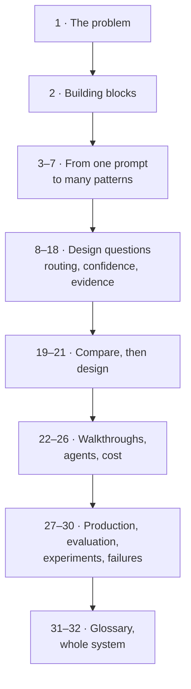

Each block uses only ideas introduced above it. Short on time? Read chapter 32, then the diagrams in chapters 21 to 24.

### Three kinds of statement

The document keeps three kinds of claim apart, because they deserve different levels of trust.

| Label | What it means | How to treat it |
|---|---|---|
| **Research says** | A finding from peer-reviewed or credible preprint research, linked where it appears | Evidence about direction and mechanism. Numbers come from the paper's tasks, not from our calls |
| **Engineering practice** | Guidance from official documentation or widely adopted production practice | A sensible default, not a law |
| **Our recommendation** | The architect's own inference for this system | A hypothesis. Chapter 29 lists the experiments that could overturn it |

### How new terms appear

The first time a technical term matters, it gets a short **Term** box with four parts: simple meaning, why it matters here, a simple example, and the technical meaning. Every term is collected again in the glossary in chapter 31.

### Diagram conventions

- Rectangles are steps, diamonds are decisions, cylinders are stored data.
- A step labelled **LLM** is done by a language model. A step labelled **Code** is done by ordinary software.
- Arrows show what is passed forward. Dotted arrows show feedback that arrives later.

### About the examples

Examples use short, invented outbound personal-loan calls in romanised Hinglish, with English glosses, because that is the kind of data this system processes. The features in them (objections, disclosures, customer interest) are placeholders chosen to show different shapes of problem. They are not a proposed taxonomy, and nothing in the architecture depends on them.

## 1. The problem we are solving

We need a system that reads every call transcript and returns a structured, trustworthy record of what happened in the conversation, for a set of features whose definitions will keep changing.

### 1.1 The job in one picture

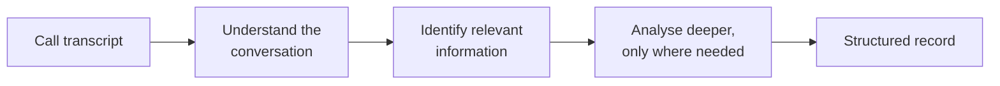

Every box hides a design decision. Who does the understanding, a model or code? How does the system know what is relevant? What decides "deeper"? How does it know the record is right? The rest of this document answers those questions one at a time.

### 1.2 What we mean by a feature

> **Term: Feature**
>
> - **Simple meaning:** one question we want answered about a call.
> - **Why it matters here:** the system will carry many features, and the list will change.
> - **Simple example:** "Did the customer raise an objection?"
> - **Technical meaning:** a named, versioned target variable with a defined answer space, extracted per call.

We will not assume a particular list of features. What we can say is that features come in a few **shapes**, and the shape, not the name, decides how hard a feature is to analyse.

| Shape | The question it asks | Placeholder example | What makes it hard |
|---|---|---|---|
| **Detection** | Did something happen? | Did the customer object? | The signal may be indirect |
| **Classification** | What kind was it? | Was the objection about rate or eligibility? | Categories overlap at the edges |
| **Attributes** | What are its details? | Which competitor, what amount? | Details are scattered across turns |
| **State over time** | How did it change? | Did interest rise or fall during the call? | The final state depends on order |
| **Absence** | Did something fail to happen? | Was a required statement never made? | Proving "no" means reading everything |
| **Overall judgement** | Taken as a whole, what was it? | How did the call end? | Depends on the whole conversation |

### 1.3 Progressive depth

Some features are finished after one question; others open up. A feature is first identified broadly, and only then, if it is present and matters, analysed for its type, cause, details or resolution.

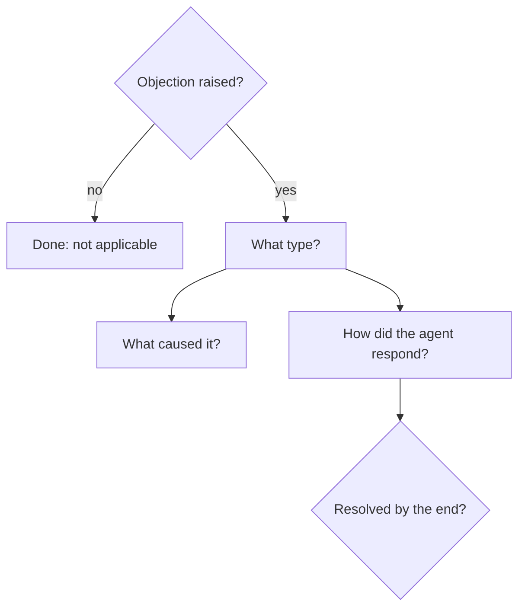

Two facts about this tree shape the whole architecture:

- **Depth differs by feature and by call.** One call needs one question answered; the next needs five.
- **The tree is not fixed in advance.** New sub-questions will be added as the business learns what matters. The system must absorb that without a redesign (chapter 17).

### 1.4 Why conversations are harder than documents

Here is an invented call fragment, with English glosses in brackets.

```text
T07  AGENT     Sir, aapka pre-approved loan offer hai, 5 lakh tak.
               [Sir, you have a pre-approved loan offer, up to 5 lakh.]
T08  CUSTOMER  Rate kya hai? Pichhli baar bahut zyada tha.
               [What's the rate? Last time it was very high.]
T09  AGENT     Aapke profile pe depend karega, 10.99% se start hota hai.
               [It depends on your profile; it starts at 10.99%.]
T10  CUSTOMER  Hmm... dusre bank ne kam bola tha. [PAUSE] Dekhte hain.
               [Hmm... another bank quoted lower. (pause) Let's see.]
T11  AGENT     Haan ji?
               [Yes?]
T12  CUSTOMER  Haan, bhej dijiye details.
               [Yes, send the details.]
```

In six turns, this fragment shows most of what makes conversations difficult:

| Difficulty | Where it shows | What goes wrong if ignored |
|---|---|---|
| **Who said it matters** | "10.99%" is a disclosure when the agent says it, a question when the customer does | Right words, wrong speaker, wrong conclusion |
| **Evidence is spread out** | The hesitation at T10 only makes sense after T08 and T09 | A decision based on one turn misreads the call |
| **Meaning is implicit** | "Dekhte hain" is a polite deferral, not a neutral remark | Keyword rules and literal search miss it |
| **People change their minds** | Hesitant at T10, agreeable at T12 | One label hides the change |
| **Short turns need their question** | "Haan" at T12 means yes only in reply to T11 | Excerpts lose the meaning |
| **Some answers are absences** | Was the processing fee ever mentioned? Nothing here says so | Only reading everything can prove "no" |
| **The input is noisy** | [PAUSE] marks audio the speech recogniser replaced; spellings vary ("zyada", "jyada") | The model over-interprets artefacts |
| **Some questions cannot be answered** | Is the customer salaried? Never discussed | The model guesses, and the guess looks confident |

**Research says** these difficulties are measurable, not hypothetical:

- On a benchmark of multi-speaker spoken conversations, models "can capture what was said, [but] often fail to identify who said it" ([M3-SLU, 2025](https://arxiv.org/abs/2510.19358)).
- On real human-to-human spoken dialogues, the best dialogue state tracker reached only 25.65% joint goal accuracy ([Si et al., SpokenWOZ, NeurIPS 2023](https://arxiv.org/abs/2305.13040)).
- LLM comprehension drops when words from another language interrupt English text; prompting fixes gave mixed results, while fine-tuning was more stable ([Mohamed et al., 2025](https://arxiv.org/abs/2506.14012)).
- In contact-centre quality assurance, 18 LLMs reversed binary judgements in 5.4% to 13.0% of cases when transcripts were altered in ways that should not matter, such as linguistic identity cues ([Mayilvaghanan et al., 2026](https://arxiv.org/abs/2602.14970)).

### 1.5 What "reliable structured output" has to mean

A label alone is not enough. For every feature, the system must return an answer, its evidence, a confidence, a status and its provenance.

```json
{
  "feature": "objection",
  "answer": {"present": true, "type": "RATE"},
  "evidence": [
    {"turn": "T08", "speaker": "CUSTOMER", "quote": "Rate kya hai?"},
    {"turn": "T10", "speaker": "CUSTOMER", "quote": "dusre bank ne kam bola tha"}
  ],
  "confidence": 0.93,
  "status": "ACCEPTED",
  "provenance": {"definitions": "v4", "prompt": "customer_signals@v11", "model": "model-A"}
}
```

| Part | Why it is required |
|---|---|
| **Answer**, including "not applicable" and "the call doesn't say" | Forcing a yes or no when the call is silent manufactures errors |
| **Evidence**: turns, speakers, exact words | An auditor can check the answer without re-listening to the call |
| **Confidence** that means something | Decides whether the answer is used, checked again, or sent to a person. Chapter 10 explains why a model's self-reported number is not enough |
| **Status**: accepted, needs review, abstained | Downstream users know what they can rely on |
| **Provenance**: definition, prompt and model versions | Results stay explainable after anything changes |

That gives five requirements the architecture must meet:

1. **Correct often enough**, with a measured error rate per feature.
2. **Honest about uncertainty**: it says "not sure" instead of guessing.
3. **Traceable**: every answer points to words in the call.
4. **Affordable at volume**: cost follows difficulty, not the worst case.
5. **Changeable**: a new feature does not require a new system.

### 1.6 The questions this document must answer

The architectural problem is how to build a system that analyses conversations progressively, goes deeper only when necessary, and produces reliable structured output. It splits into smaller questions:

| Question | Chapters |
|---|---|
| What parts can a system like this be built from? | 2 |
| Why not one prompt? When do more LLM calls help? | 3–5 |
| Which architectural patterns exist, and what does each cost? | 6–7 |
| Should every call follow the same path? | 8–9 |
| How does the system know how sure it is, and check itself? | 10–11 |
| What should each step see, and what should it pass on? | 12–14 |
| Which work belongs to code, to classic ML, and to LLMs? | 15–16 |
| How do we add features and improve over time? | 17–18 |
| Which design wins, how does it behave, and how does it run? | 19–30 |

## 2. The building blocks

Every design in this document is assembled from the same few parts, and the distinction that matters most between them is **who decides what happens next: your code, or the model**.

### 2.1 The LLM call

> **Term: LLM call**
>
> - **Simple meaning:** send text to a language model and get text back.
> - **Why it matters here:** every call costs money and time, and every call can be wrong.
> - **Simple example:** send a transcript plus "Did the customer object?" and receive "yes".
> - **Technical meaning:** one stateless inference request: a sequence of input tokens in, a sampled sequence of output tokens out.

The key word is **stateless**. A model remembers nothing between calls. If step 3 needs something step 1 learned, your program must put it into step 3's input. Chapters 13 and 14 are about doing that well.

### 2.2 Prompt, context and tokens

> **Term: Context**
>
> - **Simple meaning:** everything the model can see during one call.
> - **Why it matters here:** the model can only use what is in its context, and irrelevant context can make it worse (chapter 13).
> - **Simple example:** instructions, feature definitions, two examples, the transcript and the output format.
> - **Technical meaning:** the full token sequence given to the model for one request, bounded by its context window. The **prompt** is the part you write. **Tokens** are the sub-word units that models read and bill by.

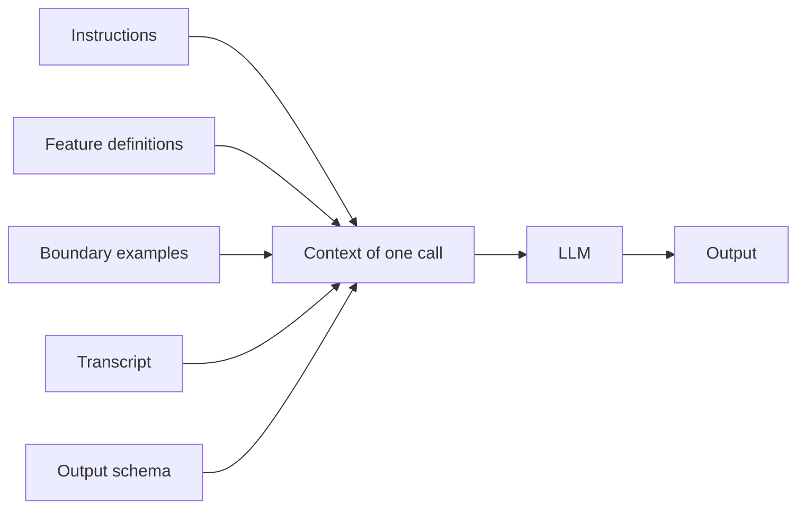

### 2.3 Structured output

> **Term: Structured output**
>
> - **Simple meaning:** the model fills in a form instead of writing free text.
> - **Why it matters here:** code can only route, check and store answers it can parse.
> - **Simple example:** `{"objection_present": true, "type": "RATE", "evidence_turns": ["T08", "T10"]}`
> - **Technical meaning:** generation constrained to a JSON Schema, either during decoding (tokens that would break the schema are masked out) or by validation afterwards.

**Engineering practice:** providers now enforce schemas during decoding. OpenAI reported 100% adherence on its complex-schema evaluation with this feature, against under 40% for an older model that was only prompted ([OpenAI, Aug 2024](https://openai.com/index/introducing-structured-outputs-in-the-api/)). Amazon Bedrock offers the same through `outputConfig.textFormat` in the Converse API ([AWS, Bedrock User Guide](https://docs.aws.amazon.com/bedrock/latest/userguide/structured-output.html)).

> **Key idea.** A valid form is not a correct form. OpenAI's announcement itself warns that the model "may still make mistakes within the values of the JSON object". Schema enforcement removes parsing failures; it does nothing about wrong answers. Chapters 10 to 12 deal with the second problem.

### 2.4 Tool

> **Term: Tool**
>
> - **Simple meaning:** a function the model can ask your program to run.
> - **Why it matters here:** tools let a model fetch information it does not have, which matters far less when the whole call is already in its context.
> - **Simple example:** "Look up this customer's application status."
> - **Technical meaning:** function calling. The model emits a structured request (function name and arguments); the application executes it and returns the result in a follow-up call.

### 2.5 Workflow

> **Term: Workflow**
>
> - **Simple meaning:** a recipe written in code that calls an LLM at fixed points.
> - **Why it matters here:** the path is known in advance, so cost, behaviour and failures are predictable.
> - **Simple example:** code cleans the transcript, an LLM labels speakers, an LLM extracts features, code checks the quotes.
> - **Technical meaning:** "systems where LLMs and tools are orchestrated through predefined code paths" ([Anthropic, Building effective agents, Dec 2024](https://www.anthropic.com/engineering/building-effective-agents)).

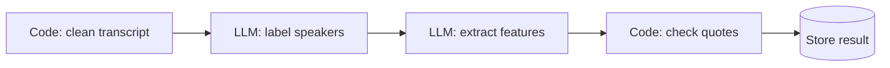

### 2.6 Agent

> **Term: Agent**
>
> - **Simple meaning:** an LLM in a loop that chooses its own next action.
> - **Why it matters here:** agents are powerful when the steps cannot be known in advance, and costly and unpredictable when they can.
> - **Simple example:** "Find out why this customer's application stalled." The model decides to search the CRM, read notes, pull an earlier call, then decides what to check next.
> - **Technical meaning:** "systems where LLMs dynamically direct their own processes and tool usage, maintaining control over how they accomplish tasks" ([Anthropic, Dec 2024](https://www.anthropic.com/engineering/building-effective-agents)). The classic loop interleaves reasoning and actions ([Yao et al., ReAct, ICLR 2023](https://arxiv.org/abs/2210.03629)).

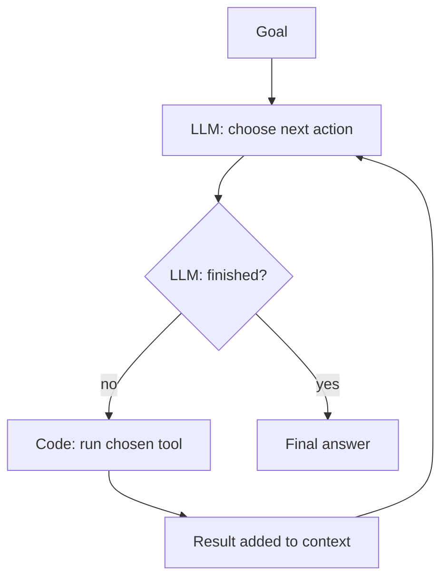

**Engineering practice:** OpenAI draws the same line. Applications that use LLMs but "don't use them to control workflow execution—think simple chatbots, single-turn LLMs, or sentiment classifiers—are not agents". Its guide advises checking that a use case really needs one, because "otherwise, a deterministic solution may suffice" ([OpenAI, A practical guide to building agents, 2025](https://cdn.openai.com/business-guides-and-resources/a-practical-guide-to-building-agents.pdf)).

### 2.7 Multi-agent system

> **Term: Multi-agent system**
>
> - **Simple meaning:** several agents, each with its own instructions and context, that pass work or messages to each other.
> - **Why it matters here:** splitting work can add parallelism and focus, but it adds coordination cost and new ways to fail.
> - **Simple example:** a manager agent hands a transcript to a "compliance agent" and a "sales agent", then merges their reports.
> - **Technical meaning:** multiple LLM-driven control loops that coordinate through messages, hand-offs or shared state, often under a supervisor.

What the evidence says about them:

- **Engineering practice:** Anthropic's multi-agent research system beat its single-agent version by 90.2% on an internal research evaluation, but agents used about 4× the tokens of a chat and the multi-agent system about 15×. Domains that "require all agents to share the same context or involve many dependencies between agents are not a good fit" ([Anthropic, Jun 2025](https://www.anthropic.com/engineering/multi-agent-research-system)).
- **Engineering practice:** later guidance puts multi-agent systems at 3–10× the tokens of a single agent, says to "group work by what context it requires, not by what kind of work it is", and names a verification sub-agent as the pattern that works consistently ([Anthropic, Jan 2026](https://claude.com/blog/building-multi-agent-systems-when-and-how-to-use-them)).
- **Research says:** across 260 controlled configurations, multi-agent set-ups improved a decomposable financial-reasoning task by 80.8% but degraded sequential planning by up to 70.0% ([Kim et al., 2025, rev. 2026](https://arxiv.org/abs/2512.08296)).
- **Research says:** failures are hard to trace in multi-agent logs. The best automated method found the responsible agent 53.5% of the time and the decisive step 14.2% of the time ([Zhang et al., ICML 2025](https://arxiv.org/abs/2505.00212)).
- **Engineering practice:** Cognition argues against splitting by default, because "actions carry implicit decisions, and conflicting decisions carry bad results" ([Yan, Cognition, Jun 2025](https://cognition.com/blog/dont-build-multi-agents)).

### 2.8 The ladder, and where the line really is

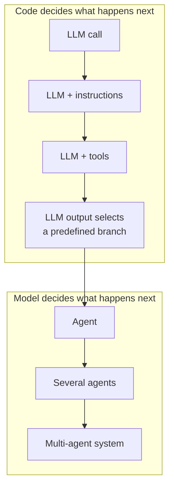

| Rung | Who decides the next step | Example in our world | Predictability |
|---|---|---|---|
| LLM call | Code | One extraction call | High |
| LLM + instructions | Code | Extraction with definitions and examples | High |
| LLM + tools | Code owns the sequence; the model may request a lookup | Extraction that can fetch product terms | High |
| LLM output selects a predefined branch | Code owns every possible path; the model's typed answer picks one | "Objection present" switches on a deeper objection step | High |
| Agent | The model, in a loop, until it decides to stop | Investigating a stalled application | Low |
| Several agents / multi-agent system | Several models, coordinating | Manager plus specialist agents | Lowest |

**Where the distinction matters:**

- **Control.** When code owns the loop, every possible path can be listed, tested, bounded in cost and replayed. When a model owns it, none of that is guaranteed.
- **Cost.** Tokens multiply with every loop and every agent.
- **Debugging.** In a workflow, a bad answer points to one call. In agent traces, even finding the responsible agent is hard.

**Where it is exaggerated:**

- Calling a prompt a "Compliance Agent" changes nothing about its behaviour. A persona is an instruction, not autonomy.
- Many systems described as multi-agent are workflows with several prompts. That is fine; it helps to call them what they are.
- The fourth rung is not an agent. A model's typed answer choosing among branches you wrote is still a workflow.

> **Key idea.** "Multi-agent" is not a higher tier of quality. It is a different allocation of control, worth its cost only when the task needs the model to choose its own steps. The rest of the document keeps asking whether ours does.

### 2.9 Three kinds of machinery

LLMs are one of three tools, and a good system uses each for what it does best.

| Machinery | Good at | Weak at | Example job in this system |
|---|---|---|---|
| **Deterministic code** | Exact rules, checks, routing, arithmetic, storage | Meaning and ambiguity | Checking that a quoted phrase really appears in turn T10 |
| **Traditional ML** | Fast, cheap, consistent decisions learned from labels; similarity search | Needs labelled data; must be retrained when definitions change | A trained classifier for a stable, high-volume label |
| **LLMs** | Reading implicit meaning; applying new definitions without training | Cost, variance, confident mistakes | Deciding whether "dekhte hain" is a refusal or a deferral |

Chapters 15 and 16 return to this split in detail.

## 3. Level 1: the simplest possible architecture

The simplest design sends the whole transcript and every feature definition to one LLM call and gets every answer back at once. It is a strong baseline, and every more complex design in this document has to beat it on the same data.

### 3.1 How it works

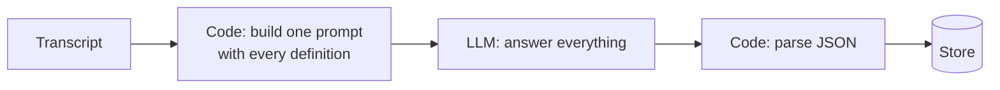

One prompt holds the instructions, every feature's definition, the transcript and a JSON schema with a field for each feature. One call returns all the answers.

```text
INSTRUCTIONS  Answer every question about this call. Return JSON only.
FEATURES      objection: present? type?  |  fee disclosure: stated?  |  interest: final state?
TRANSCRIPT    T01 ... T42
SCHEMA        {"objection": {...}, "fee_disclosure": {...}, "interest": {...}}
```

### 3.2 Why it is attractive

- **Cheapest and fastest.** One call per transcript, and the transcript is sent once.
- **Nothing is lost.** The model sees the whole conversation for every question.
- **Internally consistent.** Related answers come from one reading, so they rarely contradict each other.
- **Simple to run.** One prompt, one schema, one place to look when something breaks.

**Research says** bundling related questions can even help. When models answered two or three related sub-tasks in one call, GPT-4 improved by up to 12.4% and Llama-2-Chat-70B by up to 7.3% over one call per sub-task, and total inference time fell by 1.46× ([Son et al., ACL 2024](https://aclanthology.org/2024.acl-long.304/)).

### 3.3 What it can solve

- A small number of features with short, clear definitions.
- Detection and simple classification where the evidence is explicit.
- A prototype, and the baseline for every experiment in chapter 29.

### 3.4 What breaks as the system grows

| Problem | What you see | Why it happens |
|---|---|---|
| **Instruction overload** | Fields left empty; later features answered carelessly | **Research says:** at 500 simultaneous instructions the best frontier model followed only 68%, with a bias toward earlier instructions ([Jaroslawicz et al., 2025](https://arxiv.org/abs/2507.11538)) |
| **Longer prompts, worse answers** | Quality drops as definitions and examples accumulate | **Research says:** across 18 models, performance "varies significantly as input length changes, even on simple tasks" ([Hong et al., Chroma, 2025](https://www.trychroma.com/research/context-rot)) |
| **No sense of difficulty** | Easy and ambiguous calls get the same single reading | There is no step where the system can decide to look again |
| **Forced guesses** | Confident answers to questions the call never settles | The schema demands a value for every field |
| **Unchecked evidence** | Answers nobody can verify | Nothing checks that the model's reasons exist in the transcript |
| **One model for everything** | Strong-model prices for easy questions, or weak-model errors on hard ones | Every feature shares the call |
| **All-or-nothing changes** | Editing one definition shifts unrelated answers; every change re-runs everything | All features share one prompt |
| **Shared ownership** | Several teams editing one giant prompt | Governance cannot be split |

### 3.5 Verdict

> **Key idea.** Level 1 is not a straw man; it is the control group. Many of its weaknesses are not caused by "one call" as such. They come from missing evidence checks, missing confidence and a growing instruction load. Every later level must show, on real data, that it fixes one of these at a cost worth paying.

**Our recommendation:** keep the single call as the baseline arm in every architecture experiment. If the feature set stays small and errors are cheap, it may even be the right production design.

## 4. Why not one big prompt?

Splitting work into several LLM calls helps only when a boundary buys something measurable: a lighter instruction load, a different context or model, conditional execution, or an independent check. It hurts when it separates reasoning that belongs together.

### 4.1 The tempting argument

"Models are powerful and context windows are huge. Why not give the whole transcript to the strongest model and ask it to do everything?"

Half of this is right. A call of a few minutes fits comfortably in any modern context window. The real questions are whether one reading can do every job well, and whether we would know when it has not.

### 4.2 Nine factors, one at a time

| Factor | One big call | What splitting changes | Evidence |
|---|---|---|---|
| **Reasoning complexity** | Every question competes for the same attention | A hard sub-question (an ordering rule, an amount) gets focused reasoning | **Research says:** step-by-step reasoning helps mainly on math and symbolic tasks, with much smaller gains elsewhere ([Sprague et al., ICLR 2025](https://arxiv.org/abs/2409.12183)). Most transcript questions need careful reading more than long reasoning |
| **Context size** | Instructions grow with every feature | Each call carries only its own definitions | **Research says:** reasoning degrades "at much shorter input lengths than their technical maximum" ([Levy et al., ACL 2024](https://aclanthology.org/2024.acl-long.818/)) |
| **Task specialisation** | Every question gets the same examples, reference text and model | A sub-task can have its own rubric, reference material or stronger model | Follows from the two rows above |
| **Reliability** | One failure affects every feature | Failures and retries are per call. But chains multiply errors: three steps at 95% each give about 86% end to end (0.95³ ≈ 0.857), if errors are independent | Arithmetic |
| **Consistency** | Related answers come from one reading | Separate calls can contradict each other ("no objection" and "objection handled well"), so cross-checks become necessary | Follows from design |
| **Interpretability** | One output with dozens of fields | Small typed outputs are easier to inspect and test | Follows from design |
| **Error isolation** | Editing one definition can move unrelated answers | Only the changed call re-runs | **Research says:** formatting changes alone moved accuracy by up to 76 points for one model ([Sclar et al., ICLR 2024](https://arxiv.org/abs/2310.11324)) |
| **Verification** | A check inside the same call cannot be independent | A second call can check the first without seeing its reasoning | **Research says:** answering verification questions "independently so the answers are not biased" by the draft reduced hallucinations ([Dhuliawala et al., Findings of ACL 2024](https://aclanthology.org/2024.findings-acl.212/)) |
| **Cost** | The transcript is sent once | Every extra call re-sends it. Splitting saves money only when extra calls are conditional | Arithmetic |

### 4.3 More calls are not automatically better

- **Research says:** in voting systems, accuracy "can first increase but then decrease" as calls are added, because "more LM calls lead to higher performance on easy queries, but lower performance on hard queries" ([Chen et al., 2024](https://arxiv.org/abs/2403.02419)).
- **Research says:** on a three-level product-review taxonomy with a black-box LLM, a top-down chain (one prompt per level) was very accurate whenever its parent was right, 0.853 at the deepest level. Its end-to-end accuracy, 0.490, was still lower than predicting the whole label path in one call, 0.532 ([Yoshimura and Kashima, 2025](https://arxiv.org/abs/2508.04219)).
- **Research says:** decomposition does help on genuinely compositional tasks, where sub-tasks are delegated to dedicated prompts ([Khot et al., Decomposed Prompting, ICLR 2023](https://arxiv.org/abs/2210.02406)).

The pattern across all three: narrow calls are better at their narrow job, and worse at not losing the plot. A split is worth it only when its gain outweighs the errors it lets through the joins.

### 4.4 When should a sub-task become its own call?

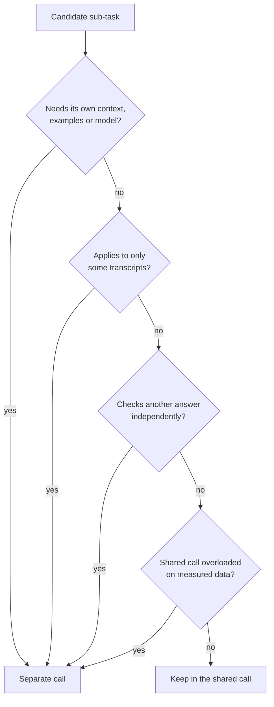

Parallelism for lower latency is a fifth reason, but it rarely matters when calls are processed in batches.

| Reason to split | Helps when | Hurts when |
|---|---|---|
| Lighter instruction load | Many features, long rubrics | Related questions lose sight of each other |
| Different context | A sub-task needs reference text the others do not | Context is duplicated for no gain |
| Different model | One sub-task is measurably harder | The cheaper model's errors cannot be detected |
| Conditional execution | The sub-task applies to a minority of calls | The condition itself is unreliable |
| Independent check | Consequential answers need a second look | The checker shares the first model's blind spots (chapter 11) |
| Parallelism | Latency matters | Calls depend on each other |

**Reasons that do not justify a split:** mirroring the org chart; giving each prompt a persona; one call per category label, so the model never compares categories side by side; "each prompt will be simpler" without a measured gain.

> **Key idea.** The right unit of work is one coherent reading. Questions that compete with each other or share evidence stay together. Anything with a different context, model, trigger or checking role gets its own call.

**Our recommendation:** start from grouped calls of related features, and split further only for one of the named reasons, recorded next to the feature so the split can be re-tested later.

## 5. The complexity ladder

Each step up the ladder should be forced by a specific problem the level below cannot solve, and each step brings a new problem of its own.

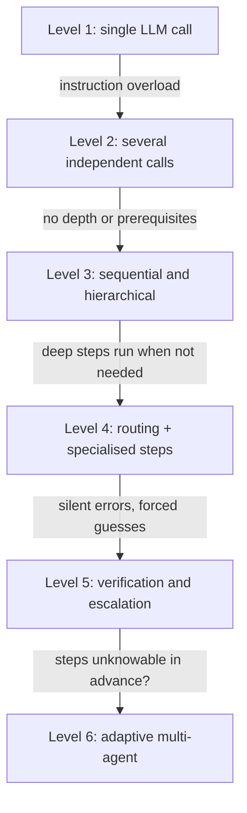

### Level 2: several independent calls

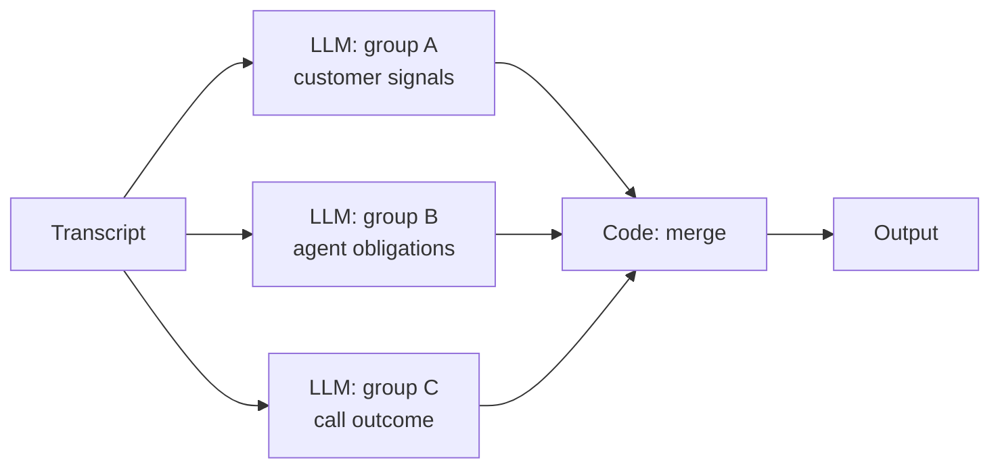

- **What changes:** related features are grouped, and each group gets its own call. Groups run in parallel.
- **Problem solved:** instruction overload; a model per group; separate ownership; one group's failure does not break the others.
- **Problem remaining:** every group runs on every transcript, relevant or not. There is no depth, no checking, and groups can contradict each other.

### Level 3: sequential and hierarchical processing

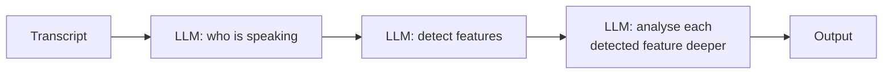

- **What changes:** prerequisites come first (speaker roles before anything that depends on them), and features are analysed level by level: detect, then type, then cause or resolution.
- **Problem solved:** depth, and a correct order of dependencies.
- **Problem created:** errors cascade. If speaker attribution swaps the agent and the customer at T09, every disclosure feature downstream fails, however good its prompt. A wrong parent also blocks a correct child from ever running.

### Level 4: routing and specialised processing

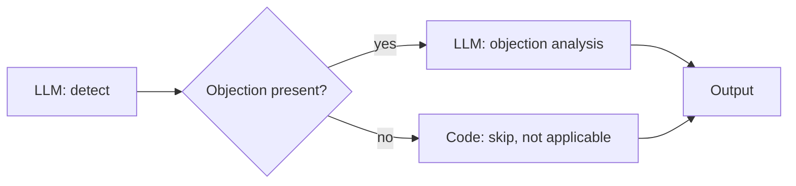

- **What changes:** deeper steps run only where earlier results say they apply.
- **Problem solved:** cost follows content. A call with no objection pays nothing for objection analysis.
- **Problem created:** routing errors are silent. If the detector reads "dekhte hain" as no objection, objection analysis never runs, and nothing in the output shows that anything was missed.

### Level 5: verification and escalation

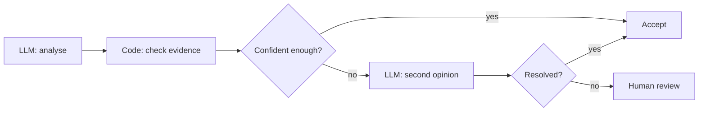

- **What changes:** results are checked, and uncertain ones get more analysis or go to a person instead of being guessed.
- **Problem solved:** silent errors become visible; forced guesses become honest "not sure" outcomes.
- **Problem created:** the system now needs a confidence signal that actually means something (chapter 10), a verifier that does not share the first model's blind spots (chapter 11), and a human queue with limited capacity.

### Level 6: adaptive multi-agent system

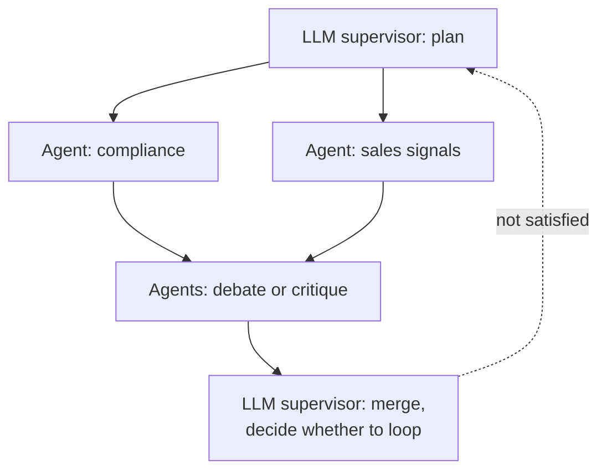

- **What changes:** models decide which analyses to run, in what order, and when to stop.
- **Problem solved, in principle:** tasks whose steps cannot be listed in advance, such as open-ended investigations.
- **Problem created:** cost and path vary from transcript to transcript; audits become hard. **Research says:** multi-agent traces show 14 distinct failure modes in three categories, including inter-agent misalignment and weak task verification ([Cemri et al., 2025](https://arxiv.org/abs/2503.13657)), and even locating the failing agent is unreliable ([Zhang et al., ICML 2025](https://arxiv.org/abs/2505.00212)).

### The ladder at a glance

| Level | Adds | Solves | New problem | LLM calls per transcript |
|---|---|---|---|---|
| 1 | One call | — | Overload, no checks | 1 |
| 2 | Feature groups | Overload, ownership | Irrelevant work, no depth | One per group |
| 3 | Sequential stages | Depth, prerequisites | Cascading errors, blocking | Groups × levels |
| 4 | Conditional steps | Wasted work | Silent routing misses | Groups + active deep steps |
| 5 | Checks and escalation | Silent errors, forced guesses | Needs real confidence and independent checkers | Level 4 + checks on the uncertain share |
| 6 | Model-driven control | Unlistable steps | Variance, cost, auditability | Variable; unbounded without caps |

> **Key idea.** Levels 2 to 5 keep code in charge of what happens next; Level 6 hands that control to models. That is the real jump on this ladder, and it needs a stronger reason than any step before it. Hold the question "do our steps really need to be invented at run time?" until chapter 20.

## 6. Pattern catalogue, part A: structuring the work

Most LLM architectures are combinations of about a dozen patterns. This chapter covers six that decide how work is structured; chapter 7 covers seven that decide how answers are checked and how effort is spent. Each uses the same format so they can be compared in chapter 19.

**How to read the cost line:** 1× means one LLM call per transcript. **Complexity** means how hard the pattern is to build, test and keep working.

### 6.1 Simple pipeline

**What is it?** A fixed line of steps, mostly ordinary code, with one LLM step in the middle.

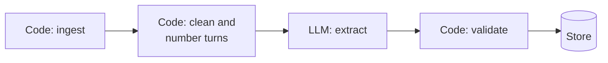

**Example.** Rules drop calls with no conversation, code numbers the turns, one LLM call extracts features, code validates the JSON, the result is stored.

**Why use it?** It is predictable, cheap and easy to test. Much of a system's reliability comes from the code around the model.

**What can go wrong?** The LLM step keeps every Level 1 weakness. Cleaning errors, such as merging turns from two speakers, silently poison everything after them.

**Cost:** 1×. **Complexity:** low.

**Where it fits our problem.** Ingestion, triage, cleaning, validation and storage are pipeline steps in any design.

**Verdict:** keep as the outer skeleton; not enough on its own.

### 6.2 Sequential LLM pipeline (prompt chaining)

**What is it?** Several LLM calls in a fixed order, each consuming the previous call's output.

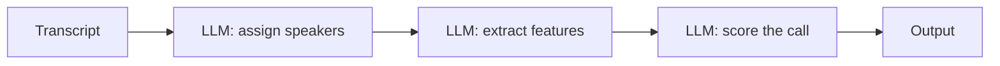

**Example.** First decide who is the agent and who is the customer, then extract features from the speaker-labelled transcript.

**Why use it?** Each step is simpler, intermediate results can be inspected, and prerequisites run first.

- **Engineering practice:** Anthropic calls chaining "ideal for situations where the task can be easily and cleanly decomposed into fixed subtasks", trading latency for accuracy ([Anthropic, Dec 2024](https://www.anthropic.com/engineering/building-effective-agents)).
- **Research says:** in a 20-person user study, chaining improved the quality of outcomes and "significantly enhanced system transparency, controllability, and sense of collaboration" ([Wu et al., AI Chains, CHI 2022](https://arxiv.org/abs/2110.01691)).

**What can go wrong?** Errors cascade: the later step inherits the earlier step's mistakes. If steps hand each other prose, meaning drifts at every hand-off. Latency adds up.

**Cost:** one call per step. **Complexity:** low to medium.

**Where it fits our problem.** When a step is a genuine prerequisite, such as speaker roles before anything that depends on who spoke. Not for cutting one coherent reading into artificial stages.

**Verdict:** consider, for real prerequisites only, and pass structured data rather than prose between steps.

### 6.3 Hierarchical processing

**What is it?** A coarse decision first, then finer decisions only inside the branch that was chosen.

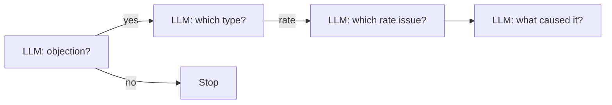

**Example.** "Objection?" then "rate, eligibility or trust?" then "competitor quote or EMI too high?"

**Why use it?** It mirrors how taxonomies are organised. Each call sees fewer labels, and deep steps run only where relevant.

**What can go wrong?** A wrong parent blocks a correct child, and errors compound down the chain. **Research says:** on a three-level taxonomy, a top-down chain scored 0.853 at the deepest level when its parent was right, yet 0.490 end to end, below the 0.532 of predicting the whole path in one call ([Yoshimura and Kashima, 2025](https://arxiv.org/abs/2508.04219)).

**Cost:** grows with depth, though deep steps run only in their branch. **Complexity:** medium.

**Where it fits our problem.** The taxonomy is hierarchical, but execution does not have to be. Several levels can be predicted in one call; separate deep steps make sense for rare branches with large rubrics.

**Verdict:** keep hierarchy as a way to organise questions; question one call per level. Chapter 20 adds the safeguards.

### 6.4 Router and specialists

**What is it?** A classification step decides which specialised handler processes the input.

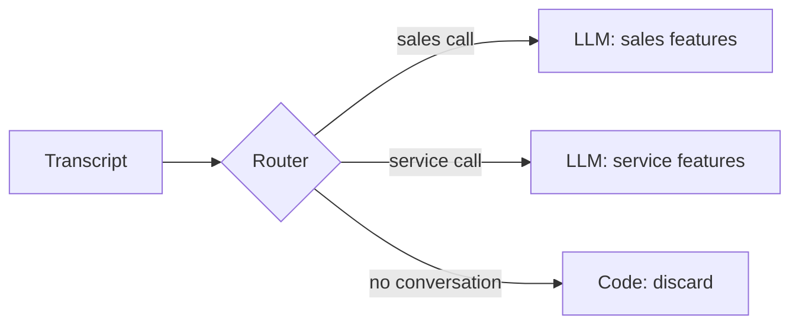

**Example.** A router separates sales calls, service calls and wrong numbers, then sends each to the matching feature set.

**Why use it?** Specialists get focused prompts, examples and models. **Engineering practice:** routing "classifies an input and directs it to a specialized followup task" ([Anthropic, Dec 2024](https://www.anthropic.com/engineering/building-effective-agents)).

**What can go wrong?** A routing miss is silent: the right specialist never runs, and the output looks normal. A separate LLM router adds a call and another source of error.

**Cost:** one router call plus the chosen specialist, cheaper than running every specialist. **Complexity:** medium.

**Where it fits our problem.** Routing is clearly needed. What is unclear is whether the router must be an LLM. Metadata (campaign, call type) can route with plain code, and an analysis call can emit a routing signal as a typed field that code reads.

**Verdict:** keep routing; challenge the separate LLM router.

### 6.5 Supervisor and workers

**What is it?** A central LLM breaks the task down, hands pieces to worker LLMs, and combines their results.

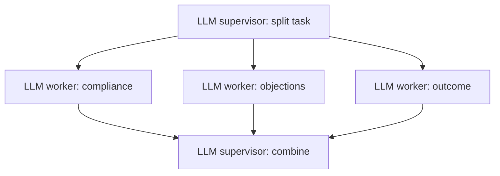

**Example.** The supervisor reads the transcript, decides to run the compliance and objection workers, then writes the merged record.

**Why use it?** It is flexible when the sub-tasks cannot be predicted. **Engineering practice:** Anthropic describes it as "a central LLM dynamically breaks down tasks, delegates them to worker LLMs, and synthesizes their results", suited to tasks where subtasks are unpredictable ([Anthropic, Dec 2024](https://www.anthropic.com/engineering/building-effective-agents)). OpenAI calls the equivalent the manager pattern ([OpenAI, 2025](https://cdn.openai.com/business-guides-and-resources/a-practical-guide-to-building-agents.pdf)).

**What can go wrong?** The supervisor may choose different workers on identical calls. An LLM merge can drop or distort worker results. **Research says:** inter-agent misalignment and weak task verification are two of the three failure categories found in multi-agent traces ([Cemri et al., 2025](https://arxiv.org/abs/2503.13657)).

**Cost:** a supervisor call, the workers and a merge call, at least 3×. **Engineering practice** puts multi-agent systems at 3–10× the tokens of a single agent ([Anthropic, Jan 2026](https://claude.com/blog/building-multi-agent-systems-when-and-how-to-use-them)). **Complexity:** high.

**Where it fits our problem.** Our sub-tasks, the features, are known before any transcript arrives. The supervisor's jobs, scheduling, merging and retrying, are exactly what ordinary code does reliably.

**Verdict:** unlikely to earn its place per transcript. Keep in mind for open-ended investigations across many calls.

### 6.6 Planner and executor

**What is it?** One step writes an explicit plan; executor steps carry it out, sometimes re-planning along the way.

```mermaid
flowchart LR
  P["LLM planner: list steps"] --> E["LLM executor: do step"]
  E --> Q{"Plan complete?"}
  Q -->|"no"| E
  Q -->|"yes"| R["Result"]
  E -.->|"step failed"| P
```

**Example.** "Step 1: find every mention of fees. Step 2: check whether it came before the customer agreed. Step 3: decide."

**Why use it?** Explicit plans reduce skipped steps in multi-step reasoning.

- **Research says:** planning first, then solving sub-tasks, targets missing-step errors in zero-shot reasoning ([Wang et al., Plan-and-Solve, ACL 2023](https://arxiv.org/abs/2305.04091)).
- **Research says:** decomposing "as-needed, i.e., when the LLM is unable to execute" raised success rates by 28.3%, 27% and 33% on three agent benchmarks ([Prasad et al., ADaPT, Findings of NAACL 2024](https://aclanthology.org/2024.findings-naacl.264/)).

**What can go wrong?** Plans can be wrong or incomplete, and a plan that changes from call to call makes results hard to audit. Planning adds calls.

**Cost:** 2× or more. **Complexity:** medium to high.

**Where it fits our problem.** For per-transcript analysis, the plan already exists: it is the set of feature definitions, written once, reviewed and versioned. What transfers is ADaPT's lesson: do more work only when the simple attempt is not good enough.

**Verdict:** no runtime planner. Keep the "decompose only when needed" principle; it returns as adaptive reasoning in chapter 9.

## 7. Pattern catalogue, part B: checking answers and spending effort

These seven patterns decide how answers are checked, combined and escalated. They matter more for reliability than the patterns in chapter 6, and they are also where most wasted LLM calls come from.

### 7.1 Parallel analysis

**What is it?** Independent sub-tasks run at the same time, and code merges the results.

```mermaid
flowchart LR
  T["Transcript"] --> A["LLM: customer signals"]
  T --> B["LLM: agent obligations"]
  A --> M["Code: merge and<br/>cross-check"]
  B --> M
```

**Example.** Customer signals and agent obligations are analysed simultaneously, then merged.

**Why use it?** Lower latency, independent failures, separate owners. **Engineering practice:** Anthropic calls this "sectioning" ([Anthropic, Dec 2024](https://www.anthropic.com/engineering/building-effective-agents)).

**What can go wrong?** Parallel results can contradict each other, the transcript is sent once per branch, and no branch sees the others' conclusions.

**Cost:** one call per branch. **Complexity:** low.

**Where it fits our problem.** Independent feature groups.

**Verdict:** keep, with cross-feature consistency checks in code.

### 7.2 Ensemble and voting

**What is it?** Several independent answers to the same question, combined by a vote or an aggregator.

```mermaid
flowchart LR
  Q["Same question"] --> A["LLM answer 1"]
  Q --> B["LLM answer 2"]
  Q --> C["LLM answer 3"]
  A --> V{"Code: vote"}
  B --> V
  C --> V
  V --> R["Answer + agreement level"]
```

**Example.** Three answers on whether T10 is an objection; the majority wins and the level of disagreement is recorded.

**Why use it?** Random errors cancel out, and disagreement is a free signal of difficulty.

- **Research says:** sampling several reasoning paths and taking the most consistent answer improved GSM8K accuracy by 17.9 points ([Wang et al., Self-Consistency, ICLR 2023](https://arxiv.org/abs/2203.11171)).
- **Research says:** with sampling and voting, performance scales with the number of agents, and the gain grows with task difficulty ([Li et al., TMLR 2024](https://arxiv.org/abs/2402.05120)).

**What can go wrong?** Voting only removes errors that are independent.

- **Research says:** across more than 350 models, two models that were both wrong gave the same wrong answer 60% of the time on one dataset, and larger, more accurate models had more correlated errors "even with distinct architectures and providers" ([Kim et al., ICML 2025](https://arxiv.org/abs/2506.07962)).
- **Research says:** mixing different models can hurt; aggregating samples of the single best model beat standard mixture-of-agents by 6.6% on AlpacaEval 2.0 ([Li et al., Rethinking Mixture-of-Agents, 2025](https://arxiv.org/abs/2502.00674)).
- **Research says:** majority voting "accounts for most of the performance gains typically attributed to" multi-agent debate, and debate alone "does not improve expected correctness" ([Choi et al., NeurIPS 2025](https://arxiv.org/abs/2508.17536)). Debate systems "do not reliably outperform" self-consistency and ensembling ([Smit et al., ICML 2024](https://arxiv.org/abs/2311.17371)).

**Cost:** one call per voter. **Complexity:** low to medium.

**Where it fits our problem.** On uncertain items, as a way to measure instability, not as a default on every item.

**Verdict:** consider selectively. Rule out debate.

### 7.3 Verifier or judge

**What is it?** A separate step evaluates an answer and accepts, rejects or scores it.

```mermaid
flowchart LR
  G["LLM: answer"] --> V["LLM: verifier checks<br/>one specific claim"]
  V -->|"supported"| A["Accept"]
  V -->|"not supported"| R["Reject or escalate"]
```

**Example.** A second model is asked a narrow question: "Does T19 show the agent stating the processing fee?"

**Why use it?** Checking a specific claim is often easier than producing the answer, and an independent check can catch what the first reading missed.

- **Research says:** a 770-million-parameter grounding checker reached GPT-4-level accuracy at 400× lower cost ([Tang et al., MiniCheck, EMNLP 2024](https://aclanthology.org/2024.emnlp-main.499/)).
- **Research says:** strong LLM judges reached over 80% agreement with human preferences, the level at which humans agree with each other ([Zheng et al., NeurIPS 2023](https://arxiv.org/abs/2306.05685)).

**What can go wrong?** Judges have biases, and a verifier that thinks like the generator confirms its mistakes.

- **Research says:** LLM judges show "position, verbosity, and self-enhancement biases" ([Zheng et al., NeurIPS 2023](https://arxiv.org/abs/2306.05685)), and LLM evaluators recognise and favour their own generations ([Panickssery et al., NeurIPS 2024](https://arxiv.org/abs/2404.13076)).
- **Research says:** a panel of smaller judges from different model families beat a single large judge, with less intra-model bias, at over seven times lower cost ([Verga et al., 2024](https://arxiv.org/abs/2404.18796)).

**Cost:** one extra call per verified item. **Complexity:** medium.

**Where it fits our problem.** Consequential or uncertain answers, checked claim by claim, by a different model family.

**Verdict:** strong candidate, used selectively. Chapter 11 works out when.

### 7.4 Reflection and self-critique

**What is it?** The model critiques its own output and revises it, sometimes in a loop.

```mermaid
flowchart LR
  G["LLM: answer"] --> C["Same LLM: critique"]
  C --> R["Same LLM: revise"]
  R -.->|"repeat"| C
```

**Example.** "Review your answer. Are you sure T10 is an objection?"

**Why use it?** It can improve open-ended writing. **Research says:** using one LLM as generator, critic and refiner improved outputs by about 20% absolute on average across its tasks ([Madaan et al., Self-Refine, NeurIPS 2023](https://arxiv.org/abs/2303.17651)).

**What can go wrong?** For judgement tasks, the model mostly argues with itself.

- **Research says:** without external feedback, "LLMs struggle to self-correct their responses… and at times, their performance even degrades" ([Huang et al., ICLR 2024](https://arxiv.org/abs/2310.01798)).
- **Research says:** self-correction works with reliable external feedback; no prior work showed success with feedback from prompted LLMs outside narrow tasks ([Kamoi et al., TACL 2024](https://aclanthology.org/2024.tacl-1.78/)).
- **Research says:** when challenged with "Are you sure?", ten LLMs flipped their classification answers 46% of the time, losing 17% accuracy on average ([Laban et al., 2023](https://arxiv.org/abs/2311.08596)).

**Cost:** two or three calls per loop. **Complexity:** easy to build, hard to control.

**Where it fits our problem.** Only with external, checkable feedback. "Your quote was not found in T10" from a code check is useful; "reconsider your answer" is not.

**Verdict:** drop open-ended self-critique. Keep repair prompts driven by concrete validation errors.

### 7.5 Adaptive cascade

**What is it?** Try a cheaper model first, and escalate to a stronger one only when the cheap answer looks unreliable.

```mermaid
flowchart LR
  T["Input"] --> S["LLM: cheaper model"]
  S --> Q{"Reliable enough?"}
  Q -->|"yes"| A["Accept"]
  Q -->|"no"| L["LLM: stronger model"]
  L --> A2["Accept or escalate"]
```

**Example.** A cheaper model labels most calls; ambiguous ones go to a stronger model.

**Why use it?** Most inputs are easy, so most of the strong model's cost is wasted on them.

- **Research says:** a learned cascade matched the best individual LLM "with up to 98% cost reduction" ([Chen et al., FrugalGPT, 2023](https://arxiv.org/abs/2305.05176)).
- **Research says:** using the weaker model's answer consistency as the escalation signal matched GPT-4 at 40% of its cost ([Yue et al., ICLR 2024](https://arxiv.org/abs/2310.03094)); self-verification-based routing cut cost by over 50% at comparable performance ([Aggarwal et al., AutoMix, NeurIPS 2024](https://arxiv.org/abs/2310.12963)).
- **Research says:** good quality estimators are "the critical factor" for routing and cascading, and combining the two outperforms either alone ([Dekoninck et al., ICML 2025](https://arxiv.org/abs/2410.10347)).

**What can go wrong?** A confidently wrong cheap answer is accepted. Savings depend on the price gap and the escalation rate. The strong model is usually less accurate on the hard cases it receives than on average.

**Cost:** cheap call + (escalation rate × strong call). **Complexity:** medium; it needs a trustworthy confidence signal and tuned thresholds.

**Where it fits our problem.** High volume with many easy calls, if our models differ enough in price and quality.

**Verdict:** strong candidate, but only as good as its confidence signal (chapter 10).

### 7.6 Human in the loop

**What is it?** People review, correct or decide the cases the system cannot settle, and their decisions flow back into the system.

```mermaid
flowchart LR
  S["System result"] --> Q{"Settled?"}
  Q -->|"yes"| A["Accept"]
  Q -->|"no"| H["Human review"]
  H --> A
  H -.->|"labels"| L[("Training and<br/>evaluation data")]
```

**Example.** A consequential finding with low confidence goes to a quality analyst, with the evidence turns highlighted.

**Why use it?** Accountability for high-stakes decisions, and a source of ground truth.

- **Research says:** "learning to defer" trains a predictor together with a rejector that decides when to hand a case to an expert ([Mozannar and Sontag, ICML 2020](https://arxiv.org/abs/2006.01862)).
- **Research says:** selective evaluation with escalation guaranteed over 80% agreement with humans at about 80% coverage, a level GPT-4 alone "almost never" reached ([Jung et al., Trust or Escalate, ICLR 2025](https://arxiv.org/abs/2407.18370)).
- **Engineering practice:** escalate to people when failure thresholds are exceeded and for high-risk actions ([OpenAI, 2025](https://cdn.openai.com/business-guides-and-resources/a-practical-guide-to-building-agents.pdf)).

**What can go wrong?** Reviewers anchor on the model. **Research says:** "when LLM was incorrect, providing the wrong LLM labels hurt human accuracy" ([Wang et al., CHI 2024](https://dl.acm.org/doi/10.1145/3613904.3641960)). Queues also overflow.

**Cost:** no LLM cost, but people are the most expensive and slowest resource. **Complexity:** medium: review tools, capacity planning, blind audits.

**Where it fits our problem.** Unresolved cases, consequential findings, and blind audits that measure real accuracy.

**Verdict:** required. The design question is how few, and which, cases reach people.

### 7.7 Hybrid: LLM + traditional ML + deterministic code

**What is it?** Each piece of work goes to the cheapest machinery that does it reliably: rules for exact checks, trained models for stable high-volume decisions, LLMs for meaning.

```mermaid
flowchart LR
  R["Code: triage rules"] --> L["LLM: interpret"]
  L --> V["Code: validate evidence"]
  V --> M["ML: stable labels,<br/>added later"]
  M --> O[("Store")]
```

**Example.** Rules drop non-conversations, an LLM extracts features, code checks the quotes, and later a small trained classifier takes over one stable, high-volume label.

**Why use it?**

- **Engineering practice:** "compound AI systems", which tackle tasks "using multiple interacting components, including multiple calls to models, retrievers, or external tools", increasingly produce state-of-the-art results ([Zaharia et al., BAIR, Feb 2024](https://bair.berkeley.edu/blog/2024/02/18/compound-ai-systems/)).
- **Research says:** a cascade that starts with models as simple as logistic regression and ends with an LLM, learning when to defer by imitating the LLM, matched LLM accuracy while cutting inference cost by up to 90% ([Nie et al., ICML 2024](https://arxiv.org/abs/2402.04513)).

**What can go wrong?** More kinds of component to maintain, and the boundaries between them must be explicit. Trained models drift when definitions change.

**Cost:** lowest at scale. **Complexity:** medium overall, but each part is simple.

**Where it fits our problem.** Everywhere. It is less a pattern than the organising principle for all the others.

**Verdict:** strong candidate as the frame for the whole design.

### 7.8 The catalogue at a glance

| Pattern | Relative LLM cost | Complexity | Main risk | Verdict for per-transcript analysis |
|---|---|---|---|---|
| Simple pipeline | 1× | Low | Unchecked LLM step | Keep as skeleton |
| Sequential LLM pipeline | Steps × | Low–medium | Cascading errors | Real prerequisites only |
| Hierarchical processing | Grows with depth | Medium | Blocking | Keep the hierarchy, question one call per level |
| Router and specialists | Router + chosen | Medium | Silent misses | Keep routing, question the LLM router |
| Supervisor and workers | 3–10× | High | Variance, misalignment | Unlikely |
| Planner and executor | 2×+ | Medium–high | Wrong or shifting plans | No runtime planner |
| Parallel analysis | Branches × | Low | Contradictions | Keep |
| Ensemble and voting | Voters × | Low–medium | Correlated errors | Selectively; no debate |
| Verifier or judge | +1 per checked item | Medium | Shared blind spots, bias | Strong candidate, selectively |
| Reflection | 2–3× per loop | Low to build | Talks itself out of right answers | Drop, except error-driven repair |
| Adaptive cascade | Cheap + share × strong | Medium | Confidently wrong cheap answers | Strong candidate |
| Human in the loop | People's time | Medium | Anchoring, overload | Required |
| Hybrid LLM + ML + code | Lowest at scale | Medium | More component types | Organising principle |

## 8. Fixed or dynamic: should every transcript follow the same path?

No. The strongest design keeps fixed whatever must always happen, lets the content of each call decide what else happens, and caps the maximum: a fixed floor, a dynamic middle and a fixed ceiling.

### 8.1 Routing

> **Term: Routing**
>
> - **Simple meaning:** deciding what should happen next.
> - **Why it matters here:** not every transcript needs the same analysis.
> - **Simple example:** a call with no objection skips objection analysis; an answer with contradictory evidence gets a second look.
> - **Technical meaning:** a decision function that selects the next computational step from the current state of the analysis.

**Analogy.** Think of a hospital reception desk. The receptionist does not run medical tests; they work out what the problem is and send the patient to the right department. A good receptionist follows clear rules, and never sends someone home without a doctor seeing them just because they look fine. In our system, routing may skip a deeper step that does not apply, but must never silently skip a feature that does.

### 8.2 Fixed workflow

```mermaid
flowchart LR
  T["Transcript"] --> S1["Step 1"]
  S1 --> S2["Step 2"]
  S2 --> S3["Step 3"]
  S3 --> O["Output"]
```

Every transcript gets identical steps.

- **Strengths:** predictable cost and latency; trivial to audit and debug; nothing is skipped by mistake.
- **Weaknesses:** wasted work on steps that do not apply; easy and hard calls get the same effort; the design is either expensive (everything deep) or shallow (nothing deep).

### 8.3 Dynamic workflow

```mermaid
flowchart TD
  T["Transcript"] --> U["Understand"]
  U --> Q{"What needs to<br/>happen next?"}
  Q -->|"simple"| F["Finish"]
  Q -->|"more to analyse"| A["Analyse deeper"]
  Q -->|"ambiguous"| V["Verify"]
  Q -->|"conflicting"| E["Escalate"]
```

Each transcript's path depends on what is in it and how clear it is.

- **Strengths:** cost follows content and difficulty; deep analysis happens where it matters.
- **Weaknesses:** routing mistakes; paths differ from call to call, so every decision must be logged; worst-case cost must be bounded.

### 8.4 Two different kinds of "dynamic"

"Going deeper" means two different things, and they need different mechanisms. Mixing them up is the most common source of over-engineered designs.

| | **Structural routing**: which questions apply? | **Effort routing**: how hard should we look? |
|---|---|---|
| Decided by | What the call contains | How uncertain the answer is, and how costly an error would be |
| Example | No objection raised, so "objection type" does not apply | An objection answer with conflicting evidence gets a second opinion |
| Natural mechanism | A condition on an earlier, typed answer | A policy over confidence and risk |
| What goes wrong if confused | An "agent" is built to choose analyses a simple condition could choose | A verifier is attached to every output, including the obvious ones |

In the research literature these are sometimes called structural and epistemic adaptivity. The rest of the document keeps them apart.

```mermaid
flowchart LR
  R["Analysis result"] --> S{"Structural:<br/>does a child question apply?"}
  R --> E{"Effort:<br/>is this answer settled?"}
  S -->|"yes"| C["Run child question"]
  S -->|"no"| NA["Mark not applicable"]
  E -->|"yes"| AC["Accept"]
  E -->|"no"| MO["Spend more effort"]
```

### 8.5 Who should make the routing decision?

| Router | Reads meaning? | Extra cost | Main risk | Good for |
|---|---|---|---|---|
| **Rules over call metadata** (campaign, product, call type) | No | None | Metadata errors | Deciding which feature groups apply to a call |
| **Separate LLM router** ("which analyses should run?") | Yes | One call | Silent misses; varies between runs | Rarely needed when an analysis call already reads the transcript |
| **Code reading typed fields from the analysis call** (`objection_present: true`) | Yes, through the model's answer | None | Inherits the analysis call's errors | Structural routing |
| **Trained classifier** | Partly | Tiny | Needs labels; drifts when definitions change | Very high volume pre-filters, later |
| **Confidence-based policy** | Indirectly | Only when it escalates | Only as good as the confidence signal | Effort routing |

What the evidence says about effort routing:

- **Research says:** a router that predicts query difficulty sent up to 40% fewer queries to the large model "with no drop in response quality" ([Ding et al., Hybrid LLM, ICLR 2024](https://arxiv.org/abs/2404.14618)).
- **Research says:** routers trained on preference data cut cost by over 2× while keeping quality, and kept working when the model pair changed ([Ong et al., RouteLLM, 2024](https://arxiv.org/abs/2406.18665)).
- **Research says:** the quality estimator is "the critical factor" in both routing and cascading ([Dekoninck et al., ICML 2025](https://arxiv.org/abs/2410.10347)). Effort belongs in the confidence signal, not in a clever router.

**Our recommendation:** **LLMs decide facts; code decides control flow.** The model reports what it found in typed fields. Code decides what to do about it, using rules you can read, test and replay.

### 8.6 The three situations the system must recognise

| Situation | Signals (computed, not self-declared) | What happens |
|---|---|---|
| **Straightforward**: one analysis is enough | Evidence found and checked; no flags; confidence above the feature's threshold | Accept; run child questions only if the answer calls for them |
| **Ambiguous**: more analysis needed | Middle confidence; an "ambiguous" flag; thin evidence; poor audio in the evidence turns | Get a second, independent reading; if still unresolved, a stronger model or a person |
| **Conflicting**: deeper reasoning needed | Supporting and contradicting evidence; disagreement between readings; a child question rejects its parent | An independent adjudication with both candidates and their evidence, which may conclude "the call does not settle this" |

### 8.7 Fixed floor, dynamic middle, fixed ceiling

```mermaid
flowchart TD
  F["Fixed floor:<br/>every applicable feature is analysed"] --> D["Dynamic middle:<br/>child questions and extra effort<br/>only when needed"]
  D --> C["Fixed ceiling:<br/>caps per feature and per call"]
  C --> H["Cap reached and still unsure:<br/>send to a person, never guess"]
```

- **Floor.** No model decides to skip a feature that applies. Features are skipped only by deterministic applicability rules, such as a product-specific disclosure applying only to that product's calls. A wrongly skipped feature produces no output, and missing outputs never show up in an error metric.
- **Middle.** Child questions run when conditions on typed answers are met. Extra effort runs when the confidence policy says an answer is not settled.
- **Ceiling.** Hard limits on extra calls per feature and per transcript. When a limit is reached, the answer is flagged or sent to a person; it is never silently accepted.

| | Fixed | Model-driven dynamic | Floor, middle, ceiling |
|---|---|---|---|
| Cost | Proportional to everything | Unpredictable | Follows content; bounded |
| Risk of skipping something | None | Silent skips | Only inapplicable steps, by rule |
| Effort on hard cases | Same as easy cases | Possibly more | More, exactly where uncertainty is |
| Auditability | Trivial | Hard | Every extra step records its trigger |

> **Key idea.** Be fixed where a mistake would be invisible, dynamic where effort should follow content, and capped where cost could run away.

## 9. Adaptive reasoning: spending effort where it changes the answer

Adaptive reasoning means doing more work only on the cases where more work is likely to change the answer. When most calls are easy, it delivers the reliability of heavy analysis at a fraction of the cost.

> **Term: Adaptive reasoning**
>
> - **Simple meaning:** the system changes how much computation it performs depending on how hard the case is.
> - **Why it matters here:** calls vary enormously in difficulty, so uniform effort either wastes money or under-serves hard cases.
> - **Simple example:** one reading for a clear "nahi chahiye" ("I don't want it"); an independent second reading for "dekhte hain".
> - **Technical meaning:** input-dependent allocation of inference-time compute, governed by a stopping rule.

### 9.1 Three cases, three amounts of work

**Easy case.**

```mermaid
flowchart LR
  T["Transcript"] --> A["Analysis"]
  A --> H["High confidence"]
  H --> F["Finish"]
```

**Medium case.**

```mermaid
flowchart LR
  T["Transcript"] --> A["Analysis"]
  A --> U["Uncertain"]
  U --> M["Additional analysis"]
  M --> F["Finish"]
```

**Difficult case.**

```mermaid
flowchart LR
  T["Transcript"] --> A["Analysis"]
  A --> C["Conflict detected"]
  C --> V["Independent verification"]
  V --> D["Adjudication"]
  D --> H["Final decision<br/>or human review"]
```

### 9.2 What the research says

- **Research says:** the best way to spend extra inference compute "critically varies depending on the difficulty of the prompt"; allocating it by difficulty was more than 4× more efficient than a uniform best-of-N baseline ([Snell et al., ICLR 2025](https://arxiv.org/abs/2408.03314)).
- **Research says:** stopping sampling once answers agree cut the sample budget by up to 7.9× with an average accuracy drop below 0.1% ([Aggarwal et al., Adaptive-Consistency, EMNLP 2023](https://aclanthology.org/2023.emnlp-main.761/)).
- **Research says:** weighting votes by confidence reduced the reasoning paths needed by over 40% on average ([Taubenfeld et al., Findings of ACL 2025](https://aclanthology.org/2025.findings-acl.1030/)).
- **Research says:** longer reasoning can lower accuracy. On several task families, models became distracted by irrelevant information or overfit to the framing of the problem as reasoning grew ([Gema et al., Inverse Scaling in Test-Time Compute, TMLR 2025](https://arxiv.org/abs/2507.14417)).
- **Research says:** training models to reason only when the value of computation is positive generated 20–37% fewer tokens while maintaining task performance ([De Sabbata et al., 2024](https://arxiv.org/abs/2410.05563)).

### 9.3 Why not run the heaviest analysis on every call?

There are two reasons: it costs more, and it can make answers worse.

**The cost.** Here is an illustration with invented proportions: 70% of answers are easy, 25% medium, 5% hard.

| Design | Easy | Medium | Hard | Average LLM calls per answer |
|---|---|---|---|---|
| Heaviest analysis everywhere | 4 | 4 | 4 | 4.0 |
| Adaptive | 1 | 2 | 4 | 0.70×1 + 0.25×2 + 0.05×4 = **1.4** |

Hard cases get the same effort in both designs, and the adaptive one makes 65% fewer calls.

**The accuracy.** Every extra step has some chance of fixing a wrong answer and some chance of overturning a right one. On an easy case the answer is almost always right already, so there is little to fix and something to break.

### 9.4 The value of another look

> **Term: Stopping rule**
>
> - **Simple meaning:** a rule for when to stop analysing and commit to an answer.
> - **Why it matters here:** without one, "more analysis" has no natural end, and cost has no ceiling.
> - **Simple example:** "Stop when confidence is above the feature's threshold, or when no remaining step is likely to help."
> - **Technical meaning:** a policy derived from the expected value of further computation (expected improvement in the decision minus its cost), a framework known as rational metareasoning.

A worked example makes the idea concrete. Suppose an extra, independent reading corrects 30% of the wrong answers it sees and wrongly overturns 2% of the right ones. These are illustrative rates; chapter 28 shows how to measure the real ones.

| Current confidence that the answer is right | Wrong answers fixed per 100 | Right answers broken per 100 | Net change per 100 |
|---|---|---|---|
| 0.72 | 28 × 0.30 = 8.4 | 72 × 0.02 = 1.4 | **+7.0** |
| 0.90 | 10 × 0.30 = 3.0 | 90 × 0.02 = 1.8 | **+1.2** |
| 0.97 | 3 × 0.30 = 0.9 | 97 × 0.02 = 1.9 | **−1.0** |

With these rates, another look stops helping above a confidence of about 0.94 (where 0.30 × (1 − q) = 0.02 × q), even before its cost is counted. That is the formal version of "do not make more LLM calls just because they are available".

### 9.5 The menu of extra effort

| Extra step | What it does | Good against | Weak against |
|---|---|---|---|
| **Another sample, same model** | Re-reads with some randomness | Unstable answers | Systematic misreadings: the model repeats itself |
| **Stronger model, or more reasoning** | A fresh reading by a more capable set-up | Hard comprehension | Cost; long, distractor-heavy transcripts |
| **Independent claim check** by a different model family | Checks one claim and searches for counter-evidence | Consequential findings; thin evidence | Errors the two models share |
| **Adjudication** | Compares conflicting answers and their evidence | Conflicts | Cases the call genuinely cannot settle |
| **Human review** | A person decides | Unresolved, high-stakes cases | Capacity |

### 9.6 What adaptive reasoning depends on

```mermaid
flowchart LR
  A["Answer + evidence"] --> C["Confidence estimate<br/>chapter 10"]
  C --> P{"Policy: thresholds,<br/>risk, budget"}
  P -->|"settled"| S["Stop"]
  P -->|"not settled"| X["Extra step with measured<br/>fix and break rates"]
  X --> A
  P -->|"cap reached"| H["Person or flag"]
```

Four things must exist for this to work:

1. **A confidence signal that separates right answers from wrong ones** (chapter 10).
2. **Extra steps whose fix and break rates have been measured** (chapters 11 and 28).
3. **A stopping rule with hard caps** (chapter 8's ceiling).
4. **A log of every trigger**, so each extra step can be explained and audited.

> **Key idea.** Adaptive reasoning is a budget problem. Spend effort where uncertainty multiplied by the cost of an error is highest, and stop as soon as the next step is more likely to break a right answer than to fix a wrong one.

## 10. Confidence done properly

A confidence number is useful only after it has been checked against real outcomes. The system should compute confidence from signals it can observe, test it on labelled calls, and set thresholds from measured error rates, rather than trusting "confidence: 0.9" because a model wrote it.

### 10.1 Why "confidence: 0.9" may not mean what we think

Imagine the model attaches 0.9 to 1,000 answers, and only 720 of them are right. The number sounded precise, but it was wrong about itself.

- **Research says:** when LLMs state their confidence in words, they "tend to be overconfident", and no elicitation method consistently beats the others ([Xiong et al., ICLR 2024](https://arxiv.org/abs/2306.13063)).
- **Research says:** for models tuned with human feedback, stated confidence can still be better calibrated than token probabilities, with about 50% lower calibration error in one study ([Tian et al., EMNLP 2023](https://arxiv.org/abs/2305.14975)). It is a useful signal, just not a sufficient one.
- **Engineering practice:** OpenAI reported that GPT-4's "base pre-trained model is highly calibrated", but "through our current post-training process, the calibration is reduced" ([OpenAI, GPT-4 research, 2023](https://openai.com/index/gpt-4-research/)).
- **Research says:** "prompting on its own is insufficient to achieve good calibration"; about a thousand graded examples go a long way, and models can estimate other models' uncertainty ([Kapoor et al., NeurIPS 2024](https://arxiv.org/abs/2406.08391)).

A practical constraint points the same way. On Amazon Bedrock, token log-probabilities are offered for Custom Model Import models ([AWS, Sep 2025](https://aws.amazon.com/blogs/machine-learning/unlock-model-insights-with-log-probability-support-for-amazon-bedrock-custom-model-import)), not for the on-demand models this system uses. Confidence has to come from signals visible from outside the model.

### 10.2 The words we need

> **Term: Confidence**
>
> - **Simple meaning:** how likely an answer is to be right.
> - **Why it matters here:** it decides whether an answer is used, checked again, or sent to a person.
> - **Simple example:** "Of all answers scored 0.9, about 90% are correct."
> - **Technical meaning:** an estimate of P(answer is correct | available signals). **Uncertainty** is the other side of the same coin: how much we do not know.

> **Term: Calibration**
>
> - **Simple meaning:** whether confidence numbers match reality.
> - **Why it matters here:** thresholds only protect us if 0.9 really means about 90% right.
> - **Simple example:** a weather forecast is calibrated if it rains on about 70% of the days it forecasts a 70% chance.
> - **Technical meaning:** agreement between predicted probability and observed accuracy, often summarised by expected calibration error (the average gap, weighted by how many answers fall in each score range).

| Term | Simple meaning | Example | Technical meaning |
|---|---|---|---|
| **Discrimination** | Whether higher scores really go with right answers | Right answers mostly score above 0.8, wrong ones below | Ranking quality of the score, e.g. AUROC |
| **Threshold** | The score above which we accept an answer | Accept objection labels at 0.9 or more | A cut-off chosen on held-out data to meet a target error rate |
| **Coverage** | The share of answers the system settles on its own | 78% accepted automatically | Fraction of items with score at or above the threshold |
| **Escalation** | Handing an item to a stronger resolver | A stronger model, an independent reviewer or a person | Deferral to a more capable, more expensive decision-maker |

### 10.3 Calibration, illustrated

This invented reliability table shows a model that is honest at 0.5 and 0.7 but overconfident at 0.9:

| Model's stated confidence | Answers | Actually right | Verdict |
|---|---|---|---|
| About 0.9 | 400 | 288 (72%) | Overconfident by 18 points |
| About 0.7 | 300 | 210 (70%) | Calibrated |
| About 0.5 | 300 | 165 (55%) | Close to calibrated |

Miscalibration can be repaired by learning a mapping from raw scores to observed accuracy. **Research says:** modern neural networks are often poorly calibrated, and temperature scaling, a one-parameter version of Platt scaling, is "surprisingly effective" at fixing it ([Guo et al., ICML 2017](https://arxiv.org/abs/1706.04599)).

**Discrimination comes first.** A score that is always 0.85 can be perfectly calibrated on average and still useless, because it never separates right answers from wrong ones. **Research says:** when confidence was used to weight votes, "the most calibrated confidence method proved to be the least effective" ([Taubenfeld et al., Findings of ACL 2025](https://aclanthology.org/2025.findings-acl.1030/)). Routing needs a score that separates first, and calibration on top.

### 10.4 Where confidence comes from

| Signal | What it catches | Cost |
|---|---|---|
| **Evidence check**: quotes found in the cited turns, right speaker | Invented or misattributed evidence | Free (code) |
| **Evidence profile**: how many supporting and contradicting items | Thin or conflicting support | Free |
| **Model's flags**: ambiguous, insufficient evidence, contradiction | Difficulty the model noticed | Free |
| **Model's categorical certainty**: certain, likely, unsure | Self-assessment, as one input among many | Free |
| **Transcript quality in the evidence turns**: recognition quality, speaker-label confidence, [PAUSE] markers | Noisy input | Free |
| **Parent–child consistency** | An upstream answer the deeper step contradicts | Free |
| **Agreement across samples** | Unstable answers | Extra calls |
| **Agreement across model families** | Some systematic errors | An extra call |
| **Token log-probabilities** | Label uncertainty | Not available on our on-demand models |

- **Research says:** consistency-based signals work without model internals. Measuring entropy over the meanings of sampled answers detected confabulations with AUROC 0.790, against 0.691 for naive entropy ([Farquhar et al., Nature 2024](https://www.nature.com/articles/s41586-024-07421-0)).
- **Research says:** a verifier combining input, label and explanation features identified incorrect LLM labels better than a logit-based baseline ([Wang et al., CHI 2024](https://dl.acm.org/doi/10.1145/3613904.3641960)).

### 10.5 Turning signals into a trustworthy number

```mermaid
flowchart LR
  S["Free signals:<br/>evidence, flags, quality"] --> K["Calibrator:<br/>small statistical model"]
  X["Paid signals, only<br/>when needed: agreement"] --> K
  L[("Labelled calls")] -.->|"fit and re-fit"| K
  K --> Q["q = probability<br/>the answer is right"]
```

**Our recommendation**, in two stages:

1. **Start with transparent bands.** For example: HIGH when every quote is verified, nothing is flagged and the model is certain; LOW when evidence is unverified or contradictory; MEDIUM otherwise. Measure accuracy per band on labelled calls. Bands are easy to explain and need little data.
2. **Move to a fitted calibrator** once each feature family has on the order of a thousand labelled answers: a logistic regression or small tree model over the signals above, followed by recalibration. Re-fit it whenever the model, prompt, definitions or context change, because a calibrator is valid only for the configuration it was fitted on.

Only answers whose free signals leave them in the middle pay for extra signals such as cross-model agreement. Estimating confidence is itself adaptive.

### 10.6 Thresholds from data, not intuition

> **Term: Selective prediction**
>
> - **Simple meaning:** the system answers only when it is confident enough, and passes the rest on.
> - **Why it matters here:** it lets us promise a maximum error rate on the answers we accept.
> - **Simple example:** accept objection labels scoring 0.9 or more; send the rest for more analysis.
> - **Technical meaning:** classification with a reject option, where a threshold is chosen on held-out data to meet a target risk, trading coverage for accuracy.

- **Research says:** a reject option can guarantee a chosen error rate with high probability; for example, 2% top-5 ImageNet error with 99.9% probability at about 60% coverage ([Geifman and El-Yaniv, NeurIPS 2017](https://arxiv.org/abs/1705.08500)).
- **Research says:** conformal risk control extends such guarantees to other losses, including false-negative rate ([Angelopoulos et al., ICLR 2024](https://arxiv.org/abs/2208.02814)), and conformal methods work through an API using sample frequency and semantic similarity instead of logits ([Su et al., Findings of EMNLP 2024](https://aclanthology.org/2024.findings-emnlp.54/)).

The trade-off looks like this (invented numbers):

| Accept when q is at least | Share of answers accepted | Error rate among accepted |
|---|---|---|
| 0.50 | 95% | 9.0% |
| 0.80 | 78% | 4.1% |
| 0.90 | 61% | 2.2% |
| 0.95 | 40% | 1.1% |

**Our recommendation:** set each feature's threshold with this recipe.

1. Label a calibration set that is never used for prompt tuning.
2. For each candidate threshold, compute the error rate among accepted answers and its upper confidence bound.
3. Choose the lowest threshold whose upper bound meets the feature's target error.
4. Confirm it on a locked test set.
5. Check that the resulting review volume fits the people available to review it.

```mermaid
flowchart TD
  P["Answer + signals"] --> Q["Calibrated confidence q"]
  Q --> D{"Compare with the<br/>feature's thresholds"}
  D -->|"high"| A["Accept"]
  D -->|"middle"| M["More analysis"]
  D -->|"low"| H["Abstain: human review"]
  M --> Q
```

### 10.7 Two different kinds of "not sure"

> **Term: Abstention**
>
> - **Simple meaning:** the system declines to give an automated answer.
> - **Why it matters here:** an honest "not sure" is far cheaper than a confident wrong answer in a compliance record.
> - **Simple example:** "Refusal or deferral? Readings disagree; sent to a reviewer."
> - **Technical meaning:** withholding a prediction when estimated risk exceeds a threshold. **Research says** it is "increasingly recognized for its potential to mitigate hallucinations and enhance safety" ([Wen et al., TACL 2025](https://aclanthology.org/2025.tacl-1.26/)).

There are two reasons a system can be unsure, and they need different handling. **Research says** machine learning distinguishes irreducible randomness in the data (aleatoric uncertainty) from lack of knowledge that more information can reduce (epistemic uncertainty) ([Hüllermeier and Waegeman, Machine Learning, 2021](https://link.springer.com/article/10.1007/s10994-021-05946-3)).

| | **The call doesn't say** (aleatoric) | **The system isn't sure** (epistemic) |
|---|---|---|
| Example | "Is the customer salaried?" Never discussed | "Is 'dekhte hain' a refusal?" Readings disagree |
| Evidence | Independent readings agree the information is missing | Readings disagree, or confidence is low despite evidence |
| Does more analysis help? | No, so stop | Possibly: verify, escalate or ask a person |
| Recorded as | `UNDETERMINABLE`, a legitimate answer | `ABSTAINED`, a gap sent for review |

> **Key idea.** Confidence is measured, not reported. The model's own certainty is one input; the number the system acts on is fitted to labelled outcomes and re-checked whenever anything changes.

## 11. Verification: checking without fooling ourselves

Verification helps only when the check can fail in different ways from the answer it checks. Cheap code checks should run on every result, an independent model check should run selectively, and agreement between similar models should never be mistaken for proof.

### 11.1 From no checking to selective checking

**Stage 1: no verification.** Whatever the model says is stored. Structured output guarantees the form of the answer, not its content, so nobody knows which answers are wrong.

```mermaid
flowchart LR
  L["LLM"] --> A["Answer"]
  A --> S[("Stored as is")]
```

**Stage 2: a verifier on every answer.** Errors get caught, but every answer now costs at least two calls, including the obvious ones.

```mermaid
flowchart LR
  L["LLM"] --> A["Answer"]
  A --> V["Verifier"]
  V -->|"supported"| OK["Accept"]
  V -->|"not supported"| NO["Reject"]
```

**Stage 3: verification only where it is needed.**

```mermaid
flowchart LR
  A["Initial analysis"] --> C{"Confidence"}
  C -->|"high"| F["Finish"]
  C -->|"low or high-stakes"| V["Verification"]
  V --> D["Decide"]
```

> **Term: Verifier**
>
> - **Simple meaning:** a separate step that checks whether an answer is supported.
> - **Why it matters here:** a second, independent look catches errors that the first reading cannot see in itself.
> - **Simple example:** "Does turn T19 show the agent stating the processing fee? Answer supported, not supported or contradicted."
> - **Technical meaning:** a model or procedure that evaluates a candidate output against the source and returns a verdict or score. A **judge** is the same idea applied to grading or comparing outputs.

### 11.2 Why verification helps

- **Checking a narrow claim is easier than producing the answer.** **Research says:** a 770-million-parameter grounding checker matched GPT-4-level accuracy at 400× lower cost ([Tang et al., EMNLP 2024](https://aclanthology.org/2024.emnlp-main.499/)).
- **Independence reduces anchoring.** **Research says:** answering verification questions "independently so the answers are not biased by other responses" reduced hallucinations ([Dhuliawala et al., Findings of ACL 2024](https://aclanthology.org/2024.findings-acl.212/)).
- **Escalation can carry guarantees.** **Research says:** checking with cheaper judges first and escalating only uncertain cases guaranteed over 80% agreement with humans at about 80% coverage ([Jung et al., ICLR 2025](https://arxiv.org/abs/2407.18370)).

### 11.3 Why two LLMs agreeing does not make an answer correct

**Analogy.** Two students who studied from the same flawed textbook will give the same wrong answer. Their agreement tells you they learned from the same place, not that they are right.

- **Research says:** across more than 350 models, when two models were both wrong they chose the same wrong answer 60% of the time on one leaderboard, and larger, more accurate models had more correlated errors "even with distinct architectures and providers" ([Kim et al., ICML 2025](https://arxiv.org/abs/2506.07962)).
- **Research says:** "model mistakes are becoming more similar with increasing capabilities", and LLM judges favour models that resemble them ([Goel et al., 2025](https://arxiv.org/abs/2502.04313)).

**A worked example.** Take a yes/no question. The first model is wrong 10% of the time, and so is the verifier. If their errors were independent, both would be wrong on 1% of calls, so "accept when they agree" would leave about 1% error. With an error correlation ρ, the share where both are wrong is 0.01 + 0.09ρ:

| Error correlation ρ | Both wrong (they agree on the wrong answer) | Share of the first model's errors the verifier misses |
|---|---|---|
| 0.0 | 1.0% | 10% |
| 0.2 | 2.8% | 28% |
| 0.4 | 4.6% | 46% |
| 0.6 | 6.4% | 64% |

At ρ = 0.6, agreement removes only about a third of the errors while doubling the cost. That is why a verifier must be **different by design**, and why its independence must be **measured** on labelled calls before its agreement is trusted.

### 11.4 The decorrelation ladder

The further down a check sits, the more its failures resemble the answer's failures.

| Rung | Check | Catches |
|---|---|---|
| 1 | **Code**: the quote exists in the cited turn, the speaker is right, the order is right, cross-feature rules hold | Invented or misattributed evidence, with completely different failure modes |
| 2 | **Different model family, different input view, different task**: a narrow claim check plus a search for counter-evidence | Many reading errors |
| 3 | Different model family, same task | Some systematic errors |
| 4 | Same model, different task or view | Some framing errors |
| 5 | Same model, re-sampled | Unstable answers only, not consistent misreadings |

### 11.5 What not to do

- **Do not ask the same model "are you sure?"** **Research says:** challenged this way, ten LLMs flipped their answers 46% of the time and lost 17% accuracy on average ([Laban et al., 2023](https://arxiv.org/abs/2311.08596)).
- **Do not rely on self-correction without external feedback.** **Research says:** models "struggle to self-correct their responses without external feedback, and at times, their performance even degrades" ([Huang et al., ICLR 2024](https://arxiv.org/abs/2310.01798)).
- **Do not use debate.** **Research says:** majority voting explains most of debate's gains, and debate alone "does not improve expected correctness" ([Choi et al., NeurIPS 2025](https://arxiv.org/abs/2508.17536)).
- **Do not let a model grade its own family's work.** **Research says:** LLM evaluators recognise and favour their own generations ([Panickssery et al., NeurIPS 2024](https://arxiv.org/abs/2404.13076)).

### 11.6 How to verify well

**Our recommendation:**

- **Check claims, not whole answers.** "Does T09 show the agent stating the interest rate?" is checkable. "Is this analysis correct?" invites agreement.
- **Keep the verifier blind** to the first model's reasoning. It sees the claim and the transcript, not the argument for the claim.
- **Ask two things in one call:** is the claim supported, and is anything in the call against it?
- **Return typed verdicts:** `SUPPORTED`, `NOT_SUPPORTED`, `CONTRADICTED` with quotes, or `CANNOT_TELL`.
- **Be asymmetric about risk.** Check every consequential positive finding, because a false accusation harms a person. For negatives, check the uncertain middle and audit a random sample to estimate what is being missed.
- **Turn absence claims into presence searches.** To test "the fee was never disclosed", ask: "Quote every agent turn that states the processing fee." A quote that appears can be verified by code; if one is found, the absence claim is contradicted.

```mermaid
flowchart TD
  A["Analysis result"] --> L1["Layer 1: code checks<br/>on every result"]
  L1 --> Q{"High-stakes finding or<br/>middle confidence?"}
  Q -->|"no"| D["Decide"]
  Q -->|"yes"| L2["Layer 2: independent claim check<br/>different model family"]
  L2 --> Q2{"Verdict conflicts<br/>with the answer?"}
  Q2 -->|"no"| D
  Q2 -->|"yes"| L3["Layer 3: adjudication<br/>both candidates + evidence"]
  L3 --> D
```

### 11.7 Verification has to pay for itself

> **Term: Flip matrix**
>
> - **Simple meaning:** a count of what a checking step actually does to answers.
> - **Why it matters here:** a verifier that overturns as many right answers as it fixes wrong ones is pure cost.
> - **Simple example:** out of 1,000 checked answers, 41 wrong answers fixed and 12 right answers broken.
> - **Technical meaning:** a 2×2 contingency table of correctness before and after an intervention, measured on labelled data, per confidence band.

An invented flip matrix for 1,000 checked answers:

| | Right after the check | Wrong after the check |
|---|---|---|
| **Right before the check** | 880 kept | 12 broken (harm) |
| **Wrong before the check** | 41 fixed (benefit) | 67 missed |

The net gain is 41 − 12 = 29 correct answers per 1,000 checks, so each net correction costs about 34 verification calls. A verifier is switched on for a confidence band only when its net gain is clearly positive and a correction is worth that price.

> **Key idea.** Verify by difference, and judge the verifier by its flips. Code checks first; then a different model looking at a narrow claim from a different angle; never the same model asked to reconsider.

## 12. Evidence-based reasoning

The system should find the evidence first, interpret it, and only then decide, and code should check that evidence before any decision is trusted. This makes answers verifiable, catches invented reasons cheaply, and gives every later step something concrete to work with.

### 12.1 Two ways to reach a decision

**Decision first:**

```mermaid
flowchart LR
  T["Transcript"] --> D["Decision"]
  D --> R["Reasons written<br/>afterwards"]
```

**Evidence first:**

```mermaid
flowchart LR
  T["Transcript"] --> E["Find relevant evidence"]
  E --> I["Interpret evidence"]
  I --> D["Decide"]
  E -.-> C["Code: check the evidence"]
```

**Why decision-first is risky.** Reasons written after a decision tend to defend it. **Research says:** chain-of-thought explanations can "systematically misrepresent the true reason for a model's prediction"; when inputs nudged models toward wrong answers, they wrote plausible justifications for them, and accuracy fell by up to 36% ([Turpin et al., NeurIPS 2023](https://arxiv.org/abs/2305.04388)).

**Why evidence-first helps:**

- **The decision is written after the evidence.** Models generate text left to right, so fields that come earlier in a structured output condition the fields after them. **Engineering practice:** Google documents that the Gemini API "preserves the same order as the ordering of keys in the schema" ([Google, Nov 2025](https://blog.google/innovation-and-ai/technology/developers-tools/gemini-api-structured-outputs/)). Confirm the same behaviour for your own models before relying on it.
- **Quoting focuses the reading.** **Engineering practice:** for long documents, Anthropic advises asking the model "to quote relevant parts of the documents first before carrying out its task" ([Anthropic, prompting best practices](https://platform.claude.com/docs/en/build-with-claude/prompt-engineering/claude-prompting-best-practices)).
- **Evidence can be checked, and must be.** **Research says:** even the best systems in one citation benchmark "lack complete citation support 50% of the time" ([Gao et al., EMNLP 2023](https://aclanthology.org/2023.emnlp-main.398/)).
- **There is a precedent for faithfulness by construction.** **Research says:** when one component extracts snippets and a separate classifier sees only those snippets, the snippets are faithful explanations by design ([Jain et al., FRESH, ACL 2020](https://aclanthology.org/2020.acl-main.409/)).

**One caution.** **Research says:** strict output formats can reduce reasoning quality, and "stricter format constraints generally lead to greater performance degradation in reasoning tasks" ([Tam et al., EMNLP 2024 Industry](https://aclanthology.org/2024.emnlp-industry.91/)). Keep the schema shallow, allow one short free-text rationale between the evidence and the decision, and measure the effect.

### 12.2 The vocabulary of evidence

> **Term: Evidence**
>
> - **Simple meaning:** the exact words in the call that support or undermine an answer, with who said them and where.
> - **Why it matters here:** it is what lets code, a verifier, an auditor or a later step check an answer without re-reading everything.
> - **Simple example:** turn T10, customer: "dusre bank ne kam bola tha".
> - **Technical meaning:** a typed record linking a claim to turn identifiers, speaker roles, verbatim quotes and a stance (supports, contradicts, context).

| Term | Simple meaning | Example from chapter 1's fragment | Why it matters |
|---|---|---|---|
| **Evidence span** | The exact words and turns behind a claim | T10: "dusre bank ne kam bola tha" | Code can confirm the words exist |
| **Speaker attribution** | Who said those words | Customer, not agent | The same words mean different things from different speakers |
| **Contextual evidence** | Turns that give another turn its meaning | T11 "Haan ji?" makes T12 "Haan" a yes | A quote alone can mislead |
| **Contradictory evidence** | Turns pointing the other way | Hesitation at T10, then "bhej dijiye details" at T12 | Must be surfaced, not buried |
| **Missing evidence** | Nothing in the call settles the question | Salary never discussed | Leads to `UNDETERMINABLE`, or to an absence claim |

### 12.3 When evidence is spread across turns

```text
T14  AGENT     Processing fee 2% lagega, plus GST.
               [There is a 2% processing fee, plus GST.]
T15  CUSTOMER  Kitna banega total?
               [How much will that be in total?]
T16  AGENT     Sir, 5 lakh pe 10 hazaar plus GST.
               [Sir, on 5 lakh it is 10 thousand plus GST.]
T17  CUSTOMER  Theek hai... [PAUSE]
               [Okay... (pause)]
T18  CUSTOMER  Nahi, abhi rehne dijiye.
               [No, leave it for now.]
T19  AGENT     Sir, offer sirf is hafte tak hai.
               [Sir, the offer is only valid this week.]
T20  CUSTOMER  Accha, link bhej do, dekh leta hoon.
               [Fine, send the link, I'll have a look.]
```

No single turn answers the interesting questions. Was the fee disclosed? T14 and T16 together, both from the agent. Did the customer agree? "Theek hai" at T17 looks like yes, T18 reverses it, and T20 is a tentative yes after the time pressure at T19.

An evidence-first answer for the customer's final state looks like this:

```json
{
  "claim": "customer_intent.final_state = TENTATIVE_YES",
  "supporting":    [{"turns": ["T20"], "speaker": "CUSTOMER", "quote": "link bhej do, dekh leta hoon"}],
  "contradicting": [{"turns": ["T18"], "speaker": "CUSTOMER", "quote": "Nahi, abhi rehne dijiye"}],
  "context":       [{"turns": ["T19"], "speaker": "AGENT",    "quote": "offer sirf is hafte tak hai"}],
  "rationale": "Refused at T18, then agreed to receive a link after the deadline was mentioned.",
  "answer": "TENTATIVE_YES"
}
```

### 12.4 Checking evidence with code, on every answer

```mermaid
flowchart TD
  E["Evidence item"] --> C1{"Quote found in<br/>the cited turn?"}
  C1 -->|"no"| X["Mark unverified"]
  C1 -->|"yes"| C2{"Speaker allowed<br/>for this feature?"}
  C2 -->|"no"| X
  C2 -->|"yes"| C3{"Order rules hold?"}
  C3 -->|"no"| X
  C3 -->|"yes"| OK["Verified"]
  X --> F["Lowers confidence;<br/>no verified support means no acceptance"]
```

1. **Existence.** Each quote matches text in its cited turn, with fuzzy matching that tolerates romanised spelling variants such as "zyada" and "jyada".
2. **Speaker.** Each feature declares who may supply its evidence; a disclosure must come from the agent.
3. **Order.** Rules such as "disclosure before agreement" are checked against turn order and timestamps.
4. **Sufficiency.** A positive answer needs at least one verified supporting item.
5. **Cross-feature rules.** For example, a converted call cannot end in a final state of refusal unless a later reversal exists.

These checks take milliseconds and catch the most damaging kind of error: a confident answer built on words that are not in the call.

### 12.5 Evidence for absence

Nobody can quote what was never said. Absence claims need their own protocol:

1. The analysis always receives the full transcript.
2. The model reports what it searched ("all agent turns") and any near misses ("T15 asks about the total, but no fee is stated there").
3. For consequential absence findings, an independent model runs a presence search: "Quote every agent turn that states the processing fee." Code verifies any quote it returns.
4. The stored record keeps the search scope and near misses, so an auditor can see why absence was concluded.

### 12.6 Separate evidence step, or part of the same call?

| Option | How it works | Strength | Weakness |
|---|---|---|---|
| **A. Same call, evidence fields first** | One call writes evidence, a short rationale, then the answer | Cheapest; the answer is conditioned on checkable evidence | The model chooses its own evidence and can miss counter-evidence |
| **B. Separate extraction, then a decision from the extracted spans only** | Extractor call, then decision call on the spans | Decision provably based on the spans | Extra call; loses anything the extractor missed; cannot prove absence |
| **C. Decision first, evidence found afterwards** | Justify a decision already made | None worth having | Invites rationalisation |
| **D. Independent evidence from a second model** | A different model gathers evidence without seeing the first | Different failure modes | Doubles the cost |

**Our recommendation:** option A for every answer; option D only for consequential and absence findings; option B only for narrow checks, such as a claim check on a few turns; never option C. An explicit evidence layer belongs in the final architecture as three things: mandatory evidence fields in every analysis output, a code verification stage, and an evidence store reused by later steps.

> **Key idea.** No verified evidence, no accepted answer.

## 13. Context management: what each LLM call should receive

Each call should receive exactly what its decision needs. For primary analysis of a normal-length call, that means the full transcript, rendered compactly with turn numbers and speakers, plus lean instructions. Summaries should never feed a decision, and every call's context should be rebuilt from the source rather than inherited from another call's output.

### 13.1 Why context is a design decision

Models are stateless (chapter 2), so every call sees only what we choose to send. Three forces pull against each other.

- **Too little context loses information.** A call cannot prove something was never said if it has not seen the whole conversation, and a "haan" means nothing without its question.
- **Too much context degrades attention.**
    - **Research says:** models use information at the start and end of long inputs best, and performance is "significantly degraded" for information in the middle ([Liu et al., Lost in the Middle, TACL 2024](https://aclanthology.org/2024.tacl-1.9/)).
    - **Research says:** on a conversational memory task, every model family did significantly better on focused prompts of about 300 tokens than on full prompts of about 113,000 tokens ([Hong et al., Chroma, 2025](https://www.trychroma.com/research/context-rot)).
    - **Research says:** when the question and the evidence share no literal words, 11 of 13 long-context models fell below half their short-context score at 32,000 tokens ([Modarressi et al., NoLiMa, ICML 2025](https://arxiv.org/abs/2502.05167)).
- **Every token costs money on every call.** The four on-demand models in our stack are not in Amazon Bedrock's prompt caching table ([AWS, Bedrock User Guide](https://docs.aws.amazon.com/bedrock/latest/userguide/prompt-caching.html)), so each call pays for its full input.

**Engineering practice:** the goal of context engineering is "the smallest possible set of high-signal tokens that maximize the likelihood of some desired outcome" ([Anthropic, Sep 2025](https://www.anthropic.com/engineering/effective-context-engineering-for-ai-agents)).

**Reading this correctly.** A call of a few minutes is a few thousand tokens, far below the lengths where most of these failures were measured. The research warns against padding: huge rubrics, piles of examples, irrelevant history. It does not argue against letting a model read the conversation it is judging.

### 13.2 Five ways to supply context

**Option 1: the full transcript, every time.**

- **Advantages:** nothing is lost; question-and-answer pairs stay together; absence can be proven; simplest to build.
- **Disadvantages:** more tokens per call; very long calls risk diluted attention.
- **Risk of losing information:** none.
- **Cost:** highest per call, multiplied by the number of calls made on that transcript.
- **Architectural implication:** favours fewer, grouped calls, plus a fallback for unusually long calls.

**Option 2: only the relevant excerpts.**

- **Advantages:** fewer tokens and sharper focus.
- **Disadvantages:** something must choose the excerpts, a search step or an earlier call, and whatever it misses is gone. Excerpts lose the question that gives an answer its meaning, and cannot prove absence. Literal search is weakest exactly where conversational evidence lives: implicit, with no words in common with the question.
- **Risk of losing information:** medium to high.
- **Cost:** low.
- **Architectural implication:** good for narrow checks (verify a claim in T14 to T16, plus a few turns either side), not for primary analysis.

**Option 3: a summary plus evidence.**

- **Advantages:** very compact and easy for people to read.
- **Disadvantages:** summaries are lossy and can be wrong. **Research says:** over 35% of generated dialogue summaries were factually inconsistent with the source dialogue ([Wang et al., EMNLP 2022](https://aclanthology.org/2022.emnlp-main.325/)).
- **Risk of losing information:** high, and the loss is invisible.
- **Cost:** low per call, plus the summarising call.
- **Architectural implication:** summaries for human screens only, never as input to a decision.

**Option 4: a structured intermediate representation** (the answers and evidence produced so far).

- **Advantages:** tiny, machine-checkable, ideal for routing, assembly and audit.
- **Disadvantages:** holds only what earlier steps extracted.
- **Risk of losing information:** high if it replaces the transcript for a judgement about meaning.
- **Cost:** very low.
- **Architectural implication:** code consumes it; LLM calls receive it only as pointers alongside the transcript.

**Option 5: hybrid.** The full transcript, plus the turn numbers an earlier step relied on, plus that step's typed answer.

- **Advantages:** nothing is lost, the call knows where to look, and it can overrule the earlier step.
- **Disadvantages:** full-transcript token cost.
- **Risk of losing information:** none.
- **Cost:** as option 1.
- **Architectural implication:** the default for deeper steps.

| Option | Information-loss risk | Cost per call | Best use |
|---|---|---|---|
| 1. Full transcript | None | Highest | Primary analysis; absence; overall judgements |
| 2. Excerpts | Medium to high | Low | Narrow claim checks |
| 3. Summary + evidence | High, invisible | Low | Human screens only |
| 4. Structured state | High if used alone | Very low | Routing, assembly, audit (code) |
| 5. Full transcript + pointers | None | Highest | Deeper steps |

### 13.3 Different calls need different context

| Call | What it receives | Why |
|---|---|---|
| Primary analysis of a feature group | Full transcript | Breadth, adjacency, absence |
| Deeper step on a detected feature | Full transcript + the parent's evidence turns + the parent's typed answer | Can find what the parent missed, or reject it |
| Claim check | The cited turns with a few turns either side, then a counter-evidence search over the full transcript | Precision, then coverage |
| Absence check | Full transcript | Absence cannot be proven from excerpts |
| Adjudication | Full transcript + both candidate answers + their evidence | Needs everything |
| Routing, assembly, audit | Structured state only | Done by code; no LLM needed |

```mermaid
flowchart LR
  CT[("Canonical transcript")] --> CB["Code: context builder"]
  EV[("Evidence store")] --> CB
  FD[("Feature definitions<br/>and boundary examples")] --> CB
  CB --> A["LLM: primary analysis"]
  CB --> D["LLM: deeper step"]
  CB --> V["LLM: claim check"]
```

**Our recommendation:** no call ever receives another call's free-text output as its context. Each context is rebuilt by code from the transcript, the evidence store and the definitions. **Engineering practice** warns that sequential hand-offs between agents suffer "information degradation at each transfer" ([Anthropic, Jan 2026](https://claude.com/blog/building-multi-agent-systems-when-and-how-to-use-them)); rebuilding from the source avoids that game of telephone.

### 13.4 Rendering the transcript

- **One turn per line:** `T14 | AGENT | 03:12 | Processing fee 2% lagega, plus GST.` Plain lines cost far fewer tokens than JSON and are easy to quote exactly.
- **Speaker roles, not speaker numbers.** Resolve `SPEAKER_00` to agent or customer before analysis; mark uncertain roles, for example `AGENT?`.
- **Never merge turns across speakers**, and never reorder turns.
- **Keep quality markers visible**, such as [PAUSE], so the model does not over-interpret gaps.
- **Long material first, instructions and question last.** **Engineering practice:** Anthropic advises putting long documents above the query, and reports that queries at the end improved response quality by up to about 30% in its tests ([Anthropic, prompting best practices](https://platform.claude.com/docs/en/build-with-claude/prompt-engineering/claude-prompting-best-practices)).

### 13.5 Instructions and examples are context too

The transcript is rarely what bloats a prompt; definitions and examples are.

- **Research says:** demonstrations help mainly by showing the label space, the style of inputs and the format; "randomly replacing labels in the demonstrations barely hurts performance" ([Min et al., EMNLP 2022](https://arxiv.org/abs/2202.12837)).
- **Research says:** prompt format, choice of examples and even their order "can cause accuracy to vary from near chance to near state-of-the-art" ([Zhao et al., ICML 2021](https://arxiv.org/abs/2102.09690)); order alone can separate "near state-of-the-art and random guess performance" ([Lu et al., ACL 2022](https://arxiv.org/abs/2104.08786)).
- **Research says:** choosing examples semantically similar to the input beat random choice ([Liu et al., 2022](https://arxiv.org/abs/2101.06804)).

**Our recommendation:** when structured output already enforces the format, format examples add little. Write subtle distinctions into the definitions themselves; use the few example slots for adjudicated boundary cases, balanced across labels and in a fixed, tested order; and keep an example only if an experiment shows it helps.

### 13.6 Unusually long calls

Measure accuracy against transcript length for each model on labelled calls, and find the length above which full-transcript accuracy starts to fall. Above that length, localised features are analysed in overlapping segments and merged by code; absence checks search every segment and record coverage; changes over time are stitched together in turn order.

> **Key idea.** Give each call the whole conversation it is judging, the smallest set of instructions it needs, and pointers rather than paraphrases.

## 14. Intermediate representations: the state that flows between stages

Stages should pass structured, verifiable records to each other: a canonical transcript, an evidence store and typed feature results, rather than raw text or paraphrases. This keeps every later step anchored to the original words and makes each run auditable.

> **Term: Intermediate representation**
>
> - **Simple meaning:** the organised notes the system keeps between steps.
> - **Why it matters here:** what a later step knows about an earlier one is exactly what is in these notes.
> - **Simple example:** "objection: present; type: RATE; evidence: T08, T10; confidence 0.91".
> - **Technical meaning:** a typed data structure produced by one stage and consumed by later stages, distinct from both the raw input and the final output.

> **Term: State**
>
> - **Simple meaning:** everything the system currently knows about one transcript's analysis.
> - **Why it matters here:** routing, stopping and assembly all read it, so it must be complete and trustworthy.
> - **Simple example:** which steps have run, what they returned, what is still pending, and why each extra step was taken.
> - **Technical meaning:** the persisted record of a workflow run, typically append-only, from which any decision can be explained or replayed.

### 14.1 The flow, and the word that hides a choice

```mermaid
flowchart LR
  R["Raw transcript"] --> U["Conversation understanding"]
  U --> S["Structured representation"]
  S --> F["Feature analysis"]
  F --> D["Deep analysis"]
  D --> O["Final output"]
```

"Understanding" can mean two very different things:

- **Preparing the words:** stable turn numbers, speaker roles, timestamps and quality markers. The original words survive.
- **Replacing the words:** an LLM-written summary, topic list or narrative that later steps read instead of the transcript. The original words are gone.

The first is essential. The second is optional at best, and dangerous as an input to decisions.

### 14.2 Why structured state beats passing text between agents

| | Passing prose between steps | Passing typed state |
|---|---|---|
| Fidelity | Each paraphrase can drift from the call | Quotes and turn numbers point back to the exact words |
| Routing | Code cannot reliably act on prose | Code acts on `objection.present == true` |
| Checking | Hard to verify | Every quote can be matched against its turn |
| Audit | "Why?" needs a human to reread everything | Every field carries its evidence and provenance |
| Reuse | Each step re-derives what it needs | The evidence store serves deeper steps, verifiers, reviewers and evaluation |
| Safety | Transcript text that looks like instructions can leak into the next prompt | Typed fields carry data, not instructions |

### 14.3 What to store

| Representation | What it holds | Verdict | Why |
|---|---|---|---|
| **Raw transcript** and speech-recognition segments | Original output with timestamps | Keep, unchanged | The source of truth everything traces back to |
| **Canonical transcript** | Turns with stable IDs, speaker roles and their confidence, timestamps, quality markers | Essential | Every prompt and every piece of evidence refers to it |
| **Evidence store** | Typed evidence items per feature: turns, speaker, quote, stance, verification result | Essential | The backbone of traceability |
| **Feature results** | Every attempt: answer, status, confidence, flags, versions | Essential | Drives routing, stopping and the final record |
| **Decision log** | Every routing and extra-effort action with its trigger | Essential | Explains why a call received the work it did |
| **Conversation map** | Phases such as opening, pitch, objection handling, closing | Optional | Worth producing only if features depend on phases |
| **Free-text summary** | A readable account of the call | Human use only | Lossy; never an input to a decision |
| **Embeddings of turns** | Vectors for similarity search | Not needed per call | Useful offline for finding similar cases and clustering |

A compact sketch of one run's state:

```json
{
  "run": {"transcript_id": "tr_8f3c", "transcript_version": 3, "definitions_version": "4.2.0"},
  "transcript": {"turns": [
    {"id": "T10", "role": "CUSTOMER", "role_conf": 0.97, "time": "01:58", "asr_conf": 0.88,
     "text": "Hmm... dusre bank ne kam bola tha. [PAUSE] Dekhte hain."}]},
  "evidence": [
    {"id": "ev_02", "feature": "objection", "turns": ["T10"], "speaker": "CUSTOMER",
     "quote": "dusre bank ne kam bola tha", "stance": "SUPPORTS", "verified": true}],
  "results": [
    {"feature": "objection", "attempt": 1, "answer": {"present": true, "type": "RATE"},
     "evidence": ["ev_01", "ev_02"], "confidence": 0.91, "status": "ACCEPTED"}],
  "decisions": [
    {"feature": "objection", "action": "ACCEPT", "reason": "confidence 0.91 at or above threshold 0.88"}]
}
```

### 14.4 Is a separate "understand the conversation" LLM stage worth it?

- **Speaker roles: yes, when the audio or metadata cannot supply them.** Nearly every feature depends on who spoke, it is a different task from feature analysis, and it can report a confidence for every turn. If recordings keep agent and customer on separate channels, this step becomes plain code.
- **Phase segmentation: only if features need it.** If several features refer to phases ("disclosed during the pitch"), a phase map pays for itself. Otherwise skip it.
- **A general "understand the call" summary before analysis: no.** It inserts a lossy, unverifiable layer between the words and every decision.

```mermaid
flowchart LR
  A["Speech recognition"] --> C["Code: canonical transcript"]
  C --> S["LLM, only if needed:<br/>speaker roles + confidence"]
  S --> F["LLM: feature analysis,<br/>evidence first"]
  F --> V["Code: verify and store"]
  V --> D["LLM: deeper steps,<br/>transcript + pointers"]
  D --> O["Code: final record"]
```

### 14.5 What about memory?

> **Term: Memory**
>
> - **Simple meaning:** information a system keeps and reuses later.
> - **Why it matters here:** agent frameworks often add memory by default, and in a labelling system it can quietly couple unrelated calls.
> - **Simple example:** an agent remembering yesterday's calls from the same customer.
> - **Technical meaning:** persisted context carried across steps (short-term) or across sessions (long-term), made available to later model calls.

**Our recommendation:** within one run, the state is the memory, and nothing else is needed. Across transcripts, keep no runtime memory. If yesterday's outputs can influence today's labels, transcripts stop being independent and evaluation stops being valid. The system still learns across calls, but only through reviewed, versioned artefacts: definitions, boundary examples, calibrators and thresholds (chapter 18).

> **Key idea.** Pass pointers, not paraphrases. Store facts, not prose.

## 15. What ordinary software should do

Anything that can be decided by a rule, checked exactly or computed should be done by ordinary code: it is essentially free, instant, identical on every run and testable. LLMs should be reserved for judgements about meaning.

### 15.1 The division of labour

```mermaid
flowchart TD
  S["The system"] --> D["Deterministic code"]
  S --> L["LLM reasoning"]
  D --> D1["validation · routing · thresholds"]
  D --> D2["storage · logging · retries"]
  L --> L1["interpretation · ambiguity"]
  L --> L2["meaning-based classification"]
```

### 15.2 Why not turn everything into an agent?

- **LLM outputs vary, even at temperature 0.** **Engineering practice:** in one test, 1,000 identical requests to an open-weight model at temperature 0 produced 80 different completions, because server load changes batch sizes and batch size changes the arithmetic ([He, Thinking Machines Lab, Sep 2025](https://thinkingmachines.ai/blog/defeating-nondeterminism-in-llm-inference/)). Code gives the same answer every time.
- **LLM steps cost money and seconds; code costs almost nothing.**
- **Code can be unit-tested exhaustively; prompts cannot.**
- **Rules can be read and approved by a compliance team.** A model's decision about what to do next cannot.
- **Practitioners converge on the same split.** **Engineering practice:** OpenAI's guide notes that "a deterministic solution may suffice" when a use case does not clearly need an agent ([OpenAI, 2025](https://cdn.openai.com/business-guides-and-resources/a-practical-guide-to-building-agents.pdf)). The 12-Factor Agents guide lists "own your control flow" as a principle, and observes that many products billed as agents are "mostly deterministic code, with LLM steps sprinkled in at just the right points" ([HumanLayer, 12-Factor Agents](https://github.com/humanlayer/12-factor-agents)).

### 15.3 Task by task

| Task | Done by | Why |
|---|---|---|
| Drop recordings with no real conversation: silence, IVR, wrong numbers | Code (rules) | Exact and cheap; removes cost before any model call |
| Number turns, normalise text, mark [PAUSE] | Code | Exact transformations |
| Decide which feature groups apply to a call | Code (metadata rules) | Campaign and product are known facts |
| Decide whether an objection was raised | LLM | Needs meaning |
| Decide whether "dekhte hain" is a refusal or a deferral | LLM | Needs pragmatics |
| Check that a quote exists in its cited turn | Code | String matching |
| Check who spoke the evidence | Code | Lookup |
| Check that a disclosure came before agreement | Code, once the LLM has located both | Comparing turn order |
| Run a child question when its parent says yes | Code | A condition |
| Accept, check again or escalate | Code (policy) | A rule over confidence, risk and budget |
| Turn signals into a confidence | Code (small statistical model) | Fitted to labelled outcomes |
| Choose between two conflicting answers | LLM | Needs meaning |
| Merge results and compute scores | Code | Arithmetic |
| Retries, timeouts, rate limits | Code | Infrastructure |
| Redact personal data before prompts are built | Code, with a named-entity model if needed | Compliance must not depend on a prompt |
| Store, version, log and trace | Code | Infrastructure |

### 15.4 The boundary rule

```mermaid
flowchart LR
  L["LLM: typed facts about meaning"] --> V["Code: validate"]
  V --> D["Code: decide what to do"]
  D --> A["Code: act, store, log"]
```

**Our recommendation:** LLMs produce facts about meaning in typed fields; code does everything with those facts. No model output is ever executed as an instruction.

### 15.5 Where rules fail

Rules are not a substitute for reading. Keyword rules miss implicit language ("dekhte hain"), romanised spelling variants and code-mixed phrasing, and people who are scored by keywords learn to say the keywords. Use rules for structure, exact checks and truly fixed patterns, such as a mandated script line, and never for meaning.

> **Key idea.** Use an LLM for judgements about meaning, and for nothing else. Because outputs vary between runs, store every model output; never rely on re-running a call to reproduce a decision.

## 16. The role of traditional machine learning

A feature should start life as an LLM problem, because LLMs need no labelled data and absorb definition changes immediately. It should become a conventional machine-learning problem once it is stable, high-volume and well labelled, because a small trained model is then cheaper, faster, more consistent and often more accurate.

### 16.1 The tools on offer

| Term | Simple meaning | Example here | Technical meaning |
|---|---|---|---|
| **Supervised classifier** | A model that learns a label from many labelled examples | Learns "objection present" from 5,000 reviewed calls | A function fitted to minimise loss on input–label pairs |
| **Embeddings** | Numbers that represent meaning, so similar texts sit close together | "Rate zyada hai" lands near "interest bahut high hai" | Dense vectors from a neural encoder |
| **Similarity search** and **vector database** | Finding the most similar stored texts quickly | Pull the five most similar adjudicated cases | Approximate nearest-neighbour search over vectors |
| **Gradient boosting** | Many small decision trees combined, strong on tabular data | Turning confidence signals into a probability | An additive ensemble of trees, e.g. XGBoost or LightGBM |
| **Neural classifier / fine-tuned small model** | A compact language model trained on one task | A multilingual encoder fine-tuned on Hinglish turns | Updating an encoder's weights with a classification head |
| **Fine-tuning** | Adjusting a model's weights for a task | Adapting an open-weight LLM on reviewed labels | Continued training on task data, fully or with adapters |
| **Distillation** | Training a small model to copy a large model's answers | A small model learns from verified LLM labels | Supervision from a teacher model's outputs or rationales |

### 16.2 What the research says

- **Research says:** fine-tuned smaller models outperformed zero-shot generative models such as GPT-4 and Claude Opus on every text classification task tested, and "fine-tuning with application-specific training data achieves superior performance in all cases" ([Bucher and Martini, 2024](https://arxiv.org/abs/2406.08660)).
- **Research says:** across 16 classification datasets, "fine-tuning smaller and more efficient language models can still outperform few-shot approaches of larger language models", with results depending on the number of labels and the task type ([Edwards and Camacho-Collados, LREC-COLING 2024](https://aclanthology.org/2024.lrec-main.879/)).
- **Research says:** a 770-million-parameter model trained with LLM rationales outperformed a few-shot prompted 540-billion-parameter model using only 80% of the available data ([Hsieh et al., Findings of ACL 2023](https://aclanthology.org/2023.findings-acl.507/)).
- **Research says:** LLMs are strong enough to bootstrap labels. ChatGPT's zero-shot accuracy beat crowd workers on four of five annotation tasks, at about a twentieth of the cost ([Gilardi et al., PNAS 2023](https://arxiv.org/abs/2303.15056)).
- **Research says:** a cascade that starts with models as simple as logistic regression, learns from LLM outputs as it goes, and defers hard inputs to the LLM matched LLM accuracy while cutting inference cost by up to 90% ([Nie et al., ICML 2024](https://arxiv.org/abs/2402.04513)).
- **Research says:** code-mixed text is a known weak spot for LLMs, and fine-tuning was a more stable fix than prompting ([Mohamed et al., 2025](https://arxiv.org/abs/2506.14012)).

### 16.3 When should a feature stay an LLM problem?

```mermaid
flowchart TD
  F["A feature in production"] --> Q1{"Definition stable<br/>for months?"}
  Q1 -->|"no"| L1["Keep as LLM"]
  Q1 -->|"yes"| Q2{"High volume?"}
  Q2 -->|"no"| L1
  Q2 -->|"yes"| Q3{"Thousands of<br/>trusted labels?"}
  Q3 -->|"no"| L2["Keep as LLM,<br/>collect labels"]
  Q3 -->|"yes"| Q4{"Evidence mostly<br/>local and explicit?"}
  Q4 -->|"no"| L1
  Q4 -->|"yes"| M["Trial a trained model as<br/>the first step of a cascade"]
```

| Factor | Favours an LLM | Favours a trained model |
|---|---|---|
| Labelled data | None or a few hundred | Thousands of trusted labels |
| Definition stability | Still changing | Stable for months |
| Volume | Low | High |
| Kind of evidence | Implicit, spread out, absence, whole-call judgement | Local and explicit |
| Explanation needed | Quotes and reasons | A label, perhaps highlighted words |
| Language drift | New campaigns and phrasing appear often | Slow |
| Cost and latency pressure | Relaxed | Tight |

### 16.4 Converting a feature without redesigning the system

```mermaid
flowchart LR
  L[("Verified labels:<br/>human + high-confidence")] --> T["Train small model"]
  T --> S["Shadow run beside the LLM"]
  S --> C{"Small model<br/>confident?"}
  C -->|"yes"| A["Accept"]
  C -->|"no"| LLM["Existing LLM path"]
```

**Our recommendation:** the trained model does not replace the architecture. It becomes the cheapest first step for that one feature, under the same confidence rules and escalation path. Nothing else changes.

Three cautions:

- **Do not train only on raw LLM labels.** The small model will learn the LLM's mistakes. Train on human-verified labels and verified high-confidence answers, and evaluate against human gold labels.
- **Retrain and re-check when definitions change**, and version the model alongside the definitions.
- **Keep the LLM path alive** for low-confidence inputs and for new phrasing the small model has never seen.

### 16.5 Other jobs where traditional ML fits now

- **The confidence calibrator** (chapter 10): logistic regression or gradient boosting over observable signals.
- **Triage**, if rules cannot reliably separate real conversations from IVR menus, silence or wrong numbers.
- **Discovering new categories offline.** Cluster the embeddings of "other" answers and abstention reasons to find recurring patterns for people to name. **Research says** clustering transformer embeddings and describing clusters with class-based TF-IDF yields coherent topics ([Grootendorst, BERTopic, 2022](https://arxiv.org/abs/2203.05794)).
- **Retrieving similar adjudicated examples** for prompts, only if an experiment shows a gain (chapter 13).
- **Downstream models.** The structured features this system produces are themselves inputs to conventional models, such as predicting outcomes from call features plus metadata.

> **Key idea.** LLMs are how a feature starts; trained models are how a stable feature scales. The architecture should make that move a configuration change, not a rebuild.

## 17. Adding features without redesigning the system

The runtime should know only a handful of generic analysis capabilities, while everything specific to a feature (its questions, labels, definitions, evidence rules, depth and risk) lives in versioned configuration. Adding or deepening a feature is then a configuration change plus a prompt, a test set and calibration data, not new orchestration code.

### 17.1 The problem

```mermaid
flowchart LR
  A["Feature A"] --> PA["Analysis path A"]
  B["Feature B"] --> PB["Analysis path B"]
  C["Feature C"] --> PC["Analysis path C"]
```

If every path is hand-written code, each new feature or new sub-question needs new code, new tests and a new deployment, and the paths slowly drift apart in how they handle evidence, confidence and errors.

### 17.2 Five ways to represent analysis paths

| Approach | How it works | Adding a feature | Main risk | Verdict |
|---|---|---|---|---|
| **Hard-coded** | A code path per feature | Code change and deployment | Paths diverge; engineers become the bottleneck | No |
| **Configuration-driven** | A declarative file describes questions, labels and conditions | Edit configuration, prompt and tests | Configuration errors, unless validated | Yes: the *what* |
| **Dynamically selected** by an LLM at run time | A planner or router model chooses the analyses | Just a prompt | Silent skips; runs cannot be audited | Not per transcript |
| **Workflow graph** | Configuration compiled into steps and conditional edges | Add nodes and edges | Graphs can sprawl | Yes: the *when* |
| **Capabilities** | A small set of generic analysis types any feature can use | Choose capabilities, write definitions | Choosing the right set | Yes: the *how* |

**Our recommendation:** combine the three "yes" rows. Configuration says what to ask, the compiled graph says when to ask it, and a small set of generic capabilities says how.

### 17.3 Capabilities: the depth dimensions that repeat

> **Term: Capability**
>
> - **Simple meaning:** a kind of question the system knows how to ask, independent of any particular feature.
> - **Why it matters here:** labels change constantly, but the kinds of deeper question do not.
> - **Simple example:** "check absence" works the same for a missing fee disclosure and a missing consent question.
> - **Technical meaning:** a reusable node type with a fixed input contract, output schema, default context policy and default verification rule.

The shapes of feature from chapter 1 become the capabilities:

| Capability | Question it asks | Default context | Default checks |
|---|---|---|---|
| **Detect** | Did it happen? | Full transcript | Code checks; claim check for consequential positives |
| **Classify** | What kind? Usually asked in the same call as Detect | Full transcript | Code checks |
| **Extract attributes** | Which amount, product, competitor? | Full transcript + parent's evidence turns | The quote must contain the value |
| **Explain cause** | Why did it happen? | Full transcript + parent's evidence turns | Claim check if consequential |
| **Track state** | How did it change during the call? | Full transcript | Turn-order checks in code |
| **Check absence** | Did something fail to happen? | Full transcript, always | Presence search by an independent model if consequential |
| **Judge overall** | Taken as a whole, what was it? | Full transcript | Adjudication if readings conflict |

This is how a hierarchy that is not fixed in advance stays manageable. Depth is composed from capabilities, so a new sub-question is a capability attached under a condition, not a new pipeline.

### 17.4 What a feature definition declares

> **Term: Feature registry**
>
> - **Simple meaning:** the versioned catalogue of feature definitions the system reads at run time.
> - **Why it matters here:** it is the only place feature-specific knowledge lives.
> - **Simple example:** the entry for "objection" lists its labels, its evidence rules and when its deeper questions run.
> - **Technical meaning:** declarative, schema-validated configuration compiled into an execution graph, with semantic versioning and per-entry test sets.

An illustrative entry:

```yaml
feature: objection
version: 2.3.0
owner: sales-quality
risk_tier: operational            # consequential | operational | exploratory
applies_when: "call.type == 'OUTBOUND_SALES'"
group: customer_signals           # which primary analysis call carries it
questions:
  - id: objection.detect_type
    capability: [DETECT, CLASSIFY]  # coarse and fine level in one call
    labels:
      RATE: [COMPETITOR_QUOTE, EMI_TOO_HIGH, UNSPECIFIED]
      ELIGIBILITY: [INCOME, EMPLOYMENT, CREDIT_HISTORY]
      TRUST: []
      OTHER: []                     # always allowed, with a description
    evidence_from: [CUSTOMER]
  - id: objection.handling
    capability: JUDGE_OVERALL
    runs_when: "objection.detect_type.present, probability >= 0.5"
    context: FULL_WITH_POINTERS
    why_separate: "40-line coaching rubric"   # the named reason for a separate call
    labels: [ADDRESSED_WELL, ADDRESSED_POORLY, NOT_ADDRESSED]
    evidence_from: [AGENT, CUSTOMER]
thresholds: calib/objection/2.3.0
test_set: gold/objection/v5
```

Two details matter. `why_separate` forces every separate call to name its reason from chapter 4. `runs_when` uses a lower bar (0.5) than accepting the parent answer would, so a borderline parent does not silently block its child; chapter 20 explains why.

### 17.5 From configuration to execution

```mermaid
flowchart LR
  R[("Feature registry<br/>versioned")] --> C["Code: validate,<br/>compile to a graph"]
  M["Call metadata"] --> P["Code: select features<br/>that apply"]
  C --> P
  P --> E["Code: run the graph with<br/>generic capabilities"]
  E --> O[("Results stamped<br/>with versions")]
```

**Research says** the same idea works for LLM programs generally: treating pipelines as graphs of declarative modules, optimised by a compiler against a metric, improved on standard few-shot prompting by 25–65% in its evaluations ([Khattab et al., DSPy, 2023](https://arxiv.org/abs/2310.03714)).

### 17.6 Versions and recomputation

| Change | Version bump | Consequence |
|---|---|---|
| Prompt wording, examples, context, model | Patch | Regression tests; re-fit confidence |
| New optional label or attribute | Minor | Regression tests; re-running history is optional |
| Changed meaning of labels, merged or split labels | Major | Relabel affected test items; old and new results are not comparable without re-running |

> **Term: Memoisation**
>
> - **Simple meaning:** reusing a stored result when nothing that affects it has changed.
> - **Why it matters here:** re-scoring months of calls after one definition change should re-run only that definition.
> - **Simple example:** the objection prompt changes; disclosure results are reused untouched.
> - **Technical meaning:** caching a pure function's output under a key that hashes every input that can change it.

The key for each stored answer hashes the transcript version, the question's version, the prompt version, the model, the context policy and the keys of any parent answers. Change one question and only it, and the questions below it, are recomputed.

### 17.7 Checks before a definition ships

- The graph has no cycles, and every condition refers to a label that exists.
- Every label has a written definition; `OTHER` and `UNDETERMINABLE` exist wherever they are needed.
- Every separate call states its reason.
- Every question has a test set and thresholds fitted for its exact configuration.
- The primary call's instruction load stays under the limit measured in chapter 29.

### 17.8 How the tree grows

```mermaid
flowchart LR
  O["OTHER answers, abstentions,<br/>reviewer notes"] --> K["Offline: embed and cluster"]
  K --> P["Proposed new label"]
  P --> H{"People approve?"}
  H -->|"yes"| V["New registry version<br/>+ test items"]
  H -->|"no"| X["Record decision"]
  V --> D["Deploy through the<br/>regression gate"]
```

> **Key idea.** A feature is a configuration, not a code path. The runtime knows capabilities; the registry knows features.

## 18. How the system improves over time

The system improves through a closed loop that turns its own uncertainty and mistakes into better definitions, examples, thresholds and models, with every change passing the same test gate before it reaches production. Nothing learns silently in production.

### 18.1 The loop

```mermaid
flowchart TD
  P["Production predictions"] --> E["Errors and uncertain cases"]
  E --> H["Human review and evaluation"]
  H --> B["Better definitions, examples,<br/>thresholds and models"]
  B --> G{"Passes the test gate?"}
  G -->|"yes"| P
  G -->|"no"| X["Rejected; reason recorded"]
```

### 18.2 What the system learns from

| Source | How it is collected | What it improves |
|---|---|---|
| **Low-confidence and abstained answers** | The human review queue | Labels for the confidence calibrator; boundary examples; definition fixes |
| **Disagreements**: between readings, between parent and child questions, between analysis and verifier | The adjudication log | Boundary examples and new test items |
| **Incorrect predictions** | Blind audits of accepted answers | True error rates; regression tests |
| **Human corrections** after the fact | Quality-assurance disputes and complaints | Test items; clarified definitions |
| **New patterns** | Rising "other" answers, new campaigns, clusters of abstention reasons | New labels, through a new registry version |
| **Difficult examples** | Any of the above | The capability test suite (hard cases to improve on) |

> **Term: Active learning**
>
> - **Simple meaning:** choosing which examples to label so the system learns the most from the fewest labels.
> - **Why it matters here:** reviewer time is scarce, so labels should go where the system is unsure, not to calls it already handles well.
> - **Simple example:** send uncertain objection answers for review, not the thousands of obvious ones.
> - **Technical meaning:** a data-selection strategy that aims to "maximize the performance gain of the model by marking the fewest samples" ([Ren et al., ACM Computing Surveys, 2021](https://arxiv.org/abs/2009.00236)).

| Term | Simple meaning | Why it matters here |
|---|---|---|
| **Golden set** | Calls labelled carefully by people, used as the answer key | Every claim about accuracy is measured against it |
| **Blind audit** | People label a sample without seeing the system's answer | The only unbiased measure of live accuracy |
| **Adjudication log** | A record of hard cases, how they were decided, and why | The source of boundary examples and definition changes |
| **Regression test** | A fixed set of cases that must keep passing | Stops a fix for one feature from quietly breaking another |
| **Drift** | Behaviour or data changing over time | Models, campaigns and speech patterns all change |

### 18.3 Why audits must be blind

**Research says:** "when LLM was incorrect, providing the wrong LLM labels hurt human accuracy" ([Wang et al., CHI 2024](https://dl.acm.org/doi/10.1145/3613904.3641960)). Showing reviewers the model's answer speeds them up, and is fine for clearing a queue. Labels used to *measure* the system must be collected without it.

Audits also need the right sample. Reviewing only abstentions tells you nothing about the accepted answers, which are most of the output. Sample accepted answers at random within each confidence band and feature.

### 18.4 Criteria move, too

**Research says:** people refine their criteria while grading outputs: "users need criteria to grade outputs, but grading outputs helps users define criteria" ([Shankar et al., Who Validates the Validators?, 2024](https://arxiv.org/abs/2404.12272)). Definitions and gold labels therefore need versions, and older gold labels need re-adjudication when a definition changes meaning.

### 18.5 Models drift even when nothing is deployed

**Research says:** the same hosted model name can change behaviour within months. GPT-4's accuracy at identifying prime numbers fell from 84% in March 2023 to 51% in June 2023 ([Chen, Zaharia and Zou, 2023](https://arxiv.org/abs/2307.09009)). Pin model versions, watch label and confidence distributions, and treat any provider update as a model change that must pass the gate.

### 18.6 Where improvements land, cheapest first

1. **Clearer definitions** in the codebook.
2. **Boundary examples** taken from the adjudication log.
3. **Re-fitted thresholds and calibrators.**
4. **Better context and prompt structure.**
5. **A different model** for one feature.
6. **A trained small model** for a stable, high-volume feature (chapter 16).
7. **New labels or features** through the registry (chapter 17).

### 18.7 The gate every change passes

```mermaid
flowchart LR
  C["Change: definition, prompt,<br/>model, threshold"] --> R["Regression tests"]
  R --> T["Metrics on the<br/>locked test set"]
  T --> S["Shadow run in production"]
  S --> L["Limited rollout with<br/>extra audits"]
  L --> P["Production"]
  P -.->|"audits and reviews"| C
```

**Engineering practice:** start an evaluation suite with "20-50 simple tasks drawn from real failures", and keep regression evaluations at "a nearly 100% pass rate" ([Anthropic, Demystifying evals, Jan 2026](https://www.anthropic.com/engineering/demystifying-evals-for-ai-agents)). Chapter 28 details the metrics.

### 18.8 What must never happen

- **No silent self-modification.** Production outputs never change prompts, examples or thresholds without passing the gate.
- **No model output treated as ground truth.** Unreviewed answers are predictions, not labels.
- **No leakage into the test set.** Cases used to tune prompts never enter the locked test set.

> **Key idea.** Every uncertain answer is a future training example, and every change passes the same gate.

## 19. Comparing the candidate architectures

Of eight realistic designs, two survive the comparison: the single call, kept as the baseline to beat, and an adaptive, evidence-checked workflow in which code stays in charge. The multi-agent designs lose on cost, auditability and failure modes without offering any capability this problem needs.

### 19.1 The candidates

| | Architecture | In one sentence |
|---|---|---|
| A | **Single call** | One prompt answers every feature (chapter 3) |
| B | **Grouped fixed pipeline** | One call per feature group; every question runs on every transcript |
| C | **Hierarchical chain** | One call per level of each feature; a child runs only if its parent says yes |
| D | **LLM-routed specialists** | A router model chooses which specialist analyses run |
| E | **Verify everything** | Design B plus an LLM verifier on every answer |
| F | **Supervisor multi-agent** | A supervisor agent plans, specialist agents analyse, a critic reviews, the supervisor merges |
| G | **Debating multi-agent** | Design F plus debate rounds on uncertain items |
| H | **Adaptive evidence-checked workflow** | Grouped evidence-first calls; code checks evidence and routes on typed answers; independent checks, adjudication and people only where confidence and risk require; hard caps |

### 19.2 Side by side

| Architecture | Accuracy potential | Cost | Latency | Complexity | Flexibility | Main weakness |
|---|---|---|---|---|---|---|
| **A. Single call** | Good with few features; falls as features grow | Lowest | Lowest | Lowest | Low: one prompt for everything | Overload; no uncertainty; nothing checked |
| **B. Grouped fixed pipeline** | Good | Low to medium, fixed | Low, groups run in parallel | Low | Medium | Same effort for easy and hard calls; no checks |
| **C. Hierarchical chain** | High when parents are right; lower end to end | Medium to high; grows with depth | High, levels are sequential | Medium | Medium | Blocking and compounding errors |
| **D. LLM-routed specialists** | Good when routing is right | Medium | Medium | Medium | High | Silent misses; router varies between runs |
| **E. Verify everything** | High, if the verifier fails differently | About twice B | Medium | Medium | Medium | Pays to check obvious answers; can break right ones |
| **F. Supervisor multi-agent** | Unproven for this task | High: 3–10× tokens | High and variable | High | High in theory | Variance, hard audits, documented failure modes |
| **G. Debating multi-agent** | No reliable gain over simple voting | Highest | Highest | Highest | High | Debate adds little beyond voting |
| **H. Adaptive evidence-checked workflow** | Highest per unit of cost (a hypothesis to test) | Low on average, bounded maximum | Low for most calls, longer for hard ones | Medium, mostly ordinary code | High, through configuration | Needs labelled data for confidence and thresholds; more upfront engineering |

### 19.3 Against the five requirements

Chapter 1 set five requirements. This is how each design fares:

| Architecture | Correct, with a measured error rate | Honest about uncertainty | Traceable | Affordable at volume | Changeable |
|---|---|---|---|---|---|
| A | Partly | No | Only if asked for evidence | Yes | Poorly |
| B | Partly | No | Partly | Yes | Partly |
| C | Partly | No | Partly | Partly | Partly |
| D | Partly | No | Partly | Yes | Yes |
| E | Yes, if the verifier is independent | Partly | Yes | No | Partly |
| F | Unproven | Partly | Hard | No | Partly |
| G | Unproven | Partly | Hard | No | Partly |
| H | Yes | Yes | Yes | Yes | Yes |

### 19.4 Narrowing down

```mermaid
flowchart TD
  ALL["Eight candidates"] --> Q1{"Gives control to models<br/>where code would do?"}
  Q1 -->|"yes: D, F, G"| OUT1["Out per transcript"]
  Q1 -->|"no"| Q2{"Same effort on<br/>every answer?"}
  Q2 -->|"yes: B, E"| MERGE["Absorbed into H"]
  Q2 -->|"no"| Q3{"Chains levels<br/>with hard gates?"}
  Q3 -->|"yes: C"| MERGE
  Q3 -->|"no"| KEEP["H carries forward"]
  ALL -.->|"A"| BASE["Kept as the baseline"]
```

- **G, debating agents: out.** Majority voting accounts for most of debate's gains ([Choi et al., NeurIPS 2025](https://arxiv.org/abs/2508.17536)), and it is the most expensive design.
- **F, supervisor agents: out per transcript.** The sub-tasks are known before the call arrives, and the supervisor's jobs are what code does reliably. It stays on the table for open-ended investigations across many calls.
- **D, LLM router: out.** A separate router duplicates a signal the analysis call can emit as a typed field, and its misses are silent. Routing moves into code.
- **C, hierarchical chain: out as a chain.** The hierarchy stays in configuration; execution collapses levels where possible (chapter 20).
- **E, verify everything: out as a default.** Verification stays, but only where it pays (chapter 11).
- **B, grouped fixed pipeline: absorbed.** Its grouping and parallelism become the floor of H.
- **A, single call: kept as the baseline** in every experiment.

> **Key idea.** Designs lose for one of two reasons: they hand control to models where code would do, or they spend the same effort on every answer.

**What would change this verdict:** a controlled experiment in which a multi-agent design beats H significantly on the locked test set at acceptable cost (chapter 29), or a change in the task itself, such as needing to pull outside records conditionally or to investigate questions across many calls.

## 20. Watching the architecture emerge

Starting from the simplest pipeline, each component enters the design only because a specific problem remains. Eleven problems produce eleven additions, and none of them requires a model to decide what happens next.

```mermaid
flowchart TD
  S0["Start: simple pipeline"] --> S1["1 Speaker errors: speaker-role step"]
  S1 --> S2["2 Instruction overload: feature groups"]
  S2 --> S3["3 Unverifiable answers: evidence + checks"]
  S3 --> S4["4 Depth only sometimes: gated child questions"]
  S4 --> S5["5 Which answers to trust: confidence"]
  S5 --> S6["6 Risky answers: independent checks"]
  S6 --> S7["7 Conflicts: adjudication"]
  S7 --> S8["8 Runaway loops: caps"]
  S8 --> S9["9 Unsettled cases: human review"]
  S9 --> S10["10 Changing features: registry"]
  S10 --> S11["11 Cost and learning: gate + cheap rung"]
  S11 --> F["Final architecture"]
```

### Step 0: the skeleton

Start with chapter 6's simple pipeline: rules drop recordings with no real conversation, code builds a numbered transcript, one LLM call answers everything, code validates the schema, the result is stored.

### Step 1. Problem: speaker errors poison everything downstream

**Addition:** a speaker-role step that labels every turn as agent or customer and reports its confidence per turn. It is an LLM step only when neither separate audio channels nor dialer metadata can supply roles.

**Why this and nothing heavier:** it is a genuine prerequisite with its own task and its own test set, which is exactly when a sequential step is justified (chapter 6.2).

### Step 2. Problem: instruction overload and shared ownership as features grow

**Addition:** feature groups. Related features share one analysis call; groups run in parallel.

**Why not one call per feature:** labels that compete must be seen side by side, and related features share evidence (chapter 4).

### Step 3. Problem: answers cannot be checked, and reasons may be after-the-fact

**Addition:** evidence-first outputs (evidence, a short rationale, then the answer) and code that verifies every quote, speaker and ordering rule (chapter 12).

```mermaid
flowchart LR
  T["Code: triage rules"] --> C["Code: canonical transcript"]
  C --> S["LLM: speaker roles"]
  S --> G1["LLM: group A,<br/>evidence first"]
  S --> G2["LLM: group B,<br/>evidence first"]
  G1 --> V["Code: check evidence"]
  G2 --> V
  V --> DB[("Store")]
```

### Step 4. Problem: some features need depth, but only sometimes, and chains block

**Addition:** child questions that code switches on from typed answers. Levels whose labels compete are collapsed into one call. Where a separate child step is justified, two safeguards stop the chain from blocking:

> **Term: Soft gate**
>
> - **Simple meaning:** letting a deeper question run when its parent answer is only fairly likely, not certain.
> - **Why it matters here:** a borderline wrong "no" at the parent would otherwise silently block the child.
> - **Simple example:** an objection is 55% likely, so its type is still analysed.
> - **Technical meaning:** a child activation threshold set below the parent's acceptance threshold, making routing recall-oriented.

> **Term: Parent rejection**
>
> - **Simple meaning:** a deeper step can report that the answer it builds on is wrong.
> - **Why it matters here:** the child becomes a free second look at the parent.
> - **Simple example:** "No objection here; T10 is a deferral, not an objection."
> - **Technical meaning:** an output field on child questions that turns parent–child disagreement into an explicit conflict for adjudication.

### Step 5. Problem: no way to tell which answers to trust

**Addition:** confidence computed from observable signals, starting as transparent bands and later fitted to labelled outcomes, compared with thresholds set per risk tier (chapter 10).

> **Term: Risk tier**
>
> - **Simple meaning:** how costly a mistake on a feature would be.
> - **Why it matters here:** it sets how sure the system must be before accepting, and when people get involved.
> - **Simple example:** a compliance finding about an agent is consequential; a topic tag for analytics is exploratory.
> - **Technical meaning:** a per-feature class (for example consequential, operational, exploratory) that selects thresholds, verification rules and abstention policy.

### Step 6. Problem: uncertain or high-stakes answers are still simply accepted

**Addition:** selective independent verification. A different model family checks a narrow claim and searches for counter-evidence; absence claims become presence searches (chapter 11).

### Step 7. Problem: readings conflict

**Addition:** adjudication. A call sees both candidate answers and their evidence and chooses one, or concludes that the call does not settle the question, recorded as `UNDETERMINABLE`.

```mermaid
flowchart TD
  A["LLM: group analysis,<br/>evidence first"] --> V["Code: check evidence"]
  V --> K["Code: confidence"]
  K --> P{"Code: policy"}
  P -->|"child applies"| CH["LLM: child question"]
  CH --> V
  P -->|"settled"| ACC["Accept"]
  P -->|"unsure or high-stakes"| R["LLM: independent check"]
  R --> K
  P -->|"conflict"| ADJ["LLM: adjudicate"]
  ADJ --> K
```

### Step 8. Problem: loops, and cost with no ceiling

**Addition:** hard caps (for example one independent check, one escalation and one adjudication per feature, and a maximum number of extra calls per transcript) and a stopping rule (chapter 9.4).

### Step 9. Problem: some cases the system cannot settle

**Addition:** a human review queue sized to reviewer capacity, receiving the full evidence trail, plus blind audits of accepted answers (chapters 7.6 and 18).

### Step 10. Problem: features and definitions change constantly

**Addition:** a versioned feature registry built on generic capabilities, with memoised results so that only changed questions are recomputed (chapter 17).

### Step 11. Problem: cost at scale, and learning over time

**Addition:** an evaluation gate and feedback loop for every change (chapter 18), and, only for stable high-volume features whose confidence separates right from wrong answers well, a cheaper first step: a trained model or a cheaper LLM (chapter 16).

### Step 12. Does any remaining problem need an agent?

| Test | Answer for per-transcript analysis |
|---|---|
| Are the sub-tasks unknown until run time? | No. They are in the registry. |
| Does the analysis need open-ended tool use? | No. The whole call fits in context, and metadata is attached up front. |
| Does choosing the next step require reading meaning? | The meaning is in typed answers; choosing the step is a rule. |

No remaining problem requires a model to control the flow. Chapter 25 applies the same test to every role.

### What we deliberately did not add

| Not added | Why not |
|---|---|
| A separate LLM router | The analysis call already emits the signal; code acts on it |
| A supervisor or planner agent | The plan is the registry |
| Debate, or "are you sure?" loops | Voting explains debate's gains; challenges flip right answers |
| A verifier on every answer | Pays to check the obvious and can break right answers |
| A summarisation step before analysis | Lossy and unverifiable |
| Retrieval over the transcript | The call fits in context; literal search misses implicit evidence |
| One call per label | Labels must be compared side by side |

> **Key idea.** Every component in the final design can point to the problem that put it there. Anything that cannot is left out.

## 21. The recommended architecture: the Evidence-Gated Workflow

**Our recommendation:** build an **Evidence-Gated Workflow**. Ordinary code runs a registry-driven workflow in which two LLM roles are called as typed functions: an **Analyst** that reads the call and decides with evidence, and a **Reviewer** that independently checks or adjudicates. Every answer must carry code-verified evidence, and a confidence-based policy decides whether it is accepted, examined further, or handed to a person.

The name says what makes it work. It is *evidence-gated* because no answer passes without verified evidence, and because evidence and confidence, not a planner, decide whether more analysis happens.

### 21.1 The path of one transcript

```mermaid
flowchart TD
  TR["Transcript + call metadata"] --> PREP["Code: triage, canonical<br/>transcript, redaction, quality"]
  PREP --> SPK["LLM, only if needed:<br/>speaker roles"]
  SPK --> PLAN["Code: features that apply,<br/>from the registry"]
  PLAN --> AN["LLM Analyst: feature groups<br/>in parallel, evidence first"]
  AN --> VAL["Code: verify evidence"]
  VAL --> CONF["Code: confidence"]
  CONF --> POL{"Code: policy"}
  POL -->|"child question applies"| CH["LLM Analyst: child question"]
  CH --> VAL
  POL -->|"unsure, high-stakes<br/>or conflicting"| REV["LLM Reviewer: claim check<br/>or adjudication"]
  REV --> CONF
  POL -->|"settled"| OUT["Code: assemble record"]
  POL -->|"cap reached, unresolved"| HUM["Human review"]
  HUM --> OUT
  OUT --> DB[("Results, evidence, trace")]
```

### 21.2 The system around it

```mermaid
flowchart LR
  REG[("Feature registry")] --> RUN["Per-transcript workflow"]
  CAL["Calibrators and thresholds"] --> RUN
  RUN --> DB[("Results and traces")]
  DB --> AUD["Blind audits and<br/>review decisions"]
  AUD --> GOLD[("Golden set and<br/>adjudication log")]
  GOLD --> GATE["Evaluation gate"]
  GATE -.->|"approved changes"| REG
  GATE -.->|"re-fitted"| CAL
```

### 21.3 Seven layers

| Layer | Job | Uses an LLM? | Produces |
|---|---|---|---|
| **L0 Intake** | Turn recordings into a trustworthy transcript; drop non-conversations | Speech recognition; speaker roles only if needed | Canonical transcript with per-turn quality |
| **L1 Planning** | Decide which features apply; compile their questions | No | Active questions for this call |
| **L2 Analysis** | Read the call, extract evidence, decide; answer child questions | Yes: Analyst | Evidence, typed answers, flags |
| **L3 Assurance** | Verify evidence; estimate confidence; check or adjudicate when the policy asks | Reviewer, selectively | Verification results, confidence, verdicts |
| **L4 Policy and control** | Choose the next action; enforce caps; stop | No | Actions with triggers; final states |
| **L5 Output and review** | Assemble and store the record; route cases to people | No (people review) | Final record, trace, review tasks |
| **L6 Evaluation and improvement** | Golden sets, test gates, re-fits, drift monitoring | Offline tooling only | Thresholds, calibrators, approved changes |

### 21.4 Components

| Component | Kind | Job |
|---|---|---|
| Triage rules | Code | Remove recordings with no real conversation before any model call |
| Canonicaliser | Code | Stable turn numbers, timestamps, quality markers, redaction |
| Speaker-role resolver | LLM, or code if audio channels are separate | Agent or customer per turn with confidence, plus the call basics every feature depends on |
| Feature registry | Configuration | Definitions, labels, capabilities, conditions, risk tiers, versions |
| Planner | Code | Compile the registry into the questions active for this call |
| Context builder | Code | Rebuild each call's input from transcript, evidence store and definitions |
| LLM gateway | Code | Every model call: schema enforcement, retries, version pinning, cost tracking |
| **Analyst** | **LLM role** | Evidence-first answers for feature groups and child questions |
| Validator | Code | Quotes, speakers, order, schema, cross-feature rules |
| Confidence estimator | Code and a small statistical model | Signals to a calibrated probability |
| Policy engine | Code | Accept, run child, check, adjudicate, escalate, stop |
| **Reviewer** | **LLM role, different model family** | Claim checks, counter-evidence and presence searches, adjudication |
| Assembler | Code | Final record, derived scores, provenance |
| State store and memo cache | Database | Every attempt, evidence item and decision; reuse of unchanged results |
| Human review queue | People and tooling | Unresolved and consequential cases; blind audits |
| Evaluation service | Code, offline | Test gates, metrics, re-fits, drift alerts |

### 21.5 The two LLM roles

**Analyst**

- **Receives:** the full transcript (or, for a child question, the full transcript plus the parent's evidence turns and typed answer), and the definitions, labels and boundary examples for its feature group.
- **Returns, per feature, in this order:** supporting, contradicting and context evidence; a short rationale; the answer or instances; flags (ambiguous, insufficient evidence, contradiction present); a categorical certainty; and, for child questions, whether it rejects the parent.

**Reviewer**

- **Claim check mode:** receives one claim and the transcript, but not the Analyst's reasoning. Returns supported, not supported, contradicted (with quotes) or cannot tell, after a search for counter-evidence. For absence claims it runs a presence search instead.
- **Adjudication mode:** receives two conflicting candidate answers with their evidence. Chooses one, or returns `UNDETERMINABLE` with a reason.

### 21.6 The policy

Each answer lands in a confidence band, and the feature's risk tier decides what that band means. The thresholds come from labelled data (chapter 10); the table shows the shape.

| Confidence band | Consequential | Operational | Exploratory |
|---|---|---|---|
| **High** | Accept; findings that would trigger action also get a Reviewer claim check | Accept | Accept |
| **Middle** | Reviewer claim check, then accept or adjudicate | Reviewer check or stronger model, then accept | Accept, flagged as low confidence |
| **Low** | Adjudicate; if unresolved, human review | Stronger model once; if unresolved, human review | Abstain; not queued for people |

**Overrides, checked first:**

- Evidence fails verification: run a fresh analysis; never accept unverified evidence.
- A child rejects its parent: adjudicate.
- Independent readings agree the call does not contain the information: `UNDETERMINABLE`.
- A cap is reached: human review for consequential and operational features; a flag for exploratory ones.

**Starting caps**, to be tuned by experiment: one Reviewer check, one escalation and one adjudication per feature, and extra calls per transcript limited to a multiple of its floor.

### 21.7 When the system stops

| Stop | Condition | Outcome |
|---|---|---|
| **S1. Settled** | Confidence at or above the threshold, and any mandatory check done | Accepted |
| **S2. Terminal answer** | The parent condition is false, or independent readings agree the information is absent | `NOT_APPLICABLE` or `UNDETERMINABLE` |
| **S3. Nothing worth doing** | No allowed step is likely to fix more than it breaks (chapter 9.4) | Human review, or a flag for exploratory features |
| **S4. Cap reached** | Per-feature or per-transcript limit hit | As S3 |

### 21.8 Models on our stack

The four in-region models on Amazon Bedrock all support batch inference in Mumbai (ap-south-1) ([AWS, Bedrock User Guide](https://docs.aws.amazon.com/bedrock/latest/userguide/batch-inference-supported.html)). The Bedrock pricing page lists them in two price groups; the figures below are Asia Pacific (Sydney) list prices, so confirm Mumbai prices before budgeting ([AWS, Bedrock pricing, accessed Sep 2026](https://aws.amazon.com/bedrock/pricing/)).

| Model | Input, per million tokens | Output, per million tokens |
|---|---|---|
| Qwen3 32B | $0.1545 | $0.618 |
| gpt-oss-120b | $0.1545 | $0.618 |
| Mistral Large 3 | $0.515 | $1.545 |
| DeepSeek V3.2 | $0.6386 | $1.9055 |

**Our recommendation:**

- **Choose the Analyst model per feature group by experiment, not by size.** **Engineering practice:** OpenAI suggests prototyping with the most capable model to set a baseline, then "swapping in smaller models to see if they still achieve acceptable results" ([OpenAI, 2025](https://cdn.openai.com/business-guides-and-resources/a-practical-guide-to-building-agents.pdf)).
- **Run the Reviewer on a different model family from the Analyst**, so their errors are less likely to coincide (chapter 11).
- **Add a cheaper first step only where its confidence separates right from wrong answers well.** The two price groups differ by roughly 3–4×, which bounds what a cascade can save (chapter 26).
- **Use `outputConfig.textFormat` for schemas**, confirm that fields are generated in schema order, and keep reasoning effort low for extraction unless an experiment shows a gain, since reasoning adds output tokens.

### 21.9 How it meets the five requirements

| Requirement | How the architecture meets it |
|---|---|
| Correct, with a measured error rate | Thresholds set per feature and risk tier on labelled data; blind audits measure live accuracy |
| Honest about uncertainty | Calibrated confidence; `UNDETERMINABLE` and abstention are first-class outcomes |
| Traceable | Every answer carries verified quotes, turns, speakers and versions |
| Affordable at volume | One Analyst pass per group for most calls; extra work only where policy triggers it; caps; batch pricing |
| Changeable | Features are registry entries on generic capabilities; only changed questions are recomputed |

### 21.10 How today's pipeline maps onto it

| Existing stage | In this architecture | Change |
|---|---|---|
| Rules-only triage of non-conversations | L0 triage | Keep |
| Text-only speaker attribution prompt | L0 speaker-role resolver | Keep; add per-turn confidence; replace with channel mapping if recordings turn out to be dual-channel |
| Unified extraction and labelling | Analyst | Keep; enforce evidence-first order, contradicting evidence, flags and `UNDETERMINABLE`; split into groups only when measured |
| Verifier of cited turns | Validator (code, every answer) + Reviewer (different family, selective) | Split in two |
| Merge and contradiction layer | Assembler and cross-feature rules in code; real conflicts to Reviewer adjudication | Narrow the LLM's role |
| Codebook, gold set, adjudication log | Registry definitions, test sets, boundary examples, calibration data | Formalise and version |
| Not yet built | Gated child questions, confidence and policy, human queue, memoisation, experiment harness | Add |

This is consistent with the earlier design record in the project, *Evidence-Gated Transcript Analysis* (11 Sep 2026), with three refinements: confidence starts as transparent bands before a fitted calibrator; generic capabilities make depth independent of any taxonomy; and the default set of extra actions is smaller, with re-sampling and stronger-model escalation switched on only where an experiment shows they pay.

### 21.11 What would change this design

- The analysis needs open-ended actions whose sequence cannot be written down, such as pulling CRM records or earlier calls depending on what was said.
- The work shifts from analysing one call to investigating patterns across many calls.
- A controlled experiment shows an agentic variant beating this design significantly, at acceptable cost.

> **Key idea.** LLMs read and judge; code routes, checks, counts and stops; people settle what neither can. Every extra call has a named trigger, and every accepted answer has verified evidence.

## 22. Walkthrough 1: a typical transcript, stage by stage

This call needs four LLM calls on top of its speaker step: two feature-group readings, one child question and one independent check on the single answer that stayed ambiguous. Everything else is settled by code.

The example is built around a customer who was interested at first, is now unsure because of the price, and may consider it later. The features in it are placeholders; the point is the path.

### 22.1 The transcript

```text
T01  AGENT     Namaste sir, main bank ki taraf se bol raha hoon. Aapke liye pre-approved personal loan offer hai.
               [Hello sir, I'm calling from the bank. There is a pre-approved personal loan offer for you.]
T02  CUSTOMER  Haan, pichhle hafte message aaya tha.
               [Yes, I got a message last week.]
T03  AGENT     Ji, 8 lakh tak mil sakta hai, rate 11.5% se start hota hai.
               [Yes, up to 8 lakh is available; the rate starts at 11.5%.]
T04  CUSTOMER  Jab pehli baar suna tha tab interest tha, lekin ab price ki wajah se sure nahi hoon.
               [When I first heard about it I was interested, but now I'm not sure because of the price.]
T05  AGENT     Sir, EMI kam karne ke liye tenure badha sakte hain.
               [Sir, we can extend the tenure to bring the EMI down.]
T06  CUSTOMER  Shayad baad mein dekhenge. Abhi rehne dijiye.
               [Maybe I'll consider it later. Leave it for now.]
T07  AGENT     Theek hai sir, main aapko details bhej deta hoon.
               [Alright sir, I'll send you the details.]
```

### 22.2 The path this call takes

```mermaid
flowchart TD
  A["Code: intake and triage"] --> B["LLM: speaker roles"]
  B --> C["Code: plan 5 questions"]
  C --> D1["LLM Analyst: customer signals"]
  C --> D2["LLM Analyst: agent conduct"]
  D1 --> E["Code: verify evidence"]
  D2 --> E
  E --> F["Code: confidence"]
  F --> G{"Code: policy"}
  G -->|"objection present"| H["LLM Analyst: objection handling"]
  G -->|"interest: middle band"| I["LLM Reviewer: claim check"]
  G -->|"high band"| J["Accept"]
  H --> E
  I --> F
  J --> K["Code: final record"]
```

### 22.3 Stage by stage

**Stage 1. Intake.** *Code.*

- **What happens:** triage confirms a real two-party conversation (7 turns, about two minutes). Code assigns stable turn numbers, attaches timestamps and recognition confidence, and redacts personal data.
- **Why:** every later step and every piece of evidence refers to these turn numbers.
- **Passed forward:** the canonical transcript.

**Stage 2. Initial understanding: speaker roles.** *LLM, or code if audio channels are separate.*

- **What happens:** each turn is labelled agent or customer with a confidence; all are above 0.95 here.
- **Why:** "11.5%" is a disclosure only if the agent said it.
- **Passed forward:** roles and role confidence per turn.

**Stage 3. Planning.** *Code.*

- **What happens:** call metadata says outbound personal-loan sales, so the registry activates five questions in two groups. *Customer signals:* objection (detect and classify), interest over the call (track state), call outcome (judge overall). *Agent conduct:* rate disclosure (detect). A fifth question, objection handling, waits on a condition.
- **Why:** only questions that apply to this kind of call should run.
- **Passed forward:** the active questions and their conditions.

**Stage 4. Relevant evidence and initial analysis.** *Two Analyst calls, in parallel.*

- **What happens:** each call reads the full transcript and returns evidence first, then answers.
- **Why:** the decision is conditioned on quoted evidence that code can check.
- **Passed forward:** evidence items, typed answers, flags and certainty.

```json
{
  "group": "customer_signals",
  "features": [
    {"id": "objection.detect_type",
     "evidence": [{"turns": ["T04"], "speaker": "CUSTOMER", "quote": "ab price ki wajah se sure nahi hoon", "stance": "SUPPORTS"}],
     "rationale": "Hesitation attributed to price right after the rate was quoted at T03.",
     "answer": {"present": true, "type": "RATE"}, "flags": [], "certainty": "LIKELY"},
    {"id": "interest.trajectory",
     "evidence": [
       {"turns": ["T04"], "speaker": "CUSTOMER", "quote": "pehli baar suna tha tab interest tha", "stance": "SUPPORTS"},
       {"turns": ["T06"], "speaker": "CUSTOMER", "quote": "Shayad baad mein dekhenge. Abhi rehne dijiye.", "stance": "SUPPORTS"}],
     "rationale": "Earlier interest, hesitation over price, then a deferral rather than an outright no.",
     "answer": {"states": [["T04", "HESITANT"], ["T06", "DEFERRED"]], "final": "DEFERRED"},
     "flags": ["ambiguous"], "certainty": "LIKELY"},
    {"id": "call_outcome",
     "evidence": [{"turns": ["T06", "T07"], "speaker": "CUSTOMER, AGENT", "quote": "Abhi rehne dijiye ... details bhej deta hoon", "stance": "SUPPORTS"}],
     "answer": "NOT_CONVERTED_DETAILS_SENT", "flags": [], "certainty": "CERTAIN"}
  ]
}
```

The agent-conduct call returns the rate disclosure with evidence from T03, spoken by the agent, certainty CERTAIN.

**Stage 5. Evidence check.** *Code.*

- **What happens:** every quote is found in its cited turn, and every speaker is allowed: objection evidence from the customer, disclosure evidence from the agent.
- **Why:** an answer built on words that are not in the call must never be accepted.
- **Passed forward:** a verification report per evidence item.

**Stage 6. Confidence.** *Code.*

| Question | Signals | Confidence |
|---|---|---|
| Objection | Verified evidence, no flags, likely | 0.93, high |
| Interest, final state | Verified, but flagged ambiguous; one deciding utterance | 0.71, middle |
| Call outcome | Verified, certain | 0.96, high |
| Rate disclosure | Verified, agent speaker, certain | 0.97, high |

**Stage 7. Routing decision.** *Code.*

- **Objection:** high band, so accept. Its answer is "present", which satisfies the condition for the child question, so objection handling is switched on. This is structural routing.
- **Interest:** middle band on an operational feature, so the policy asks for a Reviewer claim check. This is effort routing.
- **Call outcome and rate disclosure:** high band, and neither is a finding that would trigger action, so accept.
- **Passed forward:** two new tasks, each with its recorded trigger.

**Stage 8. Additional analysis: the child question.** *Analyst call.*

- **What happens:** the Analyst receives the full transcript, the parent's evidence turn (T04) and the parent's typed answer (a rate objection). It returns evidence from T05 (tenure extension offered) and T06 (customer still deferring), and the answer `ADDRESSED_POORLY`: one alternative offered, the rate concern itself never answered, no follow-up question. It does not reject the parent.
- **Why:** handling quality needs its own rubric, and only matters when an objection exists.
- **Passed forward:** evidence is verified by code; confidence 0.88, above the threshold, so it is accepted.

**Stage 9. Verification.** *Reviewer call on a different model family.*

- **What happens:** the Reviewer receives one claim, "The customer's final state is a deferral, not a refusal (T06)", and the transcript, without the Analyst's reasoning. It answers `SUPPORTED`: "shayad baad mein dekhenge" leaves the door open. It records "abhi rehne dijiye" as context that could be read as a soft refusal.
- **Why:** this was the one uncertain answer, and "deferral or refusal" decides whether a callback is worthwhile.
- **Passed forward:** a verdict that raises confidence to 0.86, above the threshold, so the answer is accepted.

**Stage 10. The final structured record.** *Code.*

```json
{
  "transcript_id": "tr_0417", "definitions_version": "4.2.0",
  "features": {
    "objection": {"status": "ACCEPTED", "type": "RATE", "confidence": 0.93, "evidence_turns": ["T04"],
      "handling": {"status": "ACCEPTED", "label": "ADDRESSED_POORLY", "confidence": 0.88, "evidence_turns": ["T05", "T06"]}},
    "interest": {"status": "ACCEPTED", "final": "DEFERRED", "confidence": 0.86,
      "states": [["T04", "HESITANT"], ["T06", "DEFERRED"]], "resolution": ["analyst", "reviewer: supported"]},
    "call_outcome": {"status": "ACCEPTED", "label": "NOT_CONVERTED_DETAILS_SENT", "confidence": 0.96},
    "rate_disclosure": {"status": "ACCEPTED", "label": "DISCLOSED", "confidence": 0.97, "evidence_turns": ["T03"]}
  },
  "usage": {"llm_calls": 5, "of_which": {"speaker_roles": 1, "floor": 2, "child": 1, "reviewer": 1}}
}
```

> **Key idea.** Two decisions drove the extra work, and both came from code reading typed results: an objection was present, so its child question ran; one answer was ambiguous, so it got an independent check. Nothing else earned another call.

## 23. Walkthrough 2: an easy transcript, and the calls we avoid

One LLM call settles this transcript, because a prerequisite answer makes every other question inapplicable. A second easy example shows the ordinary floor with no extras at all.

### 23.1 A wrong number

```text
T01  AGENT     Hello, kya main [NAME] se baat kar raha hoon?
               [Hello, am I speaking with (name)?]
T02  CUSTOMER  Nahi, wrong number hai.
               [No, this is a wrong number.]
T03  AGENT     Sorry sir, dhanyavaad.
               [Sorry sir, thank you.]
```

The name is redacted by code before any prompt is built.

```mermaid
flowchart TD
  A["Code: intake and triage"] --> B["LLM: speaker roles<br/>and call basics"]
  B --> C{"Code: right person reached?"}
  C -->|"no, well evidenced"| D["Code: sales features<br/>not applicable"]
  C -->|"unsure"| E["Run the full floor anyway"]
  D --> F["Code: final record"]
  E --> F
```

| Stage | What happens | Calls |
|---|---|---|
| Intake | Three turns, 14 seconds, speech from both sides, so it is a conversation and triage keeps it | 0 |
| Prerequisite step | Speaker roles, plus the call basics every feature depends on: the intended person was not reached, evidenced by T02 | 1 |
| Gate | The registry marks every sales and conduct feature as requiring "right person reached". All become `NOT_APPLICABLE`, each with the reason and a pointer to T02 | 0 |
| Record | Final record written, with the evidence for the skip | 0 |

**The safeguard that makes this legitimate.** Skipping work is allowed only when the skip itself is well evidenced: the quote must verify, and the confidence must be high. If either fails, the floor runs anyway. A wrongly skipped feature produces no output at all, and missing outputs never show up in an error metric, so the gate fails open (chapter 8.7).

### 23.2 A clear refusal: the floor and nothing more

```text
T01  AGENT     Namaste sir, personal loan offer ke baare mein baat karni thi.
               [Hello sir, I wanted to talk about a personal loan offer.]
T02  CUSTOMER  Nahi chahiye, mera already loan chal raha hai.
               [I don't want it, I already have a loan running.]
T03  AGENT     Theek hai sir, dhanyavaad.
               [Alright sir, thank you.]
```

The prerequisite step confirms the right person was reached. Two Analyst calls answer their groups: the outcome is a refusal, the reason is an existing loan, no rate was quoted so the disclosure question returns "not applicable", and the interest trajectory is a single state. Every quote verifies, nothing is flagged ambiguous, and no answer is a finding that would trigger action.

| Work not done | Why not |
|---|---|
| Child questions | Their conditions were not met; there is no objection to analyse for handling |
| Reviewer checks | No answer landed in the middle band, and no finding would trigger action |
| Escalation to a stronger model | Never reached |
| Human review | Nothing was left unresolved |

**Three LLM calls in total**, all of them floor calls.

### 23.3 Easy does not mean unchecked

The code checks still run on every answer: quotes must exist in their cited turns, speakers must be allowed, order rules must hold, and cross-feature rules must be consistent. They cost milliseconds and nothing per call, which is exactly why they run everywhere while LLM checks do not.

> **Key idea.** The average cost of the system is set by how often the easy path is taken. A design that verified every answer would double the cost of these calls without changing a single one of them.

## 24. Walkthrough 3: a difficult transcript

This call has everything that makes the architecture necessary: an uncertain speaker label, a contradiction, a question the call cannot answer, and missing audio exactly where a compliance answer would come from. It ends with the system refusing to accuse anyone on incomplete evidence.

### 24.1 The transcript

```text
T11  AGENT      Sir, 5 lakh approve ho jayega, EMI around 11 hazaar.
                [Sir, 5 lakh will be approved, EMI around 11 thousand.]
T12  CUSTOMER   Aur koi charges?
                [Any other charges?]
T13  AGENT      Bas nominal processing hai sir.
                [Just a nominal processing charge, sir.]
T14  CUSTOMER   Kitna?
                [How much?]
T15  AGENT      [PAUSE] ... documents ke baad exact batayenge.        recognition confidence 0.41
                [(pause) ... we'll tell you the exact amount after the documents.]
T16  CUSTOMER   Theek hai...
                [Okay...]
T17  CUSTOMER?  Nahi, abhi rehne dijiye.                              speaker confidence 0.62
                [No, leave it for now.]
T18  AGENT      Sir, offer sirf is hafte tak hai.
                [Sir, the offer is only valid this week.]
T19  CUSTOMER   Accha, link bhej do, dekh leta hoon.
                [Fine, send the link, I'll have a look.]
```

| Question | What makes it hard |
|---|---|
| Was the processing fee amount disclosed before the customer agreed? | The decisive turn has an audio gap |
| What was the customer's final state? | A contradiction, and an uncertain speaker label |
| Was the "only this week" statement accurate? | The call alone cannot say |

### 24.2 The path this call takes

```mermaid
flowchart TD
  A["LLM Analyst: two groups"] --> V["Code: verify evidence,<br/>apply quality penalties"]
  V --> C["Code: confidence"]
  C --> P{"Code: policy"}
  P -->|"fee: action-triggering"| R1["LLM Reviewer: presence search"]
  P -->|"final state: low band"| S["LLM: fresh read,<br/>stronger model"]
  P -->|"deadline: fact outside the call"| M["Code: check campaign metadata"]
  R1 --> C
  S --> R2["LLM Reviewer: claim check"]
  R2 --> C
  P -->|"fee unresolved"| H["Human review with<br/>audio 02:41-02:49"]
  H --> O["Code: final record"]
  M --> O
```

### 24.3 Stage by stage

**Stages 1 to 3** run as before, with two differences that matter later: T15 carries a low recognition confidence and a [PAUSE] marker where audio was dropped, and T17's speaker label is only 0.62 confident, so it is rendered as `CUSTOMER?`.

**Stage 4. The two Analyst calls.**

- **Fee disclosure** (an absence question): searched scope, all agent turns; near misses, T13 "Bas nominal processing hai" with no amount, and T15 "documents ke baad exact batayenge", which defers the amount. Answer: `NOT_DISCLOSED_BEFORE_AGREEMENT`. Flags: insufficient evidence, "audio gap inside T15". Certainty: unsure.
- **Final state:** supporting evidence T19 "link bhej do, dekh leta hoon"; contradicting evidence T17 "Nahi, abhi rehne dijiye"; context T16 and T18. Answer: `TENTATIVE_YES`. Flags: contradiction present. Certainty: unsure.
- **Deadline statement:** evidence T18, spoken by the agent. Answer: urgency stated. Whether it was accurate is flagged as not answerable from the call.

**Stage 5. Code checks.** Every quote verifies. Two quality penalties are applied: the fee answer rests on a turn with recognition confidence 0.41 and a gap marker, and the contradicting evidence for the final state sits on a turn whose speaker is uncertain.

**Stage 6. Confidence.**

| Question | Confidence | Band |
|---|---|---|
| Fee disclosed before agreement | 0.61 | Low |
| Customer's final state | 0.48 | Low |
| Urgency statement made | 0.94 | High |
| Urgency statement accurate | No answer available from the call | — |

**Stage 7. Routing.**

- The fee question is consequential, and "not disclosed" is a finding that would trigger action against an agent, so an independent check is mandatory whatever the band.
- The final state is operational and in the low band, so it gets one fresh reading by a stronger model, which does not see the first answer.
- Accuracy of the deadline is not a question about meaning at all. It needs a fact from outside the call, so code looks it up.

**Stage 8. The checks run.**

- **Reviewer presence search:** "Quote every agent turn that states a processing-fee amount or percentage." It finds none, notes the gap in T15, and answers `CANNOT_TELL` for the window the gap covers. Two independent readings now agree that the *text* contains no amount, and agree that the text is incomplete exactly where the amount would have been.
- **Fresh reading by a stronger model:** returns `TENTATIVE_YES`, notes the uncertain speaker at T17, and observes that the last customer turn is unambiguous. Agreement across model families lifts confidence to 0.69, still in the middle band, so a Reviewer claim check follows: "The customer's final state is a tentative yes (T19)." Verdict `SUPPORTED`, with the note that the answer holds whether or not T17 belongs to the customer, because T19 comes after it either way. Confidence 0.83, accepted.
- **Code metadata check:** the campaign's offer expiry is 30 September and the call is dated 17 September, so the statement was accurate. No exception is raised.

Notice what happened with the uncertain speaker. It mattered for the trajectory (was there a refusal in the middle?) but not for the final state. The record keeps the uncertainty at the level where it belongs instead of discarding a good answer.

**Stage 9. The fee question goes to a person.**

The two readings agree the transcript has no amount, but the transcript is not the call. This is not "the call does not say", which would be `UNDETERMINABLE`; the call may well say it, and the *recording* can settle it. So the system abstains and queues a review task containing the claim, both readings, the near-miss quotes and the audio segment 02:41 to 02:49 that the gap corresponds to.

The reviewer listens and hears "processing fee do percent" inside the gap. The answer becomes `DISCLOSED_PERCENTAGE`, decided by a person and recorded as such. No false compliance finding is raised against the agent, and a data-quality issue is logged against the speech-recognition step.

This only works if timestamps survive from the recognition step into the canonical transcript. Without them, nobody can find the audio, and the strongest remaining move is a guess.

**Stage 10. The record.**

```json
{
  "features": {
    "fee_disclosure": {"status": "HUMAN_RESOLVED", "answer": "DISCLOSED_PERCENTAGE",
      "resolution": ["analyst: not disclosed (unsure)", "reviewer presence search: cannot tell, audio gap",
                     "human: listened to 02:41-02:49"],
      "evidence_turns": ["T13", "T15"], "data_quality_flag": "ASR_GAP_T15"},
    "final_state": {"status": "ACCEPTED", "answer": "TENTATIVE_YES", "confidence": 0.83,
      "note": "T17 speaker uncertain; answer unchanged either way",
      "resolution": ["analyst", "stronger model: agreed", "reviewer: supported"]},
    "urgency_statement": {"status": "ACCEPTED", "answer": "STATED_AND_ACCURATE", "confidence": 0.94,
      "checked_against": "campaign.offer_expiry = 2026-09-30"}
  },
  "usage": {"llm_calls": 6, "human_reviews": 1}
}
```

### 24.4 What each mechanism did here

| Mechanism | What it did |
|---|---|
| Quality markers kept in the transcript | Told the system its own input was incomplete |
| Evidence first, checked by code | Confirmed the near-miss quotes were real |
| Flags for contradiction and insufficiency | Surfaced the two hard answers |
| Confidence including input-quality signals | Put both of them in low bands |
| Mandatory check for action-triggering findings | Forced the presence search |
| A fresh reading by a different family | Raised confidence where it was warranted |
| Abstention to a person, with audio | Prevented a false accusation |
| A deterministic metadata check | Answered a question the call could not |
| Caps | The fee question stopped after one check instead of looping |

### 24.5 What a simpler design would have done

| Design | Outcome on this call |
|---|---|
| Single call | "Fee not disclosed", stated confidently, with no flag: a false compliance finding |
| Verify everything | The verifier reads the same incomplete transcript and agrees: two models, one broken input, the same wrong answer |
| Hierarchical chain | Inherits the T17 speaker error with no way to question it |
| Multi-agent | A different path each run, higher cost, and the same wrong answer, since no agent can hear the audio either |

The second row is worth pausing on. Chapter 11 discussed errors correlated through the *models*; here the correlation comes through the *input*. Two readings of the same damaged transcript are not independent evidence. Only a different view of the underlying call, the audio, settles it.

> **Key idea.** Hard cases are where the architecture earns its keep. The system's job is not to answer everything; it is to know which answers it cannot justify, and to hand those on with everything a person needs to decide.

## 25. Agent strategy: how many agents, and why

The per-transcript system contains **zero agents**. Two LLM roles do all the reading and judging, and neither chooses its own next action. Agents earn their place only outside the labelling path, where the steps genuinely cannot be written down in advance.

### 25.1 The test every candidate must pass

1. What problem does it solve that nothing simpler solves?
2. Why must a *model*, rather than code, choose the next step?
3. What does it receive, and what does it return?
4. When does it run, and when must it not run?
5. Can its cost be bounded and its failures attributed?

### 25.2 Candidates that were removed

| Candidate agent | The problem it would solve | Why it is not needed |
|---|---|---|
| **Planner** | Decide which analyses to run, in what order | The registry is the plan, written once and reviewed; code compiles it |
| **Router** | Choose the specialist for this call | The analysis call already emits the signal as a typed field; code routes on it |
| **Supervisor** | Coordinate specialists, merge results, retry | Scheduling, merging, retries and budgets are deterministic |
| **One agent per feature family** | Specialisation | These are prompts, not agents. Grouping by shared context beats grouping by org chart, and competing labels must be compared in one call |
| **Critic** | Review the analysis and improve it | Self-critique without external feedback is unreliable; the useful check is one blind claim check, not a loop |
| **Debaters** | Resolve hard cases by argument | Voting accounts for most of debate's gains, at a fraction of the cost |
| **Researcher with tools** | Fetch CRM records, past calls, product terms | Everything needed today is in the call, in metadata attached at intake, or in a rulebook that fits in the prompt |

The researcher is the one to watch. If a future feature needs lookups whose sequence depends on what was said ("if the customer mentions an earlier complaint, find it"), that is a genuine agent candidate, and it should be built behind the same evidence and confidence rules as everything else.

### 25.3 Why the Analyst and the Reviewer are not agents

| Property | An agent | Our LLM roles |
|---|---|---|
| Chooses its next action | Yes | No: it returns typed fields and stops |
| Loops until it decides to stop | Yes | No: the policy decides, within caps |
| Keeps its own memory | Often | No: state lives outside, in the run record |
| Cost per transcript | Variable | Bounded |
| Replayable | Hard | Yes: inputs, outputs and versions are stored |
| Failure attribution | Hard | One call, one prompt, one output |

### 25.4 Where agents may earn their place later

All three sit outside the labelling path, so their variance never touches a production label. All three are low-volume, which is why the token multipliers that make agents unaffordable per transcript are affordable here.

**Agent A: the taxonomy scout.** *Offline.*

- **Problem:** new patterns hide in "other" answers, abstentions and reviewer notes, and someone must notice them and propose labels.
- **Why an agent:** each step depends on the last. Cluster, read samples, re-cluster, draft a definition, test it against counterexamples. The sequence cannot be fixed in advance.
- **Why not ordinary software:** clustering is software, but naming a cluster, writing a definition and checking it against awkward cases is judgement.
- **Receives:** read-only access to uncertain and "other" answers, their embeddings, and redacted sample transcripts.
- **Returns:** proposed labels with definitions, boundary examples, estimated prevalence and the calls that motivated them.
- **Runs:** on a schedule, and whenever the "other" rate crosses a threshold.
- **Must not:** run inside the labelling path, or write to the registry. Every proposal goes to a person.

**Agent B: the cross-call investigator.** *Offline, for analysts.*

- **Problem:** questions such as "what changed in April?", where each query depends on the last answer.
- **Why an agent:** the sequence of queries cannot be enumerated; dashboards answer known questions, not unknown ones.
- **Receives:** a question, read-only query access to stored results, and links to evidence.
- **Returns:** a written answer with the queries it ran and the calls it cites.
- **Runs:** on request. **Must not:** write or change any label.

**Agent C: the review assistant.** *Interactive, for reviewers.*

- **Problem:** a reviewer needs to move quickly through a flagged call: related turns, the audio around a gap, similar adjudicated cases.
- **Why an agent:** the reviewer's next question is unpredictable.
- **Receives:** the run trace, transcript, audio and adjudication log. **Returns:** navigation and comparisons.
- **Must not:** decide. The person's decision is the record.

### 25.5 The test, written down for next time

When someone proposes an agent, work through this in order and stop at the first "yes":

```mermaid
flowchart TD
  Q1{"Can the steps be listed<br/>in advance?"} -->|"yes"| W["Build a workflow"]
  Q1 -->|"no"| Q2{"Is the action space open:<br/>unknown tools or sources?"}
  Q2 -->|"no"| W
  Q2 -->|"yes"| Q3{"Can cost be bounded and<br/>failures attributed?"}
  Q3 -->|"no"| W
  Q3 -->|"yes"| Q4{"Does a paired experiment<br/>beat the workflow?"}
  Q4 -->|"no"| W
  Q4 -->|"yes"| A["Build the agent,<br/>outside the labelling path"]
```

> **Key idea.** The number of agents in the labelling path is zero, and it should stay zero until a task appears whose steps genuinely cannot be written down.

## 26. Cost model

Cost follows the number of LLM calls, and the architecture keeps the average close to the floor while capping the worst case. At current prices the token bill per transcript is small, which makes review time and throughput the real constraints.

### 26.1 Calls per transcript

**Floor:** the prerequisite step (one call, or none if audio channels and dialer metadata supply roles) plus one call per applicable feature group. The illustrations below assume two groups.

**Extra, only when triggered:** child questions, Reviewer checks, one escalation, one adjudication.

```mermaid
flowchart LR
  subgraph EASY["Easy transcript"]
    E1["1 analysis"] --> E2["Finish"]
  end
  subgraph HARD["Difficult transcript"]
    H1["Analysis"] --> H2["Verification"]
    H2 --> H3["Deeper analysis"]
    H3 --> H4["Final check"]
  end
```

| Case | LLM calls | What they are |
|---|---|---|
| Gate closes (wrong number) | 1 | Prerequisite step only |
| Easy, floor only | 3 | Prerequisite + two groups |
| Typical | 5 | Floor + one child question + one Reviewer check |
| Difficult | 6 to 8 | Floor + child + escalation + one or two Reviewer calls |
| Worst case allowed | 9 | The per-transcript cap; anything still unresolved goes to a person |

### 26.2 Expected cost

The shares below are invented; measuring them on a real sample is one of the first things the system should report.

| Case | Share | Calls | Contribution |
|---|---|---|---|
| Gate closes | 10% | 1 | 0.10 |
| Floor only | 45% | 3 | 1.35 |
| One extra step | 30% | 5 | 1.50 |
| Difficult | 14% | 7 | 0.98 |
| Capped | 1% | 9 | 0.09 |
| **Expected** | | | **4.0 calls per transcript** |

Compare that with two fixed designs on the same feature set:

| Design | Calls per transcript | Notes |
|---|---|---|
| Single call | 1 | No depth, no checks, no confidence |
| Every child question and a verifier on every answer | 12 | Prerequisite + 2 groups + 3 children + 6 verifications |
| **Adaptive (this architecture)** | **4.0 on average, 9 at most** | Same effort as the heavy design on the hard cases |

### 26.3 In money

Assume about 4,000 input tokens per call (a transcript of a few minutes plus instructions and definitions) and about 700 output tokens for an evidence-first answer, at the prices listed in chapter 21.

| Model group | Cost per call | Per transcript at 4 calls | Per 100,000 transcripts |
|---|---|---|---|
| Cheaper group (Qwen3 32B, gpt-oss-120b) | $0.0011 | $0.0042 | about $420 |
| Stronger group (DeepSeek V3.2) | $0.0039 | $0.0156 | about $1,560 |
| Mixed: Analyst cheap, Reviewer strong on 0.6 calls per transcript | — | $0.0059 | about $590 |

Batch inference roughly halves the listed rates where it is offered, and all four models support batch in Mumbai. Reasoning, where a model produces it, is billed as output tokens, so keep reasoning effort low unless an experiment shows it pays.

### 26.4 What actually dominates

| Cost | Rough size per 100,000 transcripts | Comment |
|---|---|---|
| LLM tokens | Hundreds of dollars | Small, and halves again in batch mode |
| **Human review** | 2% of calls reviewed at 3 minutes each is about 100 reviewer-hours | Usually the largest running cost, and the hard constraint on thresholds |
| Re-running history after a definition change | Bounded by memoisation | Only changed questions recompute |
| Engineering time | Ongoing | Every extra component must be maintained |
| Throughput | Rate limits and batch windows | Often decides how fast a backlog clears, regardless of price |

This is why chapter 10 insists that thresholds be chosen with review capacity as a constraint. A threshold that sends 8% of calls to people instead of 2% quadruples the largest line in the budget, while the token bill barely moves.

### 26.5 When a cascade pays

A cascade costs the cheap call plus the escalation share times the strong call. It saves money whenever that share is below 1 minus the price ratio of cheap to strong. With roughly a 3.7× gap between the two price groups, escalating up to about 73% of calls still costs less than using the strong model everywhere.

| Escalation rate | Cost against strong-only | Per 100,000 transcripts |
|---|---|---|
| 10% | 37% | about $580 |
| 20% | 47% | about $730 |
| 40% | 67% | about $1,050 |
| 73% | 100% | about $1,560, the break-even point |

Two caveats. The saving is only real if the cheap model's confidence separates its right answers from its wrong ones, otherwise the cascade buys errors. And at this volume the absolute saving is under a thousand dollars, which may be smaller than the engineering cost of maintaining a second rung; the case for cascades gets stronger as volume rises or when the strong model becomes the throughput bottleneck.

### 26.6 The cost controls built into the architecture

- Rules-only triage before any model call.
- Grouped features rather than one call per feature, which matters more because these models do not offer prompt caching.
- Child questions that run only when their condition holds.
- Verification only where it is mandatory or where confidence is in the middle.
- Hard caps per feature and per transcript.
- Batch inference by default, with synchronous calls reserved for the few features that trigger same-day action.
- Memoisation, so re-runs pay only for what changed.
- A cheaper first rung, or a trained model, for stable high-volume features once the data supports it.

> **Key idea.** Optimise expected cost, not the worst case, then cap the worst case so it cannot surprise you. The savings are what pay for the extra care on the small number of answers that need it.

## 27. Production architecture

Start with the smallest thing that works: a job that reads transcripts, calls models through one gateway, and writes results to a database. Add each further component only when a specific operational requirement forces it.

### 27.1 The smallest system that works

```mermaid
flowchart LR
  SCH["Scheduler"] --> W["Worker: the workflow"]
  W --> GW["LLM gateway"]
  GW --> B["Models"]
  W --> DB[("Database:<br/>run state, results")]
  W --> S3[("Object storage:<br/>audio, raw text")]
```

This already gives results with provenance and the ability to re-run. What it does not give: backpressure when the provider throttles, resumption after a crash, a place for people to review, or any view of what is happening.

### 27.2 Components, each with the requirement that justifies it

| Component | Add it when | Skip it while |
|---|---|---|
| **Object storage** | Always: audio, raw recognition output, full prompts and outputs | Never skip |
| **Relational database with JSON columns** | Always: run state, results, evidence, audit trail | Never skip |
| **LLM gateway** | Always: one path to every model | Never skip |
| **Prompts and registry in version control, with tests in CI** | Always | Never skip |
| **Scheduler or batch job** | Volume arrives daily or hourly | Real-time only |
| **Work queue** | You need backpressure against rate limits, independent retries, or smoother load | A scheduler can push the volume through |
| **Durable workflow engine** | Runs wait on batch windows or human review and must resume exactly where they stopped | Runs are short and synchronous |
| **Memoisation cache** | The first backfill; that is, almost immediately | Never in practice |
| **Evaluation service** | As soon as a golden set exists | Before there is anything to measure |
| **Review queue application** | As soon as any feature can abstain, which is day one for consequential features | Only exploratory features exist |
| **Event bus** | Downstream systems must react to results, such as a case-management system | Results are read from the database |
| **Vector store** | Offline similarity search for taxonomy discovery | Per-transcript analysis: it is not needed there |
| **In-memory store such as Redis** | Distributed rate limiting or a hot cache at high throughput | The database is fast enough |

### 27.3 Why every model call goes through one gateway

```mermaid
flowchart LR
  W["Workflow"] --> GW["LLM gateway"]
  GW --> P1["Model A"]
  GW --> P2["Model B"]
  GW --> P3["Batch submission"]
  GW --> T[("Traces, tokens, cost")]
```

The gateway is where the operational rules live: pinned model versions, schema enforcement, timeouts, retries with backoff, the distinction between transient and content failures, per-model rate limiting, token and cost accounting per feature and version, batch submission, and one place to add a fallback deployment. Without it, these rules get copied into every call site and drift apart.

### 27.4 Observability

- **Traces:** one per transcript, one span per question attempt, one child span per model call. **Engineering practice:** OpenTelemetry publishes semantic conventions for generative AI covering "spans, metrics, and events for GenAI clients" ([OpenTelemetry GenAI conventions](https://github.com/open-telemetry/semantic-conventions-genai)), which give model, token and outcome attributes standard names. Add the workflow's own: feature, definitions version, prompt version, context policy, confidence, band, action, trigger, cache hit.
- **Metrics:** calls per transcript as a distribution rather than a mean, cost per feature, latency, schema failures, evidence-verification failures, escalation rate, abstention rate, queue depth, and the label and confidence distribution per feature.
- **Alerts:** a step change in any feature's label or confidence distribution, abstentions above review capacity, a spike in evidence-verification failures, cost per transcript above budget, and audited precision whose confidence interval crosses the target.

### 27.5 Failure handling

| Failure | Kind | Handling |
|---|---|---|
| Timeout, 5xx | Transient | Backoff with jitter, a few attempts, then a fallback deployment of the same model |
| Throttling | Capacity | Honour the retry delay, apply queue backpressure; never silently switch model |
| Invalid JSON or schema | Content | One repair attempt with the validation error, then escalate |
| Unverifiable evidence | Content | Fresh analysis, never a "fix the quote" prompt |
| Refusal or empty output | Content | One retry, then abstain with the reason |
| Context too long | Input | Switch that question to segmented processing |
| Provider outage | Platform | Circuit breaker; hold the queue; run the floor only on a validated fallback if a deadline requires it |
| Worker crash | Platform | Resume from run state; memoisation prevents paying twice |
| Version mismatch between registry and prompts | Configuration | Refuse to run and alert; never mix versions within a run |

### 27.6 Data protection is architectural

- Redact personal data in code, before any prompt is built, and keep raw audio and unredacted text in restricted storage.
- Keep inference in-region, as the current stack already does with regionally served models.
- Store prompts and outputs under the same access controls as the transcripts themselves, because they contain the same content.
- Log who read what in the review tooling.

### 27.7 Batch by default

Most call analytics tolerate hours of latency. Batch execution costs about half as much where it is offered, uses rate limits predictably, and gives natural checkpoints for evaluation. Reserve synchronous calls for the few features that trigger same-day action.

### 27.8 A build checklist

- [ ] Canonical transcript schema and builder: turn IDs, roles with confidence, timestamps, quality markers, redaction
- [ ] Triage rules that drop non-conversations before any model call
- [ ] Feature registry schema, validator and compiler, with four features covering different capabilities
- [ ] LLM gateway: schemas, pinning, retries, cost accounting, batch, traces
- [ ] Context builder with the policies from chapter 13
- [ ] Analyst prompt family and output schema, evidence first
- [ ] Validator: quote matching tolerant of romanised spellings, speaker and order rules, cross-feature rules
- [ ] Run-state store with content-hash memoisation
- [ ] Confidence bands, then the fitted calibrator, per feature family
- [ ] Policy engine with the band table, caps and trigger logging
- [ ] Reviewer prompt family on a different model family: claim check, counter-evidence, presence search, adjudication
- [ ] Golden set: stratified sample, evidence annotation, double-annotated subset, dev, calibration and locked test splits
- [ ] Evaluation harness: per-feature metrics, evidence metrics, risk-coverage, flip matrices, paired tests, cost
- [ ] Review queue with blind-audit mode and capacity limits
- [ ] Dashboards and alerts; release through shadow, then limited rollout

> **Key idea.** Infrastructure is added against requirements, not fashion. If you cannot name the failure a component prevents, you do not need it yet.

## 28. Evaluation

Measure the architecture, not just the final label: correctness per question and per level, the quality of the evidence, whether the confidence can be trusted, whether each extra step pays for itself, and what all of it costs.

### 28.1 Three families of measurement

```mermaid
flowchart TD
  E["Evaluation"] --> A["Accuracy"]
  E --> R["Reliability"]
  E --> C["Cost"]
  A --> A1["Correctness per question<br/>and per level"]
  A --> A2["Evidence quality"]
  A --> A3["Routing: skipped and<br/>blocked questions"]
  R --> R1["Calibration and<br/>risk-coverage"]
  R --> R2["Abstention quality"]
  R --> R3["Flip matrices"]
  C --> C1["Calls, tokens, money"]
  C --> C2["Latency"]
  C --> C3["Review load"]
```

### 28.2 Data

| Split | Purpose | Rules |
|---|---|---|
| **Dev** | Iterating on prompts and definitions | Look at it freely; 20 to 50 real failures is enough to start |
| **Calibration** | Fitting confidence and thresholds | Never used for prompt iteration |
| **Locked test** | Release gates and architecture comparisons | Touched only by the evaluation service; refreshed on a schedule, never ad hoc |
| **Audit stream** | Continuous sample of live output, labelled blind | The only unbiased estimate of live accuracy |

**Annotation standards:** label every active question, including "not applicable" and "the call doesn't say"; annotate the evidence turns, not only the label; double-annotate a stratified subset to measure how often two people agree, because a question people disagree about is ambiguous by definition; collect measurement labels blind; and stratify by how rare each label is, by call length, by transcript quality and by campaign.

### 28.3 How many labels are needed

Two questions come up constantly, and both have standard answers.

| Question | Target | Labelled items needed |
|---|---|---|
| Estimate one feature's precision to within ±5, ±3 or ±2 points, 95% confidence, worst case | Audited accepted answers | 385 / 1,068 / 2,401 |
| The same when precision is around 0.9 | Audited accepted answers | 139 / 385 / 865 |
| Detect a 3-point accuracy difference between two designs that disagree on 10% of items | Paired items | about 870 |
| The same when they disagree on 5% of items | Paired items | about 434 |
| Detect a 2-point difference at 10% disagreement | Paired items | about 1,960 |

The first two rows come from the usual proportion formula; the paired rows from McNemar's test, where only the items the two designs disagree on carry information. That is why architecture variants must be run on the *same* transcripts: paired designs need a fraction of the labels. **Engineering practice:** treating evaluations as statistical experiments, with standard errors, clustering and paired comparisons, is the difference between a real result and noise ([Miller, 2024](https://arxiv.org/abs/2411.00640)).

### 28.4 Metrics

| Family | Metric | Why it matters here |
|---|---|---|
| **Accuracy** | Precision, recall and F1 per label, macro and micro | Rare labels disappear in micro averages |
| | Accuracy per level, and accuracy of a child given a correct parent | Separates "the child question is weak" from "the parent misroutes" |
| | Whole-path accuracy for hierarchical labels | What the consumer of the data actually sees |
| | Instance matching for features that occur several times | Counts and attributes, not just presence |
| **Reliability** | Calibration error, Brier score, ranking quality of the confidence | Can confidence be used for routing at all? |
| | Risk-coverage curve; coverage at the target precision | The real operating point |
| | Abstention quality: how many abstained answers were actually wrong or undeterminable | Are we abstaining on the right items? |
| | Flip matrices per extra step, per band | Whether each verifier and escalation earns its cost |
| **Evidence** | Evidence precision: does the cited evidence support the claim? | Traceability quality |
| | Evidence recall against annotated evidence turns | Missed evidence causes wrong absence claims |
| | Unverifiable-quote rate; speaker-rule violations | Direct measures of the worst failure modes |
| **System** | Calls per transcript as a distribution; tokens; cost per thousand | Adaptive computation should show a skewed distribution |
| | Latency, p50 and p95 | Batch windows and deadlines |
| | Escalation, abstention and review rates | The operating cost beyond tokens |

### 28.5 Using LLMs to grade

For closed labels, grade by exact match against gold labels: no judge is needed, and none should be used. For free text, such as rationales or reviewer-facing summaries, a model judge is reasonable but must be validated first. **Research says** judge agreement with humans "varies substantially across models and datasets", and judges "should be carefully validated against human judgments before being used as evaluators" ([Bavaresco et al., ACL 2025](https://aclanthology.org/2025.acl-short.20/)). Never let a judge from the same family grade the system under test (chapter 11.5).

### 28.6 Two suites, and reading the traces

- **Regression suite:** cases that must keep passing, at very close to 100%. A failure blocks the release.
- **Capability suite:** hard, boundary and adversarial cases from the adjudication log, where a low pass rate is expected and progress is tracked.
- **Read the transcripts of failures.** **Engineering practice:** when a case fails, the trace tells you "whether the agent made a genuine mistake or whether your graders rejected a valid solution" ([Anthropic, Jan 2026](https://www.anthropic.com/engineering/demystifying-evals-for-ai-agents)). Aggregate numbers never say which.

### 28.7 How to decide whether a component earns its place

Apply this to every proposed addition: a new child question, a verifier, a re-sampling step, a stronger model, a different context policy, an extra agent.

1. **Run both designs on the same locked test items.** Memoisation makes this cheap: only the changed questions re-run.
2. **Choose the primary metric before running**, per risk tier. For consequential features, precision at a fixed coverage; for operational ones, macro F1.
3. **Test significance** on the items where the two designs disagree, clustering by transcript when several questions come from one call.
4. **Compute cost-effectiveness:** additional cost divided by additional correct decisions, per thousand transcripts, compared with what a correct decision is worth in that tier.
5. **Check non-regression:** no significant loss on any consequential feature, and latency within budget.
6. **Record the decision** either way, so the same idea is not re-litigated in six months.

### 28.8 Online evaluation

```mermaid
flowchart LR
  N["New configuration"] --> SH["Shadow: run in parallel,<br/>no effect downstream"]
  SH --> CM["Compare decisions"]
  CM --> CN["Limited rollout with<br/>tighter audit sampling"]
  CN --> PR["Production"]
  PR --> DM["Drift monitors"]
  DM -.->|"step change"| N
```

Drift monitors watch the label distribution per feature, the confidence distribution, abstention and escalation rates, evidence-verification failures and cost per transcript. A jump in any of them after a provider update is treated as an unplanned model change, not as a change in the calls.

> **Key idea.** Every number that matters comes from labelled data the system has never been tuned on, and every component must show, on that data, that it fixes more than it breaks.

## 29. Architecture experiments

Every architectural claim in this document is a hypothesis. These experiments are how to find out, in an order that stops you tuning the wrong design: settle the shape first, then tune the winner.

**Shared protocol.** Same transcripts, same gold labels, same definitions version. One variable at a time. Three runs where outputs are sampled rather than deterministic. Report paired differences with confidence intervals, clustered by transcript. Record cost and latency next to quality, always. **Tie-break:** when two variants cannot be told apart on the primary metric, choose the one with fewer LLM roles, fewer calls, and more control in code.

### E1. Single LLM call against the full workflow

- **What we are testing:** whether the extra structure is worth anything on our data.
- **Why:** every later experiment assumes the answer is yes. If one call matches the workflow on our feature set, the simplest design wins and the rest of this chapter is unnecessary.
- **Variants:** A0 one call, all features. A1 grouped calls, no checks. A6 the Evidence-Gated Workflow. Optionally A4, a supervisor multi-agent version, if someone wants the comparison on record.
- **Dataset:** the locked test set, at least 900 transcripts, stratified by label rarity and call length.
- **Metrics:** precision at fixed coverage for consequential features; macro F1 per tier; whole-path accuracy; evidence precision and recall; calls, tokens and cost per thousand; p95 latency; and time for an engineer to find the cause of 20 seeded errors from each design's traces.
- **What would justify the complexity:** A6 meets every consequential target at a cost A0 cannot match, or A0 fails a target A6 meets. If A0 matches A6 on every metric, ship A0 and revisit when the feature set grows.

### E2. One model against a cheap-to-strong cascade

- **What we are testing:** whether a cheaper first pass plus selective escalation matches a strong model everywhere.
- **Why:** chapter 26 shows the saving depends entirely on the escalation rate and the price gap.
- **Variants:** cheap only; strong only; cascade with several escalation thresholds; different families as the first rung.
- **Dataset:** calibration split for thresholds, locked test for the result.
- **Metrics:** per-feature cost against precision at target coverage; how well the cheap model's confidence separates its right answers from its wrong ones; the strong model's accuracy on the escalated slice alone, which is always lower than its average.
- **What would justify it:** the cascade matches strong-only within the non-inferiority margin at materially lower cost, and the cheap rung's confidence is discriminating. Otherwise pick one model per feature.

### E3. No verification against selective verification

- **What we are testing:** whether an LLM check earns its place, and in which confidence band.
- **Why:** verification doubles the cost of the answers it touches and can overturn right ones.
- **Variants:** none; same-model self-check; same-model independent claim check; different-family claim check; different-family claim check plus counter-evidence search; a small trained grounding checker.
- **Dataset:** locked test set, stratified by band and by whether the finding would trigger action.
- **Metrics:** flip matrix per band (wrong to right, right to wrong, missed); the probability that the verifier is wrong given the Analyst is wrong, which measures independence; cost per corrected error.
- **What would justify it:** in a given band, benefit minus harm is clearly positive and the cost per corrected error is below what a correct decision is worth in that tier. Bands that fail go straight to abstention instead.

### E4. Full transcript against narrowed context

- **What we are testing:** how much context each question actually needs, and where long calls start to hurt.
- **Why:** context is the largest cost lever after the number of calls, and the wrong cut loses evidence silently.
- **Variants:** full transcript; full transcript plus focus pointers; evidence windows of k turns; summary plus evidence. Crossed with call-length buckets, including the longest 5%.
- **Metrics:** accuracy and evidence recall per question and per length bucket; cost per call.
- **What would justify a narrower policy:** for a given question, the cheaper policy is within the non-inferiority margin on both accuracy and evidence recall. Absence and trajectory questions are excluded: they keep the full transcript regardless. The same run gives the length above which segmentation is needed.

### E5. Evidence first against decision first

- **What we are testing:** whether the order of fields in the output changes the answers.
- **Why:** chapter 12 argues that evidence written after a decision defends it. That is a claim about our models, so it should be measured.
- **Variants:** no evidence; decision then evidence; evidence then decision; evidence, short rationale, then decision.
- **Metrics:** accuracy; evidence precision and recall; unverifiable-quote rate; output tokens.
- **What would justify the extra fields:** evidence-first wins on accuracy or on evidence precision without a material cost increase. If the rationale field adds nothing, drop it: strict formats can cost reasoning quality.

### E6. Fixed workflow against dynamic routing

- **What we are testing:** whether adaptive effort beats spending the same budget uniformly.
- **Why:** the whole cost argument rests on it.
- **Variants:** floor only; floor plus a fixed extra step on every answer; the adaptive policy tuned to the same average number of calls.
- **Metrics:** quality at equal cost, and cost at equal quality; the distribution of calls per transcript; how many escalations changed the answer.
- **What would justify adaptivity:** significantly better at equal cost, or equal at significantly lower cost. If most escalations do not change the answer, the thresholds are wrong, not the idea.

### E7. Feature grouping and instruction density

- **What we are testing:** how many features one call can carry before quality falls.
- **Why:** grouping is the main lever on cost when there is no prompt caching, and overload is the main risk of grouping.
- **Variants:** everything in one call; groups of three to six features; one feature per call.
- **Metrics:** per-feature F1; omission rate, meaning fields left empty or defaulted; cost; latency.
- **Decision rule:** take the largest group whose per-feature F1 is not significantly below the one-feature-per-call variant.

### E8. Which confidence signals to pay for

- **What we are testing:** how much confidence quality comes free, and what the paid signals add.
- **Why:** every routing decision depends on this number, and some signals cost extra calls.
- **Variants:** the model's stated certainty alone; free signals only (evidence, flags, quality, validation); free signals plus sample agreement; free signals plus cross-family agreement; the full set.
- **Metrics:** how well the score separates right from wrong; calibration error; and the one that matters: coverage at the target precision.
- **Decision rule:** choose the cheapest signal set whose coverage at target is within a couple of points of the best.

### E9. A targeted agentic challenger

- **What we are testing:** whether an agent beats the workflow where the workflow is weakest.
- **Why:** it is the fair version of the multi-agent question. Run it on the hard band only, where a win is plausible.
- **Variants, on low-confidence items only:** Reviewer adjudication (the current design); a three-way vote across families; a two-round debate; a planner with transcript-search tools.
- **Metrics:** accuracy on that band; cost; latency; and how many distinct control paths appear across runs, as a measure of variance.
- **Decision rule:** keep the simplest variant within the non-inferiority margin. If an agentic variant wins clearly, adopt it for that band only, and write down which features drove the win.

### Standing rule

Every model change, prompt change or definition change re-runs the regression suite and the affected metrics on the locked test set, re-fits confidence, and must pass the earn-its-place test against the current production configuration before rollout.

> **Key idea.** Run E1 before tuning anything. Most disagreements about architecture are really disagreements about what the data would show, and two weeks of paired runs settle them better than any argument.

## 30. Failure modes and the defence for each

Every failure below has an architectural defence, meaning a structure that prevents or contains it, and a signal that detects it. A prompt fix on its own does not count as a defence.

```mermaid
flowchart TD
  F["System failure"] --> U["Understanding"]
  F --> E["Evidence"]
  F --> R["Reasoning"]
  F --> RT["Routing"]
  F --> V["Verification"]
  F --> C["Context"]
  F --> M["Model"]
  F --> T["Taxonomy and schema"]
```

### 30.1 Understanding failures

The system misreads the raw material before any feature is analysed.

| Failure | What it looks like | Detected by | Architectural defence |
|---|---|---|---|
| **Speaker confusion** | An agent's statement credited to the customer, or the reverse | Speaker-rule violations; low attribution confidence; audits | Roles resolved once, upstream, with per-turn confidence; per-feature speaker constraints in code; low attribution confidence lowers the answer's confidence; use separate audio channels when available |
| **Transcription gaps and noise** | [PAUSE] markers, garbled names, invented words on silence | Per-turn recognition confidence; quality score | Quality markers kept visible in the prompt; quality signals feed confidence; audio pointers for human review; fix upstream where possible |
| **Wrong kind of recording** | An IVR menu or a ringtone analysed as a conversation | Triage rate monitoring | Rules-only triage before any model call; a right-party gate that fails open when unsure |

### 30.2 Evidence failures

| Failure | What it looks like | Detected by | Architectural defence |
|---|---|---|---|
| **Invented evidence** | A quote that is not in the cited turn | Quote-verification failure rate | Code verifies every quote; unverifiable evidence can never be accepted; the question is re-analysed rather than repaired |
| **Missed evidence** | A real objection or disclosure never cited | Evidence recall against annotated turns; counter-evidence found by the Reviewer | Full transcript for primary analysis; counter-evidence search; presence search for absence claims |
| **Buried contradiction** | Only the convenient half of the call is cited | Contradiction-flag rate; audits | The output schema requires contradicting evidence; a contradiction routes to adjudication |

### 30.3 Reasoning failures

| Failure | What it looks like | Detected by | Architectural defence |
|---|---|---|---|
| **Misread implicit language** | "Dekhte hain" recorded as agreement | Audits; disagreement across model families | Definitions with adjudicated boundary cases; escalation in the middle band; abstention below it |
| **Rationalised answer** | Evidence that exists only to justify a decision already made | Evidence precision; the ordering experiment (E5) | Evidence fields generated before the answer |
| **Cascading error** | A wrong parent answer quietly invalidates everything under it | Accuracy of a child given a correct parent, against end-to-end accuracy; blocked-child rate | Levels collapsed into one call where labels compete; soft gates; parent rejection; at most two sequential LLM stages per feature |

### 30.4 Routing failures

| Failure | What it looks like | Detected by | Architectural defence |
|---|---|---|---|
| **Silent skip** | A feature that applied was never analysed, and nothing shows it | Audit a sample of "not applicable" outcomes | Skips only by deterministic rules; gates need verified evidence and high confidence, and fail open otherwise; the floor guarantee |
| **Unnecessary escalation** | Extra calls that never change an answer | Share of escalations that changed the answer | Actions allowed in a band only when their flip matrix is positive; caps per feature and per transcript |

### 30.5 Verification failures

| Failure | What it looks like | Detected by | Architectural defence |
|---|---|---|---|
| **Correlated errors** | The verifier confirms a wrong answer | Probability the verifier is wrong given the Analyst is wrong, measured on gold | Code checks first; a different model family; a different view and task framing |
| **Verifier breaks right answers** | Accuracy falls where verification was added | Flip matrix per band | Remove the verifier from that band |
| **Shared broken input** | Both readings rely on the same damaged transcript | Quality flags on evidence turns | Quality signals lower confidence; consequential findings with a gap go to a person with the audio |

### 30.6 Context failures

| Failure | What it looks like | Detected by | Architectural defence |
|---|---|---|---|
| **Lost adjacency** | A short answer interpreted without its question | Evidence recall; accuracy by context policy (E4) | Full transcript by default; pointers rather than paraphrases between steps |
| **Long-call degradation** | Accuracy falls on the longest calls | Accuracy by length bucket | A measured length threshold, above which processing is segmented with coverage accounting |
| **Prompt bloat** | Later features answered carelessly; fields left empty | Omission rate per feature; instruction count | Group-size limits from E7; definitions live in the registry, not in ever-growing prompts |

### 30.7 Model failures

| Failure | What it looks like | Detected by | Architectural defence |
|---|---|---|---|
| **Provider drift** | Behaviour changes with no deployment on our side | Drift monitors; shadow comparisons | Pinned model snapshots; every provider update treated as a change that must pass the gate; confidence re-fitted |
| **Nondeterminism** | The same call re-run gives a different answer | Replay mismatch | Store every output; never rely on re-running to reproduce a decision |
| **Refusal or empty output** | A feature silently missing | Refusal rate | One retry, then abstain with the reason recorded |
| **Outage** | Calls failing in bulk | Error rate | Circuit breaker, queue held, floor-only on a validated fallback if a deadline requires it |

### 30.8 Taxonomy and schema failures

| Failure | What it looks like | Detected by | Architectural defence |
|---|---|---|---|
| **Taxonomy no longer fits** | "Other" answers rising; reviewers inventing labels | "Other" rate per feature; clusters in abstention reasons | The taxonomy-discovery loop; new labels through registry versions |
| **Definitions drifting in people's heads** | Two reviewers now disagree about a settled label | Inter-annotator agreement over time | Versioned definitions; re-adjudication when meaning changes; a major version forces relabelling |
| **Schema change breaks history** | Old and new results silently incomparable | Version stamps on every result | Semantic versioning; backfill through memoisation |
| **Ambiguous definition** | Low agreement between people, and low model confidence | Inter-annotator agreement | Fix the definition before blaming the model; keep "the call doesn't say" available as an answer |

### 30.9 Operational failures

```mermaid
flowchart TD
  O["Operational failure"] --> CO["Cost"]
  O --> Q["Review queue"]
  O --> TH["Throughput"]
  O --> G["Gaming and fairness"]
  O --> S["Untrusted input"]
```

| Failure | What it looks like | Detected by | Architectural defence |
|---|---|---|---|
| **Cost creep** | Cost per transcript drifting up | Cost per thousand by feature; escalation rate | Per-transcript budgets; caps; alerts on escalation-rate jumps |
| **Review queue overload** | Abstentions exceed the people available | Queue depth against capacity | Thresholds chosen with capacity as a constraint; exploratory features never queued; the trade-off made explicitly rather than by silent acceptance |
| **Throughput limits** | Backlogs, throttling errors | Throttling rate; queue depth | Batch windows; backpressure; gateway rate limiting; graceful degradation to floor-only with extra work deferred |
| **Gaming by the people being scored** | Scripted phrases that satisfy the rubric without substance | Rising positive rates with no change in outcomes; audits | Define features on substance, such as an amount stated and acknowledged, never on keywords; random blind audits |
| **Unfair treatment** | Different scores for equivalent behaviour | Counterfactual tests on identity and style cues | Fairness audits before release; answers tied to quoted evidence; human review for consequential findings. **Research says** 18 LLMs flipped contact-centre quality judgements in 5.4% to 13.0% of counterfactual cases ([Mayilvaghanan et al., 2026](https://arxiv.org/abs/2602.14970)) |
| **Instructions hidden in a transcript** | A caller reading out text that looks like a prompt | Anomalous outputs; adversarial test cases | The transcript sits in a clearly delimited data block; system rules state it is data; outputs are schema-constrained and validated; no model output is ever executed as an instruction; only typed fields pass between steps |
| **Stale cached results** | Old answers served after a definition change | Version mismatch in cache keys | The cache key hashes every version that can affect the output |

> **Key idea.** A failure mode without a detection signal is a failure you will find out about from someone else. Every row above has both a signal and a structure.

## 31. Glossary

Every term is given in plain words first, then technically, then with what it does in this architecture. Terms are alphabetical.

| Term | Simple meaning | Technical meaning | Example, and why it matters here |
|---|---|---|---|
| **Abstention** | The system declines to answer automatically | Withholding a prediction when estimated risk exceeds a threshold | A contested "refusal or deferral" goes to a reviewer instead of being guessed |
| **Adaptive reasoning** | Doing more work only on harder cases | Input-dependent allocation of inference compute, governed by a stopping rule | Easy calls get one reading; contested ones get several |
| **Adjudication** | Choosing between two conflicting answers | A decision step given both candidates and their evidence, which may return "cannot tell" | Used when a child question rejects its parent |
| **Active learning** | Labelling the examples that teach the most | Data selection that maximises model gain per label | Reviewer time goes to uncertain answers, not obvious ones |
| **Agent** | An LLM that chooses its own next action in a loop | A control loop where the model selects tools and steps until it stops | None in the labelling path; three possible ones outside it |
| **Aleatoric uncertainty** | The information simply is not there | Irreducible randomness or missing information in the data | "Is the customer salaried?" was never discussed, so the answer is `UNDETERMINABLE` |
| **Batch inference** | Sending work in bulk, results later | Asynchronous provider mode, usually at a lower price | Roughly half price, and the default mode here |
| **Blind audit** | A person labels without seeing the system's answer | Unbiased measurement sampling | The only trustworthy estimate of live accuracy |
| **Calibration** | Confidence numbers that match reality | Agreement between predicted probability and observed accuracy | A threshold only protects us if 0.9 really means about 90% |
| **Canonical transcript** | The cleaned, numbered version of the call everything refers to | Normalised turns with IDs, roles, timestamps and quality scores | Every quote and every prompt is built from it |
| **Capability** | A kind of question the system knows how to ask | A reusable node type with a fixed contract, context policy and checks | Detect, classify, extract attributes, explain cause, track state, check absence, judge overall |
| **Cascade** | Try a cheap model first, escalate if unsure | Deferral from a cheaper to a stronger model based on a confidence signal | Worth it only where the cheap model's confidence discriminates |
| **Chain-of-thought** | Asking the model to reason step by step | Intermediate reasoning tokens before the answer | Helps mainly on maths and symbolic tasks; used sparingly here |
| **Coverage** | The share of answers the system settles itself | Fraction of items above the acceptance threshold | Traded against error rate when thresholds are set |
| **Correlated errors** | Two models being wrong in the same way | Positive correlation between models' error indicators | Why agreement between similar models is weak evidence |
| **Criteria drift** | People's standards shifting as they grade | Evaluation criteria co-evolving with observed outputs | Definitions and gold labels need versions |
| **Discrimination** | Higher scores really do mean more likely right | Ranking quality of a confidence score, such as AUROC | Routing needs this even more than calibration |
| **Distillation** | Training a small model to copy a big one | Supervision from a teacher model's outputs or rationales | How a stable feature eventually gets cheaper |
| **Drift** | Behaviour changing over time without a deployment | Distribution shift in inputs, outputs or model behaviour | Monitored per feature; provider updates count as changes |
| **Embedding** | Numbers that represent meaning | A dense vector from a neural encoder | Used offline to cluster "other" answers |
| **Epistemic uncertainty** | We are unsure, but the answer is knowable | Reducible uncertainty from lack of knowledge | Leads to escalation or abstention, not to `UNDETERMINABLE` |
| **Escalation** | Handing a case to a stronger resolver | Deferral to a more capable, more expensive decision-maker | Stronger model, independent Reviewer, or a person |
| **Evaluation gate** | The tests a change must pass before release | Regression and capability suites plus metrics on a locked test set | Every prompt, model or definition change passes it |
| **Evidence** | The words in the call that support an answer | Typed records of turns, speakers, quotes and stance | No verified evidence, no accepted answer |
| **Feature** | One question we want answered about a call | A named, versioned target variable with a defined answer space | The unit the registry is organised around |
| **Feature registry** | The catalogue of what we ask and how | Declarative, versioned configuration compiled into an execution graph | Adding a feature is a configuration change |
| **Few-shot examples** | Worked examples inside the prompt | Demonstrations for in-context learning | Reserved for adjudicated boundary cases |
| **Fine-tuning** | Training a model further on your task | Updating weights, fully or with adapters | The step after distillation data has accumulated |
| **Flip matrix** | What a checking step actually does to answers | Correctness before and after an intervention, per band | Decides whether a verifier stays switched on |
| **Golden set** | Calls labelled carefully by people | Held-out, human-annotated evaluation data | Every accuracy claim is measured against it |
| **Hierarchical processing** | Coarse question first, then finer ones | Top-down classification over a label tree | Kept in the taxonomy, flattened in execution where possible |
| **Human in the loop** | People decide what the system cannot | Deferral to human judgement with structured hand-off | Abstentions, consequential findings and audits |
| **Inference** | Running the model to get an answer | A forward pass producing output tokens | What every call pays for |
| **Intermediate representation** | The organised notes between steps | Typed structures produced by one stage for later ones | Canonical transcript, evidence store, feature results |
| **Judge** | A model grading another model's output | LLM-as-a-judge evaluation | Used only for free text, validated against people, never same family |
| **Latency** | How long an answer takes | Wall-clock time per call or per run | Matters mostly for the few same-day features |
| **LLM call** | One request to a language model | A stateless inference request with a prompt and sampled output | The unit of cost in this architecture |
| **Memoisation** | Reusing a stored result that cannot have changed | Caching keyed on a hash of every relevant input and version | Makes re-scoring history affordable |
| **Memory** | Information carried between steps or sessions | Persisted context available to later calls | Within a run only; never across transcripts |
| **Metareasoning** | Deciding how much to think | Choosing computation by its expected value minus its cost | The formal basis of the stopping rule |
| **Multi-agent system** | Several agents coordinating | Multiple LLM control loops exchanging messages or state | Rejected for the labelling path |
| **Observability** | Being able to see what the system did | Traces, metrics and logs with consistent attributes | One trace per transcript, one span per attempt |
| **Orchestration** | Deciding what runs, when, in what order | Workflow execution over a dependency graph | Done by code here, never by a model |
| **Parent rejection** | A deeper step saying the earlier answer was wrong | A child field that turns disagreement into an explicit conflict | Makes the child a free check on the parent |
| **Prompt** | The instructions and inputs you send | The written part of the model's context | Versioned like code and released through the gate |
| **Prompt caching** | Paying less for a repeated prefix | Provider-side reuse of an unchanged prompt prefix | Not available for our four models, which favours grouping |
| **Risk tier** | How costly a mistake would be | A per-feature class selecting thresholds and checks | Consequential, operational, exploratory |
| **Routing** | Deciding what happens next | A decision function selecting the next step from current state | Structural (which questions) and effort (how hard to look) |
| **Selective prediction** | Answering only when confident enough | Classification with a reject option and a tuned threshold | How an error-rate promise is kept |
| **Self-consistency** | Sampling several answers and taking the most common | Marginalising over sampled reasoning paths | Used as an uncertainty signal, not as a default |
| **Soft gate** | Running a child question on a merely likely parent | A child activation threshold below the parent's acceptance threshold | Stops a borderline "no" from silently blocking |
| **State** | Everything known about one run so far | The persisted, append-only record of a workflow run | What routing, stopping and audits read |
| **Stopping rule** | When to stop analysing | A policy derived from the expected value of more computation | Four stop conditions, all logged |
| **Structured output** | The model fills a form, not free text | Generation constrained to a JSON schema | Guarantees the shape, never the content |
| **Token** | A chunk of text models read and bill by | Sub-word unit of the model's vocabulary | The unit of cost inside a call |
| **Trace** | The recorded story of one run | A tree of spans with attributes | How a decision is explained months later |
| **Triage** | Dropping work before it costs anything | Rules-based filtering at intake | Removes non-conversations before any model call |
| **`UNDETERMINABLE`** | The call does not settle the question | A legitimate answer distinct from an abstention | Counted in analytics, not sent to review |
| **Vector database** | Fast search over embeddings | Approximate nearest-neighbour index | Offline only; not needed per transcript |
| **Verifier** | A separate step that checks an answer | A model or procedure returning a verdict on a claim | Runs selectively, on a different model family |
| **Workflow** | A recipe in code that calls models at fixed points | LLMs and tools orchestrated through predefined code paths | What this architecture is |

## 32. The whole system on one page

Written for an engineer who has not read anything above. When a transcript enters our system, this is what happens.

```mermaid
flowchart TD
  IN["Recording + call metadata"] --> TRI["Code: triage"]
  TRI --> CAN["Code: canonical transcript"]
  CAN --> ROLE["Speaker roles<br/>and call basics"]
  ROLE --> PLAN["Code: which questions apply"]
  PLAN --> AN["LLM Analyst: feature groups,<br/>evidence first"]
  AN --> CHK["Code: verify evidence"]
  CHK --> CONF["Code: confidence"]
  CONF --> Q{"Settled?"}
  Q -->|"yes"| FIN["Accept"]
  Q -->|"opens a deeper question"| AN
  Q -->|"unsure or high-stakes"| REV["LLM Reviewer: check<br/>or adjudicate"]
  REV --> CONF
  Q -->|"still unresolved"| HUM["Human review"]
  HUM --> FIN
  FIN --> REC[("Record and trace")]
  REC -.->|"audits and labels"| LEARN["Gate: thresholds,<br/>definitions, models"]
  LEARN -.-> PLAN
```

1. **A recording arrives** with its call metadata: campaign, product, agent, dialer disposition, timestamps.
2. **Rules decide whether there is a conversation at all.** Silence, IVR menus and dead air are dropped before any model is called.
3. **Code builds the canonical transcript:** numbered turns, timestamps, per-turn recognition confidence, markers where audio was lost, and personal data redacted.
4. **One step resolves who is speaking,** from separate audio channels or dialer metadata where possible, otherwise from a single LLM call that also reports the basics every feature depends on, such as whether the intended person was reached. It gives a confidence for every turn.
5. **Code reads the feature registry** and decides which questions apply to this call. No model decides to skip a feature: skips come from rules over metadata, or from a gate answer that is well evidenced and confident, and they fail open when it is not.
6. **For each group of related features, one Analyst call reads the whole transcript.** It returns evidence first, supporting and contradicting, then a short rationale, then the typed answers, flags and a certainty. Groups run in parallel.
7. **Code checks every piece of evidence:** the quote exists in the cited turn, the speaker is allowed for that feature, ordering rules hold, a positive answer has at least one verified supporting item, and cross-feature rules are consistent.
8. **Code turns those checks, the flags, the evidence profile and the input quality into a confidence** for each answer, on a scale fitted to labelled outcomes rather than taken from the model's own words.
9. **Code compares that confidence with the thresholds for the feature's risk tier** and decides what happens next. Every decision is logged with the trigger that caused it.
10. **If an answer opens a deeper question,** an objection exists, so how was it handled, a child Analyst call runs with the full transcript, the parent's evidence turns and the parent's answer. It may reject the parent, which turns the pair into a conflict.
11. **If an answer is uncertain, or would trigger action against someone,** a Reviewer on a different model family checks one narrow claim and searches for counter-evidence. For claims that something never happened, it runs the search the other way round: quote every turn where it did happen.
12. **If two readings conflict,** an adjudication step receives both candidates with their evidence and chooses, or concludes that the call cannot settle the question.
13. **Anything still unresolved when the caps are reached goes to a person,** with the transcript, the candidate answers, the evidence, the audio segment where it matters, and the record of everything already tried.
14. **Code assembles the final record:** answers, statuses, confidences, evidence turns, resolution paths and every version involved. It is stored with the full trace.
15. **A random sample of accepted answers is labelled blind** and compared with what the system said. Abstentions, adjudications and corrections all become labelled data.
16. **That data re-fits confidence and thresholds, supplies boundary examples and proposes definitions.** Every change, including a provider's model update, passes the same gate: regression tests, metrics on a locked test set, a shadow run, then a limited rollout.
17. **Nothing is recomputed unless something that affects it changed.** Re-scoring six months of calls after one definition change re-runs only that question and the questions below it.

**The four sentences worth remembering:**

- LLMs read and judge; code routes, checks, counts and stops; people settle what neither can.
- No answer is accepted without evidence that code has verified.
- Extra work happens only where confidence and stakes say it will change the answer, and it is capped.
- A feature is a configuration entry, not a code path.

## References

Every source below was opened while writing this document. Figures quoted in the text are the papers' own numbers on their own tasks; treat them as evidence about direction and mechanism, not as predictions for our transcripts. As-of date for the documentation and pricing pages: 17 September 2026.

**Agents, workflows and multi-agent systems**

- Anthropic. [Building effective agents](https://www.anthropic.com/engineering/building-effective-agents). Anthropic Engineering, December 2024.
- OpenAI. [A practical guide to building agents](https://cdn.openai.com/business-guides-and-resources/a-practical-guide-to-building-agents.pdf). 2025.
- Anthropic. [How we built our multi-agent research system](https://www.anthropic.com/engineering/multi-agent-research-system). June 2025.
- Anthropic. [When to use multi-agent systems, and how](https://claude.com/blog/building-multi-agent-systems-when-and-how-to-use-them). January 2026.
- W. Yan, Cognition. [Don't Build Multi-Agents](https://cognition.com/blog/dont-build-multi-agents). June 2025.
- HumanLayer. [12-Factor Agents](https://github.com/humanlayer/12-factor-agents).
- S. Yao et al. [ReAct: Synergizing Reasoning and Acting in Language Models](https://arxiv.org/abs/2210.03629). ICLR 2023.
- Y. Kim et al. [Towards a Science of Scaling Agent Systems](https://arxiv.org/abs/2512.08296). 2025, revised 2026.
- M. Cemri et al. [Why Do Multi-Agent LLM Systems Fail?](https://arxiv.org/abs/2503.13657) 2025.
- S. Zhang et al. [Which Agent Causes Task Failures and When?](https://arxiv.org/abs/2505.00212) ICML 2025.
- M. Zaharia et al. [The Shift from Models to Compound AI Systems](https://bair.berkeley.edu/blog/2024/02/18/compound-ai-systems/). BAIR Blog, February 2024.
- O. Khattab et al. [DSPy: Compiling Declarative Language Model Calls into Self-Improving Pipelines](https://arxiv.org/abs/2310.03714). 2023.

**How many calls, and how to split them**

- G. Son et al. [Multi-Task Inference: Can Large Language Models Follow Multiple Instructions at Once?](https://aclanthology.org/2024.acl-long.304/) ACL 2024.
- D. Jaroslawicz et al. [How Many Instructions Can LLMs Follow at Once?](https://arxiv.org/abs/2507.11538) 2025.
- L. Chen et al. [Are More LLM Calls All You Need?](https://arxiv.org/abs/2403.02419) 2024.
- T. Khot et al. [Decomposed Prompting: A Modular Approach for Solving Complex Tasks](https://arxiv.org/abs/2210.02406). ICLR 2023.
- T. Wu, M. Terry and C. Cai. [AI Chains: Transparent and Controllable Human-AI Interaction by Chaining Large Language Model Prompts](https://arxiv.org/abs/2110.01691). CHI 2022.
- L. Wang et al. [Plan-and-Solve Prompting](https://arxiv.org/abs/2305.04091). ACL 2023.
- A. Prasad et al. [ADaPT: As-Needed Decomposition and Planning with Language Models](https://aclanthology.org/2024.findings-naacl.264/). Findings of NAACL 2024.
- K. Yoshimura and H. Kashima. [Hierarchical Text Classification Using Black Box Large Language Models](https://arxiv.org/abs/2508.04219). 2025.
- C. N. Silla Jr. and A. A. Freitas. [A survey of hierarchical classification across different application domains](https://link.springer.com/article/10.1007/s10618-010-0175-9). Data Mining and Knowledge Discovery, 2011.
- Z. Sprague et al. [To CoT or not to CoT? Chain-of-thought helps mainly on math and symbolic reasoning](https://arxiv.org/abs/2409.12183). ICLR 2025.

**Adaptive computation, routing and cascades**

- C. Snell et al. [Scaling LLM Test-Time Compute Optimally can be More Effective than Scaling Model Parameters](https://arxiv.org/abs/2408.03314). ICLR 2025.
- P. Aggarwal et al. [Let's Sample Step by Step: Adaptive-Consistency](https://aclanthology.org/2023.emnlp-main.761/). EMNLP 2023.
- A. Taubenfeld et al. [Confidence Improves Self-Consistency in LLMs](https://aclanthology.org/2025.findings-acl.1030/). Findings of ACL 2025.
- A. P. Gema et al. [Inverse Scaling in Test-Time Compute](https://arxiv.org/abs/2507.14417). TMLR, 2025.
- C. N. De Sabbata et al. [Rational Metareasoning for Large Language Models](https://arxiv.org/abs/2410.05563). 2024.
- L. Chen, M. Zaharia and J. Zou. [FrugalGPT](https://arxiv.org/abs/2305.05176). 2023.
- M. Yue et al. [Large Language Model Cascades with Mixture of Thoughts Representations](https://arxiv.org/abs/2310.03094). ICLR 2024.
- P. Aggarwal et al. [AutoMix: Automatically Mixing Language Models](https://arxiv.org/abs/2310.12963). NeurIPS 2024.
- J. Dekoninck et al. [A Unified Approach to Routing and Cascading for LLMs](https://arxiv.org/abs/2410.10347). ICML 2025.
- D. Ding et al. [Hybrid LLM: Cost-Efficient and Quality-Aware Query Routing](https://arxiv.org/abs/2404.14618). ICLR 2024.
- I. Ong et al. [RouteLLM: Learning to Route LLMs with Preference Data](https://arxiv.org/abs/2406.18665). 2024.
- L. Nie et al. [Online Cascade Learning for Efficient Inference over Streams](https://arxiv.org/abs/2402.04513). ICML 2024.

**Confidence, calibration and abstention**

- M. Xiong et al. [Can LLMs Express Their Uncertainty?](https://arxiv.org/abs/2306.13063) ICLR 2024.
- K. Tian et al. [Just Ask for Calibration](https://arxiv.org/abs/2305.14975). EMNLP 2023.
- OpenAI. [GPT-4 research page](https://openai.com/index/gpt-4-research/), on calibration before and after post-training. 2023.
- S. Kapoor et al. [Large Language Models Must Be Taught to Know What They Don't Know](https://arxiv.org/abs/2406.08391). NeurIPS 2024.
- C. Guo et al. [On Calibration of Modern Neural Networks](https://arxiv.org/abs/1706.04599). ICML 2017.
- Y. Geifman and R. El-Yaniv. [Selective Classification for Deep Neural Networks](https://arxiv.org/abs/1705.08500). NeurIPS 2017.
- A. N. Angelopoulos et al. [Conformal Risk Control](https://arxiv.org/abs/2208.02814). ICLR 2024.
- J. Su et al. [API Is Enough: Conformal Prediction for LLMs Without Logit-Access](https://aclanthology.org/2024.findings-emnlp.54/). Findings of EMNLP 2024.
- S. Farquhar et al. [Detecting hallucinations in large language models using semantic entropy](https://www.nature.com/articles/s41586-024-07421-0). Nature, 2024.
- E. Hüllermeier and W. Waegeman. [Aleatoric and epistemic uncertainty in machine learning](https://link.springer.com/article/10.1007/s10994-021-05946-3). Machine Learning, 2021.
- B. Wen et al. [Know Your Limits: A Survey of Abstention in Large Language Models](https://aclanthology.org/2025.tacl-1.26/). TACL 2025.
- X. Wang et al. [Self-Consistency Improves Chain of Thought Reasoning](https://arxiv.org/abs/2203.11171). ICLR 2023.
- J. Li et al. [More Agents Is All You Need](https://arxiv.org/abs/2402.05120). TMLR 2024.

**Verification, judges and correlated errors**

- S. Dhuliawala et al. [Chain-of-Verification Reduces Hallucination](https://aclanthology.org/2024.findings-acl.212/). Findings of ACL 2024.
- L. Tang, P. Laban and G. Durrett. [MiniCheck: Efficient Fact-Checking of LLMs on Grounding Documents](https://aclanthology.org/2024.emnlp-main.499/). EMNLP 2024.
- L. Zheng et al. [Judging LLM-as-a-Judge with MT-Bench and Chatbot Arena](https://arxiv.org/abs/2306.05685). NeurIPS 2023.
- A. Panickssery, S. R. Bowman and S. Feng. [LLM Evaluators Recognize and Favor Their Own Generations](https://arxiv.org/abs/2404.13076). NeurIPS 2024.
- P. Verga et al. [Replacing Judges with Juries](https://arxiv.org/abs/2404.18796). 2024.
- J. Huang et al. [Large Language Models Cannot Self-Correct Reasoning Yet](https://arxiv.org/abs/2310.01798). ICLR 2024.
- R. Kamoi et al. [When Can LLMs Actually Correct Their Own Mistakes?](https://aclanthology.org/2024.tacl-1.78/) TACL 2024.
- A. Madaan et al. [Self-Refine: Iterative Refinement with Self-Feedback](https://arxiv.org/abs/2303.17651). NeurIPS 2023.
- P. Laban et al. [Are You Sure? Challenging LLMs Leads to Performance Drops in The FlipFlop Experiment](https://arxiv.org/abs/2311.08596). 2023.
- H. K. Choi, X. Zhu and S. Li. [Debate or Vote](https://arxiv.org/abs/2508.17536). NeurIPS 2025.
- A. Smit et al. [Should we be going MAD? A Look at Multi-Agent Debate Strategies](https://arxiv.org/abs/2311.17371). ICML 2024.
- W. Li et al. [Rethinking Mixture-of-Agents](https://arxiv.org/abs/2502.00674). 2025.
- E. Kim et al. [Correlated Errors in Large Language Models](https://arxiv.org/abs/2506.07962). ICML 2025.
- S. Goel et al. [Great Models Think Alike and this Undermines AI Oversight](https://arxiv.org/abs/2502.04313). 2025.
- J. Jung, F. Brahman and Y. Choi. [Trust or Escalate: LLM Judges with Provable Guarantees for Human Agreement](https://arxiv.org/abs/2407.18370). ICLR 2025.
- H. Mozannar and D. Sontag. [Consistent Estimators for Learning to Defer to an Expert](https://arxiv.org/abs/2006.01862). ICML 2020.
- X. Wang et al. [Human-LLM Collaborative Annotation Through Effective Verification of LLM Labels](https://dl.acm.org/doi/10.1145/3613904.3641960). CHI 2024.

**Evidence, faithfulness and structured output**

- M. Turpin et al. [Language Models Don't Always Say What They Think](https://arxiv.org/abs/2305.04388). NeurIPS 2023.
- T. Gao et al. [Enabling Large Language Models to Generate Text with Citations](https://aclanthology.org/2023.emnlp-main.398/). EMNLP 2023.
- S. Jain et al. [Learning to Faithfully Rationalize by Construction](https://aclanthology.org/2020.acl-main.409/). ACL 2020.
- Z. R. Tam et al. [Let Me Speak Freely?](https://aclanthology.org/2024.emnlp-industry.91/) EMNLP 2024 Industry Track.
- OpenAI. [Introducing Structured Outputs in the API](https://openai.com/index/introducing-structured-outputs-in-the-api/). August 2024.
- Google. [Improving Structured Outputs in the Gemini API](https://blog.google/innovation-and-ai/technology/developers-tools/gemini-api-structured-outputs/). November 2025.
- AWS. [Get validated JSON results from models](https://docs.aws.amazon.com/bedrock/latest/userguide/structured-output.html). Amazon Bedrock User Guide.

**Context and long inputs**

- N. F. Liu et al. [Lost in the Middle: How Language Models Use Long Contexts](https://aclanthology.org/2024.tacl-1.9/). TACL 2024.
- M. Levy, A. Jacoby and Y. Goldberg. [Same Task, More Tokens](https://aclanthology.org/2024.acl-long.818/). ACL 2024.
- A. Modarressi et al. [NoLiMa: Long-Context Evaluation Beyond Literal Matching](https://arxiv.org/abs/2502.05167). ICML 2025.
- K. Hong, A. Troynikov and J. Huber. [Context Rot: How Increasing Input Tokens Impacts LLM Performance](https://www.trychroma.com/research/context-rot). Chroma, July 2025.
- Anthropic. [Effective context engineering for AI agents](https://www.anthropic.com/engineering/effective-context-engineering-for-ai-agents). September 2025.
- Anthropic. [Prompting best practices](https://platform.claude.com/docs/en/build-with-claude/prompt-engineering/claude-prompting-best-practices). Claude Developer Docs.
- S. Min et al. [Rethinking the Role of Demonstrations](https://arxiv.org/abs/2202.12837). EMNLP 2022.
- T. Z. Zhao et al. [Calibrate Before Use](https://arxiv.org/abs/2102.09690). ICML 2021.
- Y. Lu et al. [Fantastically Ordered Prompts and Where to Find Them](https://arxiv.org/abs/2104.08786). ACL 2022.
- J. Liu et al. [What Makes Good In-Context Examples for GPT-3?](https://arxiv.org/abs/2101.06804) 2022.
- M. Sclar et al. [Quantifying Language Models' Sensitivity to Spurious Features in Prompt Design](https://arxiv.org/abs/2310.11324). ICLR 2024.

**Conversations, speech and code-mixing**

- [M3-SLU: Evaluating Speaker-Attributed Reasoning in Multimodal Large Language Models](https://arxiv.org/abs/2510.19358). 2025.
- S. Si et al. [SpokenWOZ](https://arxiv.org/abs/2305.13040). NeurIPS 2023.
- A. Mohamed et al. [Lost in the Mix: Evaluating LLM Understanding of Code-Switched Text](https://arxiv.org/abs/2506.14012). 2025.
- B. Wang et al. [Analyzing and Evaluating Faithfulness in Dialogue Summarization](https://aclanthology.org/2022.emnlp-main.325/). EMNLP 2022.
- K. Mayilvaghanan, S. Gupta and A. Kumar. [Counterfactual Fairness Evaluation of LLM-Based Contact Center Agent Quality Assurance System](https://arxiv.org/abs/2602.14970). 2026.

**Traditional machine learning and distillation**

- M. J. J. Bucher and M. Martini. [Fine-Tuned 'Small' LLMs (Still) Significantly Outperform Zero-Shot Generative AI Models in Text Classification](https://arxiv.org/abs/2406.08660). 2024.
- A. Edwards and J. Camacho-Collados. [Language Models for Text Classification: Is In-Context Learning Enough?](https://aclanthology.org/2024.lrec-main.879/) LREC-COLING 2024.
- C.-Y. Hsieh et al. [Distilling Step-by-Step!](https://aclanthology.org/2023.findings-acl.507/) Findings of ACL 2023.
- F. Gilardi, M. Alizadeh and M. Kubli. [ChatGPT outperforms crowd workers for text-annotation tasks](https://arxiv.org/abs/2303.15056). PNAS, 2023.
- M. Grootendorst. [BERTopic: Neural topic modeling with a class-based TF-IDF procedure](https://arxiv.org/abs/2203.05794). 2022.
- P. Ren et al. [A Survey of Deep Active Learning](https://arxiv.org/abs/2009.00236). ACM Computing Surveys, 2021.

**Evaluation and operations**

- Anthropic. [Demystifying evals for AI agents](https://www.anthropic.com/engineering/demystifying-evals-for-ai-agents). January 2026.
- E. Miller. [Adding Error Bars to Evals](https://arxiv.org/abs/2411.00640). 2024.
- A. Bavaresco et al. [LLMs instead of Human Judges?](https://aclanthology.org/2025.acl-short.20/) ACL 2025.
- S. Shankar et al. [Who Validates the Validators?](https://arxiv.org/abs/2404.12272) 2024.
- L. Chen, M. Zaharia and J. Zou. [How Is ChatGPT's Behavior Changing over Time?](https://arxiv.org/abs/2307.09009) 2023.
- H. He. [Defeating Nondeterminism in LLM Inference](https://thinkingmachines.ai/blog/defeating-nondeterminism-in-llm-inference/). Thinking Machines Lab, September 2025.
- OpenTelemetry. [Semantic conventions for generative AI](https://github.com/open-telemetry/semantic-conventions-genai).

**Platform documentation used for the stack-specific sections**

- AWS. [Supported Regions and models for batch inference](https://docs.aws.amazon.com/bedrock/latest/userguide/batch-inference-supported.html). Amazon Bedrock User Guide.
- AWS. [Prompt caching for faster model inference](https://docs.aws.amazon.com/bedrock/latest/userguide/prompt-caching.html). Amazon Bedrock User Guide.
- AWS. [Amazon Bedrock pricing](https://aws.amazon.com/bedrock/pricing/).
- AWS. [Unlock model insights with log probability support for Amazon Bedrock Custom Model Import](https://aws.amazon.com/blogs/machine-learning/unlock-model-insights-with-log-probability-support-for-amazon-bedrock-custom-model-import). September 2025.
- AWS. [Structured outputs now available in Amazon Bedrock](https://aws.amazon.com/about-aws/whats-new/2026/02/structured-outputs-available-amazon-bedrock). February 2026.

**Also consulted, not cited above**

- S. Kadavath et al. [Language Models (Mostly) Know What They Know](https://arxiv.org/abs/2207.05221). 2022.
- J. DeYoung et al. [ERASER: A Benchmark to Evaluate Rationalized NLP Models](https://aclanthology.org/2020.acl-main.408/). ACL 2020.
- P. Lewis et al. [Retrieval-Augmented Generation for Knowledge-Intensive NLP Tasks](https://arxiv.org/abs/2005.11401). NeurIPS 2020.
- P. Xu et al. [Retrieval meets Long Context Large Language Models](https://arxiv.org/abs/2310.03025). ICLR 2024.
- L. Tunstall et al. [Efficient Few-Shot Learning Without Prompts (SetFit)](https://arxiv.org/abs/2209.11055). 2022.
